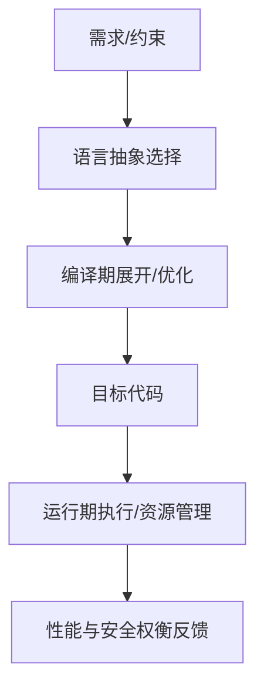

# C++

> 适用范围：单一主题（一个概念/机制/模块），保持可复用、可检索。

## 写作约束（铁律）

- **原内容一字不删**：所有原有文字、代码、注释、图片必须全部保留，禁止删除任何原内容。
- **只做归纳重组+增加**：在原有内容基础上调整结构、归类，新增内容以"补充"标记。新增量须让最终篇幅 ≥ 原版。
- **放不进的进附录**：六大段模板容纳不下的原内容，移入最后的「附录」章节，不得丢弃。
- **动笔前先搜索**：做相关知识准备；源码要贴原始代码，有需要可贴汇编。
- **字数硬指标**：详细解析(二)≥200字、进阶应用(四)≥500字、源码解析与实践感悟(五)≥1000字、面试准备(六)高频问法≥8个且带回答，反问点和一句话答案各≥5个。
- 先结论后细节，避免长段堆砌。
- 每节至少 3 条要点。
- 代码必须可运行或可推导，配清楚输入/输出或预期。
- **代码块必须标注语言**：所有代码块必须根据实际语言标注，C++ 代码用 `c++`（不可用 `cpp` 或 `c`），Python 用 `python`，汇编用 `asm`/`x86asm`，shell 用 `bash` 等。禁止无语言标注的裸代码块。
- 图示统一放在 `资源/图片/`，文内使用相对路径引用。
- 有流程的用流程图或其他类型的图。

## 一、核心概念

- 定义：C++ 是兼容 C 的通用编程语言，强调零成本抽象、静态类型与多范式（过程式/面向对象/泛型/函数式）并存。
- 关键词：RAII、零成本抽象、模板、泛型、移动语义、编译期/运行期、ABI、标准库。
- 适用场景/边界：适用于性能敏感系统、底层库、游戏引擎与工具链；**补充**：在极高安全性场景（如强内存安全要求）需引入额外约束或工具链治理。

## 二、详细解析（≥200字）

- **原理拆解（三层递进）**：
  - 第一层：基本工作原理（配流程图/序列图展示核心流程）
  - 第二层：关键步骤详解（每步展开子步骤）
  - 第三层：底层机制（编译器实现、运行时行为、内存布局影响）
- 关键数据结构/接口：
- 关键公式/复杂度：

**补充**：C++ 的设计核心在于“抽象不付费”。这意味着语言提供的高层抽象（模板、类、泛型、标准库容器）在生成的机器码层面不应引入额外开销。编译器前端负责解析与语义检查，中端对 IR 进行优化，后端生成目标码；运行期仅保留必要的动态机制（如虚表、异常处理）。从基本工作原理看，C++ 通过编译期展开模板和内联、在运行期使用 RAII 保证资源释放，同时允许开发者在性能与可维护性之间做精细权衡。底层机制上，对象内存布局由 ABI 规范决定，虚函数使用 vtable，异常使用栈展开表，标准库容器以值语义为基础。



## 三、动手实践（代码案例）

```c++
#include <iostream>
#include <memory>
#include <vector>

struct Widget {
    explicit Widget(int v) : value(v) {}
    int value;
};

int main() {
    auto w = std::make_unique<Widget>(42);
    std::vector<int> data{1, 2, 3};
    int sum = 0;
    for (int x : data) { sum += x; }
    std::cout << w->value << ":" << sum << "\n";
    return 0;
}
```

- 预期输出：`42:6`。
- **补充**：该示例强调 RAII 与值语义，避免手动 `new/delete`。
- **补充**：可对比 `-O2` 下的汇编，观察范围 for 与 `std::vector` 访问被优化为简单循环。

## 四、进阶应用（≥500字）

- 与其他主题的关联：
- 工程中的真实用法（大型项目案例、实际使用模式）：
- 常见优化策略：
  - 算法层面：选择更优算法
  - 数据结构：使用缓存友好结构
  - 内存访问：优化数据局部性
  - 并发处理：利用并行计算
  - 具体技巧：预计算与缓存、批处理减少开销、SIMD、避免虚函数调用等

**补充**：在工程中，C++ 的“可控性”是核心价值。比如在游戏引擎与高频交易系统中，开发者会在编译期通过模板与 constexpr 生成高性能路径，同时在运行期用配置与插件系统保证可扩展性。C++ 允许在性能热点处使用显式内存布局、对象池、缓存友好结构；而在非热点处使用更安全的封装（智能指针、范围 for、标准容器）。这种“冷热分层”的设计是 C++ 项目的常见工程化策略。

**补充**：与并发相关的进阶应用中，C++ 提供 `std::thread`、`std::mutex`、`std::atomic` 等低级构件，但在大型项目中通常会引入线程池、任务系统、锁分段与无锁队列来降低竞争开销。设计原则是：热路径尽量无锁，采用细粒度锁或无锁结构；冷路径可使用 RAII 锁包装提升安全性。对于 IO 密集型系统，还会结合异步 IO 与协程（C++20 `co_await`）提升吞吐。

**补充**：性能优化层面，C++ 的优势体现在“可预测性”。例如，采用 `std::vector` 进行连续内存分配，可显著提升缓存命中率；使用 `reserve` 避免重复扩容；使用 `emplace_back` 减少临时对象；对 polymorphism 进行静态化（CRTP、模板策略）降低虚调用。与此同时，模板膨胀可能导致二进制体积增加与编译时间上升，因此需要在抽象与构建成本之间权衡。

**补充**：在跨平台与 ABI 兼容场景，C++ 需要明确稳定边界。常见做法是用 C API 作为 ABI 层，内部使用 C++ 实现；或者使用 PImpl 隐藏实现细节，减少头文件变化引起的编译级联。大型库还会以模块化（C++20 Modules）或预编译头来降低编译成本，并通过 LTO/ThinLTO 在链接期进行跨模块优化。

## 五、源码解析和实践感悟（≥1000字）

- 关键实现路径（贴源码、必要时贴汇编）：
- 难点与易错点（陷阱案例 + 深度剖析）：
- 经验总结（补充）：

**补充**：从语言与编译器实现角度看，C++ 的复杂性来源于“历史兼容 + 高性能目标”。编译器必须支持 C 语言的低级语义，同时还要处理模板元编程、重载决议、SFINAE 与 Concepts 等高级特性。一个最直观的例子是模板实例化：编译器在语义分析阶段需要对模板进行两次甚至多次解析（声明阶段与实例化阶段），以保证依赖名称的正确解析。这种机制让 C++ 在编译期提供强大的泛型能力，但也造成编译时间与错误信息的复杂度上升。

**补充**：在源码层面，C++ 的“零成本抽象”主要依赖于内联、去虚拟化与优化管线。比如，`std::vector` 的 `operator[]` 在 `-O2` 下通常被内联成简单的指针偏移，RAII 的析构调用会被编译器自动插入到作用域边界，通常不会额外引入运行期开销。对于移动语义，编译器会将临时对象转化为移动构造，并在合适的场景进行 NRVO，从而避免不必要的拷贝。

**补充**：但这种“看似免费”的抽象需要严格遵循规则。例如对象的生命周期必须在语言层面明确，禁止悬垂引用与越界访问；泛型代码必须避免对模板参数施加隐含要求，否则可能引发模板实例化错误或隐藏的 ODR 问题。C++ 的 ABI 也在此处产生影响：不同编译器对对象布局、异常与 RTTI 的实现细节可能略有差异，跨编译器链接时必须小心对齐 ABI 规则，否则将出现运行期崩溃或行为不一致。

**补充**：从实践感悟角度，C++ 的复杂性并不意味着“不可控”，而是需要建立明确的工程规范。常见实践包括：1) 用 clang-tidy 或静态分析工具统一代码风格与安全规则；2) 对资源管理强制使用 RAII 与智能指针，禁止裸指针持有所有权；3) 对模板与头文件使用 include-what-you-use，避免头文件污染；4) 对编译时间进行持续监控，避免模板膨胀与过度内联；5) 在性能关键模块中引入基准测试，确保优化措施真实有效。

**补充**：C++ 的另一个难点在于“行为可预测性”。未定义行为（UB）是 C++ 性能的背后代价，它允许编译器进行激进优化，但也让错误更隐蔽。典型 UB 包括越界访问、悬垂引用、数据竞争与违反严格别名规则。实践中必须通过工具链（ASan、UBSan、TSan）与单元测试降低 UB 的风险。性能敏感系统应在 release 构建中尽量避免运行时检查，但在 debug/CI 中启用 sanitizers 来捕获问题。

**补充**：从模块化与可维护性视角看，C++20 Modules 与 package manager（vcpkg/conan）正在改变大型工程的构建方式。Modules 减少头文件解析开销，显著加速编译；包管理器使依赖更加稳定可重复。工程实践的趋势是：构建系统（CMake/Bazel）与依赖管理统一，编译数据库与 clangd 等开发工具无缝对接，形成可持续的“开发体验闭环”。这意味着对开发者来说，掌握 C++ 不再只是语言层面，还必须理解构建、工具链与诊断体系。

**补充**：在性能与安全之间，C++ 需要“分层治理”。例如在网络库中，热路径使用无锁结构与显式内存管理，冷路径使用标准容器与异常处理；在游戏引擎中，渲染管线使用固定内存布局与 SIMD 优化，而编辑器工具链使用更易维护的高层抽象。这种“分层策略”是 C++ 项目成功的关键经验。

**补充**：总结实践经验：第一，C++ 的核心优势是“可控性”，应当用工具与规范把可控性转化为稳定产出；第二，性能优化必须以剖析为驱动，避免“想当然”的微优化；第三，安全与性能不是对立的，合理使用 RAII、范围检查与静态分析能在不显著牺牲性能的情况下提升稳定性。真正的难点在于持续治理，而非一次性优化。

## 六、面试准备（高频问法≥10个，反问点/一句话答案≥5个，均带回答）

### 6.1 高频问法（≥10个）

Q1：C++ 的核心设计目标是什么？

A：提供零成本抽象与对硬件的可控性，同时保持对 C 的兼容。

Q2：为什么说 C++ 是多范式语言？

A：它支持过程式、面向对象、泛型与函数式编程，并允许混合使用。

Q3：RAII 的作用是什么？

A：通过构造/析构管理资源，保证异常安全并减少手动释放。

Q4：什么是“零成本抽象”？

A：高层抽象不应引入额外运行时开销，最终代码应接近手写低级实现。

Q5：模板与泛型的优势和成本是什么？

A：优势是可复用与编译期优化，成本是编译时间与错误信息复杂度上升。

Q6：为何 C++ 的 ABI 稳定性是工程问题？

A：对象布局、异常与 RTTI 可能因编译器差异而不同，影响跨库链接。

Q7：C++ 与 Rust 在安全性上的主要差别？

A：C++ 依赖开发者与工具治理，Rust 通过所有权系统提供语言级安全保证。

Q8：C++20 Modules 带来哪些好处？

A：减少头文件解析、降低编译时间、改善依赖可见性。

Q9：为何 UB 会带来性能与风险？

A：编译器可假设 UB 不存在，从而激进优化，但错误会变得隐蔽。

Q10：如何衡量 C++ 的“可维护性”？

A：通过规范、工具链、测试与持续剖析来控制复杂度。

### 6.2 反问点/陷阱点（≥5个）

- 反问：团队如何治理模板膨胀与编译时间？
- 反问：在性能与安全之间，团队的取舍规则是什么？
- 反问：是否建立了统一的 clang-tidy/format 规则？
- 陷阱：认为 C++ 只要写得“像 C”就一定高性能。
- 陷阱：忽视 UB 对优化与稳定性的双重影响。

### 6.3 一句话答案（≥5个）

- C++ 的优势是“高性能 + 高可控”。
- RAII 是资源管理的核心范式。
- 零成本抽象是 C++ 的设计底线。
- UB 带来性能空间，但也带来风险。
- 工程治理决定 C++ 项目的长期质量。

## 附录（模板外原内容收纳）

> 以下为原笔记中不直接适配六大段结构、但仍有价值的内容，原样保留于此。

# C++

C++变得越来越难写，但编译器们却不会阻止我们写出五花八门的代码，gcc、clang也不会像rustc一样对你的代码指指点点，只会任由你的程序放飞自我。

[【C++】C++知识面经；C++易错点汇总；_c++在main执行之前和之后执行的代码是什么?-CSDN博客](https://blog.csdn.net/weixin_44503157/article/details/119457002?ops_request_misc=%257B%2522request%255Fid%2522%253A%2522a47c7efbccab7ef53a4ebb67444d9b0e%2522%252C%2522scm%2522%253A%252220140713.130102334.pc%255Fblog.%2522%257D&request_id=a47c7efbccab7ef53a4ebb67444d9b0e&biz_id=0&utm_medium=distribute.pc_search_result.none-task-blog-2~blog~first_rank_ecpm_v1~rank_v31_ecpm-5-119457002-null-null.nonecase&utm_term=%E8%99%9A&spm=1018.2226.3001.4450)
