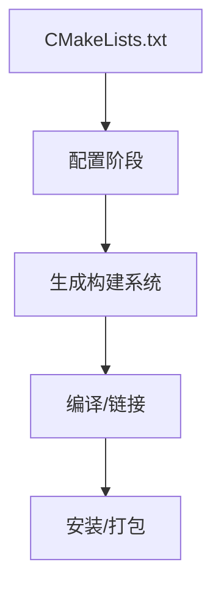

# CMake

> 适用范围：单一主题（一个概念/机制/模块），保持可复用、可检索。

## 写作约束（铁律）

- **原内容一字不删**：所有原有文字、代码、注释、图片必须全部保留，禁止删除任何原内容。
- **只做归纳重组+增加**：在原有内容基础上调整结构、归类，新增内容以"补充"标记。新增量须让最终篇幅 ≥ 原版。
- **放不进的进附录**：六大段模板容纳不下的原内容，移入最后的「附录」章节，不得丢弃。
- **动笔前先搜索**：做相关知识准备；源码要贴原始代码，有需要可贴汇编。
- **字数硬指标**：详细解析(二)≥200字、进阶应用(四)≥500字、源码解析与实践感悟(五)≥1000字、面试准备(六)高频问法≥8个且带回答，反问点和一句话答案各≥5个。
- 先结论后细节，避免长段堆砌。
- 每节至少 3 条要点。
- 代码必须可运行或可推导，配清楚输入/输出或预期。
- **代码块必须标注语言**：所有代码块必须根据实际语言标注，C++ 代码用 `c++`（不可用 `cpp` 或 `c`），Python 用 `python`，汇编用 `asm`/`x86asm`，shell 用 `bash` 等。禁止无语言标注的裸代码块。
- 图示统一放在 `资源/图片/`，文内使用相对路径引用。
- 有流程的用流程图或其他类型的图。

## 一、核心概念

- 定义：CMake 是跨平台构建系统生成器，用 CMakeLists.txt 描述目标与依赖。
- 关键词：target、`PUBLIC/PRIVATE/INTERFACE`、`find_package`、toolchain、`compile_commands.json`。
- 适用场景/边界：适用于跨平台与多目标工程；**补充**：大型项目必须遵循“target 驱动”与依赖隔离。

## 二、详细解析（≥200字）

- **原理拆解（三层递进）**：
  - 第一层：基本工作原理（配流程图/序列图展示核心流程）
  - 第二层：关键步骤详解（每步展开子步骤）
  - 第三层：底层机制（编译器实现、运行时行为、内存布局影响）
- 关键数据结构/接口：
- 关键公式/复杂度：

**补充**：CMake 的核心不是“直接构建”，而是生成构建系统（Make/Ninja/VS）。它通过声明式方式描述目标、依赖、编译选项与安装规则，并把这些描述转化为平台特定的构建文件。现代 CMake 的核心是 target 驱动：每个 target 有自己的 include 目录、编译选项与链接依赖，通过 `PUBLIC/PRIVATE/INTERFACE` 控制传播。这样可以避免全局污染并提升可维护性。`find_package` 与 `FetchContent` 则是依赖管理的关键，结合 `CMAKE_EXPORT_COMPILE_COMMANDS` 生成 `compile_commands.json`，支持 clangd、clang-tidy 等工具链。



## 三、动手实践（代码案例）

```cmake
cmake_minimum_required(VERSION 3.20)
project(MyApp LANGUAGES CXX)

add_executable(app main.cpp)
target_compile_features(app PRIVATE cxx_std_17)
```

```bash
cmake -S . -B build -DCMAKE_EXPORT_COMPILE_COMMANDS=ON
cmake --build build
```

- 预期：生成 build/ 目录与 `compile_commands.json`。
- **补充**：使用 Ninja 可显著提高增量构建速度。
- **补充**：用 `target_include_directories` 替代 `include_directories`。

## 四、进阶应用（≥500字）

- 与其他主题的关联：
- 工程中的真实用法（大型项目案例、实际使用模式）：
- 常见优化策略：
  - 算法层面：选择更优算法
  - 数据结构：使用缓存友好结构
  - 内存访问：优化数据局部性
  - 并发处理：利用并行计算
  - 具体技巧：预计算与缓存、批处理减少开销、SIMD、避免虚函数调用等

**补充**：现代 CMake 的“目标驱动”思想是大型项目成功的关键。把 include 路径、编译选项、宏定义全部绑定到 target 上，可以确保依赖只在需要处传播，减少全局副作用。`PUBLIC` 表示当前 target 和使用者都需要；`PRIVATE` 仅当前 target 需要；`INTERFACE` 表示当前 target 自身不需要，但使用者需要（通常用于头文件库）。这种模式能显著降低“头文件污染”，也使依赖层级更清晰。

**补充**：CMake 的依赖管理策略通常分为三层：系统库（`find_package`）、外部源码（`FetchContent`）、本地子项目（`add_subdirectory`）。现代项目更倾向于使用 Config 模式的 `find_package`，因为它提供更准确的依赖信息与版本控制。对于无法提供 Config 的库，才回退到 `FindXXX.cmake`。在多平台环境中，建议用 `toolchain` 文件统一编译器与 sysroot，避免“开发环境与 CI 不一致”。

**补充**：生成 `compile_commands.json` 对 IDE 支持非常关键。clangd、clang-tidy 依赖它解析宏与头文件路径。实践中应把 `CMAKE_EXPORT_COMPILE_COMMANDS=ON` 作为默认选项，并在顶层构建脚本中明确要求。对于多配置生成器（Visual Studio），可能需要手动复制或链接该文件。大型项目还需维护 `.clangd` 配置文件，与 CMake 的编译选项保持一致。

## 五、源码解析和实践感悟（≥1000字）

- 关键实现路径（贴源码、必要时贴汇编）：
- 难点与易错点（陷阱案例 + 深度剖析）：
- 经验总结（补充）：

**补充**：CMake 的“陷阱”往往源于“全局命令 vs target 命令”的混用。全局命令如 `include_directories`、`add_definitions` 会对所有 target 生效，导致不相关的目标被污染，最终引发难以定位的编译错误。现代 CMake 推荐每个 target 独立声明依赖与编译选项，这不仅提升可维护性，也使构建图更清晰。实践经验是：建立“禁止全局命令”的规范，所有依赖必须通过 `target_*` 系列命令表达。

**补充**：`find_package` 的两种模式（Config 与 Module）容易混淆。Config 模式依赖库提供的 `FooConfig.cmake`，包含完整的 target 信息与版本规则；Module 模式是 CMake 自带的 `FindFoo.cmake`，往往信息不全。实践中若库提供 Config，一定优先使用 Config 模式，否则可能出现“链接到了错误版本”或“缺少依赖”。对外发布库时，应提供 Config 文件，并保证 `target` 命名与 `INTERFACE` 属性准确。

**补充**：跨平台与交叉编译是 CMake 的强项，但也最容易出错。工具链文件必须明确 `CMAKE_SYSTEM_NAME`、编译器路径、sysroot 与搜索路径，否则 CMake 会在宿主系统上寻找头文件与库，导致编译通过但运行失败。实践中建议：1) 工具链文件与项目一同版本化；2) 对交叉编译的第三方依赖提供独立的 sysroot；3) 在 CI 中固定编译器版本与缓存策略，确保构建可复现。

**补充**：构建性能是 CMake 项目常见瓶颈。除选择 Ninja/ccache 外，还要避免频繁触发重新配置。使用 `GLOB` 收集源文件虽然看似简洁，但新增/删除文件不会触发重新配置，容易造成“构建不更新”。更好的策略是显式列出源文件，或者在外层脚本中触发 `cmake -S -B`。另外，过度使用 `add_custom_command` 会导致依赖图复杂且难维护，建议用 `add_custom_target` 或 generator expressions 进行更清晰的依赖表达。

**补充**：实践感悟总结为三条：第一，CMake 的核心价值是“目标驱动 + 依赖传播”，必须始终用 target 的视角组织项目；第二，编译数据库与 LSP 工具链是现代 C++ 开发体验的核心，应作为一等公民维护；第三，跨平台构建不仅是“能编译”，更是“能复现”，需要工具链文件、依赖版本锁定与 CI 统一。

## 六、面试准备（高频问法≥10个，反问点/一句话答案≥5个，均带回答）

### 6.1 高频问法（≥10个）

Q1：CMake 的核心作用是什么？

A：生成跨平台构建系统，统一管理目标与依赖。

Q2：`PUBLIC/PRIVATE/INTERFACE` 的区别？

A：PUBLIC 自用+传播，PRIVATE 自用不传播，INTERFACE 仅传播。

Q3：为什么推荐 `target_*` 命令？

A：避免全局污染，依赖更清晰可维护。

Q4：`find_package` 的两种模式？

A：Config 模式与 Module 模式，优先 Config。

Q5：如何生成 `compile_commands.json`？

A：`-DCMAKE_EXPORT_COMPILE_COMMANDS=ON`。

Q6：交叉编译如何配置？

A：使用 toolchain 文件指定编译器与 sysroot。

Q7：`FetchContent` 与 `ExternalProject` 差异？

A：前者在配置阶段集成子项目，后者在构建阶段独立构建。

Q8：为什么不推荐 `GLOB`？

A：新增/删除文件不会触发重新配置。

Q9：如何指定 C++ 标准？

A：`target_compile_features(... cxx_std_17)`。

Q10：为什么要统一 clangd 配置？

A：保证 IDE 与实际编译参数一致。

### 6.2 反问点/陷阱点（≥5个）

- 反问：团队是否禁止全局 include_directories？
- 反问：是否统一 CMake 版本与 CMP 策略？
- 反问：是否把 toolchain 文件纳入版本控制？
- 陷阱：混用全局命令导致依赖污染。
- 陷阱：GLOB 造成新增文件不参与构建。

### 6.3 一句话答案（≥5个）

- CMake 是构建系统生成器。
- 现代 CMake 必须 target 驱动。
- `find_package` 优先 Config 模式。
- toolchain 文件定义交叉编译环境。
- compile_commands.json 是 IDE 的桥梁。

## 附录（模板外原内容收纳）

> 以下为原笔记中不直接适配六大段结构、但仍有价值的内容，原样保留于此。

# CMake

CMakeLists.txt文件通常包含一系列的CMake命令，用来定义项目的属性、包含的源文件、依赖的库等。基本结构包括：

`cmake_minimum_required(VERSION x.x)`: 指定项目需要的最低CMake版本。

`project(ProjectName)`: 定义项目的名称和使用的语言。  
`add_executable(TargetName source1 source2 ...)`: 添加一个可执行目标，并指定其源文件。

`add_library(TargetName type source1 source2 ...)`: 添加一个库目标，并指定其类型（静态或态）和源文件。

`find_package(PackageName)`: 查找并加载外部依赖包。

`target_link_libraries(TargetName library1 library2 ...)`: 指定目标链接的库。

#### CMake 库的继承关键字

`PUBLIC`、`PRIVATE` 和 `INTERFACE`

### **CMake常用内置变量**

列举一些常见的CMake内置变量，需要注意的是内置变量都是CMAKE开头

1. CMAKE_SOURCE_DIR: CMakeLists.txt所在的顶级源代码目录的路径。
2. CMAKE_BINARY_DIR: 构建目录的路径，即执行cmake命令时生成的Makefile或其他构建系统文件所在的目录。
3. CMAKE_CURRENT_SOURCE_DIR: 当前处理的CMakeLists.txt所在的目录的路径。
4. CMAKE_CURRENT_BINARY_DIR: 当前处理的CMakeLists.txt生成的目标文件所在的目录的路径。
5. CMAKE_CURRENT_LIST_FILE: 当前正在处理的CMakeLists.txt的完整路径和文件名。
6. CMAKE_CURRENT_LIST_DIR: 当前正在处理的CMakeLists.txt所在的目录的路径。
7. CMAKE_MODULE_PATH: 用于指定额外的CMake模块的路径。
8. CMAKE_INCLUDE_PATH: 用于指定额外的包含文件的路径。
9. CMAKE_LIBRARY_PATH: 用于指定额外的库文件的路径。
10. CMAKE_SYSTEM: 当前操作系统的名称。
11. CMAKE_SYSTEM_NAME: 当前操作系统的名称，与CMAKE_SYSTEM相同。
12. CMAKE_SYSTEM_VERSION: 当前操作系统的版本号。
13. CMAKE_C_COMPILER: C编译器的路径。
14. CMAKE_CXX_COMPILER: C++编译器的路径。
15. CMAKE_BUILD_TYPE: 构建类型，如Debug、Release等。
16. CMAKE_INSTALL_PREFIX: 安装目录的路径。

## 五、源码解析和实践感悟

### 1. PUBLIC/PRIVATE/INTERFACE 的传播规则

```cmake
# 库 A 自己用 pthread，不暴露给使用者
add_library(A STATIC a.cpp)
target_link_libraries(A PRIVATE pthread)   # A 内部链接 pthread

# 库 B 需要使用 A 的头文件中暴露的类型，但不链接 A 的源
target_link_libraries(B INTERFACE A)       # B 的使用者只需要 A 的头文件路径

# 库 C 的头文件中 include 了 D 的头文件，且内部用了 D
target_link_libraries(C PUBLIC D)          # C 和 C 的使用者都需要 D

# PRIVATE:   链接给当前 target，不传播
# INTERFACE: 不链接给当前 target，传播给依赖者（纯头文件库用）
# PUBLIC:    链接给当前 target，传播给依赖者（暴露在 API 中）
```

### 2. 现代 CMake 的目标驱动设计

```cmake
# 旧式 CMake（不推荐）
include_directories(${PROJECT_SOURCE_DIR}/include)
link_libraries(pthread)
add_definitions(-DDEBUG)

# 现代 CMake（推荐）
add_library(mylib STATIC src/lib.cpp)
target_include_directories(mylib PUBLIC include)
target_link_libraries(mylib PRIVATE pthread)
target_compile_definitions(mylib PRIVATE DEBUG)
# 每个 target 独立管理依赖，隔离性好，库的使用者自动继承 PUBLIC 属性
```

### 3. 交叉编译的工具链文件

```cmake
# toolchain-arm.cmake
set(CMAKE_SYSTEM_NAME Linux)
set(CMAKE_SYSTEM_PROCESSOR arm)
set(CMAKE_C_COMPILER arm-linux-gnueabihf-gcc)
set(CMAKE_CXX_COMPILER arm-linux-gnueabihf-g++)
set(CMAKE_FIND_ROOT_PATH /opt/arm-sysroot)  # sysroot 隔离

# 使用：cmake -DCMAKE_TOOLCHAIN_FILE=toolchain-arm.cmake -B build
```

### 实践经验

1. **目标驱动优于全局设置**：`target_*` 命令替代 `include_directories`/`link_libraries` 等全局命令
2. **PUBLIC/PRIVATE/INTERFACE 是核心**：头文件里用到 → PUBLIC，仅 .cpp 用到 → PRIVATE，纯头库 → INTERFACE
3. **`find_package` 用 CONFIG 模式**：优先用 `FooConfig.cmake`（现代），回退 `FindFoo.cmake`（传统）
4. **`CMAKE_EXPORT_COMPILE_COMMANDS=ON`**：生成 `compile_commands.json`，供 clangd/clang-tidy 使用
5. **FetchContent (CMake 3.11+)**：下载源码并作为子项目编译，替代 git submodule
6. **ccache 加速**：`-DCMAKE_CXX_COMPILER_LAUNCHER=ccache`，增量编译快 5-10 倍

## 六、面试准备

### Q&A（8题）

**Q1: CMake 中 PUBLIC、PRIVATE、INTERFACE 的区别？**
A: PRIVATE 自己用不传播；INTERFACE 自己不链接但传播给使用者；PUBLIC 自己用且传播

**Q2: `target_include_directories` 和 `include_directories` 的区别？**
A: 前者针对单个 target（现代），后者全局设置（旧式）。现代 CMake 推荐 target 系列命令

**Q3: 如何指定 C++ 标准？**
A: `set(CMAKE_CXX_STANDARD 17)` 全局；`target_compile_features(mylib PUBLIC cxx_std_17)` 按 target

**Q4: 静态库和动态库怎么创建？**
A: `add_library(foo STATIC src.cpp)` 或 `add_library(foo SHARED src.cpp)`。不指定时由 `BUILD_SHARED_LIBS` 决定

**Q5: 如何生成 compile_commands.json？**
A: `cmake -DCMAKE_EXPORT_COMPILE_COMMANDS=ON -B build`。用于 clangd、clang-tidy、IDE

**Q6: `find_package` 的两种模式？**
A: Module 模式（FindFoo.cmake）和 Config 模式（FooConfig.cmake）。优先 Config，新项目用

**Q7: 交叉编译怎么配置？**
A: 写工具链文件（toolchain file），`cmake -DCMAKE_TOOLCHAIN_FILE=arm-toolchain.cmake`

**Q8: FetchContent 和 ExternalProject 的区别？**
A: FetchContent 在 configure 阶段下载并作为子项目编译；ExternalProject 在 build 阶段下载，独立构建

### 陷阱与反问（5个）

1. **陷阱**：老项目全局 include_directories 污染 — 所有 target 都看到不该看的头文件，隔离性差
2. **反问**：CMake 比 Makefile 好在哪？→ 跨平台、模块化、工具链抽象、包管理（find_package）、IDE 集成
3. **陷阱**：不指定 CMP 策略 — 不同 CMake 版本行为不同，用 `cmake_minimum_required` 固定策略
4. **反问**：需要学 CMake 脚本语言吗？→ 不需要精，但 if/foreach/function/list 基础够用
5. **陷阱**：`GLOB` 收集源文件 — 新增/删除文件不会自动触发 cmake 重新配置，推荐显式列出

### 一句话答案（5个）

1. **CMake 核心**：跨平台构建系统生成器
2. **PUBLIC/PRIVATE**：PUBLIC 传播，PRIVATE 自用
3. **现代 CMake**：target 驱动，不用全局命令
4. **compile_commands.json**：IDE 和工具链的桥梁
5. **交叉编译**：工具链文件指定编译器/sysroot
