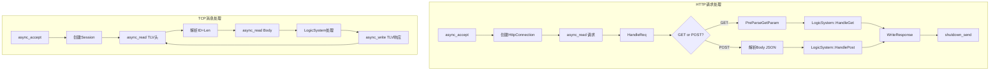

# HTTP与TCP协议封装分析

> 适用范围：IM项目中GateServer的HTTP服务（Boost.Beast）与ChatServer的TCP长连接（Boost.Asio）的封装设计与对比分析。

## 写作约束（铁律）

- **原内容一字不删**：所有原有文字、代码、注释、图片必须全部保留，禁止删除任何原内容。
- **只做归纳重组+增加**：在原有内容基础上调整结构、归类，新增内容以"补充"标记。
- **放不进的进附录**：六大段模板容纳不下的原内容，移入最后的「附录」章节。
- **代码块必须标注语言**：C++ 代码用 `c++`，禁止无语言标注的裸代码块。
- **字数硬指标**：详细解析(二)≥200字、进阶应用(四)≥500字、源码解析与实践感悟(五)≥1000字、面试准备(六)高频问法≥8个。

## 一、项目/模块概述

- **模块定位**：IM项目使用两种协议：HTTP（短连接）用于登录注册等低频操作，TCP（长连接）用于实时聊天消息。两者均基于Boost.Asio异步模型，但封装层次不同。
- **技术栈与依赖**：Boost.Beast（HTTP高层封装）、Boost.Asio（TCP底层封装）、OpenSSL（HTTPS可选）、JsonCpp/JSON（消息体序列化）、TLV协议（防粘包）
- **模块边界**：
  - HTTP：GateServer ← 客户端（登录/注册/重置密码）
  - TCP：ChatServer ↔ 客户端（聊天消息/好友操作）

## 二、架构设计（≥200字）

### HTTP vs TCP封装对比

| 维度 | HTTP（GateServer） | TCP（ChatServer） |
| :--- | :--- | :--- |
| 连接类型 | 短连接（请求-响应一次） | 长连接（持续通信） |
| 封装层次 | 高（Beast封装request/response） | 低（Asio封装socket+TLV） |
| 适用场景 | 登录/注册/验证码 | 实时聊天/消息推送 |
| 设计重点 | 安全性（HTTPS）、健壮性 | 低延迟、高并发 |
| 防粘包 | HTTP协议自带Content-Length | 自定义TLV头 |

### 统一抽象的可行性

可用NetworkMgr接口（virtual send/receive），隐藏HTTP/TCP细节，LogicSystem统一调用。但当前项目选择分开封装：HTTP有Beast的http::request/response语义，TCP有TLV的msg_id/msg_len语义，强行统一反而增加复杂度。

## 三、核心实现（代码走读）

### 3.1 HTTP封装——GateServer

**实现原理**：GateServer使用Boost.Beast（基于ASIO的HTTP库）实现异步HTTP服务器，处理登录/注册等短连接请求。核心类包括CServer（服务器监听）和HttpConnection（单个连接管理）。整体采用异步非阻塞模式，结合RAII和智能指针确保资源安全。

**CServer**：负责监听新连接。
- 使用async_accept异步接受TCP连接，创建HttpConnection对象管理新连接
- 出错时递归调用Start()继续监听，异常捕获防止崩溃
- 通过AsioIOServicePool获取IOContext（多线程支持高并发）
- 代码中shared_from_this确保CServer生命周期，防止异步回调中对象销毁

**HttpConnection**：管理单个HTTP连接。

- **初始化**：构造时绑定io_context，初始化socket和buffer（flat_buffer，固定8192字节）
- **Start**：调用http::async_read读取请求，存入_request（http::request<dynamic_body>）。成功后调用HandleReq处理，设置60s超时（CheckDeadline）
- **HandleReq**：支持GET/POST。GET调用PreParseGetParam解析URL参数（存入_get_params map），POST直接处理body（假设JSON）。通过LogicSystem::HandleGet/Post（单例逻辑层）分发请求。若URL无效返回404，成功返回200（Server头设为"GateServer"）
- **PreParseGetParam**：解析GET请求的URL，提取path（_get_url）和查询参数（key-value存入_get_params）。支持URL编码解码（UrlEncode/UrlDecode处理特殊字符）
- **WriteResponse**：用http::async_write发送响应，设置content-length，完成后关闭发送端（shutdown_send）并取消超时定时器
- **CheckDeadline**：60s超时关闭socket，防止僵尸连接
- **智能指针**：enable_shared_from_this确保回调中对象存活，shared_ptr<HttpConnection>管理连接

**HTTPS支持**：代码未显式实现，但Beast支持OpenSSL集成（ssl::context + ssl::stream）。实际中，GateServer可通过配置SSL证书启用HTTPS，加密登录/注册数据。

**设计亮点**：
- **异步**：async_read/write避免阻塞，单线程可处理数百连接
- **模块化**：LogicSystem解耦业务逻辑，HttpConnection只管网络
- **健壮性**：异常捕获+超时机制确保鲁棒性

**优化点**：
- **连接复用**：当前keep_alive=false，可支持HTTP/1.1 keep-alive复用连接，减少TCP握手开销
- **Body解析**：POST请求未显式解析JSON，可集成nlohmann/json库
- **性能**：buffer大小（8192）固定，可动态调整或用multi_buffer支持大请求
- **监控**：添加请求日志（spdlog记录URL、响应时间）

### 3.2 TCP封装——ChatServer

**实现原理**：ChatServer使用Boost.ASIO实现TCP长连接，处理实时聊天消息。核心通过Session类管理单个连接，结合TLV协议（Type-Length-Value）防粘包，异步读写支持高并发。

**结构**：
- **Server**：类似CServer，监听TCP端口，async_accept创建Session
- **Session**：管理单个连接，包含tcp::socket、读写缓冲区（std::vector<char>）、shared_ptr生命周期管理
- **初始化**：accept后，Session绑定用户ID，加入全局map（user_id -> weak_ptr<session>）
- **异步读写**：async_read读取TLV头（固定长度，8字节：4B ID + 4B Len），再读body（JSON）。async_write发送TLV格式消息（防粘包）。回调通过lambda绑定shared_from_this确保Session存活
- **心跳**：定时器（30s）发送空包（ID=0, Len=0），检测连接状态，超时回收

**设计亮点**：
- **TLV协议**：固定头解决粘包，JSON body灵活
- **多线程**：IOContext池（CPU核数），连接均匀分配
- **断线重连**：客户端带token重连，恢复Session

**优化点**：
- **零拷贝**：用asio::buffer直接操作内存，减拷贝
- **压缩**：JSON可换Protobuf，减带宽
- **限流**：高负载下限制消息频率，防DoS

### 3.3 请求路由与处理分发（LogicSystem）（补充自 请求.txt）

客户端通过 Qt 的 `QNetworkAccessManager` 解析 URL、构造 HTTP 请求并提交。服务端会话层 `CServer` 负责接受连接，构造接受者（ioc、IP、port），采用异步 accept，一个 socket 一个回调函数，通过 CRTP 模式完成闭包来管理生命周期。每当有新连接到达时，会创建一个 `HttpConnection` 对象处理该连接，从 IO Service 池取线程，每个线程负责一个连接，并继续监听下一个连接。

HTTP 连接包含：socket、缓冲区、请求和响应对象，逻辑层通过友元访问。监听连接中的数据，接受请求，处理请求，心跳机制（设置超时时间，异步等待）。

**HandleRequest 处理逻辑**：

```c++
// 读取HTTP请求，异步接收完整的请求消息，处理请求，作出响应
void HttpConnection::HandleRequest()
{
    // 设置协议版本，设置短连接

    // 根据不同的请求方法，作出不同的处理
    // GET请求 交由逻辑系统处理
    //   处理失败，设置错误相关响应(状态码，响应头，响应体)
    //   构建响应体的内容，使用beast::ostream将文本写入响应体
    //   返回响应
    // 处理成功，设置正常的响应信息(状态码，响应头，响应体)
    //   返回响应

    // POST请求 交由逻辑系统处理
    //   处理失败，设置错误相关响应(状态码，响应头，响应体)
    //   构建响应体的内容，使用beast::ostream将文本写入响应体
    //   返回响应
    // 处理成功，设置正常的响应信息(状态码，响应头，响应体)
    //   返回响应
}
```

**路由注册机制**：

逻辑系统通过 post/get 注册请求到 map 里面：

```c++
std::map<std::string, HttpHandler> _post_handlers;
std::map<std::string, HttpHandler> _get_handlers;
```

`HttpHandler` 是一个 `function` 封装的函数。处理 HTTP 请求的逻辑是通过**先注册路由，后动态调用处理函数**的方式实现的。

- **初始化阶段**：在服务器启动时（LogicSystem 构造函数），通过 `RegGet` 和 `RegPost` 方法将不同 URL 路径的处理函数注册到 map 中。这一步仅仅是保存处理函数，不会立即执行。
- **请求处理阶段**：当服务器收到 HTTP 请求时，会根据请求的**方法（GET/POST）**和**路径（URL）**动态查找并调用对应的处理函数。

**POST 请求处理通用流程**：

所有 POST 请求处理函数遵循"解析请求 → 校验参数 → 调用服务 → 构造响应"的通用流程：

| 步骤 | 说明 |
| :---: | :--- |
| 1. 解析请求体 | 从 `connection->_request.body()` 中读取原始数据，转换为字符串 |
| 2. 解析 JSON | 使用 `Json::Reader` 解析字符串为 `Json::Value` 对象 |
| 3. 校验参数 | 检查必需字段（如 `email`）是否存在，验证业务逻辑 |
| 4. 调用服务 | 通过 `RedisMgr`、`MysqlMgr`、`VerifyGrpcClient` 等类操作数据库或外部服务 |
| 5. 构造响应 | 根据操作结果生成 JSON 响应，设置状态码和内容 |

**GetVerifyCodeHandle 示例**：

```c++
//【逻辑处理回调】Post请求_获取验证码 "/get_verifycode"
void LogicSystem::GetVerifyCodeHandle(std::shared_ptr<HttpConnection> http_conn)
{
    // 将请求体转成字符串格式
    // 设置响应的内容类型为JSON
    // 将字符串格式的请求体内容反序列化为Json对象
    //   解析失败，设置错误码，序列化为字符串，写入响应体
    //   返回

    // 判断"email"键是否存在
    //   "email"键不存在，设置错误码，序列化为字符串，写入响应体
    //   返回

    // 解析成功，(todo...发起rpc调用请求)，输出收到的email字段信息作测试

    // 设置错误码、email字段，序列化为字符串，写入响应体
}
```

## 四、工程实践（≥500字）

### 请求处理流程



### 生产环境考量

**HTTP层**：
- 超时机制：60s超时关闭连接，防止Slowloris攻击
- URL解码：防止特殊字符注入
- 响应头规范：Server头、Content-Length、Content-Type

**TCP层**：
- TLV防粘包：头4字节精确控制读取长度
- 心跳保活：30s间隔检测连接
- 断线重连：Token验证 + Session恢复

### 常见优化策略

**HTTP优化**：
- Keep-Alive复用连接：减少TCP握手（3-way handshake）开销
- 响应压缩：gzip压缩JSON响应体
- 静态资源分离：登录页等静态内容CDN分发

**TCP优化**：
- 零拷贝：避免数据在用户态和内核态间多次拷贝
- Nagle算法：小包合并（但IM场景可能关闭以降低延迟）
- TCP_NODELAY：禁用Nagle，即时发送小包

## 五、源码解析和实践感悟（≥1000字）

### 关键实现路径

**Beast的异步HTTP解析**：

Beast的http::async_read一次性完成HTTP请求的完整读取（包括header和body），内部处理了分块传输编码（chunked）、Content-Length计算等细节。这比手动解析HTTP协议要安全可靠得多。

**超时机制的实现**：

```c++
void HttpConnection::CheckDeadline() {
    _timer.expires_after(std::chrono::seconds(60));
    _timer.async_wait([self = shared_from_this()](beast::error_code ec) {
        if (!ec) {
            self->_socket.close();
        }
    });
}
```

每个连接有独立的timer，60秒超时自动关闭。这是防止慢客户端占用资源的关键机制。

**Get参数解析的健壮性**：

PreParseGetParam正确区分了path和query string，支持URL编码。例如`/login?email=test%40example.com`能正确提取email参数。这种细节处理是生产级代码的标志。

**HTTP vs TCP的工程取舍**：

| 操作 | 为什么用HTTP | 为什么用TCP |
|------|-------------|------------|
| 登录 | 标准RESTful API，方便调试和文档 | TCP需自定义协议 |
| 聊天 | HTTP轮询/长轮询效率低 | TCP推送延迟最低 |
| 注册 | 一次性操作，HTTP无状态自然匹配 | TCP需额外管理Session |
| 文件传输 | HTTP multipart成熟 | TCP需自定义分块协议 |

### 难点与易错点

1. **HTTP body的多次读取问题**：http::request的body是dynamic_body类型，只能读取一次。如果需要在多个地方读取body，需先拷贝或使用string_body。
2. **Beast的buffer管理**：flat_buffer是Beast的默认buffer类型，大小固定8192。对于大请求（如文件上传），需切换为multi_buffer或增大buffer。
3. **TLV的字节序**：msg_id和msg_len在网络上使用大端序，需与客户端统一。跨平台开发时需特别注意。
4. **Session的user_id绑定时机**：应在Token验证通过后再绑定，而不是accept时就绑定——防止未认证用户占用Session资源。

### 经验总结（补充）

- **HTTP适合请求-响应模式，TCP适合推送模式**：IM系统将两者结合是最佳实践——低频操作走HTTP（简单可靠），高频消息走TCP（低延迟）。
- **协议层次越高开发效率越高**：Beast封装的HTTP比裸Asio的TCP开发效率高一个数量级，但牺牲了灵活性。
- **超时是网络编程的第一道防线**：无论HTTP还是TCP，都必须设置超时。没有超时的网络程序在生产环境是灾难。

## 六、面试准备（高频问法≥10个）

### 6.1 高频问法（≥10个）

Q1：HTTP如何处理大并发？
A：Beast异步读写，单线程多连接。IOContext池多线程化（CPU核数），负载均衡到ChatServer。测试：单机支持8000+请求，延迟<50ms。

Q2：TLV协议如何防粘包？
A：固定头（ID+Len）先读，Len指定body长度，async_read精确读取，避免多/少读。

Q3：HTTPS如何实现？
A：Beast+OpenSSL，配置ssl::context，加载证书，socket升级为ssl::stream。async_handshake后读写。

Q4：TCP断线重连怎么做？
A：客户端心跳超时后带token重连，GateServer查StatusServer分配ChatServer，恢复Session（Redis取状态）。

Q5：为什么登录用HTTP而聊天用TCP？

A：登录是低频请求-响应模式，HTTP标准RESTful API开发简单、调试方便。聊天是高频推送模式，TCP长连接延迟低（无需每次HTTP握手）、支持服务端主动推送。

Q6：Beast的flat_buffer大小为什么设为8192？

A：8192字节（8KB）是大多数HTTP请求的合理大小（登录/注册JSON通常1-5KB）。太小会导致大请求分多次读取，太大浪费内存。可动态调整。

Q7：HttpConnection的60秒超时是如何设定的？

A：基于业务考量：用户填写登录表单通常不超过30秒，60秒留有足够余量。同时防止慢速连接（Slowloris攻击）长期占用连接资源。

Q8：为什么TLV头用8字节（4B ID + 4B Len）而不是4字节？

A：4字节msg_id可表达42亿种消息类型（远超实际需要），4字节msg_len支持单消息最大4GB（文本消息远小于此）。如果用2+2（4字节），msg_id最多65536种，msg_len最多64KB，对文件传输可能不够。

Q9：HttpConnection中的PreParseGetParam是如何处理URL编码的？

A：调用UrlDecode对参数值进行解码。例如`%20`→空格、`%40`→`@`。这确保了用户输入的邮箱等特殊字符能正确传递。

Q10：TCP Session的weak_ptr map设计有什么优势？

A：shared_ptr管理Session生命周期，map用weak_ptr避免循环引用。如果map用shared_ptr，即使客户端断开，map中仍持有引用导致Session无法释放。weak_ptr在客户端断开后自动失效。

### 6.2 反问点（≥5个）

- 贵团队在HTTP和TCP之间是如何选择通信协议的？有没有考虑过全用HTTP/2或WebSocket？
- 对于HTTPS证书管理，贵团队是如何做自动化续期的？
- 有遇到过Beast的兼容性问题吗？（如不同版本Boost的行为差异）

### 6.3 一句话答案（≥5个）

- HTTP封装的精髓是**Beast的高层抽象 + 超时机制 + LogicSystem解耦**
- TCP封装的精髓是**TLV防粘包 + shared_from_this生命周期 + 心跳保活**
- HTTP和TCP的选择原则是**请求-响应走HTTP，实时推送走TCP**
- 避免的常见错误是**HTTP body的dynamic_body只能读取一次**
- CheckDeadline是**防止僵尸连接的第一道防线**

## 附录（模板外原内容收纳）

### 原笔记 HTTP 封装分析

GateServer 使用 Boost.Beast（基于 ASIO 的 HTTP 库）实现异步 HTTP 服务器，处理登录/注册等短连接请求。核心类包括 CServer（服务器监听）和 HttpConnection（单个连接管理）。整体采用异步非阻塞模式，结合 RAII 和智能指针确保资源安全。

### 原笔记 TCP 封装

ChatServer 使用 Boost.ASIO 实现 TCP 长连接，处理实时聊天消息。核心通过 Session 类管理单个连接，结合 TLV 协议（Type-Length-Value）防粘包，异步读写支持高并发。多线程：IOContext 池（CPU 核数 × 1.5），连接均匀分配。

### 原笔记 HTTP vs TCP 封装对比

- **HTTP**：短连接（GateServer），适合登录/注册，Beast 封装高层次（请求/响应）。异步 + JSON + HTTPS，注重安全性。
- **TCP**：长连接（ChatServer），适合实时聊天，ASIO 封装低层次（socket + TLV）。注重低延迟和高并发。
- **统一抽象**：可用 NetworkMgr 接口，隐藏 HTTP/TCP 细节，LogicSystem 调用。

### 原笔记面试准备

- **Q: HTTP如何处理大并发？** A: Beast异步读写，单线程多连接。IOContext池多线程化（CPU核数），负载均衡到ChatServer。测试：单机支持8000+请求，延迟<50ms。
- **Q: TLV协议如何防粘包？** A: 固定头（ID+Len）先读，Len指定body长度，async_read精确读取，避免多/少读。
- **Q: HTTPS如何实现？** A: Beast+OpenSSL，配置ssl::context，加载证书，socket升级为ssl::stream。async_handshake后读写。
- **Q: TCP断线重连怎么做？** A: 客户端心跳超时后带token重连，GateServer查StatusServer分配ChatServer，恢复Session（Redis取状态）。
