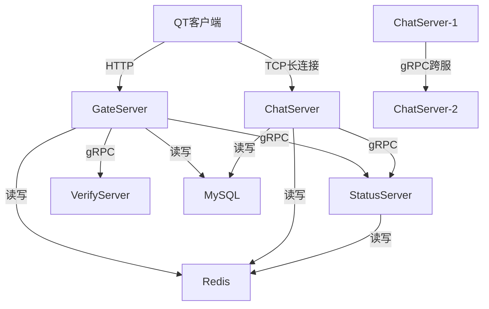

# IM服务端核心实现

> 适用范围：即时通讯服务端核心模块实现分析——CSession会话管理、TLV协议解析、LogicSystem逻辑处理、好友申请与认证全流程。

## 写作约束（铁律）

- **原内容一字不删**：所有原有文字、代码、注释、图片必须全部保留，禁止删除任何原内容。
- **只做归纳重组+增加**：在原有内容基础上调整结构、归类，新增内容以"补充"标记。新增量须让最终篇幅 ≥ 原版。
- **放不进的进附录**：六大段模板容纳不下的原内容，移入最后的「附录」章节，不得丢弃。
- **动笔前先搜索**：做相关知识准备；源码要贴原始代码，有需要可贴汇编。
- **字数硬指标**：详细解析(二)≥200字、进阶应用(四)≥500字、源码解析与实践感悟(五)≥1000字、面试准备(六)高频问法≥8个且带回答，反问点和一句话答案各≥5个。
- 先结论后细节，避免长段堆砌。
- 每节至少 3 条要点。
- 代码必须可运行或可推导，配清楚输入/输出或预期。
- **代码块必须标注语言**：所有代码块必须根据实际语言标注，C++ 代码用 `c++`（不可用 `cpp` 或 `c`），Python 用 `python`，汇编用 `asm`/`x86asm`，shell 用 `bash` 等。禁止无语言标注的裸代码块。
- 图示统一放在 `资源/图片/`，文内使用相对路径引用。
- 有流程的用流程图或其他类型的图。

## 一、项目/模块概述

- **模块定位**：IM服务端是整个即时通讯系统的核心后端，负责管理客户端TCP长连接、消息收发、好友关系管理。采用分布式微服务架构，包含GateServer（网关）、ChatServer（聊天服务）、StatusServer（状态服务）、VerifyServer（验证服务）四大服务。
- **技术栈与依赖**：Boost.Asio（异步网络I/O）、Boost.Beast（HTTP服务）、gRPC（服务间RPC通信）、Protobuf（序列化）、Redis（在线状态/token存储）、MySQL（持久化存储）、JsonCpp（JSON解析）
- **模块边界**：
  - 输入：客户端TCP/HTTP请求（TLV格式）、gRPC跨服请求
  - 输出：JSON格式响应、TLV格式TCP推送、gRPC转发
  - 上下游：客户端（QT前端）→ GateServer → ChatServer ↔ StatusServer ↔ VerifyServer

## 二、架构设计（≥200字）

### 第一层：整体架构与模块划分

IM服务端采用**分布式微服务架构**，各服务独立部署、通过gRPC通信：



- **GateServer**：对外HTTP服务，处理登录、注册、重置密码；对内通过gRPC调用StatusServer获取ChatServer分配
- **ChatServer**：TCP长连接服务，管理客户端会话（CSession），处理聊天消息、好友申请/认证
- **StatusServer**：服务注册与发现，ChatServer负载均衡（选择连接数最少的节点），Token生成与验证
- **VerifyServer**：邮箱验证码服务（Node.js实现），通过gRPC对外提供验证码生成与校验

### 第二层：关键流程与数据流

**完整请求→处理→响应路径（以文本聊天为例）**：

1. 客户端通过TcpMgr将消息按TLV格式封装（msg_id + msg_len + msg_body），经QTcpSocket发送
2. ChatServer的CSession通过`async_read_some`异步读取数据，先解析消息头（4字节：msg_id + msg_len），再根据msg_len解析消息体
3. 完整消息解析完毕后，封装为LogicNode投递到LogicSystem的逻辑队列
4. LogicSystem工作线程从队列取数据，通过事件处理器（msg_id → handler映射）分发到handle_ChatText
5. handle_ChatText执行：写入MySQL会话表/聊天记录表 → 通过Redis查询接收方所在服务器 → 同服TCP转发 / 跨服RPC转发
6. 响应通过CSession::Send接口，TLV打包后异步写回客户端

### 第三层：关键设计决策与权衡

- **为什么用TLV而非HTTP长连接**：TCP长连接 + TLV二进制协议比HTTP更轻量，消息头仅4字节，适合高频聊天场景；HTTP适合登录注册等低频请求
- **为什么用生产者-消费者模型处理消息**：将网络I/O线程与业务逻辑线程分离，CSession负责I/O（接收/发送），LogicSystem负责业务处理，避免I/O阻塞影响消息处理
- **为什么同服TCP直推、跨服gRPC转发**：同服内直接通过Session的TCP连接推送，零额外开销；跨服走gRPC保证可靠性
- **为什么用Defer模式管理资源**：C++无finally语法，Defer利用RAII在函数退出时自动执行清理（归还连接池、序列化响应），避免遗漏

### 关键数据结构/接口定义

```c++
// 消息节点基类
class MsgNode {
public:
    MsgNode(int total_len) : _total_len(total_len), _cur_len(0) {
        _data = new char[_total_len + 1]();
    }
    virtual ~MsgNode() { delete[] _data; }
    char* _data;
    int _total_len;  // 缓冲区总长度
    int _cur_len;    // 当前已读取长度
};

// 消息头接收节点（HEADER_LENGTH = 4: msg_id 2字节 + msg_len 2字节）
class HeadMsgNode : public MsgNode { /* ... */ };

// 消息体接收节点
class BodyMsgNode : public MsgNode {
    short _msg_id;  // 记录消息ID，缓冲区中只存msg_data
};

// 消息发送节点（缓冲区存 msg_id + msg_len + msg_data）
class SendMsgNode : public MsgNode {
    short _msg_id;  // 记录消息ID
};
```

### 生命周期管理

- **初始化**：CServer::Start() 从AsioIoServicePool取io_context，创建CSession，async_accept等待连接
- **运行时**：每个CSession绑定一个客户端连接，持续异步读写；LogicSystem工作线程循环处理逻辑队列
- **优雅退出**：LogicSystem设置_is_stop标志，工作线程处理完队列中剩余数据后退出；CSession关闭socket，从CServer的map中移除

## 三、核心实现（代码走读）

### 3.1 CSession：会话管理与TLV协议解析

CSession是服务端最核心的类，负责与单个客户端的TCP长连接通信。核心功能：异步读取 → TLV解析 → 投递逻辑层。

**三种消息节点**：

- **消息头接收节点**：缓冲区存放msg_id + msg_len，缓冲区长度为4
- **消息体接收节点**：缓冲区存放msg_data，成员记录msg_id，缓冲区长度为msg_len
- **消息发送节点**：缓冲区存放msg_id + msg_len + msg_data，缓冲区长度为4 + msg_len

两个接收节点供CSession接收消息时解析，一个发送节点负责发送时打包。

```c++
// 封装一个只负责读取固定长度数据的函数AsyncRead
// 内部使用async_read_some，效果类似于asio中的async_read
// 需求：读取过程中出错或完毕，通知上层处理（回调模式）
// 解决方案：上层传入可调用对象，在AsyncRead内部出错/完毕时回调

// 读取并解析消息头(msg_id + msg_len)
void CSession::AsyncReadHead(const int head_total_len)
{
    memset(_buffer, 0, MAX_BUF_LENGTH);

    auto self = shared_from_this();
    AsyncRead(head_total_len, 0,
        [self](const boost::system::error_code& ec, const std::size_t bytes_transferred) {
            try {
                if (ec) {
                    // 若出错，关闭socket，将此CSession从CServer的map表中移除
                    return;
                }
                // 消息头读取完毕，将数据存入消息头节点，解析出msg_id和msg_len
                // 1.将数据从缓冲区拷贝到消息头节点(消息头节点已在构造函数中创建)
                // 2.解析消息头(msg_id + msg_len)，字节序转换(网络转本地)，检测数据非法
                // 3.消息头解析完毕，构造消息体接收节点，接着读取数据准备解析处理消息体
            }
            catch (const std::exception& E) {
                self->logfile.write(LL::WARN, "[ CSession::AsyncReadHead ] Exception: %s\n", E.what());
            }
        }
    );
}

// 读取并解析处理消息体
void CSession::AsyncReadBody(const int msg_len)
{
    memset(_buffer, 0, MAX_BUF_LENGTH);

    auto self = shared_from_this();
    AsyncRead(msg_len, 0,
        [self](const boost::system::error_code& ec, const std::size_t bytes_transferred) {
            try {
                if (ec) {
                    // 若出错，关闭socket，将此CSession从CServer的map表中移除
                    return;
                }
                // 消息体读取完毕，将数据存入消息体节点，交由逻辑层处理
                // 1.将数据从缓冲区拷贝到消息体节点
                // 2.完善节点的长度信息
                // 3.将消息节点打包为逻辑节点，放入逻辑队列
                // 4.继续新一轮的监听消息头数据
            }
            catch (const std::exception& E) {
                self->logfile.write(LL::WARN, "[ CSession::AsyncReadBody ] Exception: %s\n", E.what());
            }
        }
    );
}
```

**CSession的数据发送接口**：采用生产者-消费者模型 + 发送队列

```c++
// 加锁，数据入队，解锁。若队列本为空，则初始发送本次数据；若队列本不为空，直接返回
// 1.加锁
// 2.数据入队
//   2.1 获取队列长度，检测是否超限
//   2.2 若队列未满，则构造发送节点，数据入队
// 3.解锁
// 4.发送数据
//   4.1 若队列中本就有数据待发送，直接返回(此次已入队)
//   4.2 若队列本就为空，则获取队头节点信息(此次数据)，调用异步写的API，初始发送本次数据
```

**发送队列设计精要**：一次写操作会将队列中所有数据发送完毕才会停止。在生产者入队时，在锁内判断队列大小：若为0表示队列确实为空，需初始调用一次写操作；若非0表示队列有数据在发送，入队解锁后可以放心返回。写回调中，一次节点发送完毕后出队前先加锁，因此生产者在锁内判断队列非空是安全的。

### 3.2 CServer：TCP服务器主控

```c++
// 启动服务器，开始监听新连接
void CServer::Start()
{
    // 1.获取当前对象的共享指针
    auto self = shared_from_this();

    // 2.从AsioIoServicePool服务池中取出一个io_context服务
    boost::asio::io_context& ioc_client = AsioIoServicePool::GetInstance()->GetIOService();

    // 3.创建新会话准备管理与客户端通信的socket
    std::shared_ptr<CSession> new_session = std::make_shared<CSession>(ioc_client, this);

    // 4.异步接收新连接
    _acceptor.async_accept(new_session->GetSocket(),
        std::bind(&CServer::HandleAccept, self, std::placeholders::_1, new_session));
}
```

**HandleAccept回调**：

```c++
{
    logfile.write(LL::DEBUG, "客户端有新的连接连上来...\n");
    try {
        if (ec) {
            logfile.write(LL::ERROR, "Async accept failed! Error: %s\n", ec.message().c_str());
        }
        else {
            // 得到新的连接，开始与客户端通信
            new_session->Start();
            logfile.write(LL::DEBUG, "新连接交由会话管理，开始与客户端通信...\n");

            // 加锁，将新的会话连接加入map容器中管理
            std::lock_guard<std::mutex> lg(_mutex);
            _session_map.insert({ new_session->GetSessionId(), new_session });
        }
        // 连接处理完毕，无论是否出错，继续监听新的连接
        Start();
    }
    catch (const std::exception& E) {
        logfile.write(LL::WARN, "Exception: %s\n", E.what());
    }
}
```

涉及asio异步读写API回调时使用CRTP（奇异递归模板）+ shared_from_this，保证回调执行时对象不被释放。Boost库许多地方都需加异常处理。

### 3.3 LogicSystem：逻辑处理层（生产者-消费者模型）

**架构**：CSession将解析完毕的消息体打包成LogicNode，投递到逻辑队列；LogicSystem有一个工作线程，专门负责处理这些消息节点。构造LogicNode时传入CSession的共享指针，以便逻辑层发送响应。

```c++
// 逻辑节点
class LogicNode {
    friend class LogicSystem;  // 声明LogicSystem为友元，可访问私有成员
    std::shared_ptr<CSession> _session;
    std::shared_ptr<BodyMsgNode> _body_msg_node;
};
```

**生产者：数据入队**

```c++
// 【接口】将逻辑节点数据放入逻辑队列
void LogicSystem::PostDataToQue(std::shared_ptr<LogicNode> logic_node)
{
    std::lock_guard<std::mutex> lg(_mutex);

    if (_is_stop) return;

    // 检测队列是否已满
    if (_logic_node_queue.size() >= MAX_RECV_QUE) {
        logfile.write(LL::INFO, "逻辑队列已满，无法入队！\n");
        return;
    }

    _logic_node_queue.push(logic_node);

    // 当队列由空变为不空时，通知工作线程处理
    if (_logic_node_queue.size() == 1) {
        _cond.notify_one();
    }
}
```

队列最大长度：`constexpr int MAX_RECV_QUE = 10000;`

**消费者：循环处理**

```c++
void LogicSystem::DealData()
{
    while (true) {
        // 1.操作队列前加锁
        // 2.在未关服且队列为空时，等待通知
        // 3.若已关服，将队列中的数据处理完毕再退出
        // 4.若未关服且队列中有数据，数据出队解锁，处理数据
    }
}
```

**事件处理器**：msg_id → 处理函数的映射

```c++
using DataDealCallBack = std::function<void(std::shared_ptr<CSession> session, const short msg_id, const std::string& data)>;
std::unordered_map<short, DataDealCallBack> _handler; // 事件处理器

// 注册各种数据的事件回调
void LogicSystem::InitDataHandler()
{
    _handler.insert({ MsgId::ID_LOGIN_CHAT_REQ, std::bind(&LogicSystem::handle_LoginChat, this, std::placeholders::_1, std::placeholders::_2, std::placeholders::_3) });
}
```

构造函数中调用InitDataHandler() + Start()开启工作线程。

### 3.4 登录聊天服务器事件处理

```c++
// 【逻辑处理回调】登录聊天服务器的请求
void LogicSystem::handle_LoginChat(std::shared_ptr<CSession> session, const short msg_id, const std::string& data)
{
    // 1.初始解析请求数据，反序列化为json对象
    // 2.定义Defer对象，在对象结束时，自动将响应数据及数据ID序列化并发送给客户端
    // 3.数据解析成功，获取各字段信息
    // 4.业务处理
    //   - RPC调用，访问StatusServer，验证token是否正确
    //   - 身份验证成功，允许登录。初始查询并记录该用户的信息
    //     - 在内存中查询该用户信息
    //     - 若未记录，则访问MySQL，查询并记录该用户信息
    //     - 若已记录，则直接获取
    // 5.返回响应信息
}
```

### 3.5 RPC客户端：连接池模式

```c++
// 【RPC调用接口】登录验证
violet::LoginAuthRsp StatusGrpcClient::LoginAuth(const int user_id, const std::string &token)
{
    // 1.准备rpc方法的参数
    grpc::ClientContext context;
    violet::LoginAuthReq request;
    violet::LoginAuthRsp response;
    request.set_user_id(user_id);
    request.set_token(token);

    // 2.使用连接池中的代理，发起rpc方法的调用
    std::unique_ptr<violet::StatusServiceRpc::Stub> stub = _stubPool->GetStubConn();
    ::grpc::Status status = stub->rLoginAuth(&context, request, &response);

    // 3.定义Defer对象，在函数每次返回时，自动归还代理到池
    Defer defer([this, &stub]() {
        this->_stubPool->ReturnStubConn(std::move(stub));
    });

    // 4.检测rpc调用是否出错
    if (!status.ok()) {
        logfile.write(LL::ERROR, "[ StatusGrpcClient::LoginAuth ] RPC failed! The status is not OK! Error code: %d, Message: %s\n",
            static_cast<int>(status.error_code()), status.error_message().c_str());
        ::violet::ResultCode* retcode = response.mutable_retcode();
        retcode->set_errcode(ErrorCodes::RPC_Failed);
        retcode->set_errmsg("RPC failed! The status is not OK!");
        return response; // defer
    }

    // 5.rpc调用成功，归还代理到池，返回rpc响应(错误信息在响应之中，不可重置为成功信息)
    return response; // defer
}
```

### 3.6 好友申请流程

**前置总结**：

发送者发起申请请求，带着申请文本、接收者的备注名，将申请记录存储在`t_friend_apply`申请表中。

若接收者在线，直接通知其进行认证，反之在其上线后再通知。

接收者认证之后，发起认证请求，修改申请记录的`auth_status`，改为对应的认证状态（同意或拒绝）。

若已同意，向`t_friend`好友表中存储记录，并且会通知发送者，告知其双方已成为好友（同时将读取状态改为已读）。

若发送者不在线，则无法通知，好友申请表中的`sender_status`依旧是未读。（在发送方上线时，查询未读记录，读取即可）

认证日期`auth_date`初始为申请日期，在认证后更新为认证日期，格式为"年/月/日"（`yyyy/MM/dd`）。

接收者需要知道发送者的一些信息，比如头像、申请信息等，若发送者发送的信息不足，或者未存入申请记录中，可以在服务端查询发送者的详细信息。

**事件处理主流程**：

```c++
// 【逻辑处理回调】好友申请
void LogicSystem::handle_FriendApply(std::shared_ptr<CSession> session, const short msg_id, const std::string & data)
{
    // 1.初始解析请求数据，反序列化为json对象
    // 2.定义Defer对象，在对象结束时，自动将响应数据及数据ID序列化并发送给客户端
    // 3.数据解析成功，获取各字段信息
    // 4.业务处理
    //   4.1 访问MySQL，插入好友申请记录
    //   4.2 解析配置，获取己方的服务器；访问Redis，查询接收者所在的服务器
    //   4.3 若对方不在线，不作处理。等对方上线后，访问申请记录表，查询申请记录，再通知即可
    //   4.4 若同服，直接转发给接收者(使用对方的TCP连接)，设置响应信息
    //   4.5 若不同服，转发给接收者所在的服务器(使用RPC通信)，设置响应信息
    // 5.准备响应数据，返回响应信息
}
```

**同服通知**：获取接收方Session → 检测连接可用性 → JSON打包 → Send发送

**跨服转发**：

```c++
// 【好友申请】跨服，转发给接收方所在服务器，并设置响应信息
void LogicSystem::RpcNotifyFriendApply(const Json::Value &src_js, const std::string &receiver_server_name, Json::Value &dst_js)
{
    // 1.获取请求数据的各字段信息
    const std::string& sender_name = src_js["sender_name"].asString();
    const int sender_id = src_js["sender_id"].asInt();
    const std::string& sender_icon = src_js["sender_icon"].asString();
    const std::string& receiver_name = src_js["receiver_name"].asString();
    const int receiver_id = src_js["receiver_id"].asInt();
    const std::string& receiver_remark = src_js["receiver_remark"].asString();
    const std::string& apply_text = src_js["apply_text"].asString();
    const std::string& auth_date = src_js["auth_date"].asString();

    // 2.创建给接收方的Json对象，将必要的数据打包
    Json::Value friend_apply_js;
    friend_apply_js["sender_name"] = sender_name;
    friend_apply_js["sender_id"] = sender_id;
    friend_apply_js["sender_icon"] = sender_icon.empty() ? DefaultAvatarName : sender_icon;
    friend_apply_js["receiver_id"] = receiver_id;
    friend_apply_js["apply_text"] = apply_text;
    friend_apply_js["auth_date"] = auth_date;

    // 3.RPC调用，将申请数据转发给接收方所在服务器
    violet::NotifyFriendApplyRsp response = ChatGrpcClient::GetInstance()->NotifyFriendApply(receiver_server_name, friend_apply_js);
    // 错误处理，记录成功失败日志
    // 4.设置己方的响应信息
    dst_js["error"] = response.error;
    return;
}
```

**RPC客户端调用接口**：

```c++
// 【RPC调用接口】好友申请，通知接收方所在服务器，其服务器再通知接收方客户端
violet::NotifyFriendApplyRsp ChatGrpcClient::NotifyFriendApply(const std::string &peer_server_name, const Json::Value &src_js)
{
    // 1.准备rpc方法的参数
    // 2.使用连接池中的代理，发起rpc方法的调用
    // 3.定义Defer对象，在函数每次返回时，自动归还代理到池
    // 4.检测rpc调用是否出错
    // 5.rpc调用成功，归还代理到池，返回rpc响应
}
```

**RPC服务端接收转发**：

```c++
// 【RPC服务】【对接ChatServer】收到了申请添加好友的请求，通知给接收方客户端
::grpc::Status ChatServiceImpl::rNotifyFriendApply(::grpc::ServerContext *context, const ::violet::NotifyFriendApplyReq *request, ::violet::NotifyFriendApplyRsp *response)
{
    logfile.write(LL::DEBUG, "[ChatServiceImpl::rNotifyFriendApply] 收到了RPC调用请求。\n");
    // 1.解析请求中的数据
    // 2.准备基础的响应数据
    // 3.做本地业务，准备部分响应数据
    //   3.1 获取接收方的连接，检测连接是否可用
    //   3.2 若连接可用，将必要的数据打包到Json对象中，发送给接收方
    //   3.3 若连接不可用，设置错误信息，返回
    // 4.准备完整的响应数据
    // 5.返回状态信息
    return ::grpc::Status::OK;
}
```

### 3.7 好友认证流程

**前置总结**：

- **发送方-即申请方，接收方-即认证方。**
- 收到认证请求，更新申请记录表，插入好友关系表（在已同意的情况下）。
- 在发送方在线时，通知发送方（直接通知，或RPC调用），且将申请记录表中的"未读"改为"已读"。若已同意，将接收方的信息一并通知给发送方，算是好友信息了。
- 发送方收到通知，将自己的待认证列表更新对应的记录为已认证。

**方案思路**：

- A 申请了 B，若 B 已经是 A 的好友，则不会重复发起申请。
- 若 B 未认证 A的请求，A再次申请，服务端限制：若申请记录中已有 A 申请 B 的记录，且是未认证`pending`的状态，则不必通知 B。
- 若 B 已经拒绝了 A，A 依旧可以向 B 发起申请，这时将旧记录废除，让 B 重新认证。
- 总结：B 若收到了申请请求，要么是初次，要么是已拒绝的重复申请，都是允许的。

**事件处理主流程**：

```c++
// 【逻辑处理回调】好友认证
void LogicSystem::handle_FriendAuth(std::shared_ptr<CSession> session, const short msg_id, const std::string& data)
{
    // 1.初始解析请求数据，反序列化为json对象
    // 2.定义Defer对象，在对象结束时，自动将响应数据及数据ID序列化并发送给客户端
    // 3.数据解析成功，获取各字段信息
    // 4.业务处理
    //   4.1 访问MySQL，更新好友申请记录(认证日期、认证状态)
    //   4.2 若已同意，则访问MySQL，插入好友关系记录
    //   4.3 获取双方的服务器(己方-解析配置；对方-访问Redis)
    //   4.4 若同服，直接转发给发送方(使用发送方的TCP连接)，设置响应信息
    //   4.5 若不同服，转发给接收者所在的服务器(使用RPC通信)，设置响应信息
    //   4.6 若转发成功，访问MySQL，更新发送方(即申请方)的读取状态为已读
    // 5.准备响应数据，返回响应信息
}
```

**客户端同意按钮**：

```c++
void Dlg_FriendAuth::slot_BtnAgreeClicked()
{
    // 1.准备认证信息
    // 2.打包数据
    // 3.发送认证请求
    // 4.通知上层，更新申请记录，更新联系人
    // 5.关闭本界面
    Close();
}
```

**客户端拒绝按钮**：

```
void Dlg_FriendAuth::slot_BtnRefuseClicked()
{
    // 1.准备认证信息
    // 2.打包数据
    // 3.发送认证请求
    // 4.通知上层，更新申请记录
    // 5.关闭本界面
    Close();
}
```

## 四、工程实践（≥500字）

### 与项目中其他模块的集成方式

- **CSession ↔ LogicSystem**：通过逻辑队列（std::queue + mutex + condition_variable）解耦。CSession是生产者，投递LogicNode；LogicSystem是消费者，工作线程处理。
- **ChatServer ↔ StatusServer**：通过StatusGrpcClient连接池发起gRPC调用，验证token、获取用户信息。
- **ChatServer ↔ ChatServer（跨服）**：通过ChatGrpcClient发起RPC转发，如好友申请跨服通知。
- **GateServer ↔ VerifyServer**：通过VerifyGrpcClient调用获取验证码。

### 生产环境考量

**错误处理与容错策略**：

- 所有boost::asio异步回调加try-catch异常处理
- gRPC调用失败时设置RPC_Failed错误码，不重置为Success（保留错误详情）
- 逻辑队列满时直接丢弃并记录日志，不阻塞网络线程
- 接收方不在线时，消息存入MySQL标记为未读，等待上线后拉取

**资源管理**：

- CSession使用shared_from_this + CRTP保证异步回调生命周期
- Defer模式自动归还gRPC Stub到连接池
- do{}while(0) + break模式替代goto实现错误处理的资源回收
- 发送队列有上限检测，防止内存无限增长

**监控与日志**：

- 异步日志系统记录每个关键步骤（连接建立、消息处理、RPC调用、错误）
- 关键操作记录sender_id、receiver_id便于追踪

**部署与配置**：

- ConfigMgr读取配置文件（端口、数据库地址、gRPC端点）
- 各服务独立进程，通过gRPC通信
- StatusServer维护服务注册信息，实现服务发现

### 常见优化策略

**并发模型优化**：

- AsioIoServicePool：根据CPU核数创建io_context池，每个io_context跑在独立线程，Round-Robin分发连接
- 网络I/O与业务逻辑分离：CSession线程负责I/O，LogicSystem工作线程负责业务
- gRPC连接池：预创建多个Channel和Stub，避免每次RPC调用都建立连接

**批处理/缓存**：

- 用户信息内存缓存：首次查询后缓存在内存，后续直接使用
- Redis缓存用户在线状态和所在服务器信息，避免频繁查MySQL
- 消息发送队列批量发送：一次write调用尽可能多地发送队列中的数据

## 五、源码解析和实践感悟（≥1000字）

### 关键实现路径

**TLV协议解析的精妙之处**：

TLV（Type-Length-Value）格式的消息头仅4字节（msg_id 2字节 + msg_len 2字节），相比HTTP/JSON大大减少了协议开销。解析策略采用"先读头→再读体"的两阶段方式：

1. 第一阶段AsyncReadHead：固定读取4字节消息头，解析msg_id和msg_len后，动态构造BodyMsgNode
2. 第二阶段AsyncReadBody：根据msg_len动态读取对应长度的消息体
3. 循环：消息体处理完毕后，立即开启新一轮的头读取

这种设计巧妙地避免了粘包问题——每次读取的长度是固定的（头4字节）或已知的（体msg_len字节），不会出现"多读"或"少读"的情况。

**shared_from_this + CRTP的生命周期管理**：

异步编程最大的陷阱是：回调执行时对象可能已被析构。本项目通过以下机制保证安全：

- CSession继承`std::enable_shared_from_this<CSession>`
- 所有异步回调中通过`auto self = shared_from_this()`捕获一份共享指针
- 即使外部不再持有CSession，只要还有待处理的异步操作，对象就不会被析构
- 配合CRTP（奇异递归模板模式）确保类型安全

**Defer模式的工程价值**：

```c++
class Defer {
public:
    Defer(std::function<void()> func) : func_(func) {}
    ~Defer() { func_(); }
private:
    std::function<void()> func_;
};
```

类似于Go语言的defer，在C++中利用RAII实现。在函数开始时创建Defer对象，传入lambda表示"退出时要执行的操作"（如归还连接、序列化响应），无论函数正常返回还是提前return，Defer析构时都会自动执行清理逻辑。这避免了在每个return点重复写清理代码，显著降低遗漏风险。

**使用do{}while(0)来一定程度上取代goto的使用**：内部是正确的流程。if失败时break。外面写失败的回收以及return false。

### 难点与易错点

1. **粘包处理**：TCP是流式协议，必须自定义消息边界。本项目采用TLV格式，消息头固定4字节，先解析长度再读取体，彻底解决粘包。

2. **字节序转换**：消息头中的msg_id和msg_len在网络传输时使用大端序（BigEndian），客户端和服务端需统一转换。Qt客户端使用QDataStream::BigEndian，服务端使用ntohs/htonl。

3. **异步回调中的异常安全**：boost::asio的异步操作触发回调时，任何异常都会导致程序崩溃。必须在每个回调函数体内加try-catch。

4. **条件变量的虚假唤醒**：LogicSystem工作线程的wait需使用带谓词的版本（`_cond.wait(lock, []{ return !queue.empty() || _is_stop; })`），避免虚假唤醒导致空队列访问。

5. **发送队列的竞态条件**：生产者入队时在锁内判断队列大小，若从0变为1则通知消费者。消费者在处理完一个节点并出队后，检查队列是否为空——若为空则停止write循环。这里的关键是：生产者在锁内判断+入队是原子的，消费者出队前也加锁，因此不会丢失通知。

### 经验总结（补充）

- **网络库选择**：Boost.Asio的Proactor模式比传统Reactor更适合高并发场景，配合io_context池可以实现"每个线程一个事件循环"的one-loop-per-thread模型。
- **协议选择**：TLV二进制协议适合高频、低延迟场景（如IM聊天），JSON适合低频、可读性要求高的场景（如HTTP API）。
- **连接池的必要性**：gRPC的Channel创建成本高（涉及HTTP/2握手），连接池复用显著降低延迟。每个Stub非线程安全，需为每个线程分配独立Stub或使用互斥保护。
- **日志的重要性**：分布式系统中排查问题极度依赖日志。每个关键步骤都应记录上下文信息（user_id、server_name、error_code等）。

## 六、面试准备（高频问法≥10个，反问点/一句话答案≥5个，均带回答）

### 6.1 高频问法（≥10个）

**基础理解**：

Q1：请介绍IM服务端的整体架构设计？

A：采用分布式微服务架构，包含GateServer（HTTP网关）、ChatServer（TCP长连接）、StatusServer（状态服务）、VerifyServer（验证服务）。各服务独立部署，通过gRPC通信。客户端HTTP请求经GateServer处理登录注册，TCP长连接连ChatServer进行消息收发。StatusServer负责负载均衡和Token管理。

Q2：为什么采用TLV协议而不是直接用JSON？

A：TLV二进制协议消息头仅4字节，体长度精确可控，彻底解决TCP粘包问题。JSON是文本协议，需要完整的JSON解析才能确定边界，且冗余字段多。TLV适合高频聊天场景的低延迟需求。

Q3：CSession如何保证异步回调时不被析构？

A：CSession继承enable_shared_from_this，异步回调中通过`auto self = shared_from_this()`捕获共享指针，只要有待处理的回调，引用计数就不会归零，对象不会被析构。配合CRTP确保类型安全。

**原理深入**：

Q4：LogicSystem的生产者-消费者模型是如何实现的？

A：CSession（生产者）通过PostDataToQue加锁入队LogicNode，当队列从空变非空时notify_one通知工作线程。工作线程（消费者）循环加锁取数据→解锁处理→继续循环。使用mutex + condition_variable保证线程安全，队列上限10000防止内存溢出。

Q5：消息头解析的完整流程是怎样的？

A：AsyncReadHead固定读4字节 → 解析msg_id(2字节)+msg_len(2字节)，字节序转换（网络→本地） → 构造BodyMsgNode（长度为msg_len） → AsyncReadBody读msg_len字节 → 拷贝数据到BodyMsgNode → 打包LogicNode投递逻辑队列 → 循环回AsyncReadHead。

Q6：跨服消息转发是如何实现的？

A：发送方ChatServer通过Redis查询接收方所在服务器名 → 若同服则直接通过接收方Session的TCP连接推送 → 若不同服则通过ChatGrpcClient连接池发起RPC调用 → 接收方ChatServer的RPC服务端收到请求后，查找本地Session并TCP推送。

**实践应用**：

Q7：如果让你重新设计这个模块，会有哪些改进？

A：1) 引入消息ID去重机制防止重复推送；2) 逻辑队列改用无锁队列（如moodycamel::ConcurrentQueue）提升性能；3) 增加消息确认（ACK）机制，发送方未收到ACK则重试；4) Session管理改用时间轮定时清理僵尸连接。

Q8：好友申请流程中如何处理重复申请？

A：服务端在插入申请记录前检查：若已有pending状态的记录则不重复通知接收方；若已拒绝则用新记录覆盖旧记录重新认证；若已是好友则直接拒绝。通过唯一约束（sender_id + receiver_id + status）保证数据一致性。

Q9：发送队列为什么设计为"一次write发完所有数据"？

A：TCP的write只是将数据拷贝到内核发送缓冲区，多次write的系统调用开销远大于一次批量拷贝。在队列非空时，新数据入队后无需额外调用write——当前write循环会在回调中继续处理队列直到清空。这减少了系统调用次数和锁竞争。

Q10：Defer模式在项目中的应用场景有哪些？

A：1) gRPC Stub归还连接池：无论RPC成功或失败，Defer析构时自动归还；2) HTTP响应序列化：LogicSystem处理函数中Defer自动序列化dst_js并调用session->Send；3) 资源回收：在do{}while(0)块结束前自动执行清理。

### 6.2 反问点/陷阱点（≥5个）

针对面试官的深度问题：

- 您在实际项目中遇到过类似IM系统的哪些坑？比如跨服消息的时序一致性如何保证？
- 贵团队的微服务是如何做服务发现的？用的是Consul、Etcd还是自研方案？
- 对于长连接服务，团队是如何做灰度发布和优雅重启的？

常见的陷阱问题：

- **陷阱问题1**：TLV消息头的msg_len如果被篡改为超大值（如0xFFFF），服务端会发生什么？ → 会尝试分配65KB内存并读取，轻则浪费内存，重则OOM。解决方案：限制msg_len上限（如1MB），超过则断开连接。
- **陷阱问题2**：如果客户端发送大量小消息填满逻辑队列（MAX_RECV_QUE），正常用户的消息会被丢弃吗？ → 是的设计如此，避免OOM。改进方案：按Session做速率限制，超过阈值的Session降级处理。
- **陷阱问题3**：condition_variable的notify_one在unlock之前调用和之后调用有区别吗？ → 逻辑上无区别（wait会检查条件），但性能上有影响：unlock前notify可能导致被唤醒的线程立即尝试获取锁却发现仍被持有（惊群效应）。建议unlock后notify。

### 6.3 一句话答案（≥5个）

快速记忆要点：

- 该模块的核心设计理念是**网络I/O与业务逻辑分离**，通过逻辑队列解耦。
- 模块最重要的性能瓶颈在**逻辑队列的处理速度**，单工作线程可能成为瓶颈。
- 与StatusServer集成时的关键是**gRPC连接池**，避免每次RPC调用都重建HTTP/2连接。
- 避免的常见错误是**忘记字节序转换**，网络字节序（大端）与主机字节序可能不同。
- 这个设计的最大优点是**简洁清晰的分层**（Session→Queue→Logic），最大代价是**单工作线程可能成为高并发瓶颈**。

情景模拟答案：

- 当被问到"这个模块的核心是什么"时，回答："核心是TLV协议解析 + 生产者消费者模型，通过CSession负责网络I/O，LogicSystem负责业务处理，两者通过线程安全队列解耦。"
- 当被问到"为什么要这样设计"时，回答："因为面临C++异步编程的复杂性约束，将I/O和逻辑分离可以避免回调地狱，同时保证网络线程不被慢业务阻塞。"
- 当被问到"这个模块的不足"时，回答："主要不足是逻辑层只有单工作线程，高并发下可能成为瓶颈，可通过多工作线程+消息分区缓解，长期看应考虑Actor模型。"

## 附录（模板外原内容收纳）

> 以下为原笔记中不直接适配六大段结构、但仍有价值的内容，原样保留于此。

### 验证服务 VerifyServer

```c++
violet::GetVerifyRsp VerifyGrpcClient::GetVerifyCode(const std::string &email)
{
  grpc::ClientContext context;
  violet::GetVerifyReq request;
  violet::GetVerifyRsp response;
  request.set_email(email);

  ::grpc::Status status = _stub->rGetVerifyCode(&context, request, &response);

  if (!status.ok()) {
    ::violet::ResultCode* retcode = response.mutable_retcode();
    retcode->set_errcode(ErrorCodes::RPC_Failed);
    logfile.write(LL::ERROR, "RPC failed! Error code: %d, message: %s\n",
      static_cast<int>(status.error_code()), status.error_message().c_str());
    return response;
  }
  
  return response;
}
```

### 注册流程

二进制 body 数据转换为字符串，指定响应内容类型为 JSON，确保客户端能正确解析 ，解析 JSON 数据，构造响应并返回

### 重置密码流程

```c++
void LogicSystem::handle_ResetPwd(std::shared_ptr<HttpConnection> http_conn)
{
    // 初始解析请求数据，设置响应内容类型
    // 定义Defer对象，在函数每次返回时，将响应数据序列化为字符串，写入响应体
    // 解析成功，获取各字段信息
    // 检测密码和确认密码是否一致
    // 访问redis查询其邮箱对应的验证码的有效性
    // 访问MySQL数据库，查询邮箱是否存在
    // 若邮箱存在，访问MySQL数据库，重置密码
    // 处理完毕，设置响应信息，序列化为字符串，写入响应体
}
```

### StatusServer实现

监听端口，添加服务，启动服务。重写GetChatServer方法，获得一个连接数量最少的chatserver（负载均衡算法），构造相应信息，IP，端口，token（uuid），uuid存到redis（可以用雪花算法）。从配置文件中读取chatserver的数据存入到map里面。

### GateServer处理登录请求

```c++
// 【逻辑处理回调】Post请求_初始登录 "/login_init"
void LogicSystem::handle_LoginInit(std::shared_ptr<HttpConnection> http_conn)
{
    // 初始解析请求数据，设置响应内容类型
    // 定义Defer对象，在函数每次返回时，将响应数据序列化为字符串，写入响应体
    // 解析成功，获取各字段信息
    // 访问MySQL，核对初始登录身份，根据邮箱查询用户信息(主要需要user_id)，同时判断密码是否正确
    // 访问StatusServer，发起RPC调用请求，将user_id传过去，获取生成的token以及合适的ChatServer信息
    // 处理完毕，设置响应信息，序列化为字符串，写入响应体
}
```

调用statusserverclient的GetChatServer，grpc服务文本，请求，响应。根据配置服务初始化一个连接池子，创建多个channel，提高负载均衡，多个stub，有一个连接队列存储stub，实现获取连接，归还连接。调用GetChatServer，stub调用服务。

### 客户端TCP连接流程

TcpMgr客户端：关联TCP连接信号 → slot_ConnectTcp → 创建QTcpSocket → connectToHost。连接成功后sig_ConnSuccess → LoginDlg::slot_ConnSuccess → 将user_id和token封装JSON → emit sig_SendData发送给ChatServer验证。消息头转网络字节序，借用QDataStream序列化。

```c++
// 向服务器发送数据
void TcpMgr::slot_SendData(MsgId msg_id, const QByteArray &json_byte_arr)
{
    // 封装成 tlv 消息格式，消息头(msg_id + msg_len) + 消息体
    // 消息头需要转成网络字节序，借用数据流作序列化
    uint16_t head_msg_id = static_cast<uint16_t>(msg_id);
    quint16 head_msg_len = static_cast<quint16>(json_byte_arr.length());
    QByteArray block;
    QDataStream out_stream(&block, QIODevice::WriteOnly);
    out_stream.setByteOrder(QDataStream::BigEndian);
    out_stream << head_msg_id;
    out_stream << head_msg_len;
    block.append(json_byte_arr);
    _socket.write(block);
}
```

### TcpMgr接收数据处理

```c++
void TcpMgr::slot_ReadData()
{
    // 1.读取所有数据，追加暂存到自定义缓冲区
    // 2.创建只读模式数据流(为了反序列化)，从缓冲区中读取数据
    // 3.循环处理接收到的数据，直到全部数据被处理完毕
    while (true) {
        // 1.解析消息头
        // 2.解析消息体(根据消息头中的消息体长度)
        // 3.处理消息体数据
        // 4.本次完整的消息处理完毕，重置消息头解析标志，为新一轮的消息头解析作准备
    }
}

// 处理接收到的服务端发来的完整的消息体数据
void TcpMgr::handleMsg(MsgId msg_id, const QByteArray &msg_data)
{
    auto iter = _handler.find(msg_id);
    if (iter == _handler.end()) {
        qDebug() << "Not found MsgId[" << msg_id << "] to handle!";
        return;
    }
    iter.value()(msg_data);
}

// 注册服务器响应的处理回调
void TcpMgr::initMsgHandler()
{
    _handler.insert(MsgId::ID_LOGIN_CHAT_RSP, std::bind(&TcpMgr::handle_LoginChat, this, std::placeholders::_1));
}

// 【事件回调】登录聊天服务器
void TcpMgr::handle_LoginChat(const QByteArray &msg_data)
{
    QJsonObject json_obj;
    if (InitParseData(msg_data, json_obj) == false) {
        int err_code = ErrorCodes::ERR_JSON;
        qDebug() << "【登录聊天服务器】失败，Json 解析错误！";
        emit sig_LoginChatResult(err_code);
        return;
    }
    int err_code = json_obj["error"].toInt();
    if (err_code != ErrorCodes::SUCCESS) {
        qDebug() << "【登录聊天服务器】失败，Error code: " << err_code;
        emit sig_LoginChatResult(err_code);
        return;
    }
    qDebug() << "【登录聊天服务器】成功，即将切换到聊天界面...";
    emit sig_LoginChatResult(err_code);
}
```

### 登录前置总结

客户端初始向 GateServer 发起登录请求，GateServer 访问 StatusServer 得到连接数最小的 ChatServer 信息，同时得到用户的 user_id 和 token。

客户端再根据 ChatServer 信息连接 ChatServer ，连接成功后，将用户的 user_id 和 token 发过去。

ChatServer 接收到 user_id 和 token 后，访问 StatusServer 验证是否正确，将结果告知客户端。

客户端收到最终结果，若认证成功，就可以跳转到聊天界面了。

StatusServer 会负责负载均衡，同时为客户端生成对应的 token，和用户的 user_id 绑定起来。

客户端连接 ChatServer 是通过 TcpMgr，TcpMgr 会将连接的结果告知给对应界面模块，对应界面模块再向连接成功的 ChatServer 发送数据。

### 客户端登录

HttpMgr 管理请求和响应

```c++
// 关联http管理者发送来的http响应结束信息的信号，处理响应信息
connect(HttpMgr::GetInstance().get(), &HttpMgr::sig_LoginModFinish, this, &LoginDlg::slot_LoginModFinish);

// http响应结束信息，处理响应信息
void LoginDlg::slot_LoginModFinish(ErrorCodes err_code, const QByteArray &byte_result, MsgId msg_id)
{
    // 1.错误检测
    // 2.将Json字节流反序列化为Json对象(使用doc中转)
    // 3.将响应结果转换为json对象(反序列化)，根据消息id的不同，调用不同的处理方法
}
```

事件处理器：`QMap<MsgId, std::function<void(const QJsonObject&)>> _handler;`

```c++
// 【事件回调】初始登录
void LoginDlg::handle_LoginInit(const QJsonObject& json_obj)
{
    // 1.错误检测
    // 2.初始登录成功，解析并存储收到的数据(用户ID-token密钥，ChatServer信息)
    //   (user_id, token, chatserver_ip, chatserver_port)
    // 3.将 ChatServer信息，通知给 TcpMgr 发送长连接，连接 ChatServer
}
```

### TCP客户端连接

```c++
// 关联TCP连接信号，到TcpMgr的槽函数中，使其发起TCP连接
connect(this, &LoginDlg::sig_ConnectTcp, TcpMgr::GetInstance().get(), &TcpMgr::slot_ConnectTcp);

// 发起TCP连接请求，连接ChatServer
void TcpMgr::slot_ConnectTcp(const ChatServerInfo &chatserver_info)
{
    qDebug() << "收到了连接信号，准备发起TCP连接。";
    qDebug() << "Connecting to server("
             << chatserver_info.Host << ":" << chatserver_info.Port << ")...";
    _host = chatserver_info.Host;
    _port = static_cast<uint16_t>(chatserver_info.Port.toUInt());
    _socket.connectToHost(_host, _port);
}

// 关联socket成功连接到服务器的信号，作出通知
connect(&_socket, &QTcpSocket::connected, this, &TcpMgr::slot_TcpConnected);

// 关联TcpMgr连接服务器成功的信号，准备向服务器发送数据
connect(TcpMgr::GetInstance().get(), &TcpMgr::sig_ConnSuccess, this, &LoginDlg::slot_ConnSuccess);

void LoginDlg::slot_ConnSuccess(const bool is_success)
{
    if (!is_success) {
        showTip(tr("连接服务器：网络异常"), false);
        enableLoginRegist(true);
        return;
    }
    showTip(tr("聊天服务器连接成功，正在登录..."), true);
    QJsonObject json_obj;
    json_obj["user_id"] = _loginchat_authinfo.UserId;
    json_obj["token"] = _loginchat_authinfo.Token;
    QByteArray json_byte_data = QJsonDocument(json_obj).toJson(QJsonDocument::Compact);
    emit TcpMgr::GetInstance()->sig_SendData(MsgId::ID_LOGIN_CHAT_REQ, json_byte_data);
    return;
}
```

### 好友申请客户端

```c++
// `确认`按钮被点击
void Dlg_FriendApply::slot_BtnConfirmClicked()
{
    // 1.准备申请信息
    // 2.打包数据
    // 3.发送申请请求
    // 4.关闭本界面
}
```

### 状态服务 StatusServer

状态服务监控各个服务的状态：

1. **服务注册与发现**：服务启动时向 StatusServer 注册自身信息（IP、端口、服务类型）。StatusServer 维护全局服务列表，供其他服务查询可用节点。
2. **健康检查与心跳机制**：各服务定期向 StatusServer 发送心跳包，确认存活状态。心跳超时后标记服务为不可用，触发告警或自动恢复。
3. **状态数据存储**：Redis存储实时状态（如用户在线状态、服务负载）。MySQL/Consul持久化服务元数据（如服务版本、配置信息）。
4. **状态查询与通知**：提供 gRPC/HTTP API 供其他服务查询状态。支持订阅模式，当服务状态变化时主动推送通知。
