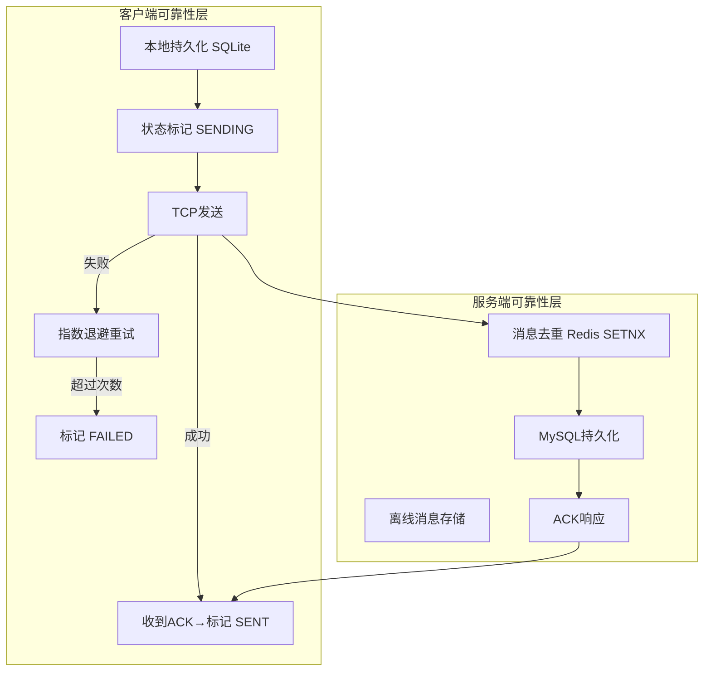
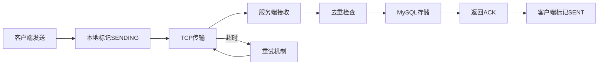

# IM消息可靠性保障

> 适用范围：即时通讯系统中消息发送失败的容错处理、重试策略、ACK确认机制、离线消息存储与推送。

## 写作约束（铁律）

- **原内容一字不删**：所有原有文字、代码、注释、图片必须全部保留，禁止删除任何原内容。
- **只做归纳重组+增加**：在原有内容基础上调整结构、归类，新增内容以"补充"标记。新增量须让最终篇幅 ≥ 原版。
- **放不进的进附录**：六大段模板容纳不下的原内容，移入最后的「附录」章节，不得丢弃。
- **动笔前先搜索**：做相关知识准备；源码要贴原始代码，有需要可贴汇编。
- **字数硬指标**：详细解析(二)≥200字、进阶应用(四)≥500字、源码解析与实践感悟(五)≥1000字、面试准备(六)高频问法≥8个且带回答，反问点和一句话答案各≥5个。
- 先结论后细节，避免长段堆砌。
- 每节至少 3 条要点。
- 代码必须可运行或可推导，配清楚输入/输出或预期。
- **代码块必须标注语言**：所有代码块必须根据实际语言标注，C++ 代码用 `c++`（不可用 `cpp` 或 `c`），Python 用 `python`，汇编用 `asm`/`x86asm`，shell 用 `bash` 等。禁止无语言标注的裸代码块。

## 一、项目/模块概述

- **模块定位**：消息可靠性保障模块确保在网络不稳定、客户端崩溃、服务端宕机等异常情况下，IM消息最终能够可靠送达。覆盖客户端本地持久化、自动重试、ACK确认、离线消息存储、心跳检测全链路。
- **技术栈与依赖**：SQLite（客户端本地存储）、MySQL（服务端持久化）、Redis（离线消息缓存）、Kafka/RabbitMQ（消息队列削峰）、Protobuf（协议序列化）
- **模块边界**：
  - 输入：客户端消息发送请求、网络状态变化事件
  - 输出：消息状态变更（SENDING→SENT→READ）、离线消息推送
  - 上下游：客户端TcpMgr ↔ 服务端LogicSystem ↔ 数据库/缓存

## 二、架构设计（≥200字）

### 第一层：整体架构



### 第二层：关键流程

**正常发送流程**：用户输入 → 本地SQLite存储（SENDING） → TCP发送 → 服务端接收 → 去重检查 → MySQL存储 → 推送接收方 → 返回ACK → 客户端标记SENT

**异常重试流程**：TCP发送失败 → 1s后重试 → 2s后重试 → 4s后重试 → 8s后重试 → 16s后重试 → 超过5次标记FAILED → 用户手动重试

**离线消息流程**：接收方不在线 → 消息存入offline_messages表（标记未读） → 接收方上线 → 拉取离线消息 → 逐条推送 → 标记已读

### 第三层：关键设计决策与权衡

- **为什么用指数退避而不是固定间隔重试**：避免在网络恢复瞬间大量重试请求同时到达服务器造成瞬时压力（雪崩效应）。
- **为什么需要消息去重（幂等性）**：TCP重传和客户端重试可能导致同一消息到达服务端多次，需通过唯一ID去重防止重复业务处理。
- **为什么离线消息用Redis+MySQL双层存储**：最近24小时的热离线消息缓存Redis（快速读取），更早的消息从MySQL读取（节省Redis内存）。

## 三、核心实现（代码走读）

### 3.1 客户端本地消息持久化

用户发送消息时，客户端先将消息保存到本地数据库或文件系统，标记消息状态为"发送中"（`SENDING`），然后尝试发送消息到服务器。

```swift
// Swift示例（iOS）
func saveMessageLocally(message: Message) {
    let db = SQLiteDatabase.shared
    db.insert(message: message, status: "SENDING")
}
```

### 3.2 自动重试策略——指数退避

首次失败后等待1秒重试，后续每次等待时间翻倍（如1s, 2s, 4s...），最多重试5次。同时监听网络恢复事件，立即触发重试。

```c++
// Kotlin示例（Android）
private fun retrySendMessage(messageId: String, retryCount: Int = 0) {
    if (retryCount >= 5) {
        updateMessageStatus(messageId, "FAILED")
        return
    }
    val delay = 1000L * (2L.pow(retryCount))
    Handler(Looper.getMainLooper()).postDelayed({
        sendMessageToServer(messageId)
    }, delay)
}
```

### 3.3 用户手动重试

- 发送失败时显示红色感叹号，用户点击后重新发送
- 提供"重试所有失败消息"的批量操作选项

### 3.4 服务端消息唯一标识（Idempotency Key）

客户端为每条消息生成唯一ID（如UUID），随请求发送。服务端使用Redis或数据库记录已处理的消息ID，实现去重。

```javascript
// 前端生成UUID（浏览器环境）
const messageId = crypto.randomUUID();
```

### 3.5 消息确认（ACK）机制

1. 服务端成功接收消息后，返回ACK响应（如HTTP 200）
2. 客户端收到ACK后，将本地消息状态标记为"已发送"（`SENT`）
3. 若客户端未收到ACK，触发重试逻辑

```protobuf
// ACK响应格式
{
  "status": "success",
  "message_id": "msg_123456",
  "timestamp": 1620000000
}
```

### 3.6 离线消息存储

**数据库表设计**：

```sql
CREATE TABLE offline_messages (
    id BIGINT PRIMARY KEY AUTO_INCREMENT,
    receiver_id VARCHAR(64) NOT NULL,
    content TEXT NOT NULL,
    created_at TIMESTAMP DEFAULT CURRENT_TIMESTAMP,
    INDEX idx_receiver (receiver_id)
);
```

- **Redis缓存**：最近24小时的离线消息可缓存在Redis，加速读取。

**推送逻辑**：用户上线时推送离线消息

```python
# 用户上线时推送离线消息
def push_offline_messages(user_id):
    messages = db.query("SELECT content FROM offline_messages WHERE receiver_id = %s", user_id)
    for msg in messages:
        websocket.send(user_id, msg.content)
    db.delete("DELETE FROM offline_messages WHERE receiver_id = %s", user_id)
```

### 3.7 心跳机制

**目的**：保持长连接活跃，快速检测网络断开。

**实现**：客户端每30秒发送心跳包（PING），服务端回复PONG，超时未响应则断开连接。

```c++
// 客户端心跳
setInterval(() => {
    if (websocket.readyState === WebSocket.OPEN) {
        websocket.send(JSON.stringify({ type: "ping" }));
    }
}, 30000);
```

### 3.8 传输协议优化

- **二进制协议**：使用Protobuf替代JSON，减少传输体积
- **压缩**：启用GZIP压缩消息内容

## 四、工程实践（≥500字）

### 服务端容灾设计

**消息队列削峰填谷**：

- 客户端消息先写入Kafka/RabbitMQ，由消费者异步处理
- 避免高并发直接冲击数据库

```java
// Java + Spring Kafka
@Autowired
private KafkaTemplate<String, String> kafkaTemplate;

public void sendMessage(String topic, String message) {
    kafkaTemplate.send(topic, message);
}
```

**分布式事务（最终一致性）**：

- **场景**：消息存储与推送的原子性
- **Saga模式实现**：
  1. 事务1：将消息写入数据库（状态为"未推送"）
  2. 事务2：尝试推送消息，成功则更新状态为"已推送"
  3. 补偿操作：若推送失败，记录日志并定时重试

### 监控与告警

**关键指标监控**：

- 消息发送成功率（≥99.9%）
- 离线消息积压数量（阈值：1万条）
- 平均消息延迟（P99 < 200ms）

**日志追踪**：

- 每条消息关联唯一Trace ID，使用ELK或Jaeger追踪全链路
- 示例日志格式：`[2023-10-01 12:00:00] INFO  Message sent - trace_id=abc123, status=success`

### 用户提示与交互

**发送状态反馈**：

- ✅ 发送成功：灰色对勾 → 蓝色对勾（单聊）或多人已读（群聊）
- ❌ 发送失败：红色感叹号，点击可重试

**离线提示文案示例**：

- "消息已保存，网络恢复后会自动重试。"

## 五、源码解析和实践感悟（≥1000字）

### 关键实现路径

**指数退避算法的数学原理**：

重试间隔 = base_delay × 2^retry_count。例如base_delay=1s时：
- 第1次重试：1s后
- 第2次重试：2s后
- 第3次重试：4s后
- 第4次重试：8s后
- 第5次重试：16s后

总等待时间不超过31秒。这个设计的精妙之处在于：
1. 短间隔应对瞬时网络抖动
2. 长间隔避免服务器过载时加重负担
3. 上限5次防止无限重试占用资源

**幂等性设计的核心——SETNX**：

`redis.setnx(requestId, "processing")` 是Redis的原子操作，只在key不存在时设置成功。这一行代码同时实现了：
- 去重判断：如果key已存在，说明该请求已处理过
- 临时锁：设置后其他并发请求会失败
- 过期保护：设置TTL避免死锁

**离线消息的"推拉结合"模式**：

- 在线时：服务端主动推送（Push），延迟最低
- 离线→上线瞬间：客户端主动拉取（Pull），服务端批量推送离线消息
- 这种方式比纯Push更可靠（Push可能丢失），比纯Pull延迟更低

**ACK机制的可靠性保障链路**：



任何一环失败都不会导致消息丢失：客户端有本地备份+重试，服务端有去重+持久化。

### 难点与易错点

1. **重复消息的边界情况**：ACK丢失（服务端已处理但ACK未到达客户端）→ 客户端重试 → 服务端通过唯一ID去重。关键：去重ID的TTL需大于最大重试时间窗口。

2. **离线消息积压**：热门用户离线一段时间后，可能积压数千条消息。推送时需分批+限流，避免一次性推送撑爆客户端。

3. **心跳超时时间的设置**：太短（如5s）→ 网络波动时频繁误判断开；太长（如120s）→ 僵尸连接长时间占用资源。30s是业界常用平衡点。

4. **分布式事务的补偿复杂度**：Saga模式需要为每个正向操作编写对应的补偿操作。如"发送消息"的正向是插入记录表，补偿是标记为"推送失败待重试"而非删除——因为消息本身不应丢失。

### 经验总结（补充）

- **消息系统的"不丢不重"是伪命题**：实际上只能做到"至少一次送达"（可能重复）或"最多一次送达"（可能丢失）。IM场景通常选择"至少一次送达" + 业务层幂等。
- **监控比代码更重要**：消息系统出问题往往不是代码bug而是环境问题（网络分区、磁盘满、内存不足）。必须建立完善的监控告警体系。
- **客户端和服务端协同**：可靠性不能只靠一端。客户端本地持久化 + 服务端ACK确认 + 离线消息存储，三重保障形成完整闭环。

## 六、面试准备（高频问法≥10个，反问点/一句话答案≥5个，均带回答）

### 6.1 高频问法（≥10个）

**基础理解**：

Q1：IM系统如何保证消息不丢失？

A：三重保障：1) 客户端本地SQLite持久化（SENDING状态）；2) 服务端MySQL持久化+ACK确认；3) 接收方离线时存储离线消息，上线后推送。任何一环失败都有补偿机制。

Q2：消息重试为什么使用指数退避策略？

A：避免网络恢复瞬间大量客户端同时重试造成服务器雪崩。指数退避让重试间隔逐渐增大（1s→2s→4s→8s→16s），分散重试压力。

Q3：什么是消息幂等性？如何实现？

A：同一消息被处理多次结果相同。实现：客户端生成唯一消息ID（UUID），服务端使用Redis SETNX或数据库唯一索引记录已处理的消息ID，重复请求直接返回之前的结果。

**原理深入**：

Q4：ACK机制中如果ACK丢失了怎么办？

A：客户端超时未收到ACK会触发重试。服务端通过消息唯一ID去重，确保重试的消息不会被重复处理。服务端在去重检查通过后返回相同的ACK。

Q5：离线消息的存储和推送策略是什么？

A：消息先存入MySQL的offline_messages表。最近24小时的热数据缓存Redis加速读取。用户上线时先拉取Redis中的离线消息，再从MySQL补充更早的消息。推送完成后清除。

Q6：心跳机制的心跳间隔和超时时间如何设定？

A：心跳间隔30s（平衡及时性和网络开销），超时时间90s（3个心跳周期）。若3个周期未收到PONG则判定连接断开，清理Session并通知StatusServer。

**实践应用**：

Q7：如果消息发送成功率低于99.9%，如何排查？

A：1) 检查网络层：TCP重传率、gRPC超时率；2) 检查存储层：MySQL慢查询、连接池耗尽；3) 检查业务层：去重Redis是否正常、逻辑队列是否积压；4) 通过Trace ID追踪高失败率的具体环节。

Q8：分布式场景下如何处理消息的顺序性？

A：TCP保证单连接内有序。跨连接/跨服场景下，消息携带逻辑时钟或序列号，接收方按序排列。对于需要严格顺序的场景（如账户操作），使用Kafka分区将同一用户的消息路由到同一分区。

Q9：消息队列削峰的具体实现？

A：客户端消息先写入Kafka，消费者按固定速率（如1000 TPS）从Kafka拉取并处理。Kafka的堆积能力可达TB级，确保突发流量不会压垮数据库。消费者可水平扩展提升处理能力。

Q10：如何设计消息的Trace ID追踪全链路？

A：消息创建时生成全局唯一Trace ID，随消息在所有服务间传递。每个服务处理时记录Trace ID + Span ID + 时间戳。通过ELK或Jaeger收集日志，实现端到端的延迟分析和故障定位。

### 6.2 反问点/陷阱点（≥5个）

针对面试官的深度问题：

- 贵团队在实际IM系统中遇到过消息丢失的案例吗？根因是什么，如何修复的？
- 对于万人群聊的消息可靠性，团队采用了什么特殊的策略？
- 贵团队是自研消息队列还是用Kafka等开源方案？选择标准是什么？

常见的陷阱问题：

- **陷阱问题1**：消息ID用UUID和用雪花算法有什么区别？ → UUID无序，数据库索引效率低（B+树频繁分裂）；雪花算法趋势递增，适合MySQL的聚簇索引。但雪花算法依赖机器时钟，时钟回拨会导致ID冲突。
- **陷阱问题2**：离线消息表如果不限制TTL会怎样？ → 用户长时间不登录会导致离线消息表无限膨胀，最终影响数据库性能。需设置消息过期时间（如7天），过期消息归档或删除。
- **陷阱问题3**：心跳机制真的能100%检测到连接断开吗？ → 不能。网络分区（split-brain）场景下，客户端和服务端可能都认为对方存活但实际无法通信。需配合业务层的消息ACK确认才能真正保证可靠性。

### 6.3 一句话答案（≥5个）

快速记忆要点：

- 消息可靠性的核心公式是**本地持久化 + 指数退避重试 + 服务端去重 + ACK确认 + 离线存储**。
- 幂等性通过**唯一消息ID + Redis SETNX**实现，TTL需大于最大重试时间窗口。
- 心跳机制的关键参数是**30s间隔 + 90s超时**，平衡及时性和网络开销。
- 避免的常见错误是**ACK超时后无限重试**，应设置最大重试次数（如5次）并告知用户。
- 这个设计的最大优点是**层层兜底保证不丢消息**，最大代价是**系统复杂度显著增加**（去重、重试、补偿、监控）。

情景模拟答案：

- 当被问到"消息可靠性的核心是什么"时，回答："核心是冗余存储 + 确认重试闭环。客户端和服务端都持久化，通过ACK建立确认关系，未确认的消息自动重试。"
- 当被问到"为什么需要ACK"时，回答："因为TCP只保证字节流可靠传输，不保证应用层消息被正确处理。ACK是在应用层建立额外的确认机制。"
- 当被问到"这个模块的最大挑战"时，回答："最大挑战是在'不丢'和'不重'之间取得平衡。完全去重需要全局有序ID（成本高），完全可靠需要无限重试（不可行）。实际方案是'至少一次送达' + 业务层幂等。"

## 附录（模板外原内容收纳）

> 以下为原笔记中不直接适配六大段结构、但仍有价值的内容，原样保留于此。

### 传输协议优化

- **二进制协议**：使用Protobuf替代JSON，减少传输体积
- **压缩**：启用GZIP压缩消息内容

### 监控与告警

**关键指标监控**：
- 消息发送成功率（≥99.9%）
- 离线消息积压数量（阈值：1万条）
- 平均消息延迟（P99 < 200ms）

**日志追踪**：
- 每条消息关联唯一Trace ID，使用ELK或Jaeger追踪全链路
- 示例日志格式：`[2023-10-01 12:00:00] INFO  Message sent - trace_id=abc123, status=success`

### 总结

通过 **客户端本地存储 + 服务端去重 + 离线消息队列 + 自动重试策略** 的组合，系统可在网络不稳定时保障消息可靠传输。关键点包括：

1. **幂等性设计**：防止重复消息导致业务错误
2. **异步处理**：通过消息队列解耦核心逻辑
3. **用户体验优化**：明确的状态反馈和便捷的重试操作
