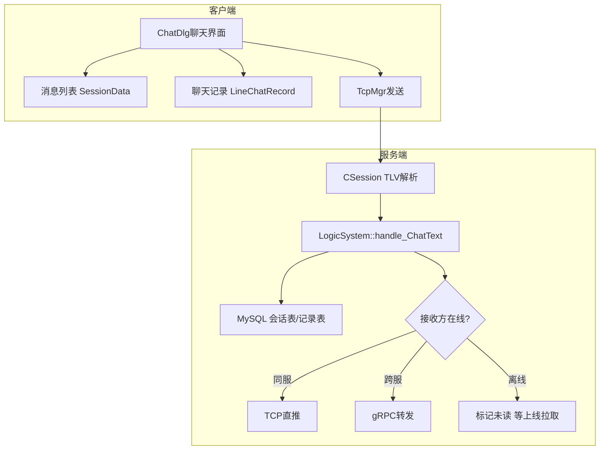

# IM聊天与群聊实现

> 适用范围：即时通讯系统中聊天消息的客户端展示、服务端收发处理、群聊广播方案。

## 写作约束（铁律）

- **原内容一字不删**：所有原有文字、代码、注释、图片必须全部保留，禁止删除任何原内容。
- **只做归纳重组+增加**：在原有内容基础上调整结构、归类，新增内容以"补充"标记。新增量须让最终篇幅 ≥ 原版。
- **放不进的进附录**：六大段模板容纳不下的原内容，移入最后的「附录」章节，不得丢弃。
- **动笔前先搜索**：做相关知识准备；源码要贴原始代码，有需要可贴汇编。
- **字数硬指标**：详细解析(二)≥200字、进阶应用(四)≥500字、源码解析与实践感悟(五)≥1000字、面试准备(六)高频问法≥8个且带回答，反问点和一句话答案各≥5个。
- 先结论后细节，避免长段堆砌。
- 每节至少 3 条要点。
- 代码必须可运行或可推导，配清楚输入/输出或预期。
- **代码块必须标注语言**：所有代码块必须根据实际语言标注，C++ 代码用 `c++`（不可用 `cpp` 或 `c`），Python 用 `python`，汇编用 `asm`/`x86asm`，shell 用 `bash` 等。禁止无语言标注的裸代码块。

## 一、项目/模块概述

- **模块定位**：聊天消息处理模块负责IM系统中文本消息的客户端展示、服务端接收存储与转发，以及群聊消息的广播分发。
- **技术栈与依赖**：Qt QMap/QVector（客户端数据管理）、MySQL（会话表/聊天记录表持久化）、Redis（在线状态查询）、gRPC（跨服转发）、JsonCpp（消息序列化）
- **模块边界**：
  - 输入：客户端聊天文本输入、服务端TLV消息体
  - 输出：会话列表更新、聊天记录展示、消息推送通知
  - 上下游：客户端UI层 ↔ TcpMgr ↔ ChatServer LogicSystem ↔ 数据库

## 二、架构设计（≥200字）

### 第一层：整体架构与模块划分

聊天消息模块分为客户端数据管理层和服务端处理层：



### 第二层：关键流程与数据流

1. 用户输入文本 → 创建时间记录项（可选） → 更新本地会话列表 → TLV封装发送
2. 服务端CSession解析TLV → LogicSystem::handle_ChatText处理
3. 时间类型：仅插入聊天记录表
4. 文本类型：插入/更新会话表 → 判断接收方在线状态 → 同服TCP推送 / 跨服RPC转发 / 离线标记未读
5. 转发成功后插入聊天记录表标记已读

### 第三层：关键设计决策与权衡

- **为什么Time和Text分开处理**：时间记录仅用于UI展示时间分割线，无需通知对方，只需本地持久化。文本记录需要通知对方并更新会话列表。
- **为什么会话表用INSERT OR UPDATE**：避免为每个消息查询会话是否存在，直接ON DUPLICATE KEY UPDATE减少一次查询。
- **为什么离线消息标记Unread而不是丢弃**：保证消息可靠性，用户上线后可通过拉取未读消息获取。

## 三、核心实现（代码走读）

### 3.1 客户端数据模型

**聊天消息列表**：

- 在消息列表类中，为便于查找聊天项，用一个`QMap`，`friend_id`作为键，方便我们查找（比如想添加一个好友消息项，判断是否已有记录，知道`friend_id`，自然是在`QMap`里直接找键比较方便），值为消息项结构体数据`SessionData`。
- 一个好友一个会话，会话ID随机生成。
- 全局的消息列表，一个`vector`（保证顺序），存放消息项结构体数据`SessionData`。
- `SessionData`内部主要包括：session_id、friend_id、friend_icon、last_msg、time。（其实就是消息列表项需要的必要的控件信息，再带上对应的会话ID）至于备注等信息，看情况再说。

**聊天记录列表**：

- 全局的列表，依旧是一个`vector`（保证顺序），存放各个聊天记录`LineChatRecord`
- 单个聊天记录`LineChatRecord`内部主要包括：text_id、record_type（时间或文本）、sender_id、receiver_id、text_content、time。
- 全局列表或许依旧可以维护两个，一个用于初始分批加载，一个用于总数据。后面再看了（这些都是离线加载时要考虑的，在线聊天先不考虑这些）

**输入文本内容流程**：

1. 添加添加聊天记录项（先添加时间项，可选）
2. 通知左侧消息列表，更新时间点和消息（最后一条，即最新）
3. 向后端发送数据

**收到对方的回应流程**：

1. 左侧消息列表，更新时间点和消息（最后一条，即最新）
2. 添加添加聊天记录项（先添加时间项，可选）

至于存储到全局的记录列表之类的，后期做离线时再考虑。

**数据库表设计**：

**会话列表 t_session**：


**聊天记录表 t_chat_record**：


### 3.2 数据存储方案

若是时间类型，只在聊天记录表中存下即可，毕竟紧接着就会是文本类型，没必要向会话表中先存再更新。

若是文本类型，在会话表中插入记录，若已存在，则更新记录。在聊天记录中插入记录。（判断对方是否在线，在线-已读，不在线-未读）

### 3.3 服务端处理请求

**消息ID定义**：

```
ID_CHAT_TEXT_RECORD_REQ = 1022, //聊天 文本记录 请求
ID_CHAT_TEXT_RECORD_RSP = 1023, //聊天 文本记录 响应
```

**事件注册**：

```c++
_handler.insert({ MsgId::ID_CHAT_TEXT_RECORD_REQ, std::bind(&LogicSystem::handle_ChatText, this, std::placeholders::_1, std::placeholders::_2, std::placeholders::_3) });
```

### 3.4 核心事件处理——文本聊天

```c++
// 【逻辑处理回调】文本聊天
void LogicSystem::handle_ChatText(std::shared_ptr<CSession> session, const short msg_id, const std::string & data)
{
    // 1.初始解析请求数据，反序列化为json对象
    Json::Value src_js; Json::Value dst_js;
    if (InitParseQuest(data, src_js, dst_js, session, MsgId::ID_CHAT_TEXT_RECORD_RSP) == false) return;

    // 2.定义Defer对象，在对象结束时，自动将响应数据及数据ID序列化并发送给客户端
    Defer defer([&dst_js, session]() {
        std::string dst_str = dst_js.toStyledString();
        session->Send(dst_str, MsgId::ID_CHAT_TEXT_RECORD_RSP);
    });

    // 3.数据解析成功，获取各字段信息
    std::string session_id = src_js["session_id"].asString();
    std::string record_id = src_js["record_id"].asString();
    int sender_id = src_js["sender_id"].asInt();
    int receiver_id = src_js["receiver_id"].asInt();
    RecordType record_type = RecordType(src_js["record_type"].asInt());
    long long timestamp = src_js["timestamp"].asInt64();
    std::string text_content{};
    if (src_js.isMember("text_content")) text_content = src_js["text_content"].asString();

    // 4.业务处理
    switch (record_type) {
        case RecordType::Type_Time: { // 时间类型
            // 4.1 若是时间类型，访问MySQL，只需插入聊天记录表即可。
            std::shared_ptr<T_ChatRecord> t_chat_record = std::make_shared<T_ChatRecord>(0, session_id, sender_id, receiver_id, record_id, record_type, timestamp);
            int insert_chatrecord_errcode = RdbMgr::GetInstance()->InsertChatRecord(t_chat_record);
            if (insert_chatrecord_errcode != ErrorCodes::Success) {
                logfile.write(LL::ERROR, "【文本聊天】【时间类型】访问MySQL，插入聊天记录表(sender_id = %d, receiver_id = %d)失败！\n", sender_id, receiver_id);
                dst_js["error"] = ErrorCodes::InsertChatRecord_Failed;
                return; // defer
            }
            logfile.write(LL::DEBUG, "【文本聊天】【时间类型】访问MySQL，插入聊天记录表(sender_id = %d, receiver_id = %d)成功！\n", sender_id, receiver_id);
        }
            break;
        case RecordType::Type_Text: { // 文本类型
            // 4.2 若是文本类型，访问MySQL，先插入会话表(记录存在则更新)
            std::shared_ptr<T_Session> t_session = std::make_shared<T_Session>(0, session_id, sender_id, receiver_id, text_content, timestamp);
            int insert_session_errcode = RdbMgr::GetInstance()->InsertSession(t_session);
            if (insert_session_errcode != ErrorCodes::Success) {
                logfile.write(LL::ERROR, "【文本聊天】【文本类型】访问MySQL，插入会话表(sender_id = %d, receiver_id = %d)失败！\n", sender_id, receiver_id);
                dst_js["error"] = ErrorCodes::InsertSession_Failed;
                return; // defer
            }
            logfile.write(LL::DEBUG, "【文本聊天】【文本类型】访问MySQL，插入会话表(sender_id = %d, receiver_id = %d)成功！\n", sender_id, receiver_id);

            // 4.3 判断对方是否在线 获取双方的服务器(己方-解析配置；对方-访问Redis)
            const std::string self_server_name = ConfigMgr::GetInstance().GetConfig("SelfServer", "Name");
            const std::string receiver_server_name = RedisMgr::GetInstance()->HGet(Hash_UserId_Server, std::to_string(receiver_id));
            // 4.4 若不在线，访问MySQL，插入聊天记录表且标记为未读
            if (receiver_server_name.empty()) {
                logfile.write(LL::INFO, "【文本聊天】【文本类型】访问Redis，查询接收方所在的服务器失败！对方(即接收方，receiver_id = %d)可能不在线！\n", receiver_id);

                std::shared_ptr<T_ChatRecord> t_chat_record = std::make_shared<T_ChatRecord>(0, session_id, sender_id, receiver_id, record_id, record_type, timestamp, text_content, ReadStatus::Unread);
                int insert_record_errcode = RdbMgr::GetInstance()->InsertChatRecord(t_chat_record);
                if (insert_record_errcode != ErrorCodes::Success) {
                    logfile.write(LL::ERROR, "【文本聊天】【文本类型】访问MySQL，插入聊天记录表(sender_id = %d, receiver_id = %d)失败！\n", sender_id, receiver_id);
                    dst_js["error"] = ErrorCodes::InsertChatRecord_Failed;
                    return; // defer
                }
                logfile.write(LL::DEBUG, "【文本聊天】【文本类型】访问MySQL，插入聊天记录表(sender_id = %d, receiver_id = %d)成功！\n", sender_id, receiver_id);
            }
            else {
                // 4.5 若同服，直接转发给接收方(使用接收方的TCP连接)，设置响应信息
                bool notify_success = false; // 转发成功标志
                if (self_server_name == receiver_server_name) {
                    logfile.write(LL::DEBUG, "【文本聊天】【文本类型】同服，直接转发给接收方(使用接收方的TCP连接)。\n");
                    notify_success = TcpNotifyChatText(src_js, dst_js);
                }
                // 4.6 若不同服，转发给接收者所在的服务器(使用RPC通信)，设置响应信息
                else {
                    logfile.write(LL::DEBUG, "【文本聊天】【文本类型】不同服，转发给接收方所在的服务器(使用RPC通信)。\n");
                    notify_success = RpcNotifyChatText(src_js, receiver_server_name, dst_js);
                }

                // 4.7 若转发失败，设置响应信息，返回(前端提示发送失败)
                if (!notify_success) {
                    logfile.write(LL::ERROR, "【文本聊天】【文本类型】转发失败！(sender_id = %d, receiver_id = %d)\n", sender_id, receiver_id);
                    return; // defer
                }

                // 4.8 若转发成功，访问MySQL，插入聊天记录表且标记为已读
                std::shared_ptr<T_ChatRecord> t_chat_record = std::make_shared<T_ChatRecord>(0, session_id, sender_id, receiver_id, record_id, record_type, timestamp, text_content, ReadStatus::Read);
                int insert_record_errcode = RdbMgr::GetInstance()->InsertChatRecord(t_chat_record);
                if (insert_record_errcode != ErrorCodes::Success) {
                    logfile.write(LL::ERROR, "【文本聊天】【文本类型】访问MySQL，插入聊天记录表(sender_id = %d, receiver_id = %d)失败！\n", sender_id, receiver_id);
                    dst_js["error"] = ErrorCodes::InsertChatRecord_Failed;
                    return; // defer
                }
                logfile.write(LL::DEBUG, "【文本聊天】【文本类型】访问MySQL，插入聊天记录表(sender_id = %d, receiver_id = %d)成功！\n", sender_id, receiver_id);
            }
        }
            break;
        default:
            break;
    }

    // 5.准备响应数据，返回响应信息
    dst_js["error"] = ErrorCodes::Success;
    dst_js["receiver_id"] = receiver_id;
    dst_js["session_id"] = session_id;
    dst_js["record_id"] = record_id;
    dst_js["record_type"] = static_cast<int>(record_type);
    return; // defer
}
```

### 3.5 群聊设计思路

**群聊核心设计**：

- 群聊的唯一ID
- 建一张表：群聊id关联信息相关的更改（名字、状态、数量）
- 每个用户也有一张表，关联很多群聊，两张表做匹配
- 发信息时，发到server，server会查群聊的所有用户，实现广播，找到其他用户的server

**扩展功能**：

- 文件传输：资源服务器（ResourceServer），大文件分小文件传输，最后汇成一个，断电续传（分组交换思想）
- Web RTC：实时音视频通话

## 四、工程实践（≥500字）

### 与项目中其他模块的集成方式

- **客户端TcpMgr ↔ ChatServer CSession**：通过TLV协议通信，msg_id区分消息类型（1022文本记录请求/1023文本记录响应）
- **LogicSystem ↔ RedisMgr**：通过HGet查询接收方所在服务器（Hash_UserId_Server），判断在线状态
- **LogicSystem ↔ RdbMgr（MySQL）**：InsertSession（会话表）、InsertChatRecord（聊天记录表），区分时间/文本类型
- **LogicSystem ↔ ChatGrpcClient**：跨服文本消息转发

### 生产环境考量

**错误处理与容错策略**：

- 每条SQL操作后检查errcode，失败时记录日志+设置响应错误码
- 转发失败时设置对应error信息，前端显示"发送失败"
- 对方离线时不丢弃消息，标记未读等待上线拉取

**监控与日志**：

- 每个处理步骤记录DEBUG级别日志（含sender_id、receiver_id）
- 错误操作记录ERROR级别，包含完整上下文（如"插入聊天记录表(sender_id=X, receiver_id=Y)失败"）

### 常见优化策略

**批量处理**：

- 发送队列批量发送：减少系统调用次数
- 聊天记录分批加载：初始加载最近N条，滚动时按需加载更多

**缓存策略**：

- 用户信息内存缓存：避免重复查MySQL
- Redis缓存用户在线状态和所在服务器

**群聊优化**：

- 群聊广播时批量查询所有成员所在的Server，按Server分组后批量RPC转发
- 大群（如万人群）采用消息队列异步推送，避免阻塞主线程

## 五、源码解析和实践感悟（≥1000字）

### 关键实现路径

**会话表与聊天记录表的分离设计**：

会话表（t_session）存储每个对话的最新一条消息和会话元信息，类似于微信的消息列表。聊天记录表（t_chat_record）存储完整的聊天历史。两者分离的好处：
1. 消息列表只需查会话表（数据量小、速度快）
2. 点击进入聊天界面时才查聊天记录表
3. 会话表的更新频率远低于记录表（每个会话每天可能几百条消息，但会话表只更新最后一条）

**时间记录的巧妙处理**：

- Type_Time类型只存储到本地聊天记录表，不需要通知对方
- 时间记录紧挨着文本记录，起到UI分割线的作用（"今天 14:30"）
- 不向会话表插入时间记录，因为会话表只需展示最后一条真实消息

**同服/跨服判断的精准路由**：

```c++
const std::string self_server_name = ConfigMgr::GetInstance().GetConfig("SelfServer", "Name");
const std::string receiver_server_name = RedisMgr::GetInstance()->HGet(Hash_UserId_Server, std::to_string(receiver_id));
```

关键设计：
- 己方服务器名从配置文件读取（静态信息）
- 对方服务器名从Redis查询（动态信息，用户登录时写入）
- 若receiver_server_name为空 → 对方不在线 → 标记未读
- 若相等 → 同服TCP直推（延迟最低）
- 否则 → 跨服gRPC转发

### 难点与易错点

1. **会话表重复插入问题**：若两个用户互相发消息，会有两条会话记录（sender_id和receiver_id交换）。解决方案：INSERT ... ON DUPLICATE KEY UPDATE。

2. **群聊广播的性能问题**：群成员可能分布在多个ChatServer上，需要逐个RPC调用。解决方案：先按Server分组，然后每组批量发送，减少RPC次数。

3. **大文件传输的断点续传**：将大文件切分为小块（如1MB），逐块传输并记录进度。接收方按序号组装。传输中断后从断点继续。类似分组交换中"分组"的思想。

4. **消息顺序性问题**：TCP保证单连接内消息有序，但跨服转发时两条消息可能经不同路径到达。解决方案：消息携带序列号或时间戳，接收方按序排列。

### 经验总结（补充）

- **数据库设计先于编码**：聊天系统的核心是数据模型。先确定会话表、记录表、群聊表的结构和索引，再写业务逻辑。
- **读写分离思想**：会话表是"热"数据（频繁更新），聊天记录表是"温"数据（频繁插入），离线消息是"冷"数据。不同热度可采用不同存储策略。
- **协议字段预留**：TLV消息体中应预留扩展字段，避免后续新增功能时协议不兼容。

## 六、面试准备（高频问法≥10个，反问点/一句话答案≥5个，均带回答）

### 6.1 高频问法（≥10个）

**基础理解**：

Q1：请介绍聊天消息的完整收发流程？

A：用户输入文本 → 客户端创建时间记录+文本记录 → TLV封装发送 → ChatServer CSession解析 → LogicSystem::handle_ChatText → 写入MySQL会话表+记录表 → Redis查询对方所在Server → 同服TCP推送/跨服gRPC转发/离线标记未读 → 返回ACK给发送方。

Q2：会话表和聊天记录表为什么要分开设计？

A：会话表存储每个对话的最后一条消息，用于消息列表展示（数据量小、查询快）。聊天记录表存储完整历史，按需加载。分离设计避免每次打开消息列表都扫描海量记录。

Q3：文本聊天中Time类型和Text类型的区别是什么？

A：Time类型仅用于UI时间分割线展示，只存入本地记录表不通知对方。Text类型是真正的聊天内容，需存入会话表+记录表并通知对方。

**原理深入**：

Q4：同服和跨服消息转发的判断逻辑是怎样的？

A：通过Redis HGet查询接收方user_id对应的server_name。server_name为空→对方离线；与己方server_name相同→同服TCP直推；不同→跨服gRPC转发。

Q5：群聊广播如何高效实现？

A：查询群成员列表 → 按所在Server分组 → 每组批量RPC转发 → 各ChatServer收到后通过本地Session TCP推送。大群可采用消息队列异步推送。

Q6：大文件分块传输的断点续传如何设计？

A：发送方将文件切分为固定大小块（如1MB），每块带序号和总块数。接收方按序号写入临时文件，记录已接收块号。传输中断后从最后一个成功的块号继续。全部接收完毕后校验完整性。

**实践应用**：

Q7：如果系统需要支持消息已读/未读状态，如何设计？

A：在聊天记录表中增加read_status字段。发送方发消息时默认Unread。接收方打开聊天界面时批量更新read_status为Read，并通过ACK通知发送方更新UI。群聊需要记录每个成员的已读状态（可用位图或独立表）。

Q8：如何处理消息发送失败的情况？

A：1) 客户端本地持久化消息（状态SENDING）；2) 指数退避重试（1s→2s→4s→...最多5次）；3) 超过重试次数标记FAILED，显示红色感叹号；4) 用户可手动重试。

Q9：消息ID的生成策略有哪些选择？

A：1) UUID（简单但无序，不利于数据库索引）；2) 雪花算法（趋势递增，适合分布式）；3) 数据库自增（单点瓶颈）。推荐雪花算法：局部自增+全局唯一。

Q10：如何保证消息不丢失？

A：客户端：本地持久化+重试机制；服务端：写入MySQL后再返回ACK；接收方离线：标记未读等待上线拉取。三重保障确保消息可靠性。

### 6.2 反问点/陷阱点（≥5个）

针对面试官的深度问题：

- 贵团队在群聊消息的存储上是如何做冷热分离的？比如超过3个月的群聊历史消息如何归档？
- 在高并发场景下，数据库写入成为瓶颈时有哪些优化手段？
- 跨服消息转发时如果接收方服务器宕机，消息如何处理？

常见的陷阱问题：

- **陷阱问题1**：会话表用INSERT OR UPDATE，并发场景下两个发送方同时发消息会丢失更新吗？ → INSERT ... ON DUPLICATE KEY UPDATE是原子操作（在InnoDB的行锁保护下），不会丢失，但后到达的消息会覆盖先到达的消息（last write wins）。
- **陷阱问题2**：如果Redis中查不到接收方的server_name，一定是对方离线吗？ → 不一定。可能Redis数据过期、服务器重启导致数据丢失。需要结合心跳机制综合判断。
- **陷阱问题3**：群聊广播时，如果某个成员的Session已断开但Redis尚未更新，消息会发给谁？ → 会发送失败（TCP write error），该成员的消息应标记为未读，等其重连后拉取。

### 6.3 一句话答案（≥5个）

快速记忆要点：

- 聊天模块的核心设计是**会话表与记录表分离**，热数据小表快速查询，冷数据大表按需加载。
- 消息转发最关键的判断是**Redis中receiver_server_name**，空=离线、相等=同服、否则=跨服。
- 群聊广播的优化关键在**按Server分组批量发送**，减少RPC调用次数。
- 避免的常见错误是**Time类型也推送给了对方**，造成对方界面出现多余时间线。
- 这个设计的最大优点是**清晰的路由策略**（同服/跨服/离线三态），最大代价是**跨服消息延迟高于同服**。

情景模拟答案：

- 当被问到"聊天系统的核心是什么"时，回答："核心是消息的可靠存储与精准路由，通过MySQL保证持久化，通过Redis+TCP/gRPC保证送达。"
- 当被问到"为什么要用Redis查在线状态"时，回答："因为Redis是内存数据库，查询延迟在微秒级，远快于MySQL，适合高频的在线状态查询。"
- 当被问到"这个模块的不足"时，回答："主要不足是群聊广播的线性扩展问题，当群成员数极大时，广播开销线性增长。可通过消息队列异步化+分级推送缓解。"

## 附录（模板外原内容收纳）

> 以下为原笔记中不直接适配六大段结构、但仍有价值的内容，原样保留于此。

### 群聊思路原文

群聊的唯一id。建一张表，群聊id关联信息相关的更改（名字、状态、数量）。每个用户也有一张表，关联很多群聊，两张表做匹配。发信息时，发到server，server会查群聊的所有用户，实现广播，找到其他用户的server。

语言方面：文件传输使用资源服务器（ResourceServer），大文件分小文件传输，最后汇成一个，断电续传，分组交换。Web RTC。
