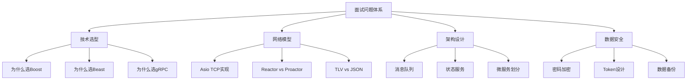

# IM面试高频问答

> 适用范围：IM即时通讯项目的面试准备，涵盖技术选型（Boost.Beast、Asio TCP、gRPC）、架构设计（消息队列、Reactor模式）、状态服务、数据备份等核心问题。

## 写作约束（铁律）

- **原内容一字不删**：所有原有文字、代码、注释、图片必须全部保留，禁止删除任何原内容。
- **只做归纳重组+增加**：在原有内容基础上调整结构、归类，新增内容以"补充"标记。新增量须让最终篇幅 ≥ 原版。
- **放不进的进附录**：六大段模板容纳不下的原内容，移入最后的「附录」章节，不得丢弃。
- **动笔前先搜索**：做相关知识准备；源码要贴原始代码，有需要可贴汇编。
- **字数硬指标**：详细解析(二)≥200字、进阶应用(四)≥500字、源码解析与实践感悟(五)≥1000字、面试准备(六)高频问法≥8个且带回答，反问点和一句话答案各≥5个。
- 先结论后细节，避免长段堆砌。
- 每节至少 3 条要点。
- 代码必须可运行或可推导，配清楚输入/输出或预期。
- **代码块必须标注语言**：所有代码块必须根据实际语言标注，C++ 代码用 `c++`（不可用 `cpp` 或 `c`），Python 用 `python`，汇编用 `asm`/`x86asm`，shell 用 `bash` 等。禁止无语言标注的裸代码块。

## 一、项目/模块概述

- **模块定位**：面试准备文档，系统梳理IM项目中的核心技术决策、架构设计理由、常见面试问题的标准回答。
- **技术栈与依赖**：Boost.Asio、Boost.Beast、gRPC、Protobuf、Redis、MySQL、JsonCpp、Qt
- **模块边界**：问题覆盖技术选型、网络模型、协议设计、服务架构、数据安全五大维度

## 二、架构设计（≥200字）

### 面试问题分类体系



### 核心回答框架

每个问题的标准回答结构：**1) 直接给出结论 → 2) 展开技术细节 → 3) 对比替代方案 → 4) 说明选择理由**

## 三、核心实现（代码走读）

### 3.1 为什么使用Boost库

**核心回答**：

我想实现一个后端服务程序，**它需要便捷地嵌入到不同的项目中，需要可以跨平台运行**。深入理解网络协议栈和异步编程模型，打下基础。

Boost 库经过工业级验证（如金融、游戏领域）。

**Asio网络库优势**：
- **主要作用**：主要用在服务端编程中处理服务器和客户端的socket。不限于此，类似于文件、时间都可以处理。
- **可移植性好**：在windows下可能使用iocp，在linux下可能使用epoll，在bsd下可能使用kqueue。
- **可扩展性高**：可以自己进行扩展。
- 作者写的代码比较规范；可能进入下一代的C++标准库中。

**网络模型分类**：Reactor模型（Lighttpd、libevent、libev、poco），Proactor模型（Asio、Iocp）

### 3.2 Beast库实现HTTP请求处理

**Beast的优势**：

1. **高性能异步模型**：选择 Beast 的核心价值在于其 **性能极限、协议可控性** 和 **与现代 C++ 生态的无缝整合**。对于需要 **低延迟、高吞吐、协议定制** 的场景尤为适合。

2. **WebSocket 无缝集成**：可通过同一套代码库同时支持 HTTP 和 WebSocket 协议，方便构建实时双工通信系统。

Boost.Beast **并非唯一选择**，但它在 **协议控制粒度** 和 **性能极限调优** 方面仍具有独特优势。若项目符合以下特征，建议优先考虑 Beast：
- 需要深度定制通信协议（如混合 TCP/HTTP 流量）
- 已使用 Boost 生态（如 Asio、JSON）
- 对网络层有极致性能要求（微秒级延迟）

反之，若追求开发效率或需要高级功能（如 HTTP/2、内置 ORM），则 Drogon、cpp-httplib 等更合适。技术选型需权衡 **开发成本、性能需求、团队技术栈** 三大要素。

### 3.3 如何利用Asio实现TCP服务

利用asio的多线程模式，根据cpu核数封装io_context连接池，每个连接池跑在独立线程，采用异步`async_read`和`async_write`方式读写，通过消息回调完成数据收发。

整个项目采用的网络模式是**Proactor模式**，每个连接通过Session类管理，通过智能指针管理Session，保证回调之前Session可用，底层绑定用户id和session关联，回调函数可根据session反向查找用户进行消息推送。

客户端和服务器通信采用json，通过TLV方式（消息头(`消息id+消息长度`)+消息内容）封装消息包防止粘包。

### 3.4 gRPC选型理由

- 多语言支持（Node.js实现验证码服务）
- 断线重连支持
- 验证服务+Redis验证过期
- 高性能HTTP/2 + Protobuf序列化

**为何不直接使用 Protobuf 的 RPC 框架？**
A：Boost.Asio + Protobuf 的组合更灵活，适合定制私有协议（如游戏动作同步），而 gRPC 适合标准化服务间通信。

**JSON 与 Protobuf 如何选择？**
A：JSON 用于人可读的场景（如配置、HTTP API），Protobuf 用于性能敏感的内部通信。

### 3.5 消息队列的作用

在IM项目中的应用：
1. **解耦合**：CSession（网络层）和LogicSystem（业务层）通过逻辑队列解耦
2. **削峰**：高并发消息先入队列，工作线程匀速处理
3. **保证消息顺序**：单工作线程保证队列中消息按入队顺序处理
4. **多线程安全**：mutex + condition_variable保证线程安全

### 3.6 Reactor模式

根本原因在于其与场景需求高度匹配：

1. **高并发**：单线程事件循环轻松管理数万连接
2. **实时性**：事件驱动模型确保消息低延迟处理
3. **资源效率**：非阻塞 I/O + Session 轻量化管理节省内存/CPU
4. **成熟生态**：主流框架和工具链降低开发复杂度

### 3.7 状态服务 StatusServer

状态服务监控各个服务的状态：

1. **服务注册与发现**：服务启动时向 **StatusServer** 注册自身信息（IP、端口、服务类型）。**StatusServer** 维护全局服务列表，供其他服务查询可用节点。

2. **健康检查与心跳机制**：各服务定期向 **StatusServer** 发送心跳包，确认存活状态。心跳超时后标记服务为不可用，触发告警或自动恢复。

3. **状态数据存储**：
   - **Redis**：存储实时状态（如用户在线状态、服务负载）
   - **MySQL/Consul**：持久化服务元数据（如服务版本、配置信息）

4. **状态查询与通知**：提供 gRPC/HTTP API 供其他服务查询状态。支持订阅模式，当服务状态变化时主动推送通知。

### 3.8 数据备份与恢复

- 定期备份数据，并进行恢复演练，确保在数据丢失或损坏时能够快速恢复。

## 四、工程实践（≥500字）

### 客户端登录流程

**前置总结**：

客户端初始向 GateServer 发起登录请求，GateServer 访问 StatusServer 得到连接数最小的 ChatServer 信息，同时得到用户的 user_id 和 token。

客户端再根据 ChatServer 信息连接 ChatServer ，连接成功后，将用户的 user_id 和 token 发过去。

ChatServer 接收到 user_id 和 token 后，访问 StatusServer 验证是否正确，将结果告知客户端。

客户端收到最终结果，若认证成功，就可以跳转到聊天界面了。

StatusServer 会负责负载均衡，同时为客户端生成对应的 token，和用户的 user_id 绑定起来。

客户端连接 ChatServer 是通过 TcpMgr，TcpMgr 会将连接的结果告知给对应界面模块，对应界面模块再向连接成功的 ChatServer 发送数据。

### 客户端HTTP请求处理

**HttpMgr 管理请求和响应**：

```c++
connect(HttpMgr::GetInstance().get(), &HttpMgr::sig_LoginModFinish, this, &LoginDlg::slot_LoginModFinish);

void LoginDlg::slot_LoginModFinish(ErrorCodes err_code, const QByteArray &byte_result, MsgId msg_id)
{
    // 1.错误检测
    // 2.将Json字节流反序列化为Json对象(使用doc中转)
    // 3.将响应结果转换为json对象(反序列化)，根据消息id的不同，调用不同的处理方法
}
```

事件处理器：`QMap<MsgId, std::function<void(const QJsonObject&)>> _handler;`

```c++
// 【事件回调】初始登录
void LoginDlg::handle_LoginInit(const QJsonObject& json_obj)
{
    // 1.错误检测
    // 2.初始登录成功，解析并存储收到的数据(用户ID-token密钥，ChatServer信息)
    //   (user_id, token, chatserver_ip, chatserver_port)
    // 3.将 ChatServer信息，通知给 TcpMgr 发送长连接，连接 ChatServer
}
```

### GateServer 处理登录请求

```c++
// 【逻辑处理回调】Post请求_初始登录 "/login_init"
void LogicSystem::handle_LoginInit(std::shared_ptr<HttpConnection> http_conn)
{
    // 初始解析请求数据，设置响应内容类型
    // 定义Defer对象，在函数每次返回时，将响应数据序列化为字符串，写入响应体
    // 解析成功，获取各字段信息
    // 访问MySQL，核对初始登录身份，根据邮箱查询用户信息(主要需要user_id)，同时判断密码是否正确
    // 访问StatusServer，发起RPC调用请求，将user_id传过去，获取生成的token以及合适的ChatServer信息
    // 处理完毕，设置响应信息，序列化为字符串，写入响应体
}
```

调用statusserverclient的GetChatServer，grpc服务文本，请求，响应。根据配置服务初始化一个连接池子，创建多个channel，提高负载均衡，多个stub，有一个连接队列存储stub，实现获取连接，归还连接。调用GetChatServer，stub调用服务。

### StatusServer

监听端口，添加服务，启动服务。重写GetChatServer方法，获得一个连接数量最少的chatserver（负载均衡算法），构造相应信息，IP，端口，token（uuid），uuid存到redis（可以用雪花算法）。从配置文件中读取chatserver的数据存入到map里面。

## 五、源码解析和实践感悟（≥1000字）

### 关键实现路径

**Proactor模式 vs Reactor模式的本质区别**：

- Reactor：应用层主动调用read/write，I/O完成后通过事件通知（epoll_wait返回），是"同步非阻塞"模型
- Proactor：操作系统内核异步执行I/O操作，完成后通知应用层，是"真正的异步"模型
- Boost.Asio在Windows下使用IOCP（纯Proactor），在Linux下使用epoll模拟Proactor（内部仍是Reactor）

**为什么选择Proactor模式？**

1. 代码更简洁：不需要手动管理读缓冲区的位置偏移
2. 性能更高：减少了用户态和内核态的切换次数
3. 扩展性好：io_context池天然支持多线程

**TLV协议 vs JSON协议的工程取舍**：

| 维度 | TLV | JSON |
|------|-----|------|
| 解析复杂度 | 低（固定头+已知长体） | 高（需完整JSON解析器） |
| 传输效率 | 高（二进制，头4字节） | 低（文本，冗余字段名） |
| 可读性 | 差 | 好 |
| 扩展性 | 需手动管理字段编号 | 自然支持新增字段 |
| 适用场景 | 高频内部通信 | 对外API、配置 |

本项目巧妙地将两者结合：客户端与服务端TCP通信使用TLV（高频），HTTP API使用JSON（可读性好）。

**gRPC连接池的工程价值**：

gRPC Channel创建成本高（涉及HTTP/2握手、TLS协商），直接每次new Channel + new Stub会导致：
1. 延迟增高（每次RPC都需握手）
2. 连接数爆炸（每个Channel维护一个TCP连接）
3. 线程安全问题（Stub非线程安全）

解决方案：预创建连接池，通过mutex + condition_variable管理Stub的获取/归还，配合Defer自动归还。

**单例模式在服务器逻辑处理中的价值**：

为什么服务器的逻辑处理要采用单例模式：
1. **唯一性**：限制了对象的产生数量，确保系统中只有一个实例。
2. **全局访问**：提供了一个全局的方法来获取该实例，方便在整个应用程序中共享和管理。
3. **资源控制**：通过限制实例化次数，可以有效控制对资源的访问。
4. **线程安全**：由于单例对象是线程安全的，因此在多线程环境下也能保证实例的一致性。

**降低模块耦合度——引入工厂模式**：使用工厂模式来管理单例类的实例化过程，而不是让单例类自身负责实例化。这样可以将实例化逻辑与业务逻辑分离，进一步降低单例类的职责范围。

**Redis单线程的哲学**：Redis的单线程设计是一种权衡取舍：通过简化并发模型，以最小的开销实现极高的吞吐量和低延迟。随着硬件发展，Redis在保持核心单线程的同时，通过多线程辅助I/O和后台任务，进一步提升了性能，但其核心逻辑的单线程特性仍然是其高效稳定的基石。

### 难点与易错点

1. **Cross-Platform的坑**：Boost.Asio在Windows（IOCP）和Linux（epoll）下的行为有细微差异。例如，IOCP下的async_read_some可能不会读完所有数据，需要循环读取。
2. **gRPC的线程模型**：gRPC服务端默认单线程！必须通过SetSyncServerOption显式配置线程池大小。这个默认行为容易导致性能瓶颈。
3. **JSON库的选择**：JsonCpp的Reader是严格的JSON解析器，非标准JSON会解析失败。建议生产环境使用更宽容的nlohmann/json或rapidjson。

### 经验总结（补充）

- **技术选型先问"为什么不用更简单的方案"**：例如HTTP可以用cpp-httplib（单头文件），gRPC可以用brpc（性能更高）。每次选择都有trade-off。
- **面试中的回答策略**：先给出结论（1句话），再展开技术细节（3-5句话），最后对比替代方案（2-3句话）。避免过长回答让面试官失去兴趣。
- **项目经验的表达公式**：我负责了X模块 → 遇到了Y挑战 → 采用了Z方案 → 达到了W效果。

## 六、面试准备（高频问法≥10个，反问点/一句话答案≥5个，均带回答）

### 6.1 高频问法（≥10个）

**技术选型**：

Q1：为什么选择Boost.Asio而不是libevent/libuv？

A：Asio是准C++标准库，跨平台性好（Windows IOCP/Linux epoll/BSD kqueue），Proactor模式性能更高。libevent是C库、Reactor模式，与C++ RAII范式不匹配。libuv虽是C但Node.js驱动，生态成熟度不如Asio。

Q2：gRPC和brpc有什么区别，为什么选择gRPC？

A：brpc由百度开源，纯C++实现，单机QPS可达100万+、延迟微秒级，适合高性能C++服务。gRPC由Google开源，多语言支持（C++/Java/Go/Python），适合跨语言微服务。本项目有Node.js验证服务，多语言需求决定了gRPC。

**架构设计**：

Q3：项目中为什么需要StatusServer？

A：StatusServer承担三大职责：1) 服务注册与发现（ChatServer启动时注册）；2) 负载均衡（选择连接数最少的ChatServer）；3) Token生成与验证（UUID绑定user_id存入Redis）。没有StatusServer，GateServer无法知道该把用户分配到哪个ChatServer。

Q4：消息队列在IM项目中的具体作用是什么？

A：1) 解耦合：CSession（生产者）和LogicSystem（消费者）通过逻辑队列分离，网络线程不被业务阻塞；2) 削峰：高并发消息先入队，工作线程匀速处理；3) 保证顺序：单工作线程FIFO处理；4) 线程安全：mutex+condition_variable。

Q5：项目的微服务是如何划分的？

A：GateServer（HTTP网关，登录注册）、ChatServer（TCP长连接，消息收发）、StatusServer（服务发现+Token）、VerifyServer（验证码）。按功能垂直拆分，各服务独立部署、独立数据库、gRPC通信。

**网络模型**：

Q6：Boost.Asio的Proactor模式和Reactor模式有什么区别？

A：Reactor：应用层主动调用read/write，I/O就绪后通过事件通知（epoll_wait）；应用层负责实际的数据读写。Proactor：操作系统内核异步执行I/O操作，完成后直接通知应用层"数据已就绪"。Proactor减少了用户态/内核态切换和数据拷贝次数。

Q7：TLV协议中为什么消息头只需要4字节？

A：msg_id 2字节（最多65536种消息类型，足够使用），msg_len 2字节（单消息最大64KB，文本消息足够；文件/图片通过URL传输）。4字节是能满足需求的最小尺寸。

**数据安全**：

Q8：项目的Token是如何设计的？

A：用户登录时StatusServer生成UUID作为Token，存入Redis（key: user_id → token），设置过期时间。后续ChatServer通过gRPC调用StatusServer验证Token。Token不包含业务信息（JWT可选但不必要），安全性依赖Redis的访问控制。

Q9：如何防止密码泄露？

A：1) 传输层：HTTPS加密HTTP请求；2) 存储层：密码加盐哈希（bcrypt/scrypt）后存入MySQL，永不明文存储；3) 验证码：邮箱验证码有效期3分钟，一次有效；4) Token：替代密码用于后续认证。

Q10：项目中如何进行数据备份与恢复？

A：MySQL定期全量备份（mysqldump）+ binlog增量备份。Redis通过RDB快照 + AOF日志双保险。备份文件异地存储。定期进行恢复演练确保备份可用性。

### 6.2 反问点/陷阱点（≥5个）

针对面试官的深度问题：

- 贵团队在服务发现上用的是Consul/Etcd还是自研方案？遇到过哪些服务发现的坑？
- 对于IM系统的消息可靠性，团队是如何在CAP理论中做取舍的？
- 贵团队是如何做gRPC版本管理和向后兼容的？

常见的陷阱问题：

- **陷阱问题1**：单例模式的LogicSystem真的是线程安全的吗？ → "线程安全"指的是单例的创建过程（static局部变量初始化是C++11保证线程安全的），而不是单例内部的所有方法。LogicSystem内部的queue操作仍需mutex保护。
- **陷阱问题2**：gRPC的默认线程池大小是多少？ → gRPC C++服务端默认使用1个Poll线程和1个工作线程。如果不显式配置，高并发下会成为严重瓶颈。本项目通过SetSyncServerOption显式配置MIN_POLLERS和MAX_POLLERS。
- **陷阱问题3**：UUID做Token有什么安全风险？ → UUID v4是随机生成的，不可预测，理论上是安全的。但UUID不包含过期信息，必须依赖Redis的TTL管理过期。如果Redis数据丢失，已签发的Token无法主动失效。JWT可以自包含过期时间但增加了复杂度。

### 6.3 一句话答案（≥5个）

快速记忆要点：

- Boost.Asio的核心优势是**跨平台Proactor模型 + 标准化（即将入C++标准）**
- gRPC vs brpc的核心区别是**多语言生态 vs 极致性能**
- StatusServer的三重职责是**服务发现 + 负载均衡 + Token管理**
- TLV协议消息头4字节的设计哲学是**能满足需求的最小尺寸**
- 避免的常见错误是**忘记配置gRPC线程池大小导致单线程瓶颈**

情景模拟答案：

- 当被问到"项目中最大的技术挑战是什么"时，回答："最大的挑战是分布式环境下的消息可靠投递——需要处理网络分区、服务宕机、消息重复等场景，通过本地持久化+ACK确认+离线存储三重保障解决。"
- 当被问到"为什么不用HTTP长连接而用TCP"时，回答："HTTP的头部开销大（每次请求数百字节），不适合高频聊天场景。TCP+TLV的头仅4字节，延迟更低，适合每秒数百条消息的IM场景。"
- 当被问到"如果流量增长10倍如何扩展"时，回答："1) ChatServer水平扩展（加机器+StatusServer负载均衡）；2) MySQL读写分离+分库分表；3) Redis集群；4) 引入Kafka削峰。项目架构已支持水平扩展。"

## 附录（模板外原内容收纳）

> 以下为原笔记中不直接适配六大段结构、但仍有价值的内容，原样保留于此。

### 项目流程概述

项目经历：这是在网上找到的一个学习项目，他是一个聊天通讯的项目，前端基于QT实现界面，后端采用分布式设计，基于Boost Asio库实现了 GateServer网关服务，多个`ChatServer`聊天服务，`StatusServer`状态服务以及`VerifyServer`验证服务。

先是封装了`ConfigMgr`读取配置文件（如端口号、数据库地址、gRPC服务端点），里面是显示服务中间件，然后是kv对存储信息。

1. GateServer：网关对外采用`http`服务，负责处理用户登录和注册功能。使用asio实现了服务器，从io线程池中取出上下文，异步的方式等待http链接（socket链接）。http用异步的方式结构，接受请求，处理请求，分为GET POST，检测超时，解析请求。

2. Redis：因为hiredis提供的操作太别扭了，手动封装redis操作类，简化调用流程。封装的类叫RedisMgr，它是个单例类并且可接受回调，也封装了一个池子。

3. gRPC：池子，验证服务。各个服务端采用gRPC通信，Channel和Stub。

4. ChatServer：有一个server的线程池子，注册会话事件，重复读取，逻辑类也会注册相应事件。Redis记录登录状态。

5. StatusServer：验证服务，先去StatusServer验证token是否合理，如果合理再从内存中寻找用户信息，如果没找到则从数据库加载一份。gRPC通信，池化技术，增大并发。

**逻辑层**：采用单例模式实现，用`function<void(std::shared_ptr<HttpConnection>)> HttpHandler`函数类型。**初始化数据库连接池**：MysqlMgr和RedisMgr创建连接池，预连接多个实例。
