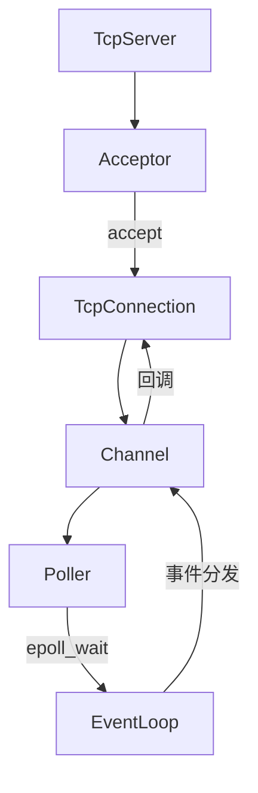

# Muduo核心机制深度解析

> 适用范围：muduo网络库的核心设计思想——one loop per thread、Channel::tie_生命周期管理、fd耗尽处理、优雅关闭连接（数据不丢失）。

## 写作约束（铁律）

- **原内容一字不删**：所有原有文字、代码、注释、图片必须全部保留，禁止删除任何原内容。
- **只做归纳重组+增加**：在原有内容基础上调整结构、归类，新增内容以"补充"标记。新增量须让最终篇幅 ≥ 原版。
- **放不进的进附录**：六大段模板容纳不下的原内容，移入最后的「附录」章节，不得丢弃。
- **动笔前先搜索**：做相关知识准备；源码要贴原始代码，有需要可贴汇编。
- **字数硬指标**：详细解析(二)≥200字、进阶应用(四)≥500字、源码解析与实践感悟(五)≥1000字、面试准备(六)高频问法≥8个且带回答，反问点和一句话答案各≥5个。
- 先结论后细节，避免长段堆砌。
- 每节至少 3 条要点。
- 代码必须可运行或可推导，配清楚输入/输出或预期。
- **代码块必须标注语言**：C++ 代码用 `c++`，禁止无语言标注的裸代码块。

## 一、项目/模块概述

- **模块定位**：muduo是陈硕开发的高性能C++网络库，基于Reactor模式（one loop per thread），是学习C++服务端编程的经典项目。其核心设计思想深刻影响了IM项目的网络层架构。
- **技术栈与依赖**：Linux epoll、pthread、C++11（shared_ptr/weak_ptr、function/bind）、non-blocking I/O
- **模块边界**：
  - EventLoop：事件循环核心，每个线程一个
  - Channel：fd事件封装，负责事件分发
  - Poller/EPoller：I/O复用封装
  - TcpConnection：TCP连接管理
  - TcpServer/Acceptor：服务器框架

## 二、架构设计（≥200字）

### 第一层：整体组件关系



TcpServer → Acceptor → 有一个新用户连接，通过accept函数拿到connfd → TcpConnection设置回调 → 设置到Channel → Poller → Channel回调

### 第二层：核心设计原则

**one loop per thread**：保证一个线程只有一个EventLoop对象，保证不该跨线程调用的函数不会跨线程调用。

每个线程（EventLoop）都准备一个待执行队列（pendingFunctors_），用于存储待执行函数。当其他线程需要调用某个不能跨线程调用的函数时，只需把该函数通过runInLoop或queueInLoop加入到本线程的待执行队列中，然后由本线程从队列中取出该函数并执行。


### 第三层：关键设计决策

- **为什么被动关闭连接**：muduo永远被动关闭连接——等待对方关闭后再关闭自己。即使主动关闭也只关闭写端，等对方关闭后再关闭读端。
- **为什么有idleFd_**：占位文件描述符，在fd耗尽时用于优雅拒绝新连接。

## 三、核心实现（代码走读）

### 3.1 保证one loop per thread

**保证一个线程只有一个EventLoop对象**：

使用`__thread`关键字，通过`__thread`修饰的变量，每一个线程有一份独立实体，各个线程的值互不干扰。

```c++
// EventLoop.cc
__thread EventLoop *t_loopInThisThread = nullptr;

EventLoop::EventLoop() : threadId_(CurrentThread::tid())
{
    if (t_loopInThisThread)
    {
        LOG_FATAL << "Another EventLoop" << t_loopInThisThread << " exists in this thread " << threadId_;
    }
    else
    {
        t_loopInThisThread = this;
    }
    // ...省略代码
}
```

当某个子线程启动时，在子线程执行函数中构造一个EventLoop对象，EventLoop的构造函数会把`t_loopInThisThread`初始化为this。该线程中再次创建EventLoop时，就会在其构造函数中终止程序（执行LOG_FATAL）。

**保证不该跨线程调用的函数不会跨线程调用**：

不能跨线程调用的函数：`TcpConnection::sendInLoop`、`TimerQueue::addTimerInLoop`、`TcpConnection::shutdownInLoop`、`TcpConnection::connectEstablished`——它们都涉及对fd的操作。

### 3.2 EventLoop核心机制

**EventLoop::runInLoop**：

```c++
void EventLoop::runInLoop(Functor cb)
{
    // 如果当前调用runInLoop的线程正好是EventLoop绑定的线程，则直接执行此函数
    // 否则就将回调函数通过queueInLoop()存储到pendingFunctors_中
    if (isInLoopThread()) { cb(); }
    else { queueInLoop(cb); }
}
```

**EventLoop::queueInLoop**：直接把回调函数加入`pendingFunctors_`中，并在必要的时候唤醒EventLoop绑定的线程。

```c++
void EventLoop::queueInLoop(Functor cb)
{
    {
        std::unique_lock<std::mutex> lock(mutex_);
        pendingFunctors_.emplace_back(cb);
    }
    if (!isInLoopThread() || callingPendingFunctors_)
    {
        wakeup();
    }
}
```

`pendingFunctors_`是多线程共享资源，其他线程负责往`pendingFunctors_`中存储待执行函数，本线程就负责从`pendingFunctors_`把函数取出来执行，相当于一个生产者消费者模型，所以再向`pendingFunctors_`中添加待执行函数时需要加锁。

**EventLoop::loop()——主事件循环**：

```c++
void EventLoop::loop()
{
    while (!quit_)
    {
        activeChannels_.clear();
        epollReturnTime_ = epoller_->poll(kPollTimeMs, &activeChannels_);
        for (Channel *channel : activeChannels_)
        {
            channel->handleEvent(epollReturnTime_);
        }
        // 执行其他线程添加到pendingFunctors_中的函数
        doPendingFunctors();
    }
    looping_ = false;
}
```

### 3.3 EventLoop::wakeup()——跨线程唤醒

**为什么需要唤醒？**：子Reactor管理的fd上没有任何事件发生时，EPoller会一直阻塞在poll函数，无法执行doPendingFunctors函数。

**怎么唤醒？**：每个EventLoop都有一个wakeupFd_，封装成wakeupChannel_。在EventLoop构造时为wakeupChannel_注册可读事件。当queueInLoop中调用wakeup时，在wakeupFd_上写入数据，EPoller检测到wakeupFd_可读，解除阻塞，执行doPendingFunctors。

```c++
void EventLoop::wakeup()
{
    // wakeup() 的过程本质上是对wakeupFd_进行写操作，以触发该wakeupFd_上的可读事件
    // 这样就起到了唤醒 EventLoop 的作用
    uint64_t one = 1;
    ssize_t n = write(wakeupFd_, &one, sizeof(one));
}
```

### 3.4 跨线程发送数据示例

```c++
void TcpConnection::send(const std::string &buf)
{
    if (state_ == kConnected)
    {
        // 如果当前执行的线程就是自己所属loop绑定的线程，则可以直接发送数据
        if (loop_->isInLoopThread())
        {
            sendInLoop(buf.c_str(), buf.size());
        }
        else
        {
            loop_->runInLoop(std::bind(&TcpConnection::sendInLoop, this, buf));
        }
    }
}
```

send函数在调用sendInLoop发送数据之前，会先判断调用send函数的线程和TcpConnection所属loop_绑定的线程是否是同一个。如果是同一个，直接调用sendInLoop。如果不是，则通过EventLoop的runInLoop来保证sendInLoop函数不会跨线程调用。

### 3.5 Channel::tie_生命周期管理

在没有tie_的时候，当客户端主动关闭连接时，服务器上该连接对应的sockfd上就会有事件发生，Channel会调用Channel::handleEvent()来关闭连接，关闭连接就会释放TcpConnection，进而Channel对象也会析构。这就造成了Channel::handleEvent()只执行到一半，Channel就已经被析构了，引发不可预测的后果。

为了避免这个问题，使用弱指针tie_绑定到TcpConnection的共享指针上。如果tie_能够被转化为TcpConnection共享指针，这就延长了TcpConnection的生命周期，使之长过Channel::handleEvent()。

```c++
void Channel::handleEvent(Timestamp receiveTime)
{
    if (tied_)
    {
        std::shared_ptr<void> guard = tie_.lock();
        if (guard)
        {
            handleEventWithGuard(receiveTime);
        }
    }
}

// 根据相应事件执行回调操作
void Channel::handleEventWithGuard(Timestamp receiveTime)
{
    // 对方关闭
    if ((revents_ & EPOLLHUP) && !(revents_ & EPOLLIN))
    {
        // 如果没有tie_，可能程序执行到这里就已经释放了Channel对象
        // 如果继续往下执行，会引发不可预知的后果
        if (closeCallback_) closeCallback_();
    }
    // ... 省略处理其他事件的代码（如可读、可写）
}
```

### 3.6 fd耗尽处理

- 当TCP连接数超过设定值时，给客户端发送一个消息，告知客户端自己已经过载，然后调用`TcpConnection::shutdown`关闭连接。
- 打开一个空文件描述符`idleFd_`，用于占位。因为如果连接过多，该进程可用的fd都被占用完毕，就无法接收新的连接了。既然没有接收该连接，那么此时服务器也无法告知客户端发生了什么情况。为了让客户端更好的处理，可以先暂时关闭`idleFd_`，然后接收这个连接，接收后立马close它，这样就实现了优雅的拒绝新来的连接，关闭该连接后，重新打开一个空文件描述符，把坑位继续占住。

### 3.7 关闭连接时保证数据不丢失

**被动关闭连接**：muduo永远都是被动关闭连接——即等待对方关闭后（无论是只shutdowWrite还是close），自己才关闭连接。即使muduo主动关闭连接，都还是只关闭自己的写端，等对方关闭后，再关闭自己的读端。所以这种关闭连接的方式要求对方read到0字节后（read到0字节表示对方已经关闭了）主动关闭连接。

**主动关闭不会丢数据**：当muduo主动关闭连接时（调用`TcpConnection::shutdown`），并不会直接close掉该连接对应的sockfd，而是只关闭sockfd的写端。这样sockfd不可继续发送数据，如果路上还有数据客户端没有收到，客户端就会一直read，直到客户端read到0字节时，表示路上的所有数据已经收完，即避免了数据漏收。

但是此时muduo还处于半关闭状态（即服务器该连接的读端还没有关闭），要求客户端read到0字节时主动关闭连接（只关闭写端或者直接close都行）。这样，服务器上该连接对应的Channel就会触发EPOLLHUP事件，该事件会执行`TcpConnection::handleClose()`，它执行完后会析构该连接对应的TcpConnection对象，TcpConnection析构时，其成员Socket也会析构，Socket析构的时候会调用close来完全关闭该连接。

**被动关闭不会丢数据**：当muduo被动关闭连接时，即客户端先关闭连接，此时服务器就一直handlRead，直到read到0字节时，说明客户端发送的数据已经全部接收了，此时服务器也会调用`TcpConnection::handleClose()`关闭连接。

### 3.8 保证关闭前数据发送完毕

总的来说，muduo在关闭连接时，会看下output buffer中是否还有数据没有发送完毕，如果还有没发送完的，则等待数据发送完毕后再调用TcpConnection::shutdown关闭连接。

当用户调用TcpConnection::shutdown时，该函数会判断EPoller是否还关注了该连接的可写事件，关注了就说明还有数据没有发送完毕。此时该函数仅仅把连接状态改变成kDisconnecting就结束。当再次有可写事件发生时（再次调用TcpConnection::handleWrite时），如果outputBuffer_中的数据发送完毕，则可以把可写事件从EPoller中注销掉。此时如果连接状态是kDisconnecting，就可以再次调用TcpConnection::shutdownInLoop，该函数只关闭写端。要完整的关闭连接，需要TcpConnection::handleRead读取到0字节或者fd上发生EPOLLHUP事件。

## 四、工程实践（≥500字）

### Reactor模型组件体系

**Thread类**：封装线程的基本操作以及绑定线程回调函数。

**EventLoopThread**：one loop per thread，将线程和loop绑定在一起。初始化成员函数，绑定线程的回调函数，注册初始化的回调函数，开启线程，绑定loop。

```c++
void EventLoopThread::threadFunc()
{
    EventLoop loop; // 创建一个独立的EventLoop对象 和上面的线程是一一对应的 即one loop per thread

    if (callback_)
    {
        callback_(&loop);
    }

    {
        std::unique_lock<std::mutex> lock(mutex_);
        loop_ = &loop;
        cond_.notify_one();
    }
    loop.loop();    // 执行EventLoop的loop() 开启了底层的Poller的poll()
    std::unique_lock<std::mutex> lock(mutex_);
    loop_ = nullptr;
}
```

**EventLoop**（子loop轮询）：一个reactor模型，一个事件循环。有一个channel列表，一个poller智能指针，存放回调的队列。初始化epoll对象、成员变量、wakeup(唤醒下层的reactor)。开启循环loop，epoll监听事件，然后channel处理事件。回调：在loop中就回调，不在就注册事件然后唤醒。回调写到列表里，上锁交换，然后执行。

**wakeup()唤醒自己**：主reactor想要注册回调函数到子reactor，但子reactor阻塞，使用wakefd唤醒。给eventfd返回的文件描述符wakeupFd_绑定的事件回调，当wakeup()时即有事件发生时，调用handleRead()读wakeupFd_的8字节，同时唤醒阻塞的epoll_wait。doPendingFunctors()执行上层回调。

**Channel**：对socket事件发生封装，发生读写等事件对回调函数封装。将channel和fd绑定到一起。通过EventLoop调用poll。

**EPoller**：重写IO复用接口。将活跃的事件填充到channel中。更新channel，封装一些epoll的操作（add, mod, del）。

```c++
using EventList = std::vector<epoll_event>; // C++中可以省略struct 直接写epoll_event即可
int epollfd_;      // epoll_create创建返回的fd保存在epollfd_中
EventList events_; // 用于存放epoll_wait返回的所有发生的事件的文件描述符事件集
```

**Poller**（多态基类）：定义一个基类，给所有IO复用保留统一的接口，实现多态。虚函数，定义所属的loop，以及map<socket, channel>。

**Socket类和Address类**：

```c++
// Address类：封装IP端口，提供格式化的函数，对sockaddr进行初始化
::memset(&addr_, 0, sizeof(addr_));
addr_.sin_family = AF_INET;
addr_.sin_port = ::htons(port); // 本地字节序转为网络字节序
addr_.sin_addr.s_addr = ::inet_addr(ip.c_str());

// Socket类：封装bindAddress、listen、accept等函数，还有设置socket相关函数（TCP Nagle算法）
```

**Acceptor类**：指向baseloop，初始化socket，绑定事件发生执行回调函数。有请求到来时调用读回调函数，调用socket类的accept函数，执行回调函数。

### TcpConnection

给channel设置相应的回调函数，poller给channel通知感兴趣的事件发生了，channel会回调相应的回调函数。


## 五、源码解析和实践感悟（≥1000字）

### 关键实现路径

**one loop per thread 的双重保证**：

1. 代码层面：`__thread EventLoop* t_loopInThisThread` 在每个线程有一份独立副本
2. 运行时检查：EventLoop构造函数中检查t_loopInThisThread是否已设置，若已设置则LOG_FATAL
3. 函数层面：runInLoop/queueInLoop将跨线程调用安全地转发到目标线程

这三层保证使得one loop per thread不仅仅是"约定"，而是"强制约束"。任何违反约束的代码都会在运行时立即暴露。

**pendingFunctors_的交换技巧**：

doPendingFunctors中通常的做法是加锁→取出→解锁→执行。但muduo使用了更高效的做法：先将pendingFunctors_与一个空的局部vector交换（swap），然后解锁，再遍历局部vector执行。这样锁的持有时间极短（仅swap操作），回调函数的执行完全在无锁状态下进行。

**eventfd vs pipe 作为wakeup机制**：

muduo使用eventfd（Linux 2.6.22+）而非pipe作为wakeup机制：
- eventfd只需一个fd（pipe需要两个）
- eventfd的读写更简单（8字节整数）
- eventfd支持EFD_NONBLOCK和EFD_CLOEXEC标志
- eventfd是Linux特有的，pipe是POSIX标准

**Channel::tie_的weak_ptr妙用**：

这是muduo中最精巧的设计之一：
- tie_是weak_ptr<void>，绑定到TcpConnection的shared_ptr
- Channel::handleEvent中通过tie_.lock()尝试提升为shared_ptr
- 若提升成功：说明TcpConnection还存活 → 安全执行回调 → handleEventWithGuard执行期间TcpConnection不会析构
- 若提升失败：说明TcpConnection已析构 → 不再执行回调

这比常见的"在TcpConnection析构时从Poller中移除Channel"更安全——后者无法处理"Channel的事件已在activeChannels_中等待处理，但TcpConnection刚被析构"的竞态窗口。

**fd耗尽的优雅处理**：

idleFd_的设计体现了"优雅降级"的思想：
1. 正常情况下idleFd_占一个fd位置
2. fd耗尽时：close(idleFd_)腾出位置 → accept新连接 → 立即close新连接（拒绝） → 重新打开idleFd_
3. 这样服务器始终有"告知客户端拒绝"的能力——即使fd耗尽，也能临时腾出一个fd完成告知

**输出缓冲区与关闭的协调**：

shutdown时的等待策略：不立即close，而是等output buffer清空。这避免了"服务端还有数据没发完就关闭连接"的问题。但代价是：如果客户端已经断开，服务端的output buffer永远发不完，此时依赖EPOLLHUP事件触发关闭。

### 难点与易错点

1. **跨线程调用的死锁风险**：如果EventLoop A的runInLoop中调用了EventLoop B的queueInLoop，然后B又调用了A的queueInLoop，且两者都在等待对方处理，就会死锁。muduo通过"不阻塞等待"的设计避免了这个问题——queueInLoop只是入队+唤醒，不等待执行结果。

2. **Channel的生命周期**：Channel是fd的事件处理器，但其生命周期不应由fd控制。常见错误：close(fd)后立即delete Channel → 但此时可能还有事件在处理中。tie_机制解决了这个问题。

3. **EPOLLHUP vs EPOLLRDHUP**：EPOLLRDHUP表示对端关闭了写端（半关闭），EPOLLHUP表示连接完全断开。muduo同时关注这两个事件以精确判断连接状态。

### 经验总结（补充）

- **muduo的"多线程Reactor"比"单线程Reactor"更适合现代多核服务器**：one loop per thread充分利用多核，每个线程独立的事件循环避免锁竞争。
- **"不跨线程调用"是原则而非限制**：通过runInLoop/queueInLoop机制，用户可以在任意线程调用TcpConnection的方法，框架自动保证线程安全。
- **优雅关闭 > 粗暴关闭**：muduo花了大量代码处理关闭连接时的边界情况（数据不丢、不泄漏），这是生产级网络库与玩具库的本质区别。

## 六、面试准备（高频问法≥10个，反问点/一句话答案≥5个，均带回答）

### 6.1 高频问法（≥10个）

**基础理解**：

Q1：muduo的one loop per thread是什么意思？

A：每个线程拥有一个独立的EventLoop（事件循环），负责一组连接的事件处理。线程之间不共享EventLoop，避免了跨线程加锁的开销，同时充分利用了多核CPU。

Q2：runInLoop和queueInLoop的区别是什么？

A：runInLoop：如果当前线程就是目标EventLoop的线程，直接执行回调；否则调用queueInLoop。queueInLoop：将回调加入pendingFunctors_队列，并唤醒目标EventLoop。总结：runInLoop是面向用户的接口，queueInLoop是内部实现。

Q3：Channel的tie_是做什么用的？

A：防止Channel在处理事件时其关联的TcpConnection已被析构。tie_是weak_ptr，指向TcpConnection的shared_ptr。handleEvent时通过lock()提升为shared_ptr，延长TcpConnection生命周期到回调执行完毕。

**原理深入**：

Q4：EventLoop的wakeup机制是如何实现的？

A：每个EventLoop持有一个eventfd（wakeupFd_），注册到EPoller上监听可读事件。当其他线程需要唤醒EventLoop时，向wakeupFd_写入8字节数据，EPoller检测到可读事件，poll()返回，EventLoop继续执行doPendingFunctors。

Q5：muduo如何优雅处理fd耗尽？

A：维护一个idleFd_占位符。当fd耗尽时：关闭idleFd_→ accept新连接 → 发送过载通知 → close新连接 → 重新打开idleFd_。这样始终保留一个fd用于告知客户端拒绝。

Q6：muduo的被动关闭策略是什么？

A：永远不主动close，而是等待对方关闭。即使主动关闭也只shutdown写端（半关闭），等对方read到0字节后主动close，自己再close读端。这样保证路上的数据不会丢失。

**实践应用**：

Q7：为什么说muduo的网络模式是Reactor而非Proactor？

A：Reactor：I/O就绪后通知应用，应用负责读写数据（epoll + non-blocking I/O）。Proactor：I/O完成后直接通知应用（IOCP）。muduo基于epoll，自己调用read/write，是典型的Reactor模式。Boost.Asio在Windows上使用IOCP是Proactor。

Q8：muduo如何保证关闭连接前数据发送完毕？

A：关闭时检查output buffer是否为空。非空则只标记状态为kDisconnecting，等可写事件触发后继续发送。output buffer清空且状态为kDisconnecting时，才真正shutdown写端。

Q9：__thread关键字和thread_local有什么区别？

A：__thread是GCC扩展，用于POD类型，性能略好。thread_local是C++11标准关键字，支持非POD类型（带构造/析构函数），可移植性好。muduo用__thread因为只需要存储指针（POD类型）。

Q10：muduo的Reactor模型中，主Reactor和子Reactor分别负责什么？

A：主Reactor（main EventLoop）：负责accept新连接，将connfd分发给子Reactor。子Reactor（worker EventLoop）：负责已建立连接的所有I/O事件（读写、关闭）。分发策略通常是Round-Robin。

### 6.2 反问点/陷阱点（≥5个）

常见的陷阱问题：

- **陷阱问题1**：pendingFunctors_为什么不直接执行而要先swap到局部变量？ → 1) 减少锁持有时间（swap是O(1)操作）；2) 避免死锁（回调中可能再次调用queueInLoop）；3) 回调在无锁状态下执行，性能更好。
- **陷阱问题2**：tie_能100%防止Channel在handleEvent中被析构吗？ → 能防止同一线程内的同步析构。但如果另一个线程持有TcpConnection的最后引用并在Channel::handleEvent之前释放（极难发生的竞态），tie_无法保护。实际中这种情况几乎不会发生，因为TcpConnection的析构也是通过EventLoop排队的。
- **陷阱问题3**：muduo的shutdown只关闭写端，如果对端不配合（不主动close），连接会一直处于半关闭状态吗？ → 是的，这是一个已知的潜在问题。但TCP协议要求收到FIN的一方也发送FIN，这是协议栈保证的。除非对端代码有bug，否则不会出现。

### 6.3 一句话答案（≥5个）

快速记忆要点：

- muduo的核心设计哲学是**one loop per thread + 非阻塞I/O + 被动关闭**
- Channel::tie_通过**weak_ptr.lock()延长生命周期**防止use-after-free
- wakeup机制的本质是**向eventfd写数据 → epoll检测可读 → poll返回**
- 关闭连接不丢数据的关键是**只关闭写端 → 等对方read到0 → 再关闭读端**
- 避免的常见错误是**在非EventLoop线程中直接操作fd**

情景模拟答案：

- 当被问到"muduo和其他网络库的区别"时，回答："muduo强调简单性和正确性，而非功能丰富。核心代码不到5000行，但覆盖了TCP网络编程的所有关键点：事件循环、线程模型、缓冲区管理、优雅关闭。"
- 当被问到"one loop per thread的优缺点"时，回答："优点是每个线程独立的事件循环，无锁竞争，性能线性扩展。缺点是长耗时回调会阻塞整个EventLoop，需要将耗时任务放到线程池中。"
- 当被问到"从muduo学到的最重要的东西"时，回答："网络编程的正确性远比性能重要。muduo花了大量代码处理边界情况（连接关闭、fd耗尽、生命周期），这些才是生产级的保障。"

## 附录（模板外原内容收纳）

### 参考链接

- [Muduo网络库概述 - 知乎](https://zhuanlan.zhihu.com/p/636167841)
- [万字长文梳理Muduo库核心代码及优秀编程细节思想剖析 - 知乎](https://zhuanlan.zhihu.com/p/495016351)

### 消息处理流程图


