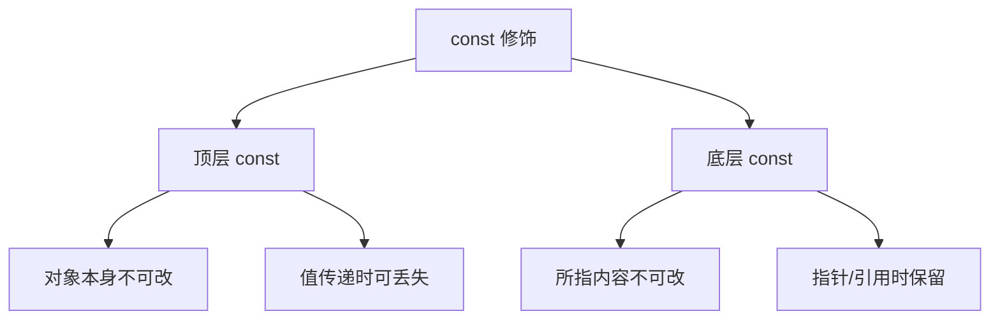

# const

> 适用范围：单一主题（一个概念/机制/模块），保持可复用、可检索。

## 写作约束（铁律）

- **原内容一字不删**：所有原有文字、代码、注释、图片必须全部保留，禁止删除任何原内容。
- **只做归纳重组+增加**：在原有内容基础上调整结构、归类，新增内容以"补充"标记。新增量须让最终篇幅 ≥ 原版。
- **放不进的进附录**：六大段模板容纳不下的原内容，移入最后的「附录」章节，不得丢弃。
- **动笔前先搜索**：做相关知识准备；源码要贴原始代码，有需要可贴汇编。
- **字数硬指标**：详细解析(二)≥200字、进阶应用(四)≥500字、源码解析与实践感悟(五)≥1000字、面试准备(六)高频问法≥8个且带回答，反问点和一句话答案各≥5个。
- 先结论后细节，避免长段堆砌。
- 每节至少 3 条要点。
- 代码必须可运行或可推导，配清楚输入/输出或预期。
- **代码块必须标注语言**：所有代码块必须根据实际语言标注，C++ 代码用 `c++`（不可用 `cpp` 或 `c`），Python 用 `python`，汇编用 `asm`/`x86asm`，shell 用 `bash` 等。禁止无语言标注的裸代码块。
- 图示统一放在 `资源/图片/`，文内使用相对路径引用。
- 有流程的用流程图或其他类型的图。

## 一、核心概念

- 定义：`const` 表示“不可修改”的语义约束，分为顶层 const（对象本身不可变）与底层 const（指向内容不可变）。
- 关键词：顶层/底层 const、指针/引用、`constexpr`、`const_cast`、成员函数 const。
- 适用场景/边界：适用于表达只读语义、接口契约与编译期优化；**补充**：`const_cast` 去除 const 修改原 const 对象属于 UB。

## 二、详细解析（≥200字）

- **原理拆解（三层递进）**：
  - 第一层：基本工作原理（配流程图/序列图展示核心流程）
  - 第二层：关键步骤详解（每步展开子步骤）
  - 第三层：底层机制（编译器实现、运行时行为、内存布局影响）
- 关键数据结构/接口：
- 关键公式/复杂度：

**补充**：`const` 是 C++ 中最基础但最易误用的关键字之一。它既是类型系统的一部分，也是 API 契约的一部分。编译器在语义分析阶段会把 const 资格写入类型系统，使其影响重载解析、模板推导与隐式转换。顶层 const 修饰对象本身（如 `int* const p`），底层 const 修饰指向内容（如 `const int* p`）。在模板推导中，值传递会丢弃顶层 const，而引用/指针传递会保留底层 const，这也是许多“为什么 const 丢了”的根源。底层机制上，const 对象常被放置在只读段或被当作常量折叠，但这并不保证在所有情况下都在编译期确定；只有 `constexpr` 才强制编译期求值。



## 三、动手实践（代码案例）

```c++
#include <iostream>

int main() {
    int x = 1;
    const int* p1 = &x;      // 不能改 *p1
    int* const p2 = &x;      // 不能改 p2
    const int* const p3 = &x; // 都不能改

    *p2 = 2; // OK
    std::cout << x << "\n";
    return 0;
}
```

- 预期输出：`2`。
- **补充**：尝试修改 `*p1` 或 `p2` 会触发编译错误。
- **补充**：在 const 成员函数中对 mutable 成员修改是合法的。

## 四、进阶应用（≥500字）

- 与其他主题的关联：
- 工程中的真实用法（大型项目案例、实际使用模式）：
- 常见优化策略：
  - 算法层面：选择更优算法
  - 数据结构：使用缓存友好结构
  - 内存访问：优化数据局部性
  - 并发处理：利用并行计算
  - 具体技巧：预计算与缓存、批处理减少开销、SIMD、避免虚函数调用等

**补充**：在工程实践中，const 是接口设计的第一道防线。对输入参数使用 `const T&` 或 `const T*`，可以明确表达“函数不会修改调用方数据”，这不仅提升可读性，也让编译器更安全地进行优化。对类的成员函数加 `const` 则表明“不会修改对象可观察状态”，这是多线程与缓存设计的重要基础：例如一个 `get()` 方法加 `const`，意味着在调用时不会改变核心成员，从而便于读写锁与线程安全分析。

**补充**：在性能优化中，const 的作用更多体现在“减少可变性”。当编译器确定对象不可变时，可以更大胆地进行常量折叠、公共子表达式消除与内联优化。对于编译期常量，`constexpr` 是更强约束，它要求值在编译期确定；但 const 仍然有价值，因为它能帮助读者理解代码的意图，并减少意外修改的风险。

**补充**：const 与 API 设计的关系还体现在“重载选择”。const 成员函数与非 const 成员函数可同时存在，编译器会根据 `this` 的 const 性选择合适版本。这使得库设计者可以为 const 对象提供只读接口，为非 const 对象提供可变接口。一个典型实践是容器的 `operator[]`：const 对象返回 const 引用，非 const 对象返回可变引用。

**补充**：在复杂系统中，`const_cast` 的使用极为敏感。它的合法场景是“原对象本身非 const，但被 const 引用遮蔽”，例如旧代码库接口不完备时临时修复。但对原本定义为 const 的对象进行修改属于 UB，可能导致只读内存写入或编译器优化失效。实践中建议用更安全的方式替代 `const_cast`，比如重构接口或引入 `mutable` 缓存。

## 五、源码解析和实践感悟（≥1000字）

- 关键实现路径（贴源码、必要时贴汇编）：
- 难点与易错点（陷阱案例 + 深度剖析）：
- 经验总结（补充）：

**补充**：从编译器实现角度看，const 既是类型系统的一部分，也是优化的依据。编译器在语义分析阶段会把 const 资格写入 AST 节点，并在 IR 中保留只读属性。对具有静态存储期的 const 对象，编译器通常会将其放入只读段（如 `.rodata`），这意味着任何对该对象的写入都可能触发访问违例。但对自动存储期（栈上）的 const 对象，编译器可能仍然放在栈上，只是在语义层面禁止写入。这也解释了“const 并不一定是编译期常量”的现象。

**补充**：顶层 const 与底层 const 的概念在模板推导中尤为重要。`template<typename T> void f(T t)` 会按值拷贝参数，此时顶层 const 被忽略（因为拷贝后的 `t` 不再是原对象）。但 `template<typename T> void g(T& t)` 会保留底层 const，确保对常量对象的引用仍然是只读。这一规则直接影响到函数重载与自动类型推导（auto）。例如 `auto a = x;` 会丢掉 const，而 `const auto& a = x;` 则保留 const。这些细节决定了库接口在泛型场景下的可用性。

**补充**：const 成员函数与对象不变式密切相关。C++ 标准规定 const 成员函数不能修改对象的非 mutable 成员，编译器会把 `this` 视为 `const ClassName* const`。这意味着在 const 成员函数中只能调用其他 const 成员函数，否则会触发编译错误。实践中，这一规则有助于保证“逻辑只读”接口，但也带来一个常见陷阱：如果成员函数需要更新缓存，就必须把缓存成员标记为 `mutable`。这是一种可控的“破例”，但需要在代码审查中确认其合理性。

**补充**：`const_cast` 的风险在于它可以移除 const 限定，从而允许写入原本只读对象。若对象实际位于只读段，写入会导致崩溃；若对象只是被 const 引用遮蔽，写入虽然可行，但会破坏接口契约。正确的处理方式通常是：1) 修正接口，使其不需要 const_cast；2) 引入更明确的可变接口；3) 使用 `mutable` 表达缓存更新的意图。只有在极端兼容性需求下才应使用 const_cast，并附带严格注释与测试。

**补充**：在优化层面，const 提供了“别名分析”的线索。编译器更容易确定 const 对象不会被修改，从而进行更大胆的寄存器缓存与指令重排。但需要注意，const 不是线程安全保证。即使对象是 const，如果存在多线程写入（通过非法方式或 const_cast），仍然会引发数据竞争。这是“const 不等于不可变性”的重要实践教训。

**补充**：结合 `constexpr` 的语义差异是面试常见考点。`constexpr` 强制编译期求值，常被用作数组大小或模板参数；`const` 仅保证不可修改，但值可能在运行期确定。这意味着 `const int n = f();` 在语义上是常量，但不一定是编译期常量。理解这一点对于设计模板与编译期算法非常重要。

**补充**：实践经验总结：第一，凡是能写成 `const` 的接口都尽量写成 const，这不是为了“写得更安全”，而是为了提升接口表达力；第二，对成员函数加 const 是维护对象不变式的关键手段，尤其在并发系统中；第三，避免滥用 const_cast，把真正的可变需求显式化；第四，理解顶层/底层 const 在模板与 auto 推导中的影响，能显著减少“莫名其妙的类型错误”。

## 六、面试准备（高频问法≥10个，反问点/一句话答案≥5个，均带回答）

### 6.1 高频问法（≥10个）

Q1：`const int*` 和 `int* const` 的区别？

A：左 const 保内容，右 const 保指针，`const int* const` 两者都不可改。

Q2：顶层 const 与底层 const 的区别？

A：顶层 const 修饰对象本身，底层 const 修饰所指内容。

Q3：const 成员函数能做什么？

A：不能修改非 mutable 成员，不能调用非 const 成员函数。

Q4：`const int&` 为什么能绑定临时对象？

A：标准允许 const 左值引用绑定右值并延长生命周期。

Q5：const 与 constexpr 的差别？

A：const 只保证不可改，constexpr 要求编译期可求值。

Q6：模板推导中 const 如何处理？

A：值传递丢顶层 const，引用/指针传递保留底层 const。

Q7：`const_cast` 什么时候安全？

A：仅当原对象本身非 const，被 const 引用遮蔽时。

Q8：为什么 const 成员函数需要重载？

A：为 const 对象提供只读接口，确保语义一致。

Q9：`mutable` 的用途是什么？

A：允许 const 成员函数修改缓存或统计等逻辑状态。

Q10：C 和 C++ 的 const 有何差别？

A：C++ const 可作为编译期常量，C 的 const 更像只读变量。

### 6.2 反问点/陷阱点（≥5个）

- 反问：团队是否对 const 成员函数的使用有明确规范？
- 反问：如何在大型项目中避免 const_cast 滥用？
- 反问：是否启用静态分析检查 const 正确性？
- 陷阱：把 const 当作线程安全保证。
- 陷阱：在 const 成员函数中返回非 const 引用导致外部修改内部状态。

### 6.3 一句话答案（≥5个）

- const 的本质是接口契约。
- 顶层 const 锁对象本身，底层 const 锁所指内容。
- const 不等于编译期常量，constexpr 才是。
- const_cast 是最后手段。
- const 成员函数体现“逻辑只读”。

## 附录（模板外原内容收纳）

> 以下为原笔记中不直接适配六大段结构、但仍有价值的内容，原样保留于此。

# const

记住这三句就够用了：

1. `const`**靠谁，就保护谁。**
2. **左 const 保内容，右 const 保指针；两边都放全锁死。**
3. **成员函数后加** `const` **= 不改对象状态。**

# const用法

## const限定符

1 const 的定义与作用

const 是 C++ 关键字，用于指示变量的值不可修改。通过使用 const，可以提高代码的安全性与可读性，防止无意中修改变量的值。

### 编译器如何处理 `const` 修饰的变量

`const` 修饰的变量在编译时会被视为只读，尝试修改其值会导致编译错误。此外，编译器可能会对 `const` 变量进行优化，如将其存储在只读内存区域。

## `const`的引用

可以把引用绑定到`const`对象上，就像绑定到其他对象上一样，我们称之为对常量的引用（`reference to const`）。与普通引用不同的是，对常量的引用不能被用作修改它所绑定的对象：

## 指针和`const`

### 指向常量的指针(pointer to const)

可以令指针指向常量或非常量。类似于常量引用，指向常量的指针（`pointer to const`）不能用于改变其所指对象的值。

### `const`指针

指针是对象而引用不是，因此就像其他对象类型一样，允许把指针本身定为常量。

常量指针（`const pointer`）必须初始化，而且一旦初始化完成，则它的值（也就是存放在指针中的那个地址）就不能再改变了。

把＊放在`const`关键字之前用以说明指针是一个常量，这样的书写形式隐含着一层意味，即不变的是指针本身的值而非指向的那个值

## 顶层`const`

指针本身是一个对象，它又可以指向另外一个对象。因此，指针本身是不是常量以及指针所指的是不是一个常量就是两个相互独立的问题

用名词顶层`const（top-level const）`表示指针本身是个常量，而用名词底层`const（low-level const）`表示指针所指的对象是一个常量。

顶层`const`可以表示任意的对象是常量，这一点对任何数据类型都适用，如算术类型、类、指针等。

底层`const`则与指针和引用等复合类型的基本类型部分有关。比较特殊 的是，指针类型既可以是顶层`const`也可以是底层`const`，这一点和其他类型相比区别明显

**底层**`const`**的限制却不能忽视。当执行对象的拷贝操作时，拷入和拷出的对象必须具有相同的底层const资格，或者两个对象的数据类型必须能够转换**

**顶层const和底层const的区别在于修饰的对象不同。顶层const修饰的是变量本身的值，使其成为常量；而底层const修饰的是指针或引用所指向的内容，使其成为常量。**


## 五、源码解析和实践感悟

### 1. const 在函数签名中的位置含义

```c++
// 记住口诀：const 修饰它左边最近的东西；左边没有才修饰右边
const int* p1;       // const 在 int 左边 → 内容不可改：*p1 = 5（错）
int const* p2;       // 同上，写法不同
int* const p3;       // const 在 * 和 p3 之间 → 指针不可改：p3 = &x（错）
const int* const p4; // 内容和指针都不可改

// 成员函数后 const
class A {
    int x;
    int get() const { return x; }      // 不修改任何成员
    int& get()       { return x; }     // 可能修改成员
};
const A a;
a.get();  // 调用 const 版本，不能调非 const 版本
```

### 2. 顶层 const vs 底层 const 的模板推导

```c++
template<typename T>
void f(T t) {}     // 值传递 → 顶层 const 被忽略

template<typename T>
void g(T& t) {}    // 引用传递 → const 保留

const int x = 5;
f(x);  // T = int，const 被忽略（因为拷贝了，修改 t 不影响 x）
g(x);  // T = const int

// auto 也有同样规则：
auto a = x;        // a 是 int
const auto& b = x; // b 是 const int&
```

### 3. constexpr 与 const 的区别

```c++
// const 不一定编译期确定
int n;
std::cin >> n;
const int sz = n;      // 运行期 const，OK
int arr[sz];           // 错误！运行期 const 不能做数组大小

// constexpr 必须编译期确定
constexpr int sz2 = 10;
int arr2[sz2];         // 正确

constexpr int sz3 = n; // 错误！n 不是编译期常量
```

### 实践经验

1. **口诀记忆**："const 靠谁就保谁"——`const int*` 保 `*p`，`int* const` 保 `p`
2. **成员函数 const 重载**：const 和非 const 可以共存，编译器按 `this` 的 const 性选择
3. **值传递丢 const**：模板推导和 auto 中，值拷贝时顶层 const 被忽略
4. **const 引用可绑定临时对象**：`void f(const int& x); f(5);` 成立，而 `void f(int& x); f(5);` 不成立
5. **mutable 打破 const**：const 成员函数内可修改 mutable 成员（如缓存、互斥锁）
6. **const cast 危险**：去掉 const 修改原始对象是 UB，除非原始对象本身不是 const

## 六、面试准备

### Q&A（10题）

**Q1: `const int* p` 和 `int* const p` 区别？**
A: 左 const 保内容（*p 不可改），右 const 保指针（p 不可改）。`const int* const p` 全锁死

**Q2: 顶层 const 和底层 const 怎么区分？**
A: 顶层 const 修饰对象本身（如 `int* const p` 的 p），底层 const 修饰所指内容（如 `const int* p` 的 *p）

**Q3: const 成员函数能修改什么？**
A: 不能修改非 mutable 成员、不能调非 const 成员函数。可改 mutable 成员、static 成员

**Q4: `const int&` 为什么能绑定临时对象？**
A: 标准规定 const 左值引用可绑定右值，编译器会延长临时对象生命周期

**Q5: const 和 constexpr 的区别？**
A: const 只保证不可修改（可能运行期），constexpr 保证编译期可求值。constexpr 隐含 const

**Q6: 模板推导中 const 怎么处理？**
A: 值传递 `f(T t)` 忽略顶层 const；引用/指针传递 `f(T& t)` / `f(T* t)` 保留 const

**Q7: `const_cast` 安全吗？**
A: 去掉 const 后可读但不可写。修改原本是 const 的对象 → UB。仅对原本非 const 但被 const 引用的对象安全

**Q8: 为什么需要 const 成员函数重载？**
A: 让 const 对象和非 const 对象调用不同版本，const 对象自动选 const 版本

**Q9: `mutable` 的作用？**
A: const 成员函数内可修改的成员。典型用途：缓存计算结果、线程锁、引用计数

**Q10: C 的 const 和 C++ 的 const 有什么区别？**
A: C 的 const 是"只读变量"，不能做数组大小。C++ 的 const 是真正的编译期常量（可用作数组大小）

### 陷阱与反问（5个）

1. **陷阱**：`typedef char* pstr; const pstr p;` — p 是 `char* const` 而非 `const char*`，typedef 不是文本替换
2. **反问**：const 能提高运行性能吗？→ 不能直接提升，但让编译器做常量折叠和内联优化
3. **陷阱**：`const` 函数返回非 const 引用 — 暴露内部成员，破坏封装
4. **反问**：全部声明 const 好吗？→ 不是，移动语义需要非 const 右值引用，有些优化依赖修改状态
5. **陷阱**：`auto` 推导丢掉 const 和引用 — `auto x = const_obj.method()`，按值推导丢失 const/reference

### 一句话答案（5个）

1. **口诀**：const 靠谁保谁
2. **顶层 vs 底层**：顶层 const 锁对象本身，底层 const 锁所指内容
3. **const 成员函数**：承诺不修改对象状态
4. **constexpr vs const**：constexpr 编译期确定，const 可能运行期
5. **const 引用**：可绑定临时对象，延长其生命周期
