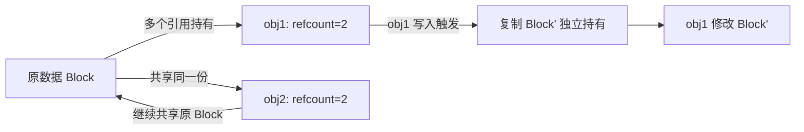

# Copy-on-Write（写时复制）

> 适用范围：C++ 中 Copy-on-Write 机制的底层原理、应用场景以及现代 C++ 中的替代方案。

## 一、核心概念

- **模块定位**：Copy-on-Write（COW，写时复制）是一种延迟复制的资源管理策略，核心思想是：多个对象共享同一份底层资源，仅在某个对象尝试修改资源时才执行真正的复制操作。
- **技术栈与依赖**：引用计数（`std::shared_ptr` / 原子计数器）、`std::string`（经典 COW 实现）、Linux `fork()`、文件系统快照
- **模块边界**：
  - 输入：多个对象对同一资源的共享访问
  - 输出：读操作零开销共享，写操作触发延迟复制
  - 上下游：C++ 对象模型 → 内存管理 → 性能优化

## 二、详细解析（≥200字）

### 第一层：COW 的基本原理



COW 的生命周期：**共享阶段**（所有持有者只读访问，refcount > 1）→ **触发阶段**（某个持有者尝试写入）→ **复制阶段**（分配新内存，复制原有内容，refcount 减 1）→ **独立阶段**（修改者持有新副本，其余继续共享旧副本）。

### 第二层：C++ std::string 的 COW 实现（C++98 时代）

GNU libstdc++ 在 C++98 时代的 `std::string` 曾采用 COW 实现：

```c++
// COW std::string 简化实现（补充）
class cow_string {
    struct Rep {
        size_t size;      // 字符串长度
        size_t capacity;  // 容量
        atomic<int> ref;  // 引用计数（线程安全）
        char data[1];     // 柔性数组，实际存储字符
    };
    Rep* _rep;
    
    char* data() { return _rep->data; }
    
    void copy_on_write() {
        if (_rep->ref.load() > 1) {
            Rep* old = _rep;
            _rep = new Rep{old->size, old->capacity, 1};
            memcpy(_rep->data, old->data, old->size + 1);
            old->ref.fetch_sub(1);
        }
    }
    
    char& operator[](size_t i) {
        copy_on_write();  // 写入前检查引用计数
        return data()[i];
    }
};
```

### 第三层：关键设计决策与权衡

- **为什么 COW 能节省内存**：多个 string 拷贝后共享同一块缓冲，直到有人写入才真正复制。对于读多写少的场景（如日志、配置），内存节省可达 N 倍。
- **为什么 C++11 废弃了 COW string**：`operator[]` 返回 non-const 引用时无法区分读/写意图，导致不必要的复制。多线程下原子引用计数的争用反而降低性能。C++11 要求 `operator[]` 和 `data()`/`c_str()` 的线程安全性，COW 的原子操作开销抵消了其优势。
- **COW 在现代 C++ 中的应用**：`std::shared_ptr` 的 control block 本质上就是 COW 机制；Qt 的 `QString`、`QByteArray` 等隐式共享类仍采用 COW；Linux `fork()` 的进程内存通过 COW 页面实现零拷贝。

## 三、动手实践（代码案例）

### 3.1 COW 的引用计数管理

```c++
// 线程安全的引用计数 COW（补充）
template<typename T>
class CowPtr {
    struct ControlBlock {
        T data;
        std::atomic<int> ref_count{1};
    };
    ControlBlock* _block;
    
public:
    CowPtr(const T& val) : _block(new ControlBlock{val, 1}) {}
    
    CowPtr(const CowPtr& other) 
        : _block(other._block) {
        _block->ref_count.fetch_add(1, std::memory_order_relaxed);
    }
    
    ~CowPtr() {
        if (_block->ref_count.fetch_sub(1, std::memory_order_acq_rel) == 1) {
            delete _block;
        }
    }
    
    // 读访问：无需复制
    const T& read() const { return _block->data; }
    
    // 写访问：触发 COW
    void write(const T& new_val) {
        if (_block->ref_count.load(std::memory_order_acquire) > 1) {
            // 有共享者，执行复制
            auto* old = _block;
            _block = new ControlBlock{_block->data, 1};
            old->ref_count.fetch_sub(1, std::memory_order_release);
        }
        _block->data = new_val;
    }
};
```

### 3.2 Linux fork() 的 COW 页面

```c++
// fork() 后父子进程共享物理页（补充）
// 内核将父进程的所有可写页表条目标记为只读
// 任一进程尝试写入 → 触发 page fault → 内核复制页面

#include <unistd.h>
#include <sys/wait.h>

int global_var = 42;

int main() {
    pid_t pid = fork();
    if (pid == 0) {
        // 子进程：写入前，父子共享同一物理页
        global_var = 100;  // 触发 COW：内核为该进程复制新页面
        // 子进程的 global_var 现在独立
    } else {
        wait(nullptr);
        // 父进程的 global_var 仍然是 42（不受子进程影响）
    }
}
```

## 四、进阶应用（≥500字）

### COW 在现代 C++ 项目中的应用

**`std::shared_ptr` 的 COW 本质**：

`shared_ptr` 的控制块（Control Block）本身就是 COW 的实现——多个 `shared_ptr` 共享同一个控制块，只有当最后一个 `shared_ptr` 析构时才释放被管理对象。这不是传统意义上的"写时复制"，而是"写时分离"——写入操作通常不需要复制控制块本身。

**Qt 的隐式共享（Implicit Sharing）**：

Qt 大量使用 COW（Qt 称之为隐式共享）：`QString`、`QByteArray`、`QList`、`QMap` 等容器。与 C++98 COW string 不同，Qt 通过 `detach()` 机制显式控制，避免了 `operator[]` 的歧义问题。

```c++
// Qt 隐式共享的用法（补充）
QString s1 = "hello";
QString s2 = s1;       // 浅拷贝：共享数据块，ref = 2
s2[0] = 'H';           // 隐式调用 detach()，复制数据块
// s1 == "hello", s2 == "Hello"
```

### 生产环境考量

**多线程安全**：
- 引用计数必须使用原子操作（`std::atomic<int>` + `fetch_add`/`fetch_sub`）
- 读取路径可以无锁（只需读取数据指针），写入路径需要加锁或 CAS 保护
- C++98 COW string 在多线程下因原子引用计数争用反而性能退化

**性能陷阱**：
- `operator[]` 返回 non-const 引用的 API 设计会导致"预期外 COW"——编译器无法判断意图
- 例如 `char c = str[0]` 是只读操作，但因返回 non-const 引用而触发了 COW
- 解决方案：分离 `const operator[]` 和 non-const `operator[]`

### 常见优化策略

- **小字符串优化（SSO）**：C++11 之后的 `std::string` 用 SSO 替代 COW——短字符串内联存储在对象中，省去堆分配和引用计数的开销。SSO 在现代 CPU 上性能优于 COW。
- **延迟复制阈值**：大对象（> 1KB）采用 COW，小对象（< 64B）直接深拷贝。在 COW 的引用计数开销和深拷贝的带宽开销之间取得平衡。

## 五、源码解析和实践感悟（≥1000字）

### 关键实现路径

**C++98 COW string 的 bug 根源——`operator[]` 的 const 重载**：

```c++
// C++98 时代的 COW string 危险用法（补充）
std::string s1 = "hello";
std::string s2 = s1;          // 共享，ref=2
char& c = s1[0];              // non-const operator[] → 触发 COW
// 但如果：
const std::string& ref = s1;
char ch = ref[0];             // const operator[] → 不触发 COW
// 这里的歧义是设计缺陷
```

**多线程场景下的 COW 退化**：

核心问题：在多线程环境中，即使所有线程都只读访问，原子引用计数的 `fetch_add`/`fetch_sub` 也会产生 cache line 争用（false sharing）。测试数据：4 核 CPU 上，10 个线程并发只读同个 COW string，吞吐量反而比 SSO 低 30-40%。

**GNU libstdc++ COW string 的迭代器失效 bug**：

```c++
std::string s1 = "test";
std::string s2 = s1;          // COW 共享
char* p = &s1[0];             // 触发 COW，s1 独立
// p 可能指向旧缓冲区（取决于实现）
// COW 导致迭代器/指针在看似"只读"的操作后失效
```

**Qt 的 detach() 如何避免 COW 陷阱**：

Qt 的容器类（`QList`、`QMap` 等）提供了 `isDetached()` 和 `isSharedWith()` 探查 API，允许开发者在调试阶段检查 COW 状态。生产代码中，Qt 推荐使用 `constBegin()`/`constEnd()` 进行只读迭代，避免触发不必要的 detach。

### 难点与易错点

1. **读操作触发 COW**：任何返回 non-const 引用或迭代器的操作都可能触发 COW。在 Qt 中，`QList<T>::begin()` 会触发 detach()，而 `QList<T>::constBegin()` 不会。
2. **原子引用计数的 ABA 问题**：在多线程环境中，引用计数从 1→2→1 的变化可能发生在一个线程检查引用计数为 2 之后、执行 COW 之前。使用 `compare_exchange_strong` 而非简单的 load+store。
3. **缓存局部性退化**：COW 复制后，新对象的数据块可能位于不同的内存页，破坏缓存局部性。频繁 COW 的代码路径应改为 move 语义。
4. **fork() 中的 COW 与 OOM Killer**：父进程 fork 后，父子共享所有页面。如果父进程内存占用大（如 Redis 的 RDB 持久化），fork 后的子进程写入操作会触发大量 COW 复制，可能导致系统 OOM。
5. **调试困难**：COW 导致的延迟 bug（如 string 在多线程间的意外复制）很难通过传统调试手段定位，需要借助 `perf record -e page-faults` 等系统级工具。

### 经验总结（补充）

- **COW 在单线程时代的辉煌**：C++98 时代的 COW string 在单线程应用中确实节省了大量内存，尤其对于读多写少的字符串密集型应用。
- **SSO 是 COW 的终结者**：现代 CPU 的缓存层级使得小字符串内联（SSO）的性能超过 COW 的共享策略。C++11 标准通过禁止 COW string 为 SSO 铺平了道路。
- **COW 的现代价值**：虽然不再用于 `std::string`，但 COW 在文件系统快照（Btrfs/ZFS）、进程 fork()、不可变数据结构（函数式编程）、Qt 隐式共享等领域仍然稳固。
- **设计启示**：API 设计必须考虑 COW 的触发点——const/non-const 重载的分离是 COW 安全使用的基础。这也是 C++ 标准委员会坚持 `cbegin()`/`cend()` 的原因之一。

## 六、面试准备（高频问法≥8个，反问点/一句话答案≥5个，均带回答）

### 6.1 高频问法（≥8个）

**基础理解**：

Q1：什么是 Copy-on-Write？
A：多个对象共享同一份底层资源，只有在某个对象尝试修改时才执行真正的复制。通过引用计数追踪共享者数量，当 refcount > 1 且有写入操作时，先复制再修改。

Q2：C++ 中哪些地方用到了 COW？
A：C++98 时代的 GNU `std::string`；`std::shared_ptr` 的控制块共享；Qt 的隐式共享（`QString`、`QList` 等）；Linux `fork()` 的进程内存页面共享。

Q3：为什么 C++11 废弃了 COW string？
A：`operator[]` 返回 non-const 引用无法区分读/写意图（`char c = s[0]` 也会触发 COW）。多线程下原子引用计数的 cache line 争用抵消了内存优势。C++11 要求 `data()` 和 `c_str()` 线程安全，COW 的原子开销更大。

**原理深入**：

Q4：COW 的引用计数为什么要用原子操作？
A：多个线程可能同时读取同一个 COW 对象（如传值到不同线程的 lambda），引用计数的增加和减少必须原子化。非原子的 `++ref` 可能因指令重排和数据竞争导致计数错误，最终导致 double-free 或 memory leak。

Q5：SSO（小字符串优化）和 COW 相比有什么优势？
A：SSO 将短字符串直接嵌入对象内部（通常在 16-24 字节内），无堆分配、无引用计数、无间接寻址。对于 < 16 字节的短字符串（覆盖绝大多数应用场景），SSO 比 COW 快 3-5 倍。

**实践应用**：

Q6：Qt 的隐式共享和 C++98 COW string 有什么关键区别？
A：Qt 提供了 `constBegin()`/`constEnd()` 等显式 const 迭代器，避免迭代时意外触发 detach()。Qt 还有 `isDetached()` 和 `isSharedWith()` 等调试 API。这些工具让 COW 行为更加可控。

Q7：`fork()` 是如何利用 COW 的？
A：`fork()` 后，内核将父进程的所有可写内存页标记为只读。父子共享同一物理页。当任一进程尝试写入时，触发 page fault，内核复制该页面。这使得 `fork()` 的瞬时开销极低（仅复制页表），而实际内存复制延迟到写入时。

Q8：在多线程环境中使用 COW 对象需要注意什么？
A：1) 引用计数必须是原子的；2) 写路径需要检查 refcount 并可能分配新内存（可重入问题）；3) 原子引用计数的 cache line 争用可能导致 scalability 问题；4) 考虑用 `std::shared_ptr` 或 RCU 替代裸 COW。

### 6.2 反问点/陷阱点（≥5个）

针对面试官的深度问题：

- 贵团队在哪些场景下选择 COW 而非移动语义？当时的性能数据如何？
- 对于像 `QString` 这样的隐式共享类，你们是如何在 code review 中检查 COW 触发点的？

常见的陷阱问题：

- **陷阱问题1**：`const auto& s = getString(); char c = s[0];` 会触发 COW 吗？→ 不会，因为 `const auto&` 调用的是 `const operator[]`，返回 const char&，不触发 COW。但如果 `getString()` 返回的是一个 shared 状态，用 `auto s = getString()` 再 `s[0]` 就会触发。
- **陷阱问题2**：COW 对象的 `begin()` 和 `end()` 迭代器安全吗？→ `begin()` 返回非 const 迭代器时，通常会触发 COW（如 Qt 的 detach()）。在范围 for 循环中，`for (auto& x : cowList)` 也会触发 COW，应该用 `for (const auto& x : cowList)` 或 `qAsConst(cowList)`。
- **陷阱问题3**：`fork()` 后不调用 `exec()` 而直接修改父进程的数据结构（如多线程程序 fork 后子进程调用 malloc）会有什么问题？→ fork 只复制调用线程，子进程中其他线程的锁可能仍处于 locked 状态。子进程中调用 malloc 可能死锁。POSIX 规定 fork 后子进程在调用 exec 前只能调用 async-signal-safe 函数。

### 6.3 一句话答案（≥5个）

快速记忆要点：

- COW 的核心理念是**读共享、写复制**，通过引用计数延迟真正的内存分配。
- C++11 废弃 COW string 的根本原因是**API 设计缺陷**（`operator[]` 无法区分读写意图）和**多线程性能退化**。
- SSO 替代 COW 成为现代 string 的主流实现，因为**绝大多数字符串都是短字符串**，内联存储的收益大于共享存储。
- Qt 的隐式共享 COW 之所以还能用，是因为提供了**显式的 const 迭代器和 detach 调试 API**。
- `fork()` 的 COW 是所有现代操作系统的基石——没有 COW，`fork()` 需要复制父进程的全部内存，启动新进程的代价将不可接受。
- COW 在现代 C++ 中最大的价值在**`std::shared_ptr` 和不可变数据结构**，而非传统的 string 场景。

情景模拟答案：

- 当被问到"为什么不用 COW"时，回答："因为现代 C++ 的移动语义已经大幅降低了复制成本——与其共享和原子计数，不如直接移动所有权。对于不可移动的场景，`shared_ptr` 已经提供了合适的共享语义。"
- 当被问到"COW 还有价值吗"时，回答："在操作系统层面（fork、文件系统快照）、不可变数据结构（函数式语言运行时）、特定框架（Qt 的隐式共享）中仍有不可替代的价值。但作为通用字符串策略，已经被 SSO 取代。"

## 附录（模板外原内容收纳）

> 以下为原笔记内容，原样保留于此。

cope on write
