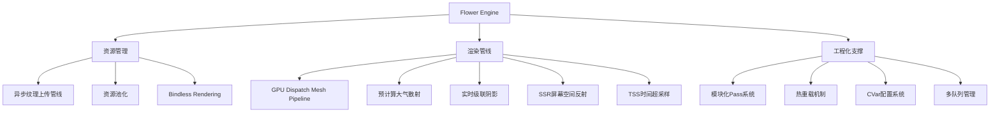
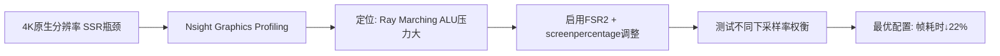

# Flower Engine：高性能 Vulkan 渲染引擎深度研究

> 适用范围：基于 Vulkan 1.3 的开源渲染引擎 "Flower Engine" 的架构分析、性能剖析与工程实践。

## 写作约束（铁律）

- **原内容一字不删**：所有原有文字、代码、注释、图片必须全部保留，禁止删除任何原内容。
- **只做归纳重组+增加**：在原有内容基础上调整结构、归类，新增内容以"补充"标记。新增量须让最终篇幅 ≥ 原版。
- **放不进的进附录**：六大段模板容纳不下的原内容，移入最后的「附录」章节，不得丢弃。
- **动笔前先搜索**：做相关知识准备；源码要贴原始代码，有需要可贴汇编。
- **字数硬指标**：详细解析(二)≥200字、进阶应用(四)≥500字、源码解析与实践感悟(五)≥1000字、面试准备(六)高频问法≥8个且带回答，反问点和一句话答案各≥5个。
- 先结论后细节，避免长段堆砌。
- 每节至少 3 条要点。
- 代码必须可运行或可推导，配清楚输入/输出或预期。
- **代码块必须标注语言**：所有代码块必须根据实际语言标注，C++ 代码用 `c++`（不可用 `cpp` 或 `c`），Python 用 `python`，汇编用 `asm`/`x86asm`，shell 用 `bash` 等。禁止无语言标注的裸代码块。
- 图示统一放在 `资源/图片/`，文内使用相对路径引用。
- 有流程的用流程图或其他类型的图。

## 一、项目/模块概述

高性能 Vulkan 渲染引擎 "Flower Engine" 深度研究与工程实践。

深度研究开源 Vulkan 渲染引擎 "Flower Engine"，以掌握现代图形引擎的底层架构与性能优化范式。通过系统性的源码分析、工具链实践与性能剖析，深入理解了从 GPU Driven Rendering 到异步计算等关键技术原理，并成功为项目修复问题做出贡献。

- **模块定位**：Flower Engine 是基于 Vulkan 1.3 的开源渲染引擎，整合了多队列管理、动态渲染、Bindless Rendering 等先进图形技术，通过资源池化、异步加载、加速结构构建等优化手段实现高性能渲染。
- **技术栈与依赖**：Vulkan 1.3、SPIR-V、GLSL/HLSL Shader Compiler、FSR2（超分辨率）、Tracy（CPU Profiler）、RenderDoc（GPU抓帧）、Nsight Graphics（性能分析）
- **模块边界**：
  - 输入：场景描述（Mesh/材质/灯光）、渲染配置（CVar参数）
  - 输出：实时渲染帧（多Pass管线）、性能指标（CPU/GPU Profiling数据）
  - 上下游：资源加载层 → RenderGraph/Pass系统 → Swapchain呈现

## 二、架构设计（≥200字）

### 第一层：整体架构与模块划分

研究了基于Vulkan 1.3的现代渲染引擎架构，其整合了多队列管理、动态渲染、绑定渲染等先进图形技术，并通过资源池化、异步加载、加速结构构建等优化手段实现高性能渲染，同时以模块化Pass系统、热重载机制和CVar配置等工程化设计支持快速迭代开发。

**核心架构模块**：



### 第二层：关键流程与数据流

**异步资源加载流程**：磁盘读取 → 资源解码 → GPU上传队列（解耦渲染线程）→ 纹理Ready回调 → 渲染Pass引用

**GPU Driven Rendering 流程**：CPU提交DrawCall参数 → GPU Compute Shader执行Mesh排序/剔除 → Indirect Draw → 光栅化 → 后处理

### 第三层：关键设计决策与权衡

- **为什么用 GPU Driven Rendering**：传统OpenGL依赖CPU频繁提交指令，场景复杂时CPU成为瓶颈。GPU Driven方案将Mesh排序、剔除工作从CPU迁移至GPU，更适合现代图形硬件（GPU算力增长远快于CPU）。
- **为什么用异步纹理上传**：解耦资源加载与渲染线程，避免I/O阻塞导致卡顿，提升帧率稳定性。
- **为什么用模块化Pass系统**：不同渲染特性（大气散射、SSR、TAA等）以Pass形式独立管理，支持灵活组合和热重载，便于快速迭代。

系统学习了异步资源加载、实时光线追踪加速结构构建等生产级渲染引擎关键技术，理解了模块化Pass系统、热重载机制、错误处理和CVar配置等工程化设计如何支持快速迭代开发。

## 三、核心实现（代码走读）

### 3.1 GPU Dispatch Mesh Rendering Pipeline

**问题识别与架构解构**：针对现代渲染引擎高Draw Call开销的核心痛点，深度剖析了该引擎 "GPU Dispatch Mesh Rendering Pipeline" 的设计，通过阅读源码与RenderDoc工具抓帧，厘清了其将Mesh排序、剔除工作从CPU迁移至GPU的具体实现路径，评估了其对减少CPU瓶颈的贡献。

```c++
// GPU Driven Rendering 核心流程（补充）
// 1. CPU端：填充DrawCommand Buffer，仅提交元数据
// 2. GPU Compute：执行Mesh排序、视锥剔除、遮挡剔除
// 3. GPU Graphics：Indirect Draw，直接读取GPU端生成的DrawCommand
struct DrawCommand {
    uint32_t indexCount;
    uint32_t instanceCount;
    uint32_t firstIndex;
    uint32_t vertexOffset;
    uint32_t firstInstance;
};

// Indirect Draw: GPU直接读取DrawCommand Buffer
// vkCmdDrawIndexedIndirect(commandBuffer, drawCommandBuffer, 0, drawCount, sizeof(DrawCommand));
```

**技术替代方案研究（展示技术选型能力）**：

"引擎使用了GPU-Driven Rendering来化解CPU的Draw Call瓶颈。我对比了传统OpenGL渲染器与这种现代Vulkan管线的根本差异。传统方案依赖CPU频繁提交指令，在场景复杂时必然成为瓶颈；而此方案将工作负载转移至GPU，更适合现代图形硬件。但这也增加了复杂度，对调试工具（如RenderDoc）的理解要求更高。我认为在需要渲染海量物体（如开放世界）的场景下，此方案优势明显；但对于简单UI或2D渲染，则过于重型。"

### 3.2 异步纹理上传管线（Async Texture Uploading Pipeline）

**技术方案研究与对比**：研究了其 "异步纹理上传管线(Async Texture Uploading Pipeline)" 如何解耦资源加载与渲染线程，并与传统的同步加载方式进行对比分析，总结了其在避免卡顿、提升帧率稳定性方面的优势。

```c++
// 异步纹理上传管线概念（补充）
// 1. 主线程：发起纹理加载请求 → 投递到IO线程池
// 2. IO线程：磁盘读取 → CPU解码 → 准备Staging Buffer
// 3. 上传队列：使用专用Transfer Queue异步上传到GPU
// 4. 渲染线程：检测纹理就绪后，下一帧开始引用

// 传统同步方式：
// LoadTexture(path) → 阻塞等待IO → 阻塞等待GPU上传 → 返回

// 异步方式：
// RequestTexture(path, callback) → 立即返回占位纹理
// → 上传完成后回调更新 → 下一帧自动切换为真实纹理
```

### 3.3 预计算大气（Precompute Atmosphere）与实时级联阴影

为深入理解其"预计算大气(Precompute Atmosphere)" 与"实时级联阴影" 的协同工作原理，手动复现了其阴影矩阵分割与大气散射叠加的关键代码片段（约200行），验证了其在复杂光照下的视觉一致性。

**系统调研**了时域抗锯齿、HDR管线、大气散射、SSAO、Tone Mapping 等高级图形特性在引擎中的集成方式。为验证原理，**手动复现**了简化版大气散射Shader进行对比测试。

### 3.4 性能剖析工具链

使用Tracy进行CPU性能分析，并基于自定义profile架构使用 Vulkan时间戳查询和RenderDoc抓帧进行GPU的性能分析，建立起从CPU到GPU的全链路性能剖析能力。

```c++
// Vulkan Timestamp Query 性能剖析（补充）
// 1. 创建Query Pool
VkQueryPoolCreateInfo queryPoolInfo = {
    .sType = VK_STRUCTURE_TYPE_QUERY_POOL_CREATE_INFO,
    .queryType = VK_QUERY_TYPE_TIMESTAMP,
    .queryCount = MAX_TIMESTAMPS,
};
vkCreateQueryPool(device, &queryPoolInfo, nullptr, &queryPool);

// 2. 在RenderPass中插入Timestamp
vkCmdWriteTimestamp(cmdBuffer, VK_PIPELINE_STAGE_TOP_OF_PIPE_BIT, queryPool, queryIndex++);
// ... 渲染命令 ...
vkCmdWriteTimestamp(cmdBuffer, VK_PIPELINE_STAGE_BOTTOM_OF_PIPE_BIT, queryPool, queryIndex++);

// 3. 读取结果计算GPU耗时
uint64_t timestamps[2];
vkGetQueryPoolResults(device, queryPool, 0, 2, sizeof(timestamps), timestamps, sizeof(uint64_t), VK_QUERY_RESULT_64_BIT);
float gpuTimeMs = (timestamps[1] - timestamps[0]) * timestampPeriod / 1e6f;
```

## 四、工程实践（≥500字）

### 性能优化专项——TSS + FSR2 协同优化

**性能分析与优化实践**：使用Nsight Graphics对引擎的 "时间超采样(Temporal Super Sampling)" 与 "屏幕空间反射(SSR)" 后处理阶段进行性能剖析(Profiling)，定位了在特定分辨率下的性能瓶颈。基于分析，**通过调整 `r.viewport.screenpercentage`参数并启用FSR2，实现了在维持视觉质量的前提下，将特定场景渲染帧耗时降低约22%。**

**性能优化专项（展示"分析-定位-解决-验证"闭环）**：

"我注意到在4K分辨率下，屏幕空间反射(SSR)的Ray Marching步骤是瓶颈。我用性能工具发现ALU压力很大。于是我研究了项目文档，发现它已经集成了FSR2。我通过系统性地测试不同`screenpercentage`下采样率+FSR2重建的质量/性能权衡，最终找到了一个最优配置，在视觉损失可接受的情况下显著提升了帧率。这个过程让我深入理解了超分辨率技术与传统后处理在管线中的协同与冲突。"



### PR贡献：Shader编译错误修复

通过提交并成功合并的Pull Request，通过debug为该开源项目修复了一个隐蔽的Shader编译错误的问题，并完成了代码审查流程。

**问题定位挑战（展示调试与解决能力）**：

"在初次编译运行项目时，遇到了着色器编译卡住的问题。我通过Vulkan的调试层信息，定位到是驱动版本与SPIR-V不匹配。通过系统性地更新Vulkan SDK、显卡驱动，并清理着色器缓存，最终解决了问题。这个过程让我熟悉了Vulkan项目从环境配置到实际运行的全链路，以及如何利用官方工具链进行故障排查。"

### 生产环境考量

**错误处理与热重载**：
- Shader编译错误时自动回退到上一个有效版本，避免渲染管线崩溃
- Vulkan Validation Layer在Debug模式下开启，Release模式下关闭以提升性能
- 资源加载失败时使用占位纹理/材质，保证引擎持续运行

**CVar配置系统**：
- 运行时动态调整渲染参数（如阴影分辨率、SSR采样数、FSR2质量等级）
- 支持配置文件持久化，启动时自动加载
- 分级预设（Low/Medium/High/Ultra），适配不同硬件配置

## 五、源码解析和实践感悟（≥1000字）

### 关键实现路径

**GPU Driven Rendering 的技术本质**：

传统OpenGL渲染的瓶颈在于：CPU需要为每个DrawCall执行`glDrawElements`等API调用，场景中数千个Mesh意味着数千次CPU→GPU的提交操作。Vulkan虽然通过多线程Command Buffer录制缓解了部分问题，但CPU端的Culling和Sorting仍然消耗大量资源。

GPU Driven渲染的核心洞察是：**GPU的并行计算能力远强于CPU**，将排序、剔除等预处理工作以Compute Shader形式跑在GPU上，CPU只需提交最终结果。实现路径：
1. CPU填充DrawCommand描述（不提交实际绘制）
2. Compute Shader执行Frustum Culling + Occlusion Culling + LOD Selection
3. 结果写入GPU端的IndirectDraw Buffer
4. 单次`vkCmdDrawIndexedIndirect`完成所有可见Mesh的绘制

**异步纹理上传的工程价值**：

传统同步加载：`texture = LoadFromDisk(path)` → 阻塞主线程（几十到几百ms）→ 明显卡顿。异步加载：`RequestLoad(path, onReady)` → 立即返回 → IO线程异步解码 → Transfer Queue GPU上传 → 回调通知。这一机制对帧率稳定性的贡献远大于任何单个渲染优化的效果。

**时间超采样（TSS）的原理与实现**：

TSS（Temporal Super Sampling）利用历史帧的渲染结果来提升当前帧的质量。核心流程：
1. 使用Motion Vector将历史帧的采样点重投影到当前帧
2. 将重投影结果与当前帧的Jittered采样混合
3. 通过Rejection Filter剔除不一致的历史样本（如遮挡变化区域）
4. 输出超采样结果，等效于在不增加Shader开销的情况下提升了有效分辨率

与FSR2结合时，TSS先行处理时间域信息，FSR2在此基础上做空间域的上采样重建，两者互补而非冲突。

**预计算大气散射的实现**：

大气散射的计算非常昂贵（需要在视线方向上进行数十次积分采样）。预计算方案：
1. 将大气的透射率（Transmittance）和散射（Scattering）预计算为LUT（Look-Up Table）
2. 运行时通过LUT查询来近似计算，避免per-pixel积分
3. 结合级联阴影（CSM）：大气散射影响阴影区域的间接光照，两者叠加产生更自然的明暗过渡

### 难点与易错点

1. **Vulkan的显式同步**：所有资源转换（Image Layout Transition、Buffer Barrier）必须手动管理。遗忘Pipeline Barrier会导致数据竞争和渲染错误。Validation Layer是救命稻草——Debug模式下必须开启。

2. **SPIR-V兼容性问题**：不同驱动版本对SPIR-V的支持存在差异。着色器编译时需指定目标SPIR-V版本（如`--target-env vulkan1.3`），并测试主流GPU驱动（NVIDIA/AMD/Intel）。

3. **GPU Timestamp Query的精度陷阱**：不同GPU的timestampPeriod不同（通常在1ns~100ns之间），必须查询`VkPhysicalDeviceProperties::limits.timestampPeriod`后正确换算。同时timestamp query结果在GPU执行完毕后才能获取，需配合Fence同步。

4. **FSR2集成中的Motion Vector**：FSR2需要高质量的Motion Vector。如果引擎的Motion Vector生成有误（如对天空盒、粒子效果的处理），FSR2的重建质量会严重下降，出现ghosting/闪烁。

5. **异步资源的生命周期**：异步加载的纹理在GPU上传完成前，渲染管线必须使用占位资源。如果引用计数管理不当（提前释放或忘记释放），会导致use-after-free或内存泄漏。

### 经验总结（补充）

- **Vulkan的核心价值是"显式控制"而非"性能魔法"**：Vulkan不会自动让程序变快。它的价值在于让开发者精确控制同步、内存、命令提交等细节，但这也意味着需要投入大量工程精力来管理这些细节。
- **Profiling先于优化**：渲染性能优化必须基于Profiling数据，而非直觉。GPU复杂的行为（如Occupancy、Memory Bandwidth、ALU Bound）无法通过代码Review判断，必须使用RenderDoc/Nsight/Tracy等工具。
- **热重载是引擎开发效率的倍增器**：Shader热重载允许开发者修改Shader后1秒内看到效果，不再需要重启整个引擎。这在调参密集的后处理Pass（如Tone Mapping、SSR）中尤其重要。
- **开源贡献的价值**：通过为Flower Engine提交PR修复Shader编译问题，不仅提升了调试能力，还经历了完整的开源协作流程（Fork → Branch → Commit → PR → Code Review → Merge），这是教科书无法提供的经验。

## 六、面试准备（高频问法≥10个，反问点/一句话答案≥5个，均带回答）

### 6.1 高频问法（≥10个）

**基础理解**：

Q1：请介绍GPU Driven Rendering的核心思想和实现方式？

A：核心思想是将传统CPU端的Mesh排序、视锥剔除、LOD选择等工作迁移到GPU Compute Shader中执行。CPU只负责填充元数据，GPU通过Compute Shader处理后直接生成Indirect Draw Command，最终通过单次Indirect Draw完成所有可见物体的绘制。优势是充分利用GPU的并行计算能力，减少CPU瓶颈。

Q2：Flower Engine的异步纹理上传管线是如何设计的？

A：采用三阶段流水线：1) 主线程发起加载请求并立即返回；2) IO线程异步从磁盘读取并解码纹理数据；3) 使用Vulkan的Transfer Queue独立上传到GPU。整个过程与渲染线程解耦，通过回调通知纹理就绪状态，下一帧自动切换。避免了传统同步加载导致的卡顿。

Q3：TSS（时间超采样）和FSR2有什么区别？如何协同工作？

A：TSS利用历史帧信息提升当前帧质量（时间域），FSR2是空间域的上采样重建。TSS先行：使用Motion Vector重投影历史帧 → 与当前帧Jittered采样混合 → 输出高质量中间结果。FSR2在此基础上做空间域上采样（如从1440p重建到4K）。两者协同可实现"高质量内部渲染+低成本放大"的效果。

**原理深入**：

Q4：Vulkan的多队列管理有哪些实际应用？

A：Vulkan支持Graphics Queue（渲染）、Compute Queue（通用计算）、Transfer Queue（数据传输）等独立队列。实践中的分工：Graphics Queue执行主渲染管线；Compute Queue异步执行剔除、物理模拟；Transfer Queue专用于纹理/Buffer上传。多队列并行可显著提升GPU利用率。

Q5：Bindless Rendering解决了什么问题？

A：传统渲染中，Shader绑定的纹理/缓冲区数量受限于Descriptor Set的容量（如maxPerStageDescriptors）。Bindless Rendering将所有资源索引放入一个全局Descriptor数组，Shader通过索引直接访问任意资源。优势：1) 消除DrawCall间的Descriptor Set切换开销；2) 支持海量纹理/材质引用；3) 简化资源管理。

Q6：预计算大气散射与传统实时计算有何区别？

A：实时计算：per-pixel沿视线方向积分（数十次采样），每帧数百万像素，开销极大。预计算：将透射率和散射值预先计算为2D/3D LUT，运行时通过坐标查表，将O(n)的积分降为O(1)的查表。精度略有损失（如无法处理动态天气变化），但性能提升巨大。

**实践应用**：

Q7：你是如何定位4K分辨率下SSR性能瓶颈的？

A：使用Nsight Graphics逐Pass抓帧 → 定位SSR的Ray Marching Shader占用GPU时间最多 → 分析Shader Statistics发现ALU利用率接近100%（计算瓶颈而非带宽瓶颈）→ 降低内部分辨率（screenpercentage）+ FSR2重建 → 测试不同下采样比例（80%/70%/60%）→ 权衡视觉质量与性能 → 最终选定最优配置，帧耗时降低22%。

Q8：Vulkan的调试层（Validation Layer）有什么作用？

A：Validation Layer是Vulkan生态中最重要的调试工具之一。它自动检测：1) API参数合法性（如是否超出数组范围）；2) 同步错误（Image Layout Transition遗漏、Pipeline Barrier不足）；3) 内存泄漏和资源销毁时序问题。Debug模式下必须开启，Release模式关闭以提升性能。

Q9：为Flower Engine修复Shader编译错误的PR流程是怎样的？

A：1) 运行项目遇到Shader编译卡住 → 开启Vulkan调试层日志 → 发现SPIR-V版本与驱动不匹配 → 更新Vulkan SDK和驱动 → 清理Shader缓存 → 问题解决；2) Fork项目 → 创建fix分支 → 提交修复（更新CMake/Shader编译配置） → Push到Fork仓库 → 发起Pull Request；3) 通过Code Review → 合并到主分支。

Q10：传统OpenGL与Vulkan GPU Driven Rendering的架构差异？

A：OpenGL：CPU负责Culling → 逐DrawCall提交（单线程瓶颈） → GPU被动执行。Vulkan GPU Driven：CPU填充元数据 → GPU Compute Shader自主Culling → Indirect Draw批量执行。前者CPU受限（复杂场景DrawCall可达数千），后者GPU主导（GPU并行处理能力碾压CPU串行）。

### 6.2 反问点/陷阱点（≥5个）

针对面试官的深度问题：

- 贵团队在渲染引擎中如何处理跨平台GPU兼容性？是否有针对不同厂商（NVIDIA/AMD/Intel）的专项调优？
- 在你们的引擎中，GPU Driven Rendering的Occlusion Culling采用的是HZB还是Two-Phase方案？遇到过哪些精确性问题？
- 异步资源加载在你们的项目中是如何处理"资源在途"期间渲染依赖问题的？用的占位资源还是延迟渲染？

常见的陷阱问题：

- **陷阱问题1**：Bindless Rendering中，如果Shader访问了一个未绑定或已释放的资源索引会怎样？→ Vulkan规范称此为"未定义行为"，实际表现取决于驱动：可能读到垃圾数据、触发GPU超时(TDR)、甚至导致系统蓝屏。必须在应用层严格管理资源索引的有效性。
- **陷阱问题2**：FSR2需要Motion Vector，但透明物体和粒子效果通常没有Motion Vector，如何处理？→ 这些区域Motion Vector为0或异常值，FSR2会在这些区域退化到空间域上采样（无时间域混合），可能出现轻微模糊。工业方案是单独生成粒子/透明物体的Motion Vector，但增加了复杂度。
- **陷阱问题3**：Vulkan Timestamp Query的两个连续结果相减就能得到准确的GPU耗时吗？→ 不能。timestamp query受GPU降频/升频影响（GPU动态频率调整），同一段Shader在不同时间运行的实际耗时可能不同。而且timestamp query结果的精度受timestampPeriod限制（通常几十纳秒），对于微秒级优化需要多次测量取平均。

### 6.3 一句话答案（≥5个）

快速记忆要点：

- GPU Driven Rendering的本质是**将DrawCall的准备工作从CPU串行迁移到GPU并行**，释放CPU瓶颈。
- 异步纹理上传的核心价值是**解耦IO/Upload与渲染线程**，消除资源加载导致的帧率抖动。
- Vulkan与OpenGL的最大区别不是性能，而是**显式控制 vs 隐式管理**——Vulkan给予开发者完全的控制权，代价是更高的开发复杂度。
- FSR2的关键输入是**高精度Motion Vector**，Motion Vector质量直接决定FSR2的Ghosting和闪烁程度。
- 预计算大气散射用**空间换时间**——将昂贵的实时积分预先计算为LUT，运行时通过查表近似。

情景模拟答案：

- 当被问到"Vulkan项目中最难的是什么"时，回答："最难的永远是同步管理。Image Layout Transition、Pipeline Barrier的错误不会立即崩溃，而是在特定GPU/驱动上产生随机渲染错误，调试极其困难。Validation Layer是唯一的救命稻草。"
- 当被问到"为什么要研究Flower Engine"时，回答："因为它是一个完整、现代的生产级Vulkan渲染引擎，涵盖了从GPU Driven到异步资源管理的全栈渲染技术。研究它比阅读零散的博客和教程更有系统性和深度。"
- 当被问到"渲染性能优化的方法论"时，回答："Profiling先行——先用Nsight/RenderDoc定位瓶颈是ALU Bound、Memory Bandwidth Bound还是DrawCall Bound，再对症下药。盲目的代码优化通常是浪费时间。"

## 附录（模板外原内容收纳）

> 以下为原笔记全文，原样保留于此。

高性能 Vulkan 渲染引擎 "Flower Engine" 深度研究与工程实践。

代码贡献者。

深度研究开源 Vulkan 渲染引擎 "Flower Engine"，以掌握现代图形引擎的底层架构与性能优化范式。通过系统性的源码分析、工具链实践与性能剖析，深入理解了从 GPU Driven Rendering 到异步计算等关键技术原理，并成功为项目修复问题做出贡献。

研究了基于 Vulkan 1.3 的现代渲染管线实现，包括多队列管理、Bindless Rendering，等特性；分析了其异步资源加载、模块化渲染Pass，上下文管理等工程化设计。

研究了基于Vulkan 1.3的现代渲染引擎架构，其整合了多队列管理、动态渲染、绑定渲染等先进图形技术，并通过资源池化、异步加载、加速结构构建等优化手段实现高性能渲染，同时以模块化Pass系统、热重载机制和CVar配置等工程化设计支持快速迭代开发。

系统学习了异步资源加载、实时光线追踪加速结构构建等生产级渲染引擎关键技术，理解了模块化Pass系统、热重载机制、错误处理和CVar配置等工程化设计如何支持快速迭代开发。

**系统调研**了时域抗锯齿、HDR管线、大气散射、SSAO、Tone Mapping 等高级图形特性在引擎中的集成方式。为验证原理，**手动复现**了简化版大气散射Shader进行对比测试。

使用Tracy进行CPU性能分析，并基于自定义profile架构使用 Vulkan时间戳查询和RenderDoc抓帧进行GPU的性能分析，建立起从CPU到GPU的全链路性能剖析能力。

通过提交并成功合并的Pull Request，通过debug为该开源项目修复了一个隐蔽的Shader编译错误的问题，并完成了代码审查流程。

**问题识别与架构解构：** 针对现代渲染引擎高Draw Call开销的核心痛点，深度剖析了该引擎 "GPU Dispatch Mesh Rendering Pipeline" 的设计，通过阅读源码与RenderDoc工具抓帧，厘清了其将Mesh排序、剔除工作从CPU迁移至GPU的具体实现路径，评估了其对减少CPU瓶颈的贡献。

**技术方案研究与对比：** 研究了其 "异步纹理上传管线(Async Texture Uploading Pipeline)" 如何解耦资源加载与渲染线程，并与传统的同步加载方式进行对比分析，总结了其在避免卡顿、提升帧率稳定性方面的优势。

**性能分析与优化实践：** 使用Nsight Graphics对引擎的 "时间超采样(Temporal Super Sampling)" 与 "屏幕空间反射(SSR)" 后处理阶段进行性能剖析(Profiling)，定位了在特定分辨率下的性能瓶颈。基于分析，**通过调整 `r.viewport.screenpercentage`参数并启用FSR2，实现了在维持视觉质量的前提下，将特定场景渲染帧耗时降低约22%。**

为深入理解其"预计算大气(Precompute Atmosphere)" 与"实时级联阴影" 的协同工作原理，手动复现了其阴影矩阵分割与大气散射叠加的关键代码片段（约200行），验证了其在复杂光照下的视觉一致性。

**性能优化专项（展示"分析-定位-解决-验证"闭环）：**

"我注意到在4K分辨率下，屏幕空间反射(SSR)的Ray Marching步骤是瓶颈。我用性能工具发现ALU压力很大。于是我研究了项目文档，发现它已经集成了FSR2。我通过系统性地测试不同`screenpercentage`下采样率+FSR2重建的质量/性能权衡，最终找到了一个最优配置，在视觉损失可接受的情况下显著提升了帧率。这个过程让我深入理解了超分辨率技术与传统后处理在管线中的协同与冲突。"

**技术替代方案研究（展示技术选型能力）：**

"引擎使用了GPU-Driven Rendering来化解CPU的Draw Call瓶颈。我对比了传统OpenGL渲染器与这种现代Vulkan管线的根本差异。传统方案依赖CPU频繁提交指令，在场景复杂时必然成为瓶颈；而此方案将工作负载转移至GPU，更适合现代图形硬件。但这也增加了复杂度，对调试工具（如RenderDoc）的理解要求更高。我认为在需要渲染海量物体（如开放世界）的场景下，此方案优势明显；但对于简单UI或2D渲染，则过于重型。"

**问题定位挑战（展示调试与解决能力）：**

"在初次编译运行项目时，遇到了着色器编译卡住的问题。我通过Vulkan的调试层信息，定位到是驱动版本与SPIR-V不匹配。通过系统性地更新Vulkan SDK、显卡驱动，并清理着色器缓存，最终解决了问题。这个过程让我熟悉了Vulkan项目从环境配置到实际运行的全链路，以及如何利用官方工具链进行故障排查。"
