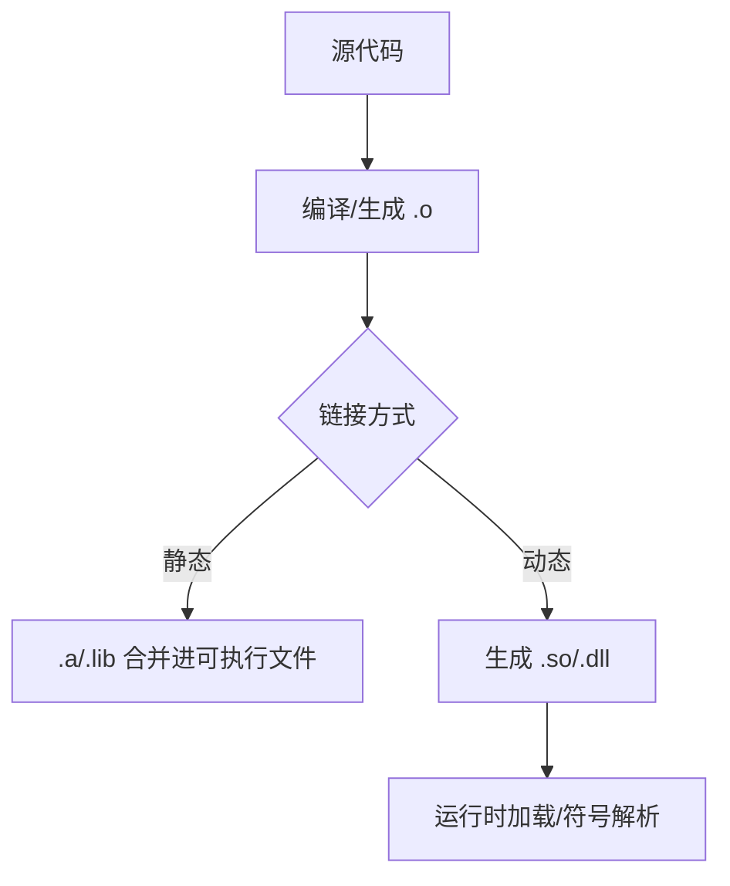

# 动态链接和静态链接

> 适用范围：单一主题（一个概念/机制/模块），保持可复用、可检索。

## 写作约束（铁律）

- **原内容一字不删**：所有原有文字、代码、注释、图片必须全部保留，禁止删除任何原内容。
- **只做归纳重组+增加**：在原有内容基础上调整结构、归类，新增内容以"补充"标记。新增量须让最终篇幅 ≥ 原版。
- **放不进的进附录**：六大段模板容纳不下的原内容，移入最后的「附录」章节，不得丢弃。
- **动笔前先搜索**：做相关知识准备；源码要贴原始代码，有需要可贴汇编。
- **字数硬指标**：详细解析(二)≥200字、进阶应用(四)≥500字、源码解析与实践感悟(五)≥1000字、面试准备(六)高频问法≥8个且带回答，反问点和一句话答案各≥5个。
- 先结论后细节，避免长段堆砌。
- 每节至少 3 条要点。
- 代码必须可运行或可推导，配清楚输入/输出或预期。
- **代码块必须标注语言**：所有代码块必须根据实际语言标注，C++ 代码用 `c++`（不可用 `cpp` 或 `c`），Python 用 `python`，汇编用 `asm`/`x86asm`，shell 用 `bash` 等。禁止无语言标注的裸代码块。
- 图示统一放在 `资源/图片/`，文内使用相对路径引用。
- 有流程的用流程图或其他类型的图。

## 一、核心概念

- 定义：静态链接在编译/链接期把库代码嵌入可执行文件；动态链接在运行期加载共享库并通过符号解析完成调用。
- 关键词：符号表、重定位、PLT/GOT、`-fPIC`、`dlopen`、`LoadLibrary`、RPATH。
- 适用场景/边界：静态适合独立部署与环境可控；动态适合共享与可热更新。**补充**：动态链接对 ABI 稳定性与部署路径更敏感。

## 二、详细解析（≥200字）

- **原理拆解（三层递进）**：
  - 第一层：基本工作原理（配流程图/序列图展示核心流程）
  - 第二层：关键步骤详解（每步展开子步骤）
  - 第三层：底层机制（编译器实现、运行时行为、内存布局影响）
- 关键数据结构/接口：
- 关键公式/复杂度：

**补充**：静态链接的本质是“链接器把需要的目标文件合并进最终可执行文件”。链接器在扫描 `.a/.lib` 时，只提取被引用的目标文件并拷贝进输出二进制，因此可执行文件体积增大，但运行时无需外部库。动态链接则把库代码放在 `.so/.dll` 中，程序运行时由动态加载器映射到进程地址空间，第一次调用函数时通过 PLT/GOT 完成符号解析（延迟绑定）。从底层机制看，动态链接需要位置无关代码（`-fPIC`）以便库可以加载到任意地址，静态链接则可使用绝对地址与更激进的链接期优化（LTO）。



## 三、动手实践（代码案例）

```bash
# 静态库示例
ar rcs libfoo.a foo.o
# 静态链接
g++ main.o -L. -lfoo -o app_static
```

```bash
# 动态库示例
g++ -fPIC -shared foo.cpp -o libfoo.so
# 动态链接
g++ main.o -L. -lfoo -Wl,-rpath,'$ORIGIN' -o app_shared
```

- 预期：`app_static` 可独立运行；`app_shared` 依赖运行时找到 `libfoo.so`。
- **补充**：Windows 下可用 `LoadLibrary`/`GetProcAddress` 动态加载导出符号。
- **补充**：Linux 可用 `ldd` 查看运行时依赖。

## 四、进阶应用（≥500字）

- 与其他主题的关联：
- 工程中的真实用法（大型项目案例、实际使用模式）：
- 常见优化策略：
  - 算法层面：选择更优算法
  - 数据结构：使用缓存友好结构
  - 内存访问：优化数据局部性
  - 并发处理：利用并行计算
  - 具体技巧：预计算与缓存、批处理减少开销、SIMD、避免虚函数调用等

**补充**：在大型工程里，链接方式的选择往往由“部署方式与维护成本”决定。静态链接的优势是部署简单：一个二进制即可运行，非常适合命令行工具与嵌入式设备；但缺点是体积大、更新成本高（每次升级都要重新编译与重新部署）。动态链接的优势是共享与热更新：多个进程共享同一份代码段，节省内存；库更新只需替换 `.so/.dll`，可快速修复漏洞或升级功能，但同时带来 ABI 兼容与“DLL Hell”问题。实践中常见的策略是：核心稳定模块使用动态库，变化频繁或对部署敏感的部分使用静态链接。

**补充**：动态链接还带来可插拔架构。通过 `dlopen/dlsym` 或 `LoadLibrary`，程序可在运行时发现插件并加载符号，实现“按需加载、按需升级”。这对于 IDE、图形软件、游戏引擎尤为重要。但插件化也意味着接口 ABI 必须稳定，通常需要把接口设计成 C ABI 或使用纯虚接口 + 版本号验证。对安全敏感环境，需要对插件加载进行签名验证或路径隔离。

**补充**：静态链接在性能上不一定绝对更快。虽然静态链接避免了 PLT/GOT 跳转，但现代 CPU 对间接跳转的惩罚通常较低；而动态库可通过共享减少 I-cache 压力。在性能关键模块中，真正的差异来自 LTO/IPO 能否跨模块优化。静态链接配合 LTO 往往能获得更强的跨单元优化，但动态链接也可通过 ThinLTO 与 -fvisibility=hidden 保持较好的优化边界。实践中应通过基准测试决定是否切换链接方式。

**补充**：部署层面常见问题包括：RPATH/RUNPATH 配置错误、`LD_LIBRARY_PATH` 污染、Windows PATH 冲突、以及同名 DLL 版本冲突。为避免“运行时找不到库”，推荐使用 `-Wl,-rpath,'$ORIGIN/../lib'` 让程序在相对路径下查找依赖；Windows 可使用“本地目录优先加载”策略。对于多版本库，应使用 SONAME 或版本后缀并保持 ABI 兼容策略。工程中更推荐把共享库与可执行文件一起打包，避免依赖系统库的版本差异。

## 五、源码解析和实践感悟（≥1000字）

- 关键实现路径（贴源码、必要时贴汇编）：
- 难点与易错点（陷阱案例 + 深度剖析）：
- 经验总结（补充）：

**补充**：从底层实现看，动态链接的关键是“符号解析 + 重定位”。ELF 中的 `.dynamic` 段记录了依赖库与重定位信息；程序启动时，动态加载器（ld.so）映射库文件、解析符号并重写 GOT/PLT。延迟绑定（lazy binding）使得首次调用某函数时才解析符号，这降低启动时间，但也让首次调用的开销更高。通过 `LD_BIND_NOW=1` 或链接时 `-Wl,-z,now` 可强制启动时解析所有符号，提高启动稳定性但增加启动耗时。理解这些机制能帮助定位“启动慢”或“首次调用慢”的问题。

**补充**：静态链接的内部流程主要是“符号合并 + 重定位”。链接器按照从左到右的顺序处理目标文件与库，遇到未解析符号时，从后续库中提取目标文件；这解释了为什么库的顺序会影响链接结果。`--start-group` 可以在存在循环依赖时反复扫描，但会显著拖慢链接时间。对于大型工程，建议尽量消除循环依赖，用更清晰的库层次结构替代 `--start-group`。

**补充**：符号可见性控制是动态链接工程化的关键。Linux 默认导出所有符号，会导致二进制膨胀与加载变慢，也增加 ODR 冲突风险。实践中应使用 `-fvisibility=hidden` 并显式导出 API。Windows 的 `__declspec(dllexport)` 与 `__declspec(dllimport)` 就是可见性控制的显式形式，这也解释了为什么 Windows 需要导入库 `.lib`。跨平台库应采用统一的导出宏，确保符号可见性一致。

**补充**：DLL Hell 是动态链接的经典问题。多个应用依赖不同版本的同名 DLL，加载顺序与搜索路径可能导致错误版本被加载。解决策略包括：Side-by-Side Assembly、为 DLL 添加版本后缀、采用私有目录部署、或使用静态链接避免共享。Linux 下的 SONAME 机制能一定程度缓解问题，但仍需严格遵循 ABI 兼容策略，避免“接口改了但 SONAME 未变”。

**补充**：从性能角度看，PLT/GOT 跳转带来的开销通常是数个 CPU cycle，但在高频调用的内环中仍可能显著。若性能热点调用动态库函数非常频繁，可考虑：1) 静态链接关键模块；2) 使用 `-Wl,-Bsymbolic` 限制符号重定向（但可能破坏可扩展性）；3) 将热点函数内联到调用方（头文件内联）。但这些策略要权衡可维护性与可更新性。

**补充**：调试动态链接问题的实用方法包括：`ldd` 查看依赖路径、`readelf -d` 查看 RPATH/RUNPATH、`objdump -T` 查看导出符号、`LD_DEBUG=libs` 追踪加载过程。Windows 可用 `Dependency Walker` 或 `dumpbin /DEPENDENTS`。这些工具可快速定位“找不到库”“符号未定义”或“版本不匹配”的问题。

**补充**：实践感悟总结：第一，链接方式不是纯性能问题，而是“部署 + 维护 + 兼容性”的综合选择；第二，动态链接的最大风险是 ABI 与依赖管理，必须通过统一的版本策略与导出规则控制；第三，静态链接虽然简化部署，但可能导致二进制体积膨胀与更新成本上升。选择链接方式的正确方法是：先明确部署与更新策略，再根据性能需求做局部优化，而不是一刀切。

## 六、面试准备（高频问法≥10个，反问点/一句话答案≥5个，均带回答）

### 6.1 高频问法（≥10个）

Q1：静态链接与动态链接的差异？

A：静态链接把库代码嵌入可执行文件；动态链接在运行期加载共享库。

Q2：动态链接的优势与风险？

A：优势是共享内存与可热更新；风险是 ABI 兼容与依赖地狱。

Q3：`-fPIC` 的作用？

A：生成位置无关代码，使共享库可加载到任意地址。

Q4：GOT/PLT 做了什么？

A：GOT 存函数地址，PLT 实现延迟绑定。

Q5：为什么链接顺序重要？

A：链接器单遍扫描，未解析符号必须在后续库中出现。

Q6：RPATH 与 RUNPATH 区别？

A：RPATH 优先级高，RUNPATH 优先级低于 `LD_LIBRARY_PATH`。

Q7：如何处理 DLL Hell？

A：使用版本后缀/私有目录/Side-by-Side，或静态链接。

Q8：动态库更新后是否需要重启？

A：进程已加载的库不会自动替换，需重启才生效。

Q9：为什么 Windows 需要导入库 `.lib`？

A：导入库保存符号信息，链接器用它生成调用入口。

Q10：如何在运行期显式加载库？

A：Linux 用 `dlopen/dlsym`，Windows 用 `LoadLibrary/GetProcAddress`。

### 6.2 反问点/陷阱点（≥5个）

- 反问：团队如何制定 ABI 兼容策略与版本策略？
- 反问：动态库是否统一 `-fvisibility=hidden`？
- 反问：对插件系统是否做签名校验与版本校验？
- 陷阱：链接顺序错误导致 undefined reference。
- 陷阱：忽略 RPATH/RUNPATH 导致部署失败。

### 6.3 一句话答案（≥5个）

- 静态链接部署简单，动态链接共享内存。
- `-fPIC` 是动态库的必需品。
- PLT/GOT 让动态库可延迟绑定。
- DLL Hell 来自版本冲突与加载路径不一致。
- 选择链接方式先看部署与更新策略。

## 附录（模板外原内容收纳）

> 以下为原笔记中不直接适配六大段结构、但仍有价值的内容，原样保留于此。

# 动态链接和静态链接

# 动态链接（DLL）

在软件开发中，动态链接库（DLL，Dynamic Link Library）是一种重要的技术，它通过模块化设计、资源共享和动态加载等特性，显著提升了程序的灵活性和效率。以下是使用 DLL 的主要原因及其核心优势：

### **一、DLL 的核心作用**

#### 1. **模块化开发**

* **功能解耦**：将程序拆分为多个独立模块（如网络、UI、算法），每个模块封装为 DLL，便于团队分工协作。
* **独立更新**：修复 Bug 或新增功能时，只需替换对应 DLL，无需重新编译整个程序。
* **示例**：  
  在您的代码中，`dfs_client_win.dll` 可能是文件系统客户端功能的独立模块，包含 `FDFSC_Initialize` 和 `FDFSC_UnInitialize` 等接口。

#### 2. **资源共享**

* **内存节省**：多个程序可共享同一 DLL 的代码段，减少物理内存占用（如 Windows 系统 DLL）。
* **磁盘空间优化**：公共库（如 OpenSSL、JSON 解析器）只需存储一份，避免重复占用空间。

#### 3. **动态加载**

* **按需加载**：通过 `LoadLibrary` 和 `GetProcAddress` 在运行时加载 DLL，减少程序启动时间。
* **灵活处理依赖**：若 DLL 缺失或版本不兼容，程序可优雅降级或提示用户，避免直接崩溃。

### **DLL 对比静态库的优势**

|  |  |  |
| --- | --- | --- |
| **特性** | **静态库（.lib/.a）** | **动态库（DLL/.so）** |
| **编译时链接** | 代码直接嵌入可执行文件 | 运行时动态加载 |
| **内存占用** | 每个程序独立占用内存 | 多个程序共享同一份代码 |
| **更新维护** | 需重新编译整个程序 | 替换 DLL 即可生效 |
| **磁盘空间** | 多份重复代码占用空间 | 单份代码共享 |
| **灵活性** | 低（功能固定） | 高（支持插件化、热更新） |

---

### **三、DLL 的典型应用场景**

#### 1. **系统级功能封装**

* Windows API（如 `kernel32.dll`, `user32.dll`）通过 DLL 提供系统服务。

#### 2. **插件系统**

* 程序通过加载不同的插件 DLL 扩展功能（如 Photoshop 滤镜、浏览器扩展）。

#### 3. **驱动程序开发**

* 硬件驱动（如显卡驱动 `.sys` 文件）本质上是 DLL 的变种。

#### 4. **游戏引擎模块化**

* 渲染引擎、物理引擎等功能封装为 DLL，方便跨项目复用。

* **Linux**：通过 `-fPIC -shared` 生成 `.so`，运行时需设置 `LD_LIBRARY_PATH`。
* **Windows**：需显式导出符号（`__declspec(dllexport)`），并生成导入库（`.dll.a` 或 `.lib`）。

# 静态库

### 静态库知识总结

#### 1. **定义与特点**

* **定义**：静态库（Static Library）是一组预编译的目标文件（`.o` 或 `.obj`）的集合，通过归档工具打包成单一文件（`.a` 或 `.lib`），在编译时被完整链接到可执行文件中。
* 特点：

+ **编译时链接**：库代码直接嵌入可执行文件，运行时无需外部依赖。
+ **独立性强**：程序不依赖外部库文件，部署简单。
+ **体积较大**：每个使用静态库的程序都包含一份库代码副本。

#### 2. **文件格式**

* **Linux/Unix**：`.a` 文件（Archive），使用 `ar` 工具创建。
* **Windows**：`.lib` 文件，通过编译器（如 MSVC）生成。

静态库适用场景

* 程序需要独立分发，避免依赖问题（如命令行工具）。
* 对性能敏感，需编译器深度优化。
* 库代码规模小，或更新频率低。
* 动态库适用场景：

+ 多个程序共享同一库（如系统库 `libc`）。
+ 库需要频繁更新（如插件系统）。
+ 资源受限环境（如嵌入式系统需节省内存）。

## 五、源码解析和实践感悟

### 1. 符号导出的跨平台差异

```c++
// Windows：必须显式声明导出/导入
#ifdef BUILDING_DLL
    #define API __declspec(dllexport)  // 构建 DLL 时导出
#else
    #define API __declspec(dllimport)  // 使用 DLL 时导入
#endif
class API MyClass { void foo(); };

// Linux/Unix：默认所有符号可见
// 编译：g++ -fPIC -shared -o libfoo.so foo.cpp
// 控制可见性（推荐）：-fvisibility=hidden + __attribute__((visibility("default")))
```

### 2. 动态加载的完整流程

```c++
// Windows LoadLibrary 模式
typedef void (*InitFunc)();
HMODULE dll = LoadLibrary("dfs_client_win.dll");
if (!dll) throw std::runtime_error("DLL not found");

auto init = (InitFunc)GetProcAddress(dll, "FDFSC_Initialize");
if (init) init();
// ... 使用完毕后 FreeLibrary(dll);

// Linux dlopen 模式
void* handle = dlopen("libplugin.so", RTLD_LAZY);
if (!handle) { fprintf(stderr, "%s\n", dlerror()); exit(1); }
auto func = (void(*)())dlsym(handle, "run");
char* err = dlerror();
if (err) { /* 符号未找到 */ }
```

### 3. 静态链接的链接顺序陷阱

```bash
# 链接器从左到右处理，依赖项必须在被依赖项之后
g++ main.o -lB -lA   # ❌ libA 依赖 libB，但 libB 在前
g++ main.o -lA -lB   # ✅ libA 先出现，未解析符号从 libB 中找

# 使用 --start-group 绕开顺序问题（慢）
g++ main.o -Wl,--start-group -lA -lB -Wl,--end-group
```

### 实践经验

1. **符号可见性**：Linux 默认全导出，生产库应加 `-fvisibility=hidden` 仅暴露必要 API，减小 .so 体积 + 加速加载
2. **ODR 违规**：同一符号在多个 .so 中定义 → 行为未定义。用命名空间 + 匿名命名空间隔离
3. **静态库的链接顺序**：gcc/ld 单遍扫描，被依赖的库写在依赖它的库之后
4. **DLL Hell**：Windows 多个版本同名 DLL 冲突。解决方案：Side-by-Side assembly 或静态链接
5. **`-fPIC` 必要**：动态库必须位置无关代码，静态库可选。缺少 `-fPIC` 会导致 .text 段重定位失败
6. **链接时优化**：LTO (Link Time Optimization) 跨编译单元优化，静态链接受益大

## 六、面试准备

### Q&A（10题）

**Q1: 静态链接和动态链接的区别？**
A: 静态链接在编译期将库代码嵌入可执行文件；动态链接运行时加载共享库，多个进程共享一份代码

**Q2: 动态链接的优缺点？**
A: 优：节省内存（共享）、更新方便（替换 .so 即可）、支持插件。缺：加载慢、依赖地狱、符号冲突

**Q3: `-fPIC` 的作用？**
A: Position Independent Code，生成位置无关代码。动态库必须在加载时放到任意地址，`-fPIC` 使代码段可重定位

**Q4: GOT 和 PLT 是什么？**
A: Global Offset Table 存全局变量/函数地址；Procedure Linkage Table 延迟绑定外部函数（首次调用才解析）

**Q5: Windows `__declspec(dllexport)` vs Linux 符号可见性？**
A: Windows 必须显式导出符号；Linux 默认全部导出，可通过 `-fvisibility=hidden` 限制

**Q6: 链接顺序为什么重要？**
A: GNU ld 单遍扫描，只解析已出现的未定义符号。`-lA -lB` 中 A 引用 B 的符号，B 必须在 A 之后

**Q7: static 库和 shared 库编译出 `.a` 区别？**
A: 静态 `.a` 是 `.o` 打包；共享 `.so` 需 `-fPIC -shared`，且保留符号。静态可链入共享

**Q8: 运行时找不到 .so 怎么解决？**
A: `LD_LIBRARY_PATH` 临时加路径；`ldconfig` 注册到系统；`-rpath` 在 ELF 中硬编码搜索路径

**Q9: 静态链接体积大的本质？**
A: 每个可执行文件包含完整库代码的副本，且编译器无法跨 .a 做死代码消除

**Q10: 什么是 RPATH 和 RUNPATH？**
A: ELF 中嵌的动态库搜索路径。RPATH 优先级高于 LD_LIBRARY_PATH，RUNPATH 低于。`-Wl,-rpath,'$ORIGIN/../lib'` 相对路径

### 陷阱与反问（5个）

1. **陷阱**：多 .so 定义同一符号 → ODR 违规，结果取决于加载顺序，极难调试
2. **反问**：静态链接一定比动态快吗？→ 未必然，动态库的 PLT 跳转开销约 2-5 cycles，LTO 静态链接可能更快
3. **陷阱**：忘记 `-fPIC` 编译 .so → 链接时报 `R_X86_64_32S` 重定位错误
4. **反问**：全静态链接好吗？→ 二进制巨大，无法利用系统库更新，glibc 不建议静态链接
5. **陷阱**：`dlopen` 后不检查 `dlerror()` — 可能静默失败，返回 NULL 但无报错

### 一句话答案（5个）

1. **静态链接**：编译期嵌入，独立部署，体积大
2. **动态链接**：运行时加载，共享内存，易更新
3. **-fPIC**：位置无关代码，动态库必须
4. **链接顺序**：ld 单遍扫描，被依赖的在后
5. **符号可见性**：Linux 默认全导出，生产建议 hidden
