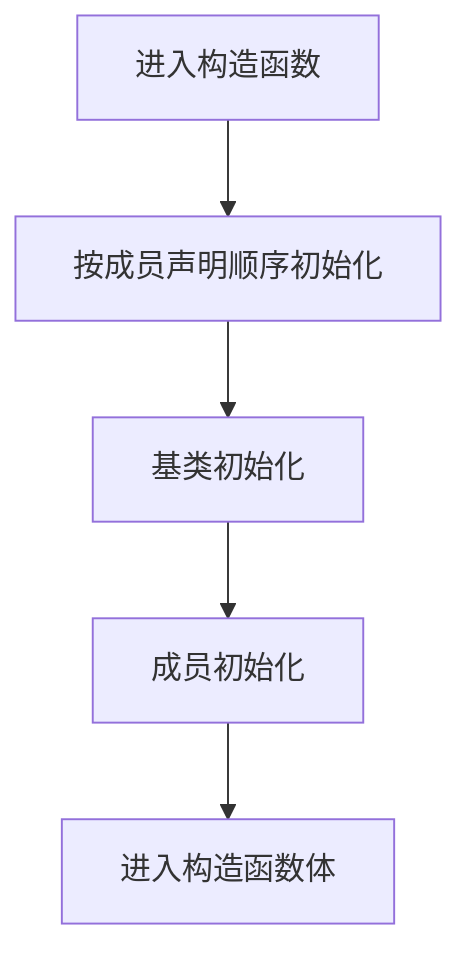

# 参数化列表

> 适用范围：单一主题（一个概念/机制/模块），保持可复用、可检索。

## 写作约束（铁律）

- **原内容一字不删**：所有原有文字、代码、注释、图片必须全部保留，禁止删除任何原内容。
- **只做归纳重组+增加**：在原有内容基础上调整结构、归类，新增内容以"补充"标记。新增量须让最终篇幅 ≥ 原版。
- **放不进的进附录**：六大段模板容纳不下的原内容，移入最后的「附录」章节，不得丢弃。
- **动笔前先搜索**：做相关知识准备；源码要贴原始代码，有需要可贴汇编。
- **字数硬指标**：详细解析(二)≥200字、进阶应用(四)≥500字、源码解析与实践感悟(五)≥1000字、面试准备(六)高频问法≥8个且带回答，反问点和一句话答案各≥5个。
- 先结论后细节，避免长段堆砌。
- 每节至少 3 条要点。
- 代码必须可运行或可推导，配清楚输入/输出或预期。
- **代码块必须标注语言**：所有代码块必须根据实际语言标注，C++ 代码用 `c++`（不可用 `cpp` 或 `c`），Python 用 `python`，汇编用 `asm`/`x86asm`，shell 用 `bash` 等。禁止无语言标注的裸代码块。
- 图示统一放在 `资源/图片/`，文内使用相对路径引用。
- 有流程的用流程图或其他类型的图。

## 一、核心概念

- 定义：参数化列表（初始化列表）是 C++ 构造函数中用于直接初始化成员与基类的语法形式。
- 关键词：成员初始化顺序、直接初始化、构造函数体赋值、`-Wreorder`、默认成员初始化。
- 适用场景/边界：适合所有有成员初始化需求的类，尤其是 `const`、引用、无默认构造的成员；**补充**：在资源管理类中初始化列表是唯一可靠的资源注入入口。

## 二、详细解析（≥200字）

- **原理拆解（三层递进）**：
  - 第一层：基本工作原理（配流程图/序列图展示核心流程）
  - 第二层：关键步骤详解（每步展开子步骤）
  - 第三层：底层机制（编译器实现、运行时行为、内存布局影响）
- 关键数据结构/接口：
- 关键公式/复杂度：

**补充**：初始化列表的本质是“直接构造”。当对象构造时，编译器会依次为成员与基类生成初始化语句，这些语句在构造函数体执行之前完成。对比构造函数体内赋值，初始化列表避免了“先默认构造再赋值”的冗余步骤。编译器执行顺序严格遵循成员声明顺序，而不是初始化列表书写顺序，这一点极易导致隐蔽的未初始化使用（典型的 `a(b)`、`b` 未先初始化）。从底层机制看，初始化列表避免了额外的构造与析构开销，尤其对 `std::string`、`std::vector`、`std::unique_ptr` 等资源类意义重大。复杂度上，初始化列表本身不改变算法复杂度，但会减少常数级的构造开销，是性能优化中低成本且高收益的手段。



## 三、动手实践（代码案例）

```c++
#include <iostream>
#include <string>

struct Example {
    std::string s;
    int x;
    Example(const char* str, int v) : s(str), x(v) {}
};

int main() {
    Example e("Hello", 42);
    std::cout << e.s << " " << e.x << "\n";
    return 0;
}
```

- 预期输出：`Hello 42`
- **补充**：把 `s(str)` 改成在构造函数体中赋值，可在汇编中观察多一次构造与一次赋值。
- **补充**：使用 `-Wreorder` 编译选项可捕获初始化顺序错误。

## 四、进阶应用（≥500字）

- 与其他主题的关联：
- 工程中的真实用法（大型项目案例、实际使用模式）：
- 常见优化策略：
  - 算法层面：选择更优算法
  - 数据结构：使用缓存友好结构
  - 内存访问：优化数据局部性
  - 并发处理：利用并行计算
  - 具体技巧：预计算与缓存、批处理减少开销、SIMD、避免虚函数调用等

**补充**：初始化列表的“进阶价值”体现在资源管理与可维护性上。首先，所有资源型成员（如 RAII 包装的句柄、文件、锁）都必须在初始化列表中完成注入，否则可能出现“构造后再赋值”的中间状态，破坏异常安全保证。其次，在大型工程中，初始化列表是“文档式代码”，它清晰展示了对象构造所需的依赖，这使得阅读者无需进入函数体就能理解对象的关键状态。对于依赖注入场景，初始化列表是最直接的“构造期注入”实现方式。

**补充**：与默认成员初始化的结合是 C++11 之后的最佳实践。默认成员初始化提供安全的默认值，初始化列表则在需要覆盖时显式指定。二者结合既保证对象在所有构造路径上都有稳定状态，也避免重复书写默认值。例如：`int x = 0;` 可以保证任何构造函数都不会遗漏初始化，而 `Foo() : x(42) {}` 在特定构造中覆盖默认值。

**补充**：工程实战中，初始化列表还与性能优化紧密相关。对大量对象构造的热点路径（如 ECS 或消息对象），初始化列表可以减少一次或多次拷贝与临时对象创建；当成员包含 `std::vector` 时，初始化列表允许使用 `reserve` 或直接构造带容量的 vector，减少运行期扩容。对于高频构造析构场景，初始化列表的常数级优化是可累积的。

**补充**：错误使用的代价同样显著。最常见的陷阱是“顺序错乱”，其结果往往是未初始化的成员参与计算，导致 UB；其次是“隐式窄化转换”，当使用大括号初始化时能阻止窄化，但使用圆括号或赋值初始化可能会无声截断；再者是“基类初始化遗漏”，若基类没有默认构造，则编译失败；若有默认构造但你期望传参，也会产生逻辑错误。这些问题的解决方案不是“记住”，而是养成固定的写法：初始化列表顺序与声明顺序一致、`-Wreorder` 作为强制警告、对资源型成员统一使用初始化列表。

## 五、源码解析和实践感悟（≥1000字）

- 关键实现路径（贴源码、必要时贴汇编）：
- 难点与易错点（陷阱案例 + 深度剖析）：
- 经验总结（补充）：

**补充**：从编译器角度看，初始化列表会直接生成成员构造调用序列。以 `std::string` 成员为例，初始化列表对应的是一次 `std::string(const char*)` 构造调用，而构造函数体赋值对应的是先调用 `std::string()` 默认构造，再调用 `operator=` 赋值，这意味着多一次构造与一次赋值。这种差异在汇编层面非常直观：初始化列表路径只有一次构造函数调用，函数体赋值路径多了额外的调用序列与临时对象处理。对于资源型对象（如 `std::unique_ptr`），初始化列表直接注入资源并建立所有权；如果改为构造函数体赋值，可能会在异常发生时出现资源泄漏或处于半构造状态。

**补充**：初始化顺序的陷阱源于 C++ 标准明确规定：成员初始化顺序与成员声明顺序一致，而不是初始化列表书写顺序。编译器在生成构造代码时，会按照声明顺序依次插入构造调用。若初始化列表与声明顺序不一致，编译器会发出 `-Wreorder` 警告，但如果忽略，可能造成 UB。典型例子是 `Bad(int x) : b(x), a(b) {}`，其中 `a` 在 `b` 之前初始化，因此 `a(b)` 读取的是未初始化的 `b`。这类问题往往在运行期表现为偶发现象，难以定位，因此必须通过编译器警告与代码审查提前消除。

**补充**：在实际项目中，初始化列表与异常安全是强绑定的。构造函数体赋值意味着对象已经完成成员默认构造，一旦赋值过程抛出异常，会触发成员析构，但对象整体处于“部分初始化”状态；初始化列表则把构造的第一步就定位为“正确的最终状态”，一旦抛异常，已构造成员会被正确析构，未构造成员不会产生副作用。这与 RAII 的设计哲学一致，因此初始化列表被认为是更安全的写法。

**补充**：从可维护性角度，初始化列表是理解类不变式的第一入口。类的不变式（如“指针始终非空”、“缓存大小与容量一致”）通常应在构造期建立。若在构造函数体内分散赋值，阅读者需要跟踪完整函数体才能理解对象初始状态；初始化列表则提供一目了然的依赖与状态定义。在复杂类中，建议将初始化列表写成“声明顺序 + 依赖顺序”，并配合注释说明关键成员的意义。

**补充**：实践经验还包括：1) 尽量使用统一的初始化风格（列表初始化）避免隐式窄化；2) 对于 `const` 和引用成员，必须在初始化列表中初始化，这不是风格问题而是语义要求；3) 使用默认成员初始化减少重复代码，但在性能敏感路径上明确写出初始化列表以避免误解；4) 在模板类中，初始化列表可利用 `std::forward` 保持值类别，避免不必要的拷贝；5) 对于派生类，先初始化基类，再初始化成员，这符合语义也减少构造顺序错误。

**补充**：汇编与反汇编验证是理解初始化列表的有效方式。通过 `-O2 -S` 生成汇编，可以观察到初始化列表会把构造函数参数直接传给成员构造器，而构造函数体赋值则在进入函数体后才调用 `operator=`。此差异不仅是性能问题，也影响异常安全与对象状态一致性。建议在关键性能敏感模块中，以汇编对比作为“质量门槛”，确保构造路径符合预期。

**补充**：最后的实践感悟是：初始化列表不是“可选优化”，而是“构造语义”的正确表达。尤其在现代 C++ 中，类往往包含多个资源成员，依赖初始化列表维持类不变式。如果团队中存在“习惯在构造函数体里赋值”的风格，应该通过代码规范与 code review 统一改进。

## 六、面试准备（高频问法≥10个，反问点/一句话答案≥5个，均带回答）

### 6.1 高频问法（≥10个）

Q1：初始化列表和构造函数体赋值的区别？

A：初始化列表是直接构造成员，构造函数体赋值会先默认构造再赋值，存在额外开销。

Q2：哪些成员必须在初始化列表中初始化？

A：`const` 成员、引用成员、无默认构造的成员、无默认构造的基类。

Q3：初始化顺序由什么决定？

A：由成员声明顺序决定，与初始化列表书写顺序无关。

Q4：`-Wreorder` 警告是什么？

A：当初始化列表顺序与成员声明顺序不一致时触发，用于提醒潜在 UB。

Q5：为什么 `std::string` 在初始化列表中性能更好？

A：构造函数体赋值会多一次默认构造与一次赋值，初始化列表只构造一次。

Q6：默认成员初始化与初始化列表如何配合？

A：默认成员初始化提供默认值，初始化列表可在需要时覆盖。

Q7：大括号初始化与圆括号初始化的差别？

A：大括号禁止窄化转换，圆括号可能允许隐式窄化。

Q8：基类构造函数如何调用？

A：只能在初始化列表中调用，构造函数体内无法调用基类构造。

Q9：初始化列表顺序写错会导致什么问题？

A：可能导致成员使用未初始化值，属于未定义行为。

Q10：为什么推荐所有成员都放到初始化列表？

A：写法一致、语义清晰、减少默认构造与赋值的额外开销。

Q11：初始化列表与异常安全的关系？

A：初始化列表确保构造期直接建立不变式，异常时析构路径更安全。

Q12：初始化列表对编译器优化有什么影响？

A：减少冗余构造，提升常数级性能，便于编译器内联与优化。

### 6.2 反问点/陷阱点（≥5个）

- 反问：团队是否统一要求初始化列表顺序与声明顺序一致？
- 反问：在项目中是否启用 `-Wreorder` 并视作错误？
- 反问：是否允许构造函数体赋值作为例外？其理由是什么？
- 陷阱：误以为初始化列表顺序决定实际初始化顺序。
- 陷阱：对 `const` 成员在构造函数体内赋值（编译失败）。

### 6.3 一句话答案（≥5个）

- 初始化列表是成员真正“构造”的位置。
- 成员声明顺序决定初始化顺序，写法顺序不改变事实。
- 初始化列表避免“默认构造 + 赋值”的冗余路径。
- `-Wreorder` 是最有效的初始化顺序防错工具。
- 资源类必须用初始化列表保持异常安全。

## 附录（模板外原内容收纳）

> 以下为原笔记中不直接适配六大段结构、但仍有价值的内容，原样保留于此。

# 参数化列表

### **初始化列表的优势**

#### **1. 性能更优**

避免冗余操作

：直接调用构造函数，省去默认构造+赋值的开销。

```c++
// 对于 std::string 等复杂对象：
Example() : s("Hello") {} // 直接调用 std::string(const char*)

// 对比构造函数体内赋值：
Example() { 
    s = "Hello"; // 先调用默认构造函数（空字符串），再调用 operator=
}
```

#### **2. 支持特殊成员**

如 `const`、**引用成员和无默认构造**的成员（见上文）。

#### **3. 初始化顺序明确**

* 初始化顺序由成员声明顺序决定，与初始化列表顺序无关。

```c++
class OrderMatters {
    int a;
    int b;
public:
    // 初始化顺序：先 a，后 b（与初始化列表顺序无关）
    OrderMatters(int x) : b(x), a(b) {} // 危险：a 用未初始化的 b 赋值！
};
```

#### **4. 代码简洁**

* 对于多成员初始化，一行代码即可完成：

```c++
class Point {
    int x, y, z;
public:
    Point(int a, int b, int c) : x(a), y(b), z(c) {}
};
```


## 五、源码解析和实践感悟

### 1. 初始化列表 vs 构造函数体赋值的汇编差异

```c++
class Foo {
    std::string s;
    int x;
public:
    // 初始化列表：直接构造
    Foo(const char* str, int val) : s(str), x(val) {}
    // 汇编：call std::string::string(const char*)  ← 一次构造
    
    // 构造函数体赋值：默认构造 + 赋值
    Foo(const char* str, int val) {
        s = str;  // 先隐式调 string() 默认构造，再调 operator=
        x = val;
    }
    // 汇编：call string() → call operator=(const char*)  ← 多一次构造
};
// 对于 string/vector/unique_ptr 等有开销的成员，初始化列表是硬性能需求
```

### 2. 初始化顺序陷阱

```c++
class Bad {
    int a;
    int b;
public:
    // 按声明顺序 a→b 初始化，初始化列表顺序无效！
    Bad(int x) : b(x), a(b) {}  // a(b) 先执行！b 尚未初始化！
};

class Good {
    int a;
    int b;
public:
    Good(int x) : a(x), b(a) {}  // 安全：a 先于 b，b 用已初始化的 a
};

// 编译器警告 -Wreorder 可检测初始化列表顺序与声明不一致
```

### 3. 必须用初始化列表的场景

```c++
class MustUseInit {
    const int c;        // const 成员：必须在初始化列表中初始化
    int& ref;           // 引用成员：同上
    std::unique_ptr<int> p;  // 无默认构造的成员：同上
public:
    MustUseInit(int val, int& r)
        : c(val), ref(r), p(new int(val)) {}  // 只能在初始化列表中
    
    // 以下在构造函数体中无法编译：
    // c = val;  // 错误：const 不能赋值
    // ref = r;  // 错误：引用不能重新绑定
};
```

### 实践经验

1. **初始化列表是唯一选择**：const 成员、引用成员、无默认构造的成员必须在初始化列表中
2. **顺序 = 声明顺序**：初始化列表顺序不影响执行顺序，声明顺序才是真正的执行顺序
3. **`-Wreorder` 必开**：gcc/clang 可检测初始化列表顺序不一致
4. **性能敏感成员**：string/vector/map 等有开销的成员必须用初始化列表，避免双重构造
5. **C++11 大括号初始化**：`Foo() : a{1}, b{2} {}` 禁止窄化转换，比圆括号更安全
6. **默认成员初始化 (C++11)**：`int x = 0;` 在声明处初始化，构造函数未显式覆盖时生效

## 六、面试准备

### Q&A（8题）

**Q1: 初始化列表和构造函数体赋值的区别？**
A: 初始化列表直接调构造函数，函数体先默认构造再赋值。后者多一次默认构造开销

**Q2: 哪些成员必须在初始化列表中初始化？**
A: const 成员、引用成员、无默认构造函数的成员、基类（无默认构造时）

**Q3: 初始化顺序由什么决定？**
A: 由类中成员声明顺序决定，与初始化列表的书写顺序无关

**Q4: `-Wreorder` 警告是什么？**
A: 当初始化列表顺序与成员声明顺序不一致时警告。建议作为错误：`-Werror=reorder`

**Q5: 为什么 `string` 在初始化列表中性能更好？**
A: 函数体赋值：先默认构造空 string，再 operator= 分配内存+拷贝。初始化列表：一次目的构造，零次额外操作

**Q6: 默认成员初始化是什么？**
A: C++11 在声明处直接初始化：`int x = 0;`。若构造函数未覆盖，该值生效

**Q7: 初始化列表和大括号初始化的区别？**
A: 大括号 `{val}` 禁止窄化转换（如 double→int 会报错），圆括号 `(val)` 允许隐式窄化

**Q8: 基类构造函数如何调用？**
A: 只能在初始化列表中调用：`Derived(int x) : Base(x), member(x) {}`

### 陷阱与反问（5个）

1. **陷阱**：`Bad(int x) : b(x), a(b) {}` — a 用未初始化的 b，UB。记死：执行顺序 = 声明顺序
2. **反问**：所有成员都进初始化列表好吗？→ 是，养成习惯。即使 int 等平凡类型也放进去无额外开销
3. **陷阱**：基类不在初始化列表中 — 基类用默认构造，若基类无默认构造则编译失败
4. **反问**：能同时用默认成员初始化和初始化列表吗？→ 可以，初始化列表覆盖默认值
5. **陷阱**：`Foo() : a(1), a(2) {}` — 同一成员初始化两次，未定义行为

### 一句话答案（5个）

1. **初始化列表**：成员真正初始化的地方，直接构造
2. **函数体赋值**：先默认构造再赋值，慢一步
3. **顺序铁律**：声明顺序决定初始化顺序
4. **必须列表**：const、引用、无默认构造的成员
5. **`-Wreorder`**：检测初始化列表顺序不一致
