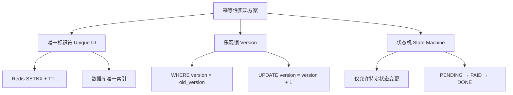
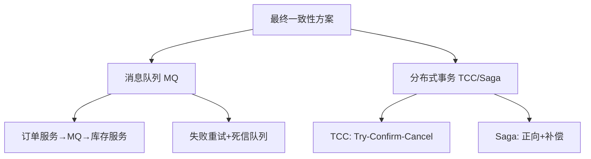

# 幂等性与分布式一致性保障

> 适用范围：分布式系统中的幂等性设计（唯一ID、乐观锁、状态机）、数据最终一致性方案（消息队列、TCC/Saga事务）。

## 写作约束（铁律）

- **原内容一字不删**：所有原有文字、代码、注释、图片必须全部保留，禁止删除任何原内容。
- **只做归纳重组+增加**：在原有内容基础上调整结构、归类，新增内容以"补充"标记。新增量须让最终篇幅 ≥ 原版。
- **放不进的进附录**：六大段模板容纳不下的原内容，移入最后的「附录」章节，不得丢弃。
- **动笔前先搜索**：做相关知识准备；源码要贴原始代码，有需要可贴汇编。
- **字数硬指标**：详细解析(二)≥200字、进阶应用(四)≥500字、源码解析与实践感悟(五)≥1000字、面试准备(六)高频问法≥8个且带回答，反问点和一句话答案各≥5个。
- **代码块必须标注语言**：所有代码块必须根据实际语言标注，C++ 代码用 `c++`，Java 用 `java`，SQL 用 `sql`，Python 用 `python` 等。禁止无语言标注的裸代码块。

## 一、项目/模块概述

- **模块定位**：幂等性与一致性是分布式系统的两大核心保障机制。在IM项目中，消息去重依赖幂等性设计，跨服务数据同步依赖最终一致性方案。
- **技术栈与依赖**：Redis（幂等校验SETNX + TTL）、MySQL（唯一索引 + 乐观锁版本号）、Kafka（可靠消息队列）、Seata（分布式事务框架）
- **模块边界**：
  - 幂等性：客户端请求 → 服务端去重 → 业务处理
  - 一致性：跨服务数据同步 → 消息队列异步 → 补偿机制

## 二、架构设计（≥200字）

### 幂等性设计三方案



### 最终一致性三方案



### 关键设计决策

- **为什么不用强一致性**：分布式系统中强一致性（如2PC）会严重影响性能和可用性。IM消息场景允许短暂不一致，最终一致性更适用。
- **为什么幂等性是必须的**：网络重传、客户端重试、消息队列重试都会导致重复请求，服务端必须能安全处理重复请求。

## 三、核心实现（代码走读）

### 3.1 幂等性定义

- **数学定义**：对于同一操作，执行一次或多次的结果相同。
- **分布式系统定义**：客户端重复调用服务端接口时，系统状态保持一致（如支付接口防止重复扣款）。

### 3.2 实现方案一：唯一标识符（Unique ID）

**原理**：客户端生成唯一请求ID（如UUID），服务端校验该ID是否已处理。

**适用场景**：支付、订单创建等关键操作。

**实现步骤**：
1. 客户端生成唯一ID（如 `request_id=uuid4()`），随请求发送
2. 服务端通过 **Redis** 或 **数据库唯一索引** 检查 `request_id` 是否存在
3. 若存在：返回之前的处理结果；若不存在：执行业务逻辑并记录ID

```sql
-- 数据库唯一索引
ALTER TABLE orders ADD UNIQUE (request_id);
```

```java
// Java代码示例（Redis校验）
public boolean processOrder(String requestId, Order order) {
    if (redis.setnx(requestId, "processing") == 1) {
        try {
            // 执行业务逻辑
            db.insertOrder(order);
            redis.set(requestId, "completed");
            return true;
        } catch (Exception e) {
            redis.delete(requestId);
            throw e;
        }
    } else {
        // 请求重复，直接返回
        return false;
    }
}
```

### 3.3 实现方案二：乐观锁（Optimistic Lock）

**原理**：基于数据版本号（Version）控制并发修改。

**适用场景**：库存扣减、账户余额更新。

**实现步骤**：
1. 读取数据时获取当前版本号（`version`）
2. 更新时校验版本号是否匹配，并递增版本号

```sql
UPDATE products 
SET stock = stock - 1, version = version + 1 
WHERE id = 1001 AND version = 3;
```

### 3.4 实现方案三：状态机（State Machine）

**原理**：业务操作设计为状态流转，仅允许特定状态变更。

**适用场景**：订单状态（待支付→已支付→已完成）。

```c++
if (order.getStatus() == OrderStatus.PENDING) {
    order.setStatus(OrderStatus.PAID);
    orderDao.update(order);
}
```

### 3.5 最终一致性：消息队列

**原理**：通过可靠消息传递实现异步数据同步。

**核心步骤**（以订单创建→扣库存为例）：
1. 订单服务本地事务中插入订单记录，并发送消息到MQ（如Kafka）
2. 库存服务消费消息，扣减库存
3. 若消费失败，MQ自动重试或进入死信队列（DLQ）人工处理

```java
// 订单服务（Producer）
@Transactional
public void createOrder(Order order) {
    orderDao.insert(order);
    kafkaTemplate.send("order-created", order);
}

// 库存服务（Consumer）
@KafkaListener(topics = "order-created")
public void deductStock(Order order) {
    productService.deductStock(order.getProductId(), order.getQuantity());
}
```

### 3.6 最终一致性：TCC（Try-Confirm-Cancel）

转账场景示例：
1. **Try**：预扣款（冻结资源）
2. **Confirm**：实际扣款（提交事务）
3. **Cancel**：回滚预扣款（释放资源）

```java
// Try阶段
public boolean tryTransfer(String from, String to, BigDecimal amount) {
    if (accountService.freeze(from, amount) && accountService.reserve(to, amount)) {
        return true;
    }
    throw new TransferException("预扣款失败");
}

// Confirm阶段（幂等）
public void confirmTransfer(String txId) {
    if (txLog.exists(txId)) return; // 已提交过
    accountService.commit(from, to, amount);
    txLog.save(txId);
}

// Cancel阶段（幂等）
public void cancelTransfer(String txId) {
    if (txLog.exists(txId)) return;
    accountService.unfreeze(from, amount);
    accountService.unreserve(to, amount);
}
```

### 3.7 补偿事务（Saga）

**原理**：每个业务步骤对应一个补偿操作，失败时逆向执行。

**编排式示例**：

```
sequenceDiagram
    participant OrderService
    participant PaymentService
    participant InventoryService

    OrderService->>PaymentService: 扣款
    PaymentService-->>OrderService: 成功
    OrderService->>InventoryService: 扣库存
    InventoryService-->>OrderService: 失败
    OrderService->>PaymentService: 退款（补偿）
```

## 四、工程实践（≥500字）

### 幂等性设计要点

- **客户端与服务端协作**：客户端生成唯一ID，服务端负责校验
- **设置合理过期时间**：Redis中的请求ID需设置TTL，避免存储膨胀
- **区分业务类型**：读操作天然幂等，写操作需显式设计

### 最终一致性设计要点

- **异步化处理**：避免同步阻塞，提升系统吞吐量
- **幂等消费**：MQ消费者需保证多次处理结果一致
- **监控与告警**：跟踪长时间未完成的事务，及时人工介入

### 典型场景示例

#### 电商下单流程

- **幂等性**：通过订单ID防止重复创建订单
- **最终一致性**：
  1. 订单服务创建订单，发送消息到MQ
  2. 库存服务扣减库存，积分服务增加积分
  3. 若积分服务宕机，MQ重试直至成功

#### 跨行转账

- **幂等性**：交易流水号唯一标识每笔转账
- **最终一致性**：
  1. 银行A预扣款，银行B预收款（Try）
  2. 双方确认后完成转账（Confirm）
  3. 若任一银行失败，执行退款（Cancel）

### 工具与框架推荐

| **工具** | **用途** | **示例场景** |
| :--- | :--- | :--- |
| **Kafka** | 可靠消息队列 | 订单-库存数据同步 |
| **Seata** | 分布式事务框架（AT/TCC模式） | 跨服务转账 |
| **Redis** | 幂等校验、分布式锁 | 防止重复支付 |
| **ZooKeeper** | 分布式协调 | Saga事务状态管理 |
| **ElasticJob** | 分布式任务调度 | 补偿任务定时触发 |

### 常见问题与解决方案

| **问题** | **解决方案** |
| :--- | :--- |
| 消息重复消费 | 消费端实现幂等性（如唯一ID+数据库校验） |
| 事务长时间未完成 | 设置超时时间，超时后触发补偿逻辑 |
| 服务宕机导致状态丢失 | 关键状态持久化到数据库，重启后恢复 |
| 跨地域网络延迟高 | 采用本地优先策略，异步同步数据 |

## 五、源码解析和实践感悟（≥1000字）

### 关键实现路径

**SETNX的原子性价值**：

`redis.setnx(requestId, "processing")` 一行代码实现了三个功能：
1. **去重判断**：key已存在 → 请求已处理
2. **临时锁**：key设置成功 → 获得处理权
3. **过期保护**：设置TTL → 避免死锁（如处理中途崩溃）

这是分布式系统中"最简洁的幂等性实现"，仅依赖Redis的单命令原子性。

**乐观锁 vs 悲观锁的选择依据**：

- 乐观锁（版本号）：适合读多写少（如商品浏览多、下单少）。冲突检测在写入时，失败则重试。
- 悲观锁（SELECT FOR UPDATE）：适合写多读少（如秒杀库存）。持有锁期间其他事务等待。

IM项目中，消息去重使用Redis SETNX（本质是乐观并发控制），因为消息重复的概率低，乐观锁开销更小。

**TCC vs Saga的取舍**：

| 维度 | TCC | Saga |
|------|-----|------|
| 一致性 | 强一致（预留资源） | 最终一致 |
| 实现复杂度 | 高（需Try/Confirm/Cancel三接口） | 中（正向+补偿） |
| 性能 | 较低（预留资源占锁） | 较高（异步执行） |
| 适用场景 | 金融转账 | 订单履约 |

IM消息场景选择Saga：消息写入是一阶段，推送是二阶段，推送失败的补偿是"标记待重试"而非回滚。

### 难点与易错点

1. **SETNX的TTL设置陷阱**：TTL太短→业务未处理完key已过期→重复请求通过；TTL太长→内存浪费。应设为业务处理最大时长×2。

2. **乐观锁的ABA问题**：读取version=1→业务处理→更新时version已变为1→2→1（被其他事务改了一圈）。解决方案：使用全局递增ID而非回绕版本号。

3. **消息队列的"恰好一次"语义**："恰好一次"在分布式系统中理论上不可能实现（Two Generals Problem）。实际实现是"至少一次" + 消费者幂等 = "效果上恰好一次"。

4. **Saga补偿失败的处理**：补偿操作本身也可能失败。需设计"补偿的补偿"或进入人工处理流程。实际方案：补偿失败时记录到死信表，人工介入。

### 经验总结（补充）

- **幂等性是分布式系统第一原则**：任何可能被重试的操作都必须幂等。这不是可选的优化，而是正确性的必要条件。
- **一致性级别的选择**：大多数业务不需要强一致性。最终一致性+合理的业务体验（如"订单处理中，请稍候"）是更好的选择。
- **"宁可重复，不可丢失"**：IM消息系统的原则。重复消息可以幂等去重，但丢失的消息无法恢复。

## 六、面试准备（高频问法≥10个，反问点/一句话答案≥5个，均带回答）

### 6.1 高频问法（≥10个）

**基础理解**：

Q1：什么是幂等性？为什么分布式系统需要幂等性？

A：幂等性指同一操作执行一次或多次的结果相同。分布式系统中网络重传、客户端重试、消息重复投递都会产生重复请求，服务端必须幂等处理以避免重复扣款、重复创建订单等问题。

Q2：实现幂等性的常用方案有哪些？

A：1) 唯一标识符（Redis SETNX/DB唯一索引）；2) 乐观锁（版本号）；3) 状态机（限制状态流转方向）。选择依据：操作频率、冲突概率、性能要求。

Q3：强一致性和最终一致性的区别？

A：强一致性要求写入后立即对所有读可见（如单机数据库），但分布式系统中代价高（如2PC阻塞）。最终一致性允许短暂不一致，但保证最终收敛（如DNS更新、消息队列同步）。

**原理深入**：

Q4：Redis SETNX实现幂等的原理和注意事项？

A：SETNX是原子操作，只在key不存在时成功。成功=获得处理权，失败=请求已处理。注意：1) 必须设置TTL防止死锁；2) TTL需大于业务处理时间；3) 异常时要清理key（DELETE）。

Q5：乐观锁的版本号是如何工作的？

A：读取数据时获取version。更新时WHERE条件包含旧version，并SET version+1。若被其他事务抢先更新（version已变），WHERE匹配0行，更新失败。应用层检测affected_rows=0则重试。

Q6：TCC事务的三个阶段分别做什么？

A：Try：预留/冻结资源（不真正执行）；Confirm：提交，使用预留的资源完成操作（必须幂等）；Cancel：回滚，释放预留的资源（必须幂等）。TCC要求业务接口改造为三阶段。

**实践应用**：

Q7：消息队列如何保证最终一致性？

A：生产者本地事务中写业务数据+发消息（事务消息/本地消息表）。消费者处理业务+手动ACK。消费失败则MQ重试，直到成功或进入死信队列。

Q8：Saga和TCC该选哪个？

A：金融场景（一致性要求高）选TCC，需改造业务接口。电商/IM场景（一致性要求低）选Saga，实现简单。TCC的Try阶段会锁定资源影响并发，Saga异步执行性能更好。

Q9：如何处理Saga的补偿失败？

A：1) 补偿重试（指数退避）；2) 记录到死信表，定时任务扫描重试；3) 告警+人工介入；4) 设计补偿操作的补偿（嵌套Saga）。通常最终兜底是人工作业。

Q10：在IM项目中哪里用到了幂等性？

A：1) 消息发送：客户端生成唯一消息ID，服务端SETNX去重；2) 好友申请：申请表中sender_id+receiver_id+status唯一约束；3) 好友认证：认证操作基于申请记录状态机（pending→agree/reject）。

### 6.2 反问点/陷阱点（≥5个）

常见的陷阱问题：

- **陷阱问题1**：Redis SETNX实现的幂等性真的绝对可靠吗？ → 不是。Redis主从切换时可能丢失key（异步复制），导致重复请求通过。解决方案：1) 使用RedLock算法；2) 数据库唯一索引兜底；3) 业务层做最终一致性校验。
- **陷阱问题2**：乐观锁在高并发下会有什么问题？ → 冲突率高时大量请求重试，造成"重试风暴"。解决方案：1) 随机退避重试；2) 分段锁（如库存分桶）；3) 改用悲观锁或队列串行化。
- **陷阱问题3**：最终一致性方案如何向用户解释"为什么我看到的数据不是最新的"？ → 这是产品体验问题。解决方案：1) 前端显示"处理中"状态；2) 乐观更新（先展示预期结果，后台修正）；3) 重要操作使用强一致性（如余额查询）。

### 6.3 一句话答案（≥5个）

快速记忆要点：

- 幂等性的核心思想是**对同一请求，多次执行 = 一次执行**
- SETNX一行代码同时实现了**去重 + 锁 + 过期保护**
- 最终一致性的本质是**用时间换可用性**，允许短暂不一致
- 避免的常见错误是**SETNX不设TTL导致死锁key永久存在**
- 分布式系统中"恰好一次"是伪命题，实际是**至少一次 + 幂等 = 效果恰好一次**

## 附录（模板外原内容收纳）

### 总结原文

- **幂等性**：通过唯一ID、乐观锁、状态机确保操作可重复执行
- **最终一致性**：借助消息队列、TCC/Saga事务实现跨服务数据同步
- **核心原则**：
  - **业务设计优先**：根据业务场景选择合适的一致性级别（强一致/最终一致）
  - **监控兜底**：任何自动化机制都需配合人工监控和干预
