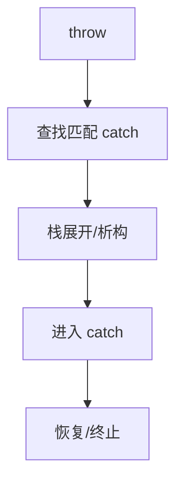

# 异常处理

> 适用范围：单一主题（一个概念/机制/模块），保持可复用、可检索。

## 写作约束（铁律）

- **原内容一字不删**：所有原有文字、代码、注释、图片必须全部保留，禁止删除任何原内容。
- **只做归纳重组+增加**：在原有内容基础上调整结构、归类，新增内容以"补充"标记。新增量须让最终篇幅 ≥ 原版。
- **放不进的进附录**：六大段模板容纳不下的原内容，移入最后的「附录」章节，不得丢弃。
- **动笔前先搜索**：做相关知识准备；源码要贴原始代码，有需要可贴汇编。
- **字数硬指标**：详细解析(二)≥200字、进阶应用(四)≥500字、源码解析与实践感悟(五)≥1000字、面试准备(六)高频问法≥8个且带回答，反问点和一句话答案各≥5个。
- 先结论后细节，避免长段堆砌。
- 每节至少 3 条要点。
- 代码必须可运行或可推导，配清楚输入/输出或预期。
- **代码块必须标注语言**：所有代码块必须根据实际语言标注，C++ 代码用 `c++`（不可用 `cpp` 或 `c`），Python 用 `python`，汇编用 `asm`/`x86asm`，shell 用 `bash` 等。禁止无语言标注的裸代码块。
- 图示统一放在 `资源/图片/`，文内使用相对路径引用。
- 有流程的用流程图或其他类型的图。

## 一、核心概念

- 定义：异常是运行期错误处理机制，通过 `try/catch/throw` 配合栈展开实现。
- 关键词：RAII、栈展开、异常安全等级、`noexcept`、强/基本保证。
- 适用场景/边界：适用于“异常路径低概率且需要穿透多层调用栈”的场景；**补充**：在实时系统或性能极端敏感路径常用错误码替代。

## 二、详细解析（≥200字）

- **原理拆解（三层递进）**：
  - 第一层：基本工作原理（配流程图/序列图展示核心流程）
  - 第二层：关键步骤详解（每步展开子步骤）
  - 第三层：底层机制（编译器实现、运行时行为、内存布局影响）
- 关键数据结构/接口：
- 关键公式/复杂度：

**补充**：异常机制的核心是“栈展开”。当 `throw` 发生时，运行期在栈上查找匹配的 `catch`，同时按作用域逆序调用已构造对象的析构函数，保证资源释放。这与 RAII 天然契合，因此 C++ 中强烈建议通过对象生命周期管理资源，而不是在 `catch` 中做清理。异常安全等级分为基本保证（无资源泄漏）、强保证（事务回滚）、不抛保证（`noexcept`）。编译器会为异常生成额外表结构（例如 DWARF 的 LSDA），并在 `noexcept` 违反时调用 `std::terminate`。这一机制让异常路径成本集中在“抛出与栈展开”，正常路径开销通常可优化为较低。



## 三、动手实践（代码案例）

```c++
#include <iostream>
#include <stdexcept>

struct Guard {
    ~Guard() noexcept { std::cout << "cleanup\n"; }
};

int main() {
    try {
        Guard g;
        throw std::runtime_error("fail");
    } catch (const std::exception& e) {
        std::cout << e.what() << "\n";
    }
    return 0;
}
```

- 预期输出：`cleanup` 然后 `fail`。
- **补充**：验证栈展开时析构一定发生。
- **补充**：将析构函数改为可能抛异常会触发 `std::terminate`。

## 四、进阶应用（≥500字）

- 与其他主题的关联：
- 工程中的真实用法（大型项目案例、实际使用模式）：
- 常见优化策略：
  - 算法层面：选择更优算法
  - 数据结构：使用缓存友好结构
  - 内存访问：优化数据局部性
  - 并发处理：利用并行计算
  - 具体技巧：预计算与缓存、批处理减少开销、SIMD、避免虚函数调用等

**补充**：工程中的异常实践通常遵循“底层抛异常、中层转换语义、顶层统一捕获”。底层（资源与IO）可以直接抛异常，因为异常最能表达“错误不可忽略”；中层（业务）捕获底层异常并转换为业务语义异常；顶层统一捕获并决定重试、降级或终止。与此配套的关键是异常安全等级设计：数据库事务、文件操作常需强保证（失败回滚），缓存更新可满足基本保证，析构与移动操作必须 `noexcept`。

**补充**：在性能层面，异常在“未抛出路径”可以做到接近零开销，但在“抛出路径”代价较高。实战中应避免使用异常作为控制流（如循环中频繁 throw/catch）。对于可预期的错误（如用户输入验证失败），更适合使用错误码或 `std::expected`；对于不可预期的错误（如系统调用失败），异常更合适。异常与并发结合时要注意：跨线程抛异常不可行，通常通过 `std::exception_ptr` 在工作线程捕获并传递到主线程再抛出或处理。

**补充**：异常与资源管理结合的最佳实践是 RAII。所有资源（内存、文件、socket、锁）应包装成对象，构造时获取资源，析构时释放资源。这样即使异常发生，资源也能自动释放。对于“部分构造”场景，已构造成员会被析构，未构造成员不会被触及，这也是构造函数允许抛异常的重要理由。工程中常见的错误是“析构函数抛异常”，它会在栈展开期间触发 `std::terminate`，因此析构函数必须 `noexcept`。

## 五、源码解析和实践感悟（≥1000字）

- 关键实现路径（贴源码、必要时贴汇编）：
- 难点与易错点（陷阱案例 + 深度剖析）：
- 经验总结（补充）：

**补充**：从编译器实现看，异常机制依赖两类结构：一类是“异常表”（描述可捕获的类型与处理位置），另一类是“清理表”（描述栈展开时需要调用的析构）。当 `throw` 发生时，运行期执行一次“二阶段展开”：第一阶段搜索匹配的 catch（不执行析构），第二阶段展开并执行析构，最后进入 catch。这个机制保证了异常路径的正确性，但也解释了为什么异常抛出成本较高。

**补充**：异常安全的核心难点是“部分完成”。例如容器插入时已修改一部分状态，若抛异常则状态可能不一致。为了实现强保证，常用“copy-and-swap”或事务式对象（先复制、成功后交换）。对于大型对象，这会引入额外的拷贝成本，因此需要衡量强保证与性能之间的取舍。实践中，通常对核心数据结构要求强保证，对外围逻辑允许基本保证。

**补充**：`noexcept` 的语义不仅是“我不会抛异常”，还影响标准库行为。例如 `std::vector` 在扩容时优先使用 `noexcept` 的移动构造，否则回退到拷贝构造。若你的类型移动构造没有 `noexcept`，会导致性能退化。工程实践中必须为移动构造与 swap 明确加上 `noexcept`，并确保实现确实不抛异常。

**补充**：异常与日志/监控的结合也需要策略。过度 catch 并吞掉异常会掩盖问题，过度抛出会造成上层逻辑难以处理。常见实践是在中层捕获并包装异常，保留原始异常信息（如 `std::nested_exception`），在顶层统一记录日志。对于跨模块边界的异常传播，尤其是跨动态库或 ABI 边界，应尽量避免抛出自定义类型，改为抛 `std::exception` 或在边界处转换为错误码。

**补充**：异常在多线程中的难点是“传播路径”断裂。线程内抛出的异常不会自动跨线程传递，因此常用 `std::exception_ptr` 捕获异常并传回主线程。配合 `std::future`/`std::promise`，可以把异常封装在 future 中，由调用者在 `get()` 时重新抛出。实践经验是：线程边界是异常边界，不应跨线程直接抛出。

**补充**：最后的实践感悟是：异常是 C++ 运行期机制中最适合表达“不应忽略的错误”的工具。它与 RAII 结合能实现最少的错误处理代码，但必须遵循一致的工程规范。规范包括：1) 析构函数禁止抛异常；2) 业务层异常类型必须语义化；3) 顶层统一捕获并记录；4) 对性能敏感路径使用错误码或 `expected` 替代异常。只有这样，异常机制才能既安全又可控。

## 六、面试准备（高频问法≥10个，反问点/一句话答案≥5个，均带回答）

### 6.1 高频问法（≥10个）

Q1：异常的核心语义是什么？

A：跨越调用栈的错误传播机制，自动触发栈展开与析构。

Q2：异常安全等级有哪些？

A：基本保证、强保证、不抛保证。

Q3：为什么析构函数要 `noexcept`？

A：栈展开期间再抛异常会导致 `std::terminate`。

Q4：RAII 与异常有什么关系？

A：RAII 保证异常路径下自动释放资源。

Q5：异常与错误码如何取舍？

A：不可恢复/不应忽略用异常，可预期错误用错误码。

Q6：`noexcept` 对性能有什么影响？

A：影响标准库选择移动构造，减少回退到拷贝。

Q7：跨线程异常如何处理？

A：捕获为 `std::exception_ptr` 并在主线程重新抛出或处理。

Q8：异常如何影响控制流？

A：跳过后续语句并进入匹配 catch。

Q9：异常表与栈展开表的作用？

A：描述 catch 匹配与析构调用路径。

Q10：`noexcept` 承诺被打破会怎样？

A：程序调用 `std::terminate` 终止。

### 6.2 反问点/陷阱点（≥5个）

- 反问：团队是否统一异常类型与错误码边界？
- 反问：是否允许在性能关键路径使用异常？
- 反问：移动构造与 swap 是否统一标注 `noexcept`？
- 陷阱：在析构函数抛异常导致终止。
- 陷阱：用异常做正常控制流（如循环中 throw/catch）。

### 6.3 一句话答案（≥5个）

- 异常是跨栈错误传播机制。
- 栈展开自动触发析构。
- `noexcept` 是强约束，不能随便写。
- RAII 让异常安全变简单。
- 线程边界就是异常边界。

## 附录（模板外原内容收纳）

> 以下为原笔记中不直接适配六大段结构、但仍有价值的内容，原样保留于此。

# 异常处理

<https://www.open-std.org/jtc1/sc22/wg21/docs/papers/2022/p2544r0.html>

<https://www.zhihu.com/search?type=content&q=C%2B%2B%E4%B8%AD%E5%BC%82%E5%B8%B8>

### **C++ 异常处理总结**


---

#### **1. 核心概念与语法**

* try`/`catch`/`throw：基础异常处理语法。

```
try {
  throw std::runtime_error("Error");
} catch (const std::exception& e) {
  std::cerr << e.what();
}
```

* **异常类型**：所有类型均可抛出，但建议继承 `std::exception`。
* **栈展开**：抛出异常时，逐层析构局部对象（RAII 核心机制）。

---

#### **2. 异常安全设计原则**

* **RAII（资源获取即初始化）**：  
  资源生命周期绑定对象，确保异常发生时自动释放。  
  **示例**：智能指针（`std::unique_ptr`）、自定义资源类（文件句柄、数据库连接）。

```
class FileRAII {
public:
    FileRAII(const char* path) : file(fopen(path, "r")) {
        if (!file) throw std::runtime_error("Open failed");
    }
    ~FileRAII() { if (file) fclose(file); }
private:
    FILE* file;
};
```

* **异常安全等级**：

+ **基本保证**：失败后程序状态合法（无泄漏）。
+ **强保证**：失败后状态回滚到操作前（事务语义）。
+ **不抛保证**：函数声明 `noexcept`，绝不抛出异常。

---

#### **3. 关键场景与最佳实践**

* **构造函数**：允许抛出异常，表示对象构造失败。

```
class DatabaseConnection {
public:
    DatabaseConnection(const std::string& url) {
        if (!connect(url)) throw ConnectionException(url);
    }
};
```

* **析构函数**：禁止抛出异常（用 `noexcept` 修饰）。

```
class SafeResource {
public:
    ~SafeResource() noexcept {
        // 仅记录日志，不抛出异常
    }
};
```

* **移动/拷贝操作**：优先声明 `noexcept`，确保性能（如 `std::vector` 扩容）。

---

#### **4. 复杂场景处理**

* **TCP 通信**：连接失败时抛异常，RAII 管理 Socket。

```
class TCPSocket {
public:
    TCPSocket(const std::string& ip, int port) {
        // 连接失败抛异常
    }
    ~TCPSocket() noexcept { closesocket(fd); }
};
```

* **数据库事务**：事务对象在析构时自动回滚。

```
class Transaction {
public:
    Transaction(Database& db) : db(db) { db.begin(); }
    ~Transaction() noexcept { if (!committed) db.rollback(); }
    void commit() { db.commit(); committed = true; }
private:
    Database& db;
    bool committed = false;
};
```

---

#### **5. 分层架构中的异常处理**

* **底层（资源层）**：直接抛异常，RAII 管理资源。
* 中层（业务逻辑）：捕获底层异常，转换为业务语义异常。

```
try {
    processOrder();
} catch (const DatabaseException& e) {
    throw OrderException("Order failed: " + e.message());
}
```

顶层（控制层）：集中捕获异常，决定重试/降级/终止。

```
int main() {
    try {
        runApplication();
    } catch (const std::exception& e) {
        logFatalError(e.what());
        return EXIT_FAILURE;
    }
}
```

### 栈展开

**栈展开"指的是在运行时从函数调用栈中移除一条函数的过程。进行栈展开时，被移除的函数的局部变量将以和创建它们时相反的顺序被逐个销毁。**

当异常发生时，C++ 会执行以下流程：

1. 程序跳过当前函数中异常之后的代码
2. 依次调用作用域内栈上对象的析构函数
3. 向上传播异常直到被 `catch` 捕获

[C++ 异常中的栈展开（Stack Unwinding）与对象析构（GeeksForGeeks 译文）](https://zhuanlan.zhihu.com/p/602700747)

### 异常安全性（Exception Safety）

C++ 中函数按异常安全性可分为四个级别：

#### 7.1 不安全（No Guarantee）

函数可能抛出异常，且对象状态不可预测，容易造成资源泄漏。

#### 7.2 基本保证（Basic Guarantee）

即使发生异常，程序保持有效状态，不泄漏资源。

#### 7.3 强保证 (Strong Guarantee)

操作失败时，原始对象保持完全不变（事务式）。

#### 7.4 不抛异常（No-throw Guarantee）

函数保证永远不会抛出异常（如 `swap()`、析构函数）

建议所有析构函数和移动操作声明为 `noexcept`。

析构函数应为 `noexcept`，否则若在栈展开过程中再次抛异常，程序将直接调用 `std::terminate()` 终止运行。

移动操作的核心理念是**资源所有权转移**，而不是资源复制。这种操作应该是廉价、高效且安全的

[在Exception的影响下，如何才能写出更高质量的C++代码？-腾讯云开发者社区-腾讯云](https://cloud.tencent.com/developer/article/1859151)

---

### **C++ 代码架构设计与业务实现的异常处理实践**

---

#### **一、分层架构设计与异常处理职责划分**

在大型项目中，代码通常按 **分层架构** 组织，每层的异常处理职责不同：

|  |  |  |
| --- | --- | --- |
| 层级 | 职责 | 异常处理策略 |
| **接口层** | 接收外部请求（HTTP/RPC等） | 捕获所有异常，转换为HTTP状态码/错误消息 |
| **业务逻辑层** | 实现核心业务流程 | 捕获底层异常，抛业务语义异常 |
| **数据访问层** | 数据库、缓存、文件操作 | 抛出技术异常（如 `DBException`） |
| **工具层** | 通用工具（日志、网络、加密） | 不处理业务异常，仅传递或记录日志 |

---

#### **二、核心设计原则**

1. **RAII 资源管理**：所有资源（内存、文件、网络连接）必须封装为对象。
2. **异常安全等级声明**：每个函数明确其异常安全等级（基本/强/不抛）。
3. **语义化异常类型**：自定义异常类，区分技术错误与业务错误。
4. **跨层异常转换**：底层技术异常转换为上层业务异常。
5. **集中异常处理**：在顶层统一处理未捕获异常（如记录日志、优雅退出）。

---

#### **三、模块化设计示例：订单处理系统**

##### **1. 数据访问层：数据库操作**

```
class OrderDAO {
public:
    // 强异常安全保证：失败时数据不变
    void saveOrder(const Order& order) {
        DatabaseTransaction tx(db_); // RAII 事务管理
        try {
            db_.execute("INSERT INTO orders ..."); // 可能抛 DBException
            tx.commit();
        } catch (const DBException&) {
            throw; // 重新抛出，由上层处理
        }
    }

private:
    Database& db_;
};
```

##### **2. 业务逻辑层：订单处理**

```
class OrderService {
public:
    void processOrder(const Order& order) {
        try {
            inventory_.lockItem(order.item_id); // 可能抛 InventoryException
            payment_.charge(order.amount);       // 可能抛 PaymentException
            dao_.saveOrder(order);               // 可能抛 DBException
        } catch (...) {
            inventory_.unlockItem(order.item_id); // 回滚库存
            throw OrderException("Order processing failed"); // 转换为业务异常
        }
    }

private:
    InventoryService& inventory_;
    PaymentService& payment_;
    OrderDAO& dao_;
};
```

##### **3. 接口层：HTTP 请求处理**

```
class OrderController {
public:
    HttpResponse handleRequest(const HttpRequest& req) {
        try {
            Order order = parseOrder(req.body()); // 可能抛 InvalidRequestException
            service_.processOrder(order);
            return HttpResponse(200, "OK");
        } catch (const OrderException& e) {
            return HttpResponse(500, e.what()); // 业务异常 -> 500
        } catch (const InvalidRequestException& e) {
            return HttpResponse(400, e.what()); // 输入错误 -> 400
        } catch (...) {
            logger_.error("Unknown error");
            return HttpResponse(500, "Internal Error");
        }
    }

private:
    OrderService& service_;
    Logger& logger_;
};
```

---

#### **四、关键技术点实现**

##### **1. 自定义异常类设计**

```
class BusinessException : public std::runtime_error {
public:
    BusinessException(const std::string& msg, int code)
        : std::runtime_error(msg), error_code(code) {}

    int getCode() const noexcept { return error_code; }

private:
    int error_code;
};

class OrderException : public BusinessException {
public:
    OrderException(const std::string& msg)
        : BusinessException(msg, 1001) {} // 业务错误代码
};
```

##### **2. RAII 资源管理封装**

```
class SafeSocket {
public:
    explicit SafeSocket(const std::string& ip, int port) {
        sock_ = createSocket(); // 可能抛 NetworkException
        connect(sock_, ip, port);
    }

    ~SafeSocket() noexcept {
        if (sock_ != INVALID_SOCKET) {
            closeSocket(sock_); // 保证不抛异常
        }
    }

    void send(const std::string& data) {
        if (::send(sock_, data.data(), data.size(), 0) < 0) {
            throw NetworkException("Send failed");
        }
    }

private:
    SOCKET sock_ = INVALID_SOCKET;
};
```

##### **3. 异常安全接口设计**

```
class ImageProcessor {
public:
    // 强异常安全保证：失败时原始图像不变
    void applyFilter(Image& img, const Filter& filter) {
        Image backup = img.clone(); // 先复制数据
        try {
            filter.applyTo(img);    // 可能抛 FilterException
        } catch (...) {
            img.swap(backup);       // 恢复原始状态
            throw;
        }
    }
};
```

---

#### **五、分布式系统增强设计**

##### **1. 重试策略（Retry Policy）**

```
template <typename Func, typename... Args>
auto retry(int maxAttempts, Func&& func, Args&&... args) {
    for (int i = 0; i < maxAttempts; ++i) {
        try {
            return func(std::forward<Args>(args)...);
        } catch (const RetryableException& e) {
            if (i == maxAttempts - 1) throw;
            std::this_thread::sleep_for(backoffDelay(i));
        }
    }
    throw std::logic_error("Unreachable");
}

// 使用示例
auto result = retry(3, &PaymentService::charge, payment, 100.0);
```

##### **2. 熔断器模式（Circuit Breaker）**

```
class CircuitBreaker {
public:
    template <typename Func>
    auto execute(Func&& func) {
        if (state_ == State::OPEN) {
            throw CircuitOpenException();
        }

        try {
            auto result = func();
            resetFailureCount();
            return result;
        } catch (...) {
            recordFailure();
            throw;
        }
    }

private:
    enum class State { CLOSED, OPEN };
    State state_ = State::CLOSED;
    int failureCount_ = 0;
