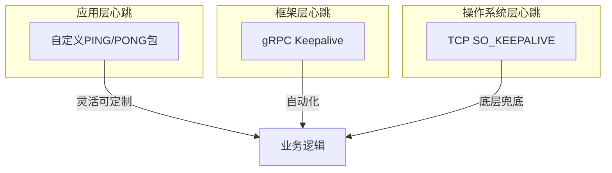

# 心跳检测与Keepalive机制

> 适用范围：TCP长连接心跳检测机制、gRPC Keepalive配置、应用层心跳包实现、SO_KEEPALIVE套接字选项分析。

## 写作约束（铁律）

- **原内容一字不删**：所有原有文字、代码、注释、图片必须全部保留，禁止删除任何原内容。
- **只做归纳重组+增加**：在原有内容基础上调整结构、归类，新增内容以"补充"标记。新增量须让最终篇幅 ≥ 原版。
- **放不进的进附录**：六大段模板容纳不下的原内容，移入最后的「附录」章节，不得丢弃。
- **动笔前先搜索**：做相关知识准备；源码要贴原始代码，有需要可贴汇编。
- **字数硬指标**：详细解析(二)≥200字、进阶应用(四)≥500字、源码解析与实践感悟(五)≥1000字、面试准备(六)高频问法≥8个且带回答，反问点和一句话答案各≥5个。
- 先结论后细节，避免长段堆砌。
- 每节至少 3 条要点。
- 代码必须可运行或可推导，配清楚输入/输出或预期。
- **代码块必须标注语言**：所有代码块必须根据实际语言标注，C++ 代码用 `c++`（不可用 `cpp` 或 `c`），Python 用 `python`，汇编用 `asm`/`x86asm`，shell 用 `bash` 等。禁止无语言标注的裸代码块。

## 一、项目/模块概述

- **模块定位**：心跳检测是TCP长连接系统中用于检测连接存活、清理僵尸连接、保证连接池可用的核心机制。IM项目的ChatServer、MySQL连接池、Redis连接池均依赖心跳检测。
- **技术栈与依赖**：TCP SO_KEEPALIVE（操作系统层）、gRPC Keepalive（应用层）、应用层自定义心跳包（PING/PONG）、WebSocket心跳
- **模块边界**：
  - 输入：定时器触发、socket事件
  - 输出：连接状态变更（存活/断开）、触发重连或清理
  - 上下游：CSession ↔ CServer、客户端TcpMgr ↔ ChatServer

## 二、架构设计（≥200字）

### 第一层：心跳机制的三层架构



### 第二层：僵尸连接问题

在网络情况下，会出现各种各样的中断：
- 有些是网络不稳定或者客户端主动断开连接，这种服务器是可以检测到的
- PC拔掉网线、客户端突然崩溃，有时候服务器会检测不到断开连接，那么你这个用户就相当于**僵尸连接**
- 当服务器有太多僵尸连接就会造成服务器性能的损耗

另外心跳还有一个作用：保证连接持续可用。比如MySQL、Redis这种连接池，如果不设计心跳，时间过长没有访问的时候连接会自动断开。

### 第三层：三层心跳的取舍

- **TCP SO_KEEPALIVE**：内核级实现，无需应用层代码，但默认检测时间极长（2小时），且无法区分"对端进程崩溃"和"对端主机宕机"
- **gRPC Keepalive**：框架内置，配置简单，适合gRPC服务间通信
- **应用层心跳**：最灵活，可携带业务数据（如在线状态），但需要自己实现定时器和超时判断

IM项目中三者结合使用：TCP层用SO_KEEPALIVE兜底，gRPC用Keepalive维护服务间连接，应用层TCP长连接用自定义心跳包。

## 三、核心实现（代码走读）

### 3.1 应用层自定义心跳包

由应用程序自己发送心跳包来检测连接是否正常，服务器每隔一定时间向客户端发送一个短小的数据包，然后启动一个线程，在线程中不断检测客户端的回应，如果在一定时间内没有收到客户端的回应，即认为客户端已经掉线；同样，如果客户端在一定时间内没有收到服务器的心跳包，则认为连接不可用。

**设计思路**：定义一个时间，检测线程，每隔多久检测一次，一分钟没有操作，我就主动发一个简单请求，告诉服务器。

### 3.2 使用SO_KEEPALIVE套接字选项

在TCP的机制里面，本身是存在有心跳包的机制的，也就是TCP的选项。不论是服务端还是客户端，一方开启KeepAlive功能后，就会自动在规定时间内向对方发送心跳包，而另一方在收到心跳包后就会自动回复，以告诉对方我仍然在线。

```c++
// 函数原型
int setsockopt(int sock,           // 将要被设置选项的套接字
               int level,          // 选项所在的协议层
               int optname,        // 需要访问的选项名
               const void *optval, // 指向包含新选项值得缓冲
               socklen_t optlen)   // 现选项的长度
// 返回值：成功返回0；失败返回-1
```

**TCP KeepAlive参数配置**（FreeRTOS嵌入式示例）：

```c++
static void vTcpKeepaliveTask(void){
  int cfd, n, i, ret;
  struct sockaddr_in server_addr;
  int so_keepalive_val = 1;
  int tcp_keepalive_idle = 3;    // 空闲3秒开始探测
  int tcp_keepalive_intvl = 3;   // 探测间隔3秒
  int tcp_keepalive_cnt = 3;     // 最多3次探测
  int tcp_nodelay = 1;

again:
  cfd = Socket(AF_INET, SOCK_STREAM, 0);
  // 使能socket层的心跳检测
  setsockopt(cfd, SOL_SOCKET, SO_KEEPALIVE, &so_keepalive_val, sizeof(int));

  server_addr.sin_family = AF_INET;
  server_addr.sin_port = htons(SERVER_PORT);
  server_addr.sin_addr.s_addr = inet_addr(SERVER_IP);
  // 连接到服务器（connect是阻塞接口，内部完成TCP三次握手）
  ret = Connect(cfd, (struct sockaddr*)&server_addr, sizeof(server_addr));
  if(ret < 0){
    vTaskDelay(100); // 100ms去连接一次服务器
    goto again;
  }
  // 配置心跳检测参数（默认参数时间很长）
  setsockopt(cfd, IPPROTO_TCP, TCP_KEEPIDLE, &tcp_keepalive_idle, sizeof(int));
  setsockopt(cfd, IPPROTO_TCP, TCP_KEEPINTVL, &tcp_keepalive_intvl, sizeof(int));
  setsockopt(cfd, IPPROTO_TCP, TCP_KEEPCNT, &tcp_keepalive_cnt, sizeof(int));
  setsockopt(cfd, IPPROTO_TCP, TCP_NODELAY, &tcp_nodelay, sizeof(int));
  printf("server is connect ok\r\n");

  while(1){
    n = Read(cfd, ReadBuff, BUFF_SIZE);
    if(n <= 0){
      goto again;
    }
    // 业务处理...
    for(i = 0; i < n; i++){
      ReadBuff[i] = toupper(ReadBuff[i]);
    }
    n = Write(cfd, ReadBuff, n);
    if(n <= 0){
      goto again;
    }
  }
}
```

### 3.3 gRPC Keepalive 心跳

**自动心跳检测**：客户端和服务端可配置 Keepalive 参数，定时发送 PING 帧检测连接活性。

```c++
grpc::ChannelArguments args;
args.SetInt(GRPC_ARG_KEEPALIVE_TIME_MS, 5000);    // 每5秒发送一次心跳
args.SetInt(GRPC_ARG_KEEPALIVE_TIMEOUT_MS, 1000); // 心跳响应超时1秒
auto channel = grpc::CreateCustomChannel("server:50051", creds, args);
```

**断线检测**：若心跳超时，gRPC 标记连接不可用，触发重连逻辑。

### 3.4 WebSocket心跳

```c++
// 客户端心跳
setInterval(() => {
    if (websocket.readyState === WebSocket.OPEN) {
        websocket.send(JSON.stringify({ type: "ping" }));
    }
}, 30000);
```

## 四、工程实践（≥500字）

### 心跳参数调优

**TCP KeepAlive默认参数问题**：
- `tcp_keepalive_time`（Linux）默认7200秒（2小时）——这意味着一个僵尸连接可能存活2小时才被清理
- `tcp_keepalive_intvl`默认75秒
- `tcp_keepalive_probes`默认9次

生产环境需调整为：
- idle: 60秒（1分钟无数据开始探测）
- intvl: 10秒（探测间隔）
- cnt: 3次（3次失败判定断开）
- 总计最长检测时间：60 + 10×3 = 90秒

### gRPC Keepalive最佳实践

```c++
// 推荐配置
args.SetInt(GRPC_ARG_KEEPALIVE_TIME_MS, 30000);       // 30秒心跳
args.SetInt(GRPC_ARG_KEEPALIVE_TIMEOUT_MS, 10000);    // 10秒超时
args.SetInt(GRPC_ARG_KEEPALIVE_PERMIT_WITHOUT_CALLS, 1); // 无RPC也发心跳
args.SetInt(GRPC_ARG_HTTP2_MAX_PINGS_WITHOUT_DATA, 0);   // 允许无限PING
```

### 连接池心跳检测

MySQL和Redis连接池需要心跳检测来维持连接：
- **MySQL**：`mysql_ping()` 或执行 `SELECT 1`
- **Redis**：`PING` 命令
- 检测间隔通常为30-60秒
- 检测到断开后自动重连并放回池中

### 常见优化策略

**自适应心跳间隔**：

| 状态 | 心跳间隔 | 原因 |
|------|---------|------|
| 前台活跃 | 30s | 确保消息实时可达 |
| 后台（WiFi） | 2min | WiFi NAT 超时较长 |
| 后台（移动网络） | 4min | 探测运营商 NAT 超时下限 |
| 后台（探测模式） | 逐步增加 | 30s → 1min → 2min → 4min，发现 NAT 超时后回退 |

- 网络稳定时：长间隔（如60s），减少带宽消耗
- 检测到网络波动时：缩短间隔（如10s），快速发现断开
- 移动端考虑省电：WiFi下30s，蜂窝网络下120s

### gRPC Keepalive与断线重连

gRPC 的 Keepalive 参数配合重连策略使用：
- **keepalive_time**：PING 帧间隔
- **keepalive_timeout**：等待 PING ACK 的超时
- **若超时**：gRPC 标记连接不可用，触发重连（指数退避）

gRPC 指数退避重连配置：

```c++
// 配置重连退避参数
args.SetInt(GRPC_ARG_MIN_RECONNECT_BACKOFF_MS, 1000);  // 最小 1 秒
args.SetInt(GRPC_ARG_MAX_RECONNECT_BACKOFF_MS, 60000); // 最大 60 秒
```

重试间隔：1s → 2s → 4s → 8s → 16s → ... → 60s（封顶）

**心跳与业务数据合并**：
- 如果最近N秒内有业务数据收发，可以跳过本次心跳
- 减少不必要的网络开销

## 五、源码解析和实践感悟（≥1000字）

### 关键实现路径

**SO_KEEPALIVE的底层原理**：

TCP KeepAlive是TCP协议栈的保活机制：
1. 连接空闲tcp_keepalive_time秒后，发送一个空的ACK探测包（不含数据）
2. 对端若存活：回复ACK，探测成功
3. 对端若已崩溃但主机存活：回复RST，连接重置
4. 对端主机宕机：无响应。等待tcp_keepalive_intvl秒后再发探测包，共发tcp_keepalive_probes次
5. 所有探测失败：关闭连接

关键限制：SO_KEEPALIVE只能检测对端操作系统是否存活，无法检测对端进程是否存活。对端进程崩溃但操作系统仍在运行的情况下，TCP协议栈会自动回复ACK，导致KeepAlive探测"成功"。

**gRPC Keepalive与HTTP/2 PING帧**：

gRPC的Keepalive基于HTTP/2的PING帧（不是TCP KeepAlive）：
- PING帧是HTTP/2控制帧，优先级高于数据帧
- 对端必须在收到PING后立即回复PING ACK
- 如果PING超时（GRPC_ARG_KEEPALIVE_TIMEOUT_MS），gRPC关闭连接并触发重连

相比TCP KeepAlive，gRPC Keepalive能检测到应用层问题（如gRPC服务hang住但TCP仍存活）。

**应用层心跳的必要性**：

尽管TCP和gRPC都提供了心跳机制，应用层心跳仍然必要：
1. 可携带业务数据（如在线状态、未读消息数）
2. 可区分"真断开"和"暂时无数据"
3. 可配合业务逻辑（如30s无操作提示用户"对方正在输入..."）
4. 调试友好：日志中可直接看到心跳收发记录

**连接池心跳的工程实践**：

```c++
// 连接池健康检查线程伪代码
void ConnectionPool::HealthCheckLoop() {
    while (!_stop) {
        sleep(30); // 每30秒检查一次
        
        std::lock_guard<std::mutex> lock(_mutex);
        auto it = _connections.begin();
        while (it != _connections.end()) {
            if (!it->Ping()) {  // 发送PING检测
                it->Reconnect(); // 重连或
                it = _connections.erase(it); // 移除
            } else {
                ++it;
            }
        }
    }
}
```

### 难点与易错点

1. **心跳间隔设置不当**：太短→增加网络开销和CPU消耗（数万连接每10s心跳会产生大量流量）；太长→僵尸连接存活太久占用资源。IM场景推荐30s。

2. **心跳超时判断的误判**：网络暂时抖动可能导致心跳超时，立即断开连接会导致用户频繁重连。解决方案：连续N次（如3次）超时才判定断开。

3. **移动端心跳的特殊性**：移动端在后台时系统可能限制网络活动（iOS的后台任务限制、Android的Doze模式）。需使用系统提供的后台保活机制（如VoIP推送、前台服务）。

4. **TCP KeepAlive的Linux内核参数**：修改`/proc/sys/net/ipv4/tcp_keepalive_*`是全局生效，影响所有TCP连接。建议通过setsockopt在单个socket上设置，避免影响其他服务。

### 经验总结（补充）

- **三层心跳各司其职**：TCP KeepAlive兜底（防止极端情况）、gRPC Keepalive维护服务间连接（自动化）、应用层心跳携带业务信息（灵活可控）。
- **心跳是双刃剑**：过多的心跳包会消耗带宽和CPU。对于低流量场景，建议用"按需心跳"：有业务数据时跳过心跳，仅在空闲时发送。
- **监控心跳失败率**：心跳失败率是网络健康状况的重要指标。突然升高的心跳失败率预示着网络问题或服务过载。

## 六、面试准备（高频问法≥10个，反问点/一句话答案≥5个，均带回答）

### 6.1 高频问法（≥10个）

**基础理解**：

Q1：什么是僵尸连接？为什么需要心跳检测？

A：客户端崩溃或网络中断但服务端未收到TCP断开通知的连接称为僵尸连接。它们占用文件描述符、内存等资源但不产生业务价值。心跳检测通过定期探测及时发现并清理僵尸连接。

Q2：TCP SO_KEEPALIVE和应用层心跳有什么区别？

A：TCP KeepAlive是内核级实现，自动发送空ACK探测包，但只能检测操作系统是否存活（无法检测进程崩溃）。应用层心跳由应用代码实现，更灵活，可携带业务数据，能检测进程级故障。

Q3：gRPC Keepalive的配置参数有哪些？

A：GRPC_ARG_KEEPALIVE_TIME_MS（心跳间隔）、GRPC_ARG_KEEPALIVE_TIMEOUT_MS（超时时间）、GRPC_ARG_KEEPALIVE_PERMIT_WITHOUT_CALLS（无RPC时也发心跳）、GRPC_ARG_HTTP2_MAX_PINGS_WITHOUT_DATA（限制PING次数）。

**原理深入**：

Q4：TCP KeepAlive探测失败后会发生什么？

A：内核发送探测包→无响应→等待intvl秒→再发→重复cnt次→全部失败后内核关闭连接，返回ETIMEDOUT错误给应用层。应用层可通过epoll的EPOLLERR/EPOLLHUP事件感知。

Q5：为什么gRPC Keepalive能检测到TCP KeepAlive检测不到的问题？

A：gRPC Keepalive基于HTTP/2 PING帧，要求对端gRPC服务主动回复PING ACK。如果gRPC服务进程hang（死锁/无限循环）但操作系统仍存活，TCP KeepAlive会成功（OS自动回复ACK），但gRPC Keepalive会超时（PING ACK需要应用层处理）。

Q6：心跳间隔和超时时间的最佳比例是多少？

A：业界惯例：超时时间 = 心跳间隔 × 3。例如心跳30s，超时90s。这样网络偶尔抖动1-2个心跳周期不会误判断开。移动端可适当放宽到×5。

**实践应用**：

Q7：连接池如何实现心跳检测保持连接活跃？

A：启动一个独立的健康检查线程，定时（如30s）遍历连接池中的所有连接，对空闲超过一定时间的连接发送PING命令（MySQL的`SELECT 1`、Redis的`PING`），检查响应。超时或失败则重连或移除。

Q8：如何处理心跳风暴（大量连接同时超时）？

A：1) 对超时判断加入随机抖动（如超时时间±5s），避免大量连接同时判定超时；2) 使用时间轮算法粒度化管理大量连接的心跳时间；3) 诊断：心跳风暴通常是网络问题，应检查网络设备。

Q9：移动端IM的心跳策略有哪些特殊考虑？

A：1) 前后台切换时调整心跳间隔（前台30s→后台120s）；2) 利用系统推送通道（APNs/FCM）作为心跳补充；3) Android使用前台服务保活，iOS使用VoIP推送；4) 最小化心跳包大小（几个字节即可）。

Q10：WebSocket连接需要额外的心跳吗？

A：需要。WebSocket协议本身有Ping/Pong帧，但浏览器JS API不直接暴露。通常需要在应用层实现自定义Ping/Pong消息。间隔30s是常见选择。

Q11：心跳检测失败后如何处理？

A：标记连接不可用 → 回收资源（close fd、清理状态）→ 触发断线重连逻辑（客户端）→ 更新连接状态（服务端如 StatusServer）。

Q12：连接池（MySQL/Redis）为什么需要心跳？

A：数据库/缓存连接池中，长时间无操作的连接可能被服务端主动断开（wait_timeout）。心跳定时发送简单查询（如 SELECT 1）保持连接活跃。

Q13：SO_KEEPALIVE 的三个关键参数是什么？

A：tcp_keepalive_time（空闲后开始探测时间）、tcp_keepalive_intvl（探测间隔）、tcp_keepalive_probes（探测次数）。默认值 7200s/75s/9 次——必须修改。

Q14：移动端心跳和 PC 端有什么不同？

A：移动端需考虑：1）运营商 NAT 超时更短 2）前后台切换自适应调整间隔 3）省电需求（后台减频）4）网络切换场景。

### 6.2 反问点/陷阱点（≥5个）

针对面试官的深度问题：

- 贵团队在处理海量长连接时，心跳检测的性能瓶颈在哪里？如何优化的？
- 有遇到过心跳机制误判导致的线上事故吗？如何改进的？
- 贵团队是使用TCP KeepAlive还是纯应用层心跳？选择依据是什么？

常见的陷阱问题：

- **陷阱问题1**：TCP KeepAlive的空闲时间设为3秒会有什么问题？ → 过于频繁的KeepAlive探测包会消耗不必要的带宽和CPU（每个连接每3秒一个ACK包）。数万连接×3s间隔可能产生几千个包/秒。通常至少设30-60秒。
- **陷阱问题2**：如果客户端和服务端同时发心跳PING，会有什么问题？ → 各自独立回复PONG即可，不会死锁。但双向心跳浪费资源。通常由一端主导（如客户端发PING，服务端回PONG）。
- **陷阱问题3**：心跳检测间隔越短越好吗？ → 不是。需要考虑功耗（移动端）、带宽（弱网环境）、服务端压力（大量连接的心跳处理）。需在检测及时性和资源消耗间权衡。

### 6.3 一句话答案（≥5个）

快速记忆要点：

- 心跳检测的核心目标是**及时发现并清理僵尸连接，同时保持长连接活跃**
- 三层心跳机制是**TCP KeepAlive（兜底）+ gRPC Keepalive（自动化）+ 应用层心跳（灵活）**
- 最佳心跳参数是**间隔30s + 超时90s（3倍间隔）**
- 避免的常见错误是**使用TCP KeepAlive的默认2小时间隔导致僵尸连接长期占用资源**
- 这个设计的最大优点是**多层保障不漏检**，最大代价是**心跳包占用带宽和CPU**

情景模拟答案：

- 当被问到"心跳检测的本质是什么"时，回答："心跳是在不可靠的网络上建立一个'超时即断'的简单判定模型，通过定期探测将不确定的连接状态转化为确定的存活/断开二态。"
- 当被问到"为什么不能用TCP自带的KeepAlive替代应用层心跳"时，回答："TCP KeepAlive只能检测OS级存活，无法检测进程级故障。而且默认2小时的检测间隔在生产环境完全不可用。"
- 当被问到"心跳检测失败的下一步做什么"时，回答："标记连接断开→清理Session→通知StatusServer→触发客户端重连→未推送的消息标记为离线消息。"

## 附录（模板外原内容收纳）

### 原笔记：为什么要设计心跳

在网络情况下，会出现各种各样的中断，有些是网络不稳定或者客户端主动断开连接，这种服务器是可以检测到的。但 PC 拔掉网线或者客户端突然崩溃，有时候服务器会检测不到断开连接，那么这个用户就相当于僵尸连接。当服务器有太多僵尸连接就会造成服务器性能的损耗。

另外心跳还有一个作用——保证连接持续可用。比如 MySQL、Redis 这种连接池，如果不设计心跳，时间过长没有访问的时候连接会自动断开。

### 原笔记：gRPC Keepalive 心跳

- 自动心跳检测：客户端和服务端可配置 Keepalive 参数，定时发送 PING 帧检测连接活性
- 断线检测：若心跳超时，gRPC 标记连接不可用，触发重连逻辑

### 原笔记：自动重连策略

**透明重连**：当 TCP 连接意外断开（如网络闪断），gRPC 客户端自动尝试重建连接，对上层业务透明。适用场景：短时间网络波动、服务器重启。

**指数退避**：初次重连立即尝试，后续重试间隔按指数增长（如 1s, 2s, 4s...），避免雪崩。

### 原笔记：应用层心跳 vs SO_KEEPALIVE

**应用层自己实现的心跳包**：由应用程序自己发送心跳包来检测连接是否正常。服务器每隔一定时间向客户端发送一个短小的数据包，然后启动一个线程在线程中不断检测客户端的回应。如果在一定时间内没有收到客户端的回应，即认为客户端已经掉线；同样，如果客户端在一定时间内没有收到服务器的心跳包，则认为连接不可用。

**使用 SO_KEEPALIVE 套接字选项**：在 TCP 的机制里面，本身是存在有心跳包的机制的，也就是 TCP 的选项。不论是服务端还是客户端，一方开启 KeepAlive 功能后，就会自动在规定时间内向对方发送心跳包，而另一方在收到心跳包后就会自动回复，以告诉对方我仍然在线。
