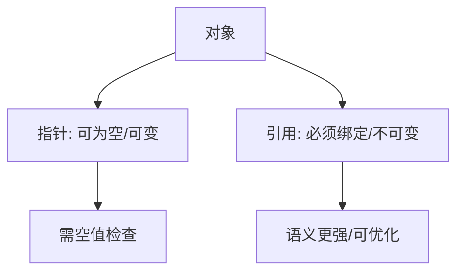

# 指针和引用

> 适用范围：单一主题（一个概念/机制/模块），保持可复用、可检索。

## 写作约束（铁律）

- **原内容一字不删**：所有原有文字、代码、注释、图片必须全部保留，禁止删除任何原内容。
- **只做归纳重组+增加**：在原有内容基础上调整结构、归类，新增内容以"补充"标记。新增量须让最终篇幅 ≥ 原版。
- **放不进的进附录**：六大段模板容纳不下的原内容，移入最后的「附录」章节，不得丢弃。
- **动笔前先搜索**：做相关知识准备；源码要贴原始代码，有需要可贴汇编。
- **字数硬指标**：详细解析(二)≥200字、进阶应用(四)≥500字、源码解析与实践感悟(五)≥1000字、面试准备(六)高频问法≥8个且带回答，反问点和一句话答案各≥5个。
- 先结论后细节，避免长段堆砌。
- 每节至少 3 条要点。
- 代码必须可运行或可推导，配清楚输入/输出或预期。
- **代码块必须标注语言**：所有代码块必须根据实际语言标注，C++ 代码用 `c++`（不可用 `cpp` 或 `c`），Python 用 `python`，汇编用 `asm`/`x86asm`，shell 用 `bash` 等。禁止无语言标注的裸代码块。
- 图示统一放在 `资源/图片/`，文内使用相对路径引用。
- 有流程的用流程图或其他类型的图。

## 一、核心概念

- 定义：指针是存储地址的对象，引用是别名语义；二者都用于间接访问对象。
- 关键词：解引用、空指针、悬垂、右值引用、移动语义、成员指针。
- 适用场景/边界：指针适合可为空/可重新绑定的场景，引用适合必须存在且不可空的绑定；**补充**：在所有权表达上优先使用智能指针或引用语义，避免裸指针持有资源。

## 二、详细解析（≥200字）

- **原理拆解（三层递进）**：
  - 第一层：基本工作原理（配流程图/序列图展示核心流程）
  - 第二层：关键步骤详解（每步展开子步骤）
  - 第三层：底层机制（编译器实现、运行时行为、内存布局影响）
- 关键数据结构/接口：
- 关键公式/复杂度：

**补充**：指针与引用的核心差异是语义层面的“可变性与可空性”。指针是一个独立对象，允许改变指向、为空或为无效地址，因此需要显式的空指针检查；引用则是对象的别名，必须在初始化时绑定且不可重新绑定，因此不需要空值检查。编译器通常将引用实现为指针，但在语言规则上，引用的语义更强，允许编译器进行优化（比如省略空指针检查）。右值引用引入后，引用系统还承担了“区分值类别”的职责，是移动语义与完美转发的基础。底层机制上，普通指针是地址值，成员指针通常表现为偏移量或带调整信息的结构体；引用在 ABI 上可能与指针相同，但在语义上更接近“隐式解引用”。



## 三、动手实践（代码案例）

```c++
#include <iostream>
#include <string>

void inc_ref(int& v) { v += 1; }
void inc_ptr(int* p) { if (p) { *p += 1; } }

int main() {
    int x = 10;
    int& r = x;
    int* p = &x;
    inc_ref(r);
    inc_ptr(p);
    std::cout << x << "\n"; // 12
    return 0;
}
```

- 预期输出：`12`。
- **补充**：引用不允许为空，指针需要显式检查。
- **补充**：对比 `const int&` 绑定临时对象的生命周期延长行为。

## 四、进阶应用（≥500字）

- 与其他主题的关联：
- 工程中的真实用法（大型项目案例、实际使用模式）：
- 常见优化策略：
  - 算法层面：选择更优算法
  - 数据结构：使用缓存友好结构
  - 内存访问：优化数据局部性
  - 并发处理：利用并行计算
  - 具体技巧：预计算与缓存、批处理减少开销、SIMD、避免虚函数调用等

**补充**：在工程实践中，指针与引用的选择直接影响 API 设计与错误处理方式。引用意味着“必有值”，适合表示必须存在的输入参数与返回值；指针表示“可为空”，常用于可选参数或可失败的查找结果。现代 C++ 更倾向于使用 `std::optional<T>` 表达“可缺省值”，而不是裸指针，但在性能敏感或 ABI 兼容场景，指针仍是最直接的表达方式。对于所有权语义，裸指针不应承担资源生命周期管理，应该用 `std::unique_ptr` 或 `std::shared_ptr` 作为所有权载体。

**补充**：右值引用与移动语义是性能优化的重要手段。通过 `T&&` 绑定临时对象，可以在资源管理类中实现“资源转移”，避免深拷贝。完美转发通过 `std::forward<T>` 保持参数值类别，从而避免不必要的拷贝或移动。实战中最常见的陷阱是把右值引用当作“可修改对象”的通用引用，导致调用点不符合预期；正确做法是使用转发引用（模板参数推导）并配合 `std::forward`。

**补充**：指针算术与内存布局是理解性能与安全的关键。指针加法基于 `sizeof(T)` 的偏移，因此只对数组元素合法；对非数组对象的指针加法是 UB。成员指针在多重继承下可能不是简单偏移，编译器会生成带调整信息的结构体，用于在运行期计算正确的成员地址。这也是为什么成员指针不能简单转换为 `void*`。

**补充**：在并发环境中，裸指针的使用更需要谨慎。悬垂指针与数据竞争往往难以定位，建议通过所有权模型（如 `shared_ptr`）或生命周期边界（如对象池）来保证对象存活期。对于跨线程共享对象，引用语义必须明确“谁拥有、谁释放”，否则引用失效会变成不可预测的崩溃。

## 五、源码解析和实践感悟（≥1000字）

- 关键实现路径（贴源码、必要时贴汇编）：
- 难点与易错点（陷阱案例 + 深度剖析）：
- 经验总结（补充）：

**补充**：从编译器实现视角看，指针与引用在机器层面通常都表现为地址值，但语义差异仍影响优化策略。比如引用不可为空，编译器可以假设引用一定有效，从而省略空指针检查并进行更多指令重排。这意味着“错误地把空指针转为引用”的行为属于 UB，会引发不可预期的优化后果。指针的空值语义虽然安全，但也意味着编译器无法做同样激进的优化，因此在性能关键路径中，引用更常见。

**补充**：成员指针是理解 C++ ABI 的重要部分。普通指针是绝对地址，而成员指针在单继承下通常是对象内偏移量；在多重继承或虚继承下，还可能需要额外的调整信息。调用 `obj.*mp` 或 `ptr->*mp` 时，编译器会生成“this 调整 + 偏移访问”的指令序列。这解释了为什么成员指针不能与普通函数指针混用，也解释了成员指针在模板中的类型推导复杂度。

**补充**：右值引用的“看似反直觉”规则是 C++ 学习中的一大难点。右值引用变量本身是左值，只有通过 `std::move` 才能重新转回右值。编译器在重载决议时使用值类别（lvalue/rvalue/xvalue/prvalue）进行选择，因此“函数重载 + 引用折叠”是实现完美转发的底层机制。理解引用折叠规则（`T& & -> T&`、`T& && -> T&`、`T&& & -> T&`、`T&& && -> T&&`）是写出安全泛型代码的关键。

**补充**：在实践中，引用与指针的错误使用会带来灾难性的后果。悬垂引用通常来自返回局部变量引用或绑定到临时对象后超出生命周期；悬垂指针常见于手动 `delete` 后仍保留旧指针。现代 C++ 推荐用智能指针表达所有权，用观察者指针（如 `observer_ptr` 或裸指针）表达非拥有关系，并在 API 文档中明确生命周期约束。对于跨模块接口，建议在文档中注明“引用在调用期间有效”或“指针需要调用方保证生命周期”。

**补充**：指针与引用与 const 的组合也是复杂源头。`const int*` 与 `int* const` 的语义差异在模板推导中尤为重要，错误的 const 会导致重载选择失败或意外拷贝。实践经验是：对输入参数使用 `const T&`，对输出参数使用 `T*` 或返回值；对可能为空的输入使用 `const T*` 并在函数体内进行空值检查。对于“必须存在”的输入则用引用，减少无意义的空指针分支。

**补充**：性能层面，指针与引用的区别通常属于常数级，但在极端路径里也会显著影响分支预测与指令数量。比如一个热循环中的指针解引用若每次都需要空指针检查，会产生额外分支；引用则允许编译器移除检查。但这种优化的前提是语义正确，若引用被错误地绑定到无效地址，编译器可能把代码优化到更难调试的状态。因此在优化前必须先保证语义正确。

**补充**：实践感悟可以归结为三条：第一，表达语义比追求性能更重要，指针与引用的选择应体现“可空性与所有权”；第二，右值引用与完美转发是模板库的核心技术，但必须与清晰的 API 设计配合，避免过度模板化；第三，在团队协作中，对指针与引用的使用规范应形成一致准则，避免在不同模块之间传递不明确的生命周期语义。

## 六、面试准备（高频问法≥10个，反问点/一句话答案≥5个，均带回答）

### 6.1 高频问法（≥10个）

Q1：指针和引用的本质区别？

A：指针是独立对象，可为空可重新绑定；引用是别名语义，必须绑定且不可为空。

Q2：为什么引用不能为空？

A：引用代表对象本身，语言设计上不允许“空对象”。

Q3：指针常量与常量指针区别？

A：`int* const p` 指针不可变，`const int* p` 指向内容不可变。

Q4：右值引用的主要用途？

A：支持移动语义与完美转发，减少拷贝开销。

Q5：为什么右值引用变量本身是左值？

A：任何有名字的对象都是左值，需用 `std::move` 转回右值。

Q6：指针运算的合法边界？

A：只对数组有效，越界或非数组对象的指针加法是 UB。

Q7：成员指针与普通指针差异？

A：成员指针通常存储偏移，需要对象上下文才能访问。

Q8：为什么函数参数常用引用？

A：语义明确为“必须存在”，且不需空指针检查。

Q9：空指针解引用的后果？

A：未定义行为，可能崩溃或触发编译器优化导致异常结果。

Q10：如何避免悬垂引用/指针？

A：使用智能指针管理所有权，避免返回局部变量引用，明确生命周期约束。

Q11：`void*` 能做什么？

A：仅作为无类型地址存储，使用前必须显式转换。

Q12：引用折叠规则有什么意义？

A：保证模板推导时值类别保持一致，实现完美转发。

### 6.2 反问点/陷阱点（≥5个）

- 反问：团队是否对“所有权/非所有权指针”有统一规范？
- 反问：是否禁止返回局部对象引用？如何在代码审查中保证？
- 反问：是否引入 `gsl::not_null` 或类似工具表达非空指针？
- 陷阱：把右值引用当作“可修改引用”而忽略值类别规则。
- 陷阱：把成员指针当作普通指针使用。

### 6.3 一句话答案（≥5个）

- 指针可为空，引用不可为空。
- 引用是别名语义，指针是地址对象。
- 右值引用为移动语义而生。
- 指针运算只对数组合法。
- 成员指针是偏移而非绝对地址。

## 附录（模板外原内容收纳）

> 以下为原笔记中不直接适配六大段结构、但仍有价值的内容，原样保留于此。

# 指针和引用

## 引用类型

### 定义

C++ 中的引用类型是一种复合类型，它是对另一个变量的别名。在C++中使用引用，可以让我们直接访问和操作另一个变量的内存地址，而不需要通过指针的解引用操作。引用在语法上比指针更简洁，且在许多情况下更安全。

### 特性

1. **必须初始化**：引用在创建时必须被初始化，它必须指向某个已存在的对象。
2. **一旦绑定，不可改变**：引用一旦被初始化后，它将一直保持与其初始对象的绑定，不能改变为另一个对象的引用。
3. **没有空引用**：引用必须指向某个对象，不能存在空引用。

### 注意事项

* 引用主要用于函数参数和返回值，以及类的成员变量等场景，以提供对原始数据的直接访问，从而提高程序的效率和可读性。
* 引用可以是`const`的，这表示你不能通过引用来修改它所指向的对象的值。
* 引用在内部实现上通常是通过指针来实现的，但它们在语法和用途上与指针有显著的不同。引用提供了更直观、更安全的访问方式。

## 左值引用和右值引用

在C++中，左值（`lvalue`）和右值（`rvalue`）是表达式的两种基本分类，它们决定了表达式的结果在内存中的位置和状态。左值通常指的是具有持久状态的对象，它们有明确的内存地址，可以被多次赋值。而右值通常是临时的、没有持久状态的值，它们通常没有内存地址，或者其内存地址在表达式结束后就变得无效。

C++11引入了右值引用（`rvalue reference`），用`T&&`表示，作为对左值引用（`lvalue reference`，用`T&`表示）的补充。这一特性极大地增强了C++的表达能力，特别是在资源管理和性能方面。

左值引用

左值引用是C++98就有的特性，它允许我们为已存在的对象创建一个别名。左值引用必须被初始化为一个左值，即一个具有持久状态的对象。

```c++
int a = 10;

int& b = a; // b是a的左值引用
```

### 右值引用

右值引用是C++11新增的特性，它允许我们为右值（即临时对象或即将被销毁的对象）创建一个引用。这样，我们就可以对右值进行更复杂的操作，比如移动语义（move semantics）。

```c++
int&& c = 20; // c是整数字面量20的右值引用（但这种情况不常见，通常用于函数参数或返回值）

std::string foo() {
    return std::string("Hello, World!"); // 返回的临时字符串是一个右值
}

std::string &&d = foo(); // d是foo()返回的临时字符串的右值引用
```

但请注意，直接绑定一个右值到右值引用（如`int&& c = 20;`）并不是右值引用的主要用途。右值引用的主要用途是作为函数参数（实现移动语义）和返回值（允许链式调用等）。

### 移动语义和完美转发

右值引用的引入主要是为了支持移动语义（move semantics），它允许我们在对象被销毁前“窃取”其资源（如动态分配的内存、文件句柄等），而不是进行深拷贝。这可以显著提高性能，特别是在处理大型对象或容器时。

完美转发（perfect forwarding）是另一个与右值引用相关的概念，它允许我们将参数原封不动地传递给另一个函数，无论是左值还是右值。这通过模板和`std::forward`函数实现。

## 指针基础

在C++中，指针是一种特殊的变量，它存储的是另一个变量的内存地址，而不是数据本身。通过使用指针，我们可以直接访问和操作内存中的数据。指针也叫做地址。

### 和引用的区别

指针（pointer）是“指向（point to）”另外一种类型的复合类型。与引用类似，指针也实现了对其他对象的间接访问。然而指针与引用相比又有很多不同点。

其一，指针本身就是一个对象，允许对指针赋值和拷贝，而且在指针的生命周期内它可以先后指向几个不同的对象。

其二，指针无须在定义时赋初值。和其他内置类型一样，在块作用域内定义的指针如果没有被初始化，也将拥有一个不确定的值。

### 指针值

指针的值（即地址）应属下列4种状态之一：

1.指向一个对象。

2.指向紧邻对象所占空间的下一个位置。

3.空指针，意味着指针没有指向任何对象。

4.无效指针，也就是上述情况之外的其他值。

### 利用指针访问对象

我们可以利用`*`(解引用操作符)获取指针所指向的对象的数据，写法如下

```c++
int ival = 42;
//p_int存放着ival的地址，或者说p_int是指向变量ival的指针
int * p_int = &ival;
```

###### 指针和引用的特点

1. 定义时需要指定类型：指针需要指定指向对象的类型，引用需要指向一个已有对象的类型。
2. 指针可以重新赋值并指向其他对象，而引用在被初始化后就不能再指向其它的对象。
3. 指针可以为空或无效（null），但是引用必须总是指向某个有效对象。
4. 指针可以被比较，而引用没有比较运算符。
5. 引用相当于指针的语法糖，它的声明和使用更为简便。


面试时如何回答：

1. 定义差异

"浅拷贝只复制对象本身（包括指针），不复制指针指向的数据。

深拷贝会复制对象和指针指向的所有数据。"

2. 问题识别

"浅拷贝可能导致多个对象共享同一资源，造成双重释放、数据竞争等问题。

深拷贝每个对象有自己的资源副本，更加安全。"

3. 实现方式

"在C++中，编译器默认生成浅拷贝。要实现深拷贝，需要手动实现：

拷贝构造函数、拷贝赋值运算符，在堆上分配新内存并复制数据。"

4. 现代实践

"现代C++中，我们可以用智能指针（unique_ptr, shared_ptr）来简化内存管理。

unique_ptr 不可拷贝但可移动，shared_ptr 支持共享所有权的浅拷贝。"

5. 设计原则

"遵循三/五法则：如果一个类需要管理资源，通常需要实现完整的拷贝控制成员。

优先考虑移动语义，避免不必要的深拷贝。"

6. 性能权衡

"深拷贝更安全但性能开销大。在适当场景可以用浅拷贝加引用计数（如shared_ptr），

或者使用写时复制（Copy-on-Write）技术优化。"

如何回答"移动语义解决的是什么"：

1. 核心问题

"移动语义解决的是不必要的深拷贝开销问题，特别是对于临时对象和大对象。"

2. 与深拷贝/浅拷贝的关系

"它不是深拷贝或浅拷贝的替代，而是第三种选择：

- 浅拷贝：共享所有权，危险

- 深拷贝：完全复制，安全但昂贵

- 移动语义：转移所有权，安全且高效"

3. 工作原理

"通过右值引用和移动构造函数，将资源从临时对象转移到新对象，

避免复制数据，只转移指针等内部资源。"

4. 应用场景

"主要用于：函数返回值优化、临时对象处理、容器操作优化等

需要传递资源所有权但不需保留原对象的场景。"

5. 现代C++实践

"现代C++中，重要的资源管理类都实现了移动语义，

结合RAII和智能指针，可以实现既安全又高效的代码。


## 五、源码解析和实践感悟

### 1. 指针在编译器中的表示

```c++
// 指针本质是内存地址的整数表示
int x = 42;
int* p = &x;  // 编译器: lea rax, [rbp-4]; mov [rbp-16], rax

// 指针运算等价于地址算术
// p + 1 → (char*)p + sizeof(T) * 1

// 成员指针的编译器转换
struct S { int a; };
int S::*mp = &S::a;  // 存储偏移量而非绝对地址
// obj.*mp → *(int*)((char*)&obj + mp_offset)
```

### 2. 引用的底层实现

```c++
// 引用在编译器内部就是指针（但语义不同）
void f(int& r) { r = 10; }
// 汇编等价于:
// void f(int* r) { *r = 10; }
// 编译后引用和指针生成相同的机器码

// 引用必须初始化，且不能为空（无须判空检查）
// 引用不能重新绑定（编译期约束，非运行时限制）
```

### 3. 左值/右值引用的实现差异

```c++
// 左值引用绑定具名对象
void g(int& x) {}   // x 是左值引用
// 右值引用绑定临时对象，暗示可安全移动
void h(int&& x) {}  // x 本身是左值（有名字）
// h 内部: x 可寻址，要用 move(x) 重新转右值
```

### 实践经验

1. **引用和指针在汇编层面等价**：都是地址传递，但引用语法更安全（不可为空、不可重新绑定）
2. **const 引用延长临时对象生命周期**：`const T& x = f()` 创建的临时对象存活到引用离开作用域
3. **指针运算只适用于数组**：非数组对象的指针+1 是 UB
4. **成员指针是偏移量**：`&C::member` 存储字节偏移，调用时基于 this 计算地址
5. **空指针解引用是 UB**：编译期可能消除后续的空指针检查代码

## 六、面试准备

### Q&A（10题）

**Q1: 指针和引用的本质区别？**
A: 指针是独立对象（存储地址），可以为空、可重新赋值；引用是别名（不占存储），必须初始化、不可重新绑定

**Q2: 为什么引用不能为空？**
A: 语义设计——引用代表对象本身，不存在"空对象"的概念

**Q3: 指针常量和常量指针的区别？**
A: `int* const p` 指针本身不可改（顶层 const），`const int* p` 指向内容不可改（底层 const），`const int* const p` 两者都不可改

**Q4: 为什么函数参数优先用引用而非指针？**
A: 引用语法更简洁（用 . 而非 ->）、保证非空、不可被重新绑定到其他对象

**Q5: 右值引用能绑定左值吗？**
A: 不能直接绑定，需要用 std::move 将左值显式转为右值引用

**Q6: 空指针在硬件层面是什么意思？**
A: 地址 0（或接近 0 的地址），通常被操作系统保护，访问触发 SIGSEGV

**Q7: this 指针是什么类型？**
A: `ClassName* const`（指向非常量的常量指针），const 成员函数中为 `const ClassName* const`

**Q8: void* 指针可以做什么？**
A: 存储任意类型的地址，但不能直接解引用或运算，使用前须 cast 回原类型

**Q9: 成员函数指针和普通函数指针的区别？**
A: 成员函数指针存储的是相对于类起始地址的偏移，调用时需提供对象指针/引用

**Q10: 悬垂引用是什么？**
A: 引用绑定的对象已被销毁，但仍通过引用访问——UB

### 陷阱与反问（5个）

1. **陷阱**：返回局部变量的引用→悬垂引用，编译器可能警告但不保证
2. **反问**：为什么智能指针不能代替所有裸指针？→ 智能指针有所有权语义，裸指针用于无所有权观察
3. **陷阱**：`int* p = nullptr; *p = 42`→UB，编译期可能优化掉这一行
4. **反问**：引用有大小吗？→ 标准不保证，但底层实现通常是指针大小（8 字节/64bit）
5. **陷阱**：`int&& x = 42; int& y = x`→合法，x 有名字即是左值

### 一句话答案（8个）

1. **指针**：存储地址的对象，sizeof 在 64 位为 8
2. **引用**：别名，底层通常是指针实现
3. **const 引用**：可绑定临时对象并延长其生命周期
4. **右值引用**：为移动语义而生的引用类型
5. **空指针**：nullptr，C++11 替代 NULL 宏
6. **指针运算**：`p+n` 偏移 `n*sizeof(T)` 字节
7. **成员指针**：编译期为偏移量，运行时为 this+偏移
8. **智能指针**：unique_ptr/shared_ptr/weak_ptr 自动管理所有权
