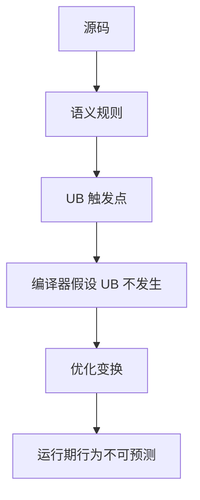

# 未定义行为（UB）

> 适用范围：单一主题（一个概念/机制/模块），保持可复用、可检索。

## 写作约束（铁律）

- **原内容一字不删**：所有原有文字、代码、注释、图片必须全部保留，禁止删除任何原内容。
- **只做归纳重组+增加**：在原有内容基础上调整结构、归类，新增内容以"补充"标记。新增量须让最终篇幅 ≥ 原版。
- **放不进的进附录**：六大段模板容纳不下的原内容，移入最后的「附录」章节，不得丢弃。
- **动笔前先搜索**：做相关知识准备；源码要贴原始代码，有需要可贴汇编。
- **字数硬指标**：详细解析(二)≥200字、进阶应用(四)≥500字、源码解析与实践感悟(五)≥1000字、面试准备(六)高频问法≥8个且带回答，反问点和一句话答案各≥5个。
- 先结论后细节，避免长段堆砌。
- 每节至少 3 条要点。
- 代码必须可运行或可推导，配清楚输入/输出或预期。
- **代码块必须标注语言**：所有代码块必须根据实际语言标注，C++ 代码用 `c++`（不可用 `cpp` 或 `c`），Python 用 `python`，汇编用 `asm`/`x86asm`，shell 用 `bash` 等。禁止无语言标注的裸代码块。
- 图示统一放在 `资源/图片/`，文内使用相对路径引用。
- 有流程的用流程图或其他类型的图。

## 一、核心概念

- 定义：未定义行为（Undefined Behavior，UB）是标准未规定结果的行为，编译器可自由假设其不会发生。
- 关键词：指针别名、越界、未初始化、无序求值、对齐、类型别名规则、`-fsanitize`。
- 适用场景/边界：理解 UB 是性能优化与安全边界的基础；**补充**：UB 不是“随机”，而是“编译器可以假设它不会发生”。

## 二、详细解析（≥200字）

- **原理拆解（三层递进）**：
  - 第一层：基本工作原理（配流程图/序列图展示核心流程）
  - 第二层：关键步骤详解（每步展开子步骤）
  - 第三层：底层机制（编译器实现、运行时行为、内存布局影响）
- 关键数据结构/接口：
- 关键公式/复杂度：

**补充**：UB 的本质不是“随机崩溃”，而是“标准放弃约束，让编译器能假设它不会发生”。编译器在优化阶段会基于这一假设做激进优化，例如：假设空指针不被解引用、假设有符号溢出不会发生、假设对象按其真实类型访问。这样可以减少分支、删除冗余检查、进行更大范围的指令重排。第一层理解是：UB 发生时程序行为不可预测，可能崩溃、可能错算、也可能“看似正常”。第二层理解是：很多 UB 来自语言规则的边界（别名、对齐、求值顺序、生命周期）。第三层理解是：UB 直接影响优化器的合法变换空间，错误的假设会让优化器删除你以为“有用”的代码。比如 `if (p) *p = 1;` 在编译器推断 p 绝不为空时，可能被重写为无条件写入。



## 三、动手实践（代码案例）

```c++
#include <iostream>

int main() {
    int* p = nullptr;
    if (p != nullptr) {
        *p = 1; // 永远不执行
    }
    std::cout << "ok" << "\n";
    return 0;
}
```

- 预期：输出 `ok`，程序安全。
- **补充**：把 `if (p != nullptr)` 改为 `if (&*p != nullptr)` 即引入 UB，编译器可能把判断优化掉。
- **补充**：使用 `-fsanitize=undefined` 可在运行期检测部分 UB。

## 四、进阶应用（≥500字）

- 与其他主题的关联：
- 工程中的真实用法（大型项目案例、实际使用模式）：
- 常见优化策略：
  - 算法层面：选择更优算法
  - 数据结构：使用缓存友好结构
  - 内存访问：优化数据局部性
  - 并发处理：利用并行计算
  - 具体技巧：预计算与缓存、批处理减少开销、SIMD、避免虚函数调用等

**补充**：UB 的治理是大型 C++ 工程的稳定性基础。首先要明确“高风险 UB 类别”：1) 空指针/悬垂指针解引用；2) 严格别名规则违反；3) 访问未初始化对象；4) 有符号整数溢出；5) 越界访问；6) 求值顺序未指定导致的多次修改。工程实践中，一条非常有效的策略是“在 debug/CI 中开启 sanitizers，在 release 中关闭”。例如使用 UBSan、ASan、TSan 捕获 UB、越界、数据竞争等问题。对于标准库容器，开启 `_GLIBCXX_DEBUG` 可在调试阶段捕获迭代器越界等 UB。

**补充**：从“编译器优化”角度看，UB 的存在让优化器能够移除很多检查。例如“有符号溢出不存在”的假设允许编译器把 `if (x + 1 > x)` 直接优化为 true，这在某些安全代码中会造成逻辑错误。实践上，如果你需要“溢出可控”的语义，应明确使用无符号类型，或用 `std::bit_cast`/`std::uint64_t` 与范围检查实现“定义良好的回环”。对于指针别名问题，应通过 `std::byte` 或 `memcpy` 做位级别访问，避免 `reinterpret_cast` 后直接按不同类型解引用。

**补充**：UB 还与并发密切相关。数据竞争在 C++ 内存模型中属于 UB，这意味着任何未同步的并发写读都可能导致编译器重排、寄存器缓存与“幽灵数据”。工程实践应使用 `std::atomic` 或锁来建立同步边界；对于性能敏感场景，必须清晰标注“只读共享”或“单线程写”。此外，对齐问题常在 SIMD 与自定义内存池中出现，错误对齐会触发 UB 或硬件异常。实践中应使用 `alignas` 或 `std::aligned_alloc` 来保证对齐。

**补充**：另一个高发 UB 场景是“生命周期”。例如返回局部变量引用、在对象析构后访问其成员、把 `this` 当作可为空指针等。这类问题在代码审查中需要明确的准则：不返回局部引用、不跨越生命周期边界保存指针、在 API 中清晰注明所有权与生命周期。结合工具链（静态分析 + ASan）可显著降低此类风险。

## 五、源码解析和实践感悟（≥1000字）

- 关键实现路径（贴源码、必要时贴汇编）：
- 难点与易错点（陷阱案例 + 深度剖析）：
- 经验总结（补充）：

**补充**：从优化器视角理解 UB 是最有效的“防错方法”。以空指针为例，标准允许编译器假设指针解引用时不为空，因此 `if (p == nullptr) return; *p = 1;` 在某些优化级别上可以被重写为 `*p = 1;`，因为若 `p` 为空则 UB，优化器可以认为该分支不可达。同样的逻辑也适用于 `this` 指针、引用对象等。理解这一点可以解释很多“奇怪的优化”与“只在 release 下崩”的问题。

**补充**：严格别名规则是 UB 的核心来源之一。编译器需要知道两个指针是否可能别名同一内存，以便进行向量化与重排。当你用 `reinterpret_cast<float*>(&i)` 访问 `int`，编译器有权认为这两个对象不会别名，从而导致读取错误。解决方案是使用 `std::byte`、`unsigned char` 或 `memcpy` 进行字节级访问。在 C++20 中 `std::bit_cast` 提供了更安全的位级转换方式，既保持定义行为，又能让编译器优化。

**补充**：求值顺序 UB 是另一个常被忽略的点。表达式如 `i = i++ + ++i;` 在语言层面是未定义的，因为对同一对象的多次修改没有序列点。编译器可以任意选择求值顺序，导致不可预测结果。现代 C++ 虽然在许多表达式上增强了顺序规则，但对“同一对象多次修改”的限制仍然存在。实践中应避免在一个表达式内多次修改同一对象，拆成多行能显著降低 UB 风险。

**补充**：有符号整数溢出在 C++ 中是 UB，这是性能与安全之间最具争议的选择之一。编译器依赖这一规则进行常量折叠与范围分析，从而生成更高效代码。若业务逻辑需要溢出语义，应使用无符号类型或显式的检查与转换。许多“安全漏洞”恰恰来自于开发者误以为有符号溢出是“回环”的。实践经验是：对涉及范围计算的代码，用 `std::int64_t` 或 `std::uint64_t` 提前扩大范围，并在边界处做断言。

**补充**：对齐 UB 常出现在自定义内存池、手工 SIMD 优化以及网络协议解析中。对于需要 16/32/64 字节对齐的类型，不能把 `malloc` 返回的指针直接强转为目标类型指针使用。应该使用 `std::aligned_alloc`、`posix_memalign` 或 `alignas` 保证对齐。同时要注意：对齐不满足时，即使在某些硬件上“看似可用”，也仍然是 UB，优化器仍然可以假设对齐正确并生成对齐指令。

**补充**：工具链治理是 UB 防控的核心。推荐的组合是：debug/CI 中开启 ASan/UBSan/TSan；GCC/Clang 下开启 `-Wall -Wextra -Werror`；标准库调试模式 `_GLIBCXX_DEBUG`；对性能敏感模块建立基准测试，确保在“修 UB”过程中不引入性能回退。静态分析工具（clang-tidy、cppcheck）也能提前发现可疑模式。重要的是团队要形成“发现 UB 即修”的文化，而不是“只要能跑就行”。

**补充**：实践感悟可以总结为三条：第一，UB 是性能的“代价”，在追求性能时必须明确其风险边界；第二，所有与指针、对齐、类型转换、求值顺序相关的代码都应被视为“高风险区”，优先写单元测试并加断言；第三，工程治理（规范 + 工具 + 测试）比个人经验更可靠，团队一致性比个人技巧更重要。

## 六、面试准备（高频问法≥10个，反问点/一句话答案≥5个，均带回答）

### 6.1 高频问法（≥10个）

Q1：什么是 UB？

A：标准未规定结果的行为，编译器可假设其不会发生并据此优化。

Q2：为什么空指针解引用是 UB？

A：标准允许编译器假设指针可解引用，空指针会破坏这一假设。

Q3：有符号整数溢出为什么是 UB？

A：编译器需要该假设进行优化与范围分析。

Q4：严格别名规则是什么？

A：对象应按其真实类型访问，除非例外类型（char/byte）。

Q5：如何安全做位级类型转换？

A：使用 `memcpy` 或 C++20 的 `std::bit_cast`。

Q6：数据竞争为何是 UB？

A：内存模型要求同步关系，否则编译器可任意重排。

Q7：求值顺序 UB 的典型例子？

A：同一表达式内多次修改同一对象（如 `i = i++ + ++i`）。

Q8：`this` 指针为什么不能为 null？

A：成员访问等价于解引用，空 `this` 属于 UB。

Q9：如何系统性降低 UB？

A：开启 sanitizers、标准库调试、静态分析并做代码规范治理。

Q10：UB 与未指定行为的差别？

A：未指定行为有若干合法结果，UB 则完全不受标准约束。

### 6.2 反问点/陷阱点（≥5个）

- 反问：团队是否默认启用 UBSan/ASan？
- 反问：在性能模块中如何平衡 UB 风险与优化收益？
- 反问：是否有统一的指针/对齐/别名规范？
- 陷阱：把未指定行为当作 UB（或反之）。
- 陷阱：认为“release 能跑就没 UB”。

### 6.3 一句话答案（≥5个）

- UB 是编译器的优化前提。
- 空指针解引用与有符号溢出是经典 UB。
- 别名规则决定能否安全 reinterpret_cast。
- Sanitizers 是 UB 治理的第一道防线。
- 不可依赖 UB 得到“稳定结果”。

## 附录（模板外原内容收纳）

> 以下为原笔记中不直接适配六大段结构、但仍有价值的内容，原样保留于此。

# 未定义行为（UB）

<https://zhuanlan.zhihu.com/p/2008244470429271918>

## 建议开启标准库的调试模式

可以帮助你监测未定义行为

* msvc: Debug 配置
* gcc: 定义 `_GLIBCXX_DEBUG` 宏

## 空指针类

### 不能解引用空指针（通常会产生崩溃，但也可能被优化产生奇怪的现象）

只要解引用就错了，无论是否读取或写入

```
int *p = nullptr;
*p;          // 错！
&*p;         // 错！
*p = 0;      // 错！
int i = *p;  // 错！
```

```
unique_ptr<int> p = nullptr;
p.get();     // 可以
&*p;         // 错！
```

例如在 Debug 配置的 MSVC STL 中，`&*p` 会产生断言异常，而 `p.get()` 不会。

```
if (&*p != nullptr) { // 可能被优化为 if (1)，因为未定义行为被排除了
}
if (p != nullptr) {   // 不会被优化，正常判断
}
```

### 不能解引用 end 迭代器

```
std::vector<int> v = {1, 2, 3, 4};
int *begin = &*v.begin();
int *end = &*v.end(); // 错！
```

```
std::vector<int> v = {};
int *begin = &*v.begin(); // 错!
int *end = &*v.end();     // 错！
```

建议改用 data 和 size

```
std::vector<int> v = {1, 2, 3, 4};
int *begin = v.data();
int *end = v.data() + v.size();
```

### this 指针不能为空

```
struct C {
    void print() {
        if (this == nullptr) { // 此分支可能会被优化为 if (0) { ... } 从而永不生效
            std::cout << "this 是空\n";
        }
    }
};

void func() {
    C *c = nullptr;
    c->print(); // 错！
}
```

### 空指针不能调用成员函数

```
struct C{
    void f() {}
    static void f2() {}
};

void func(){
    C* c = nullptr;
    c->f();  // 行为未定义
    c->f2(); // 行为未定义
}
```

本质上是因为**空指针解引用**。对于内建类型，表达式 `E1->E2` 与 `(*E1).E2` 严格等价，任何指针类型都是内建类型。

`c->f()`、`c->f2()` 等价于：

```
(*c).f();
(*c).f2();
```

## 指针别名类

### reinterpret_cast 后以不兼容的类型访问

```
int i;
float f = *(float *)&i; // 错！
```

例外：char、signed char、unsigned char 和 std::byte 总是兼容任何类型

```
int i;
char *buf = (char *)&i; // 可以
buf[0] = 1;             // 可以
```

uint8_t 是 unsigned char 的别名，所以也兼容任何类型

例外：int 和 unsigned int 互相兼容

```
int i;
unsigned int f = *(unsigned int *)&i; // 可以
```

例外：const int * 和 int * 互相兼容（二级指针强转）

```
const int *cp;
int *p = *(int **)&cp;  // 可以
```

注意：只取决于访问时的类型是否正确，中间可以转换为别的类型（如 void * 和 uintptr_t），只需最后访问时转换回正确的指针类型即可

```
int i;
*(int *)(uintptr_t)&i;  // 可以
*(int *)(void *)&i;  // 可以
*(int *)(float *)&i;  // 可以
```

### union 访问不是激活的成员

```
float bitCast(int i) {
    union {
        int i;
        float f;
    } u;
    u.i = i;
    return u.f; // 错！
}
```

特例：公共的前缀成员可以安全地访问

```
int foo(int i) {
    union {
        struct {
            int tag;
            int value;
        } m1;
        struct {
            int tag;
            float value;
        } m2;
    } u;
    u.m1.tag = i;
    return u.m2.tag; // 可以
}
```

如需在 float 和 int 之间按位转换，建议改用 memcpy，因为 memcpy 内部被认为是以 char 指针访问的，char 总是兼容任何类型

```
float bitCast(int i) {
    float f;
    memcpy(&f, &i, sizeof(i));
    return f;
}
```

或 C++20 的 `std::bit_cast`

```
float bitCast(int i) {
    float f = std::bit_cast<float>(i);
    return f;
}
```

### T 类型指针必须对齐到 alignof(T)

```
struct alignas(64) C { // 假设 alignof(int) 是 4
    int i;
    char c;
};

C *p = (C *)malloc(sizeof(C)); // 错！malloc 产生的指针只保证对齐到 max_align_t（GCC 上是 16 字节）大小，并不保证对齐到 C 所需的 64 字节
C *p = new C;  // 可以，new T 总是保证对齐到 alignof(T)
```

```
char buf[sizeof(int)];
int *p = (int *)buf;  // 错！
```

```
alignas(alignof(int)) char buf[sizeof(int)];
int *p = (int *)buf;  // 可以
```

```
char buf[sizeof(int) * 2];
int *p = (int *)(((uintptr_t)buf + sizeof(int) - 1) & ~(alignof(int) - 1));  // 可以
```

### 从父类 static_cast 到不符合的子类后访问

```
struct Base {};
struct Derived : Base {};

Base b;
Derived d = *(Derived *)&b;              // 错！
Derived d = *static_cast<Derived *>(&b); // 错！
Derived d = static_cast<Derived &>(b);   // 错！
```

```
Derived obj;
Base *bp = &obj;
Derived d = *(Derived *)bp;              // 可以
Derived d = *static_cast<Derived *>(bp); // 可以
Derived d = static_cast<Derived &>(*bp); // 可以
```

### bool 类型不得出现 0 和 1 以外的值

布尔类型 bool，只有 true 和 false 两种取值。

bool 虽然占据 1 字节（8 位）内存空间，但其中只有一个有效位，也就是最低位。

只有这个最低位可以是 0 或 1，其余 7 位必须始终保持为 0。

如果其余位中出现了非 0 的位，也就是出现 0 和 1 以外的取值，则是未定义行为。

```
char c = 0;
bool b = *(bool *)&c;   // 可以，b = false
```

```
char c = 1;
bool b = *(bool *)&c;   // 可以，b = true
```

```
char c = 2;
bool b = *(bool *)&c;   // 未定义行为
```

## 算数类

### 有符号整数的加减乘除模不能溢出

```
int i = INT_MAX;
i + 1;  // 错！
```

但无符号可以，无符号整数保证：溢出必定回环 (wrap-around)

```
unsigned int i = UINT_MAX;
i + 1;  // 可以，会得到 0
```

如需对有符号整数做回环，可以先转换为相应的 unsigned 类型，算完后再转回来

```
int i = INT_MAX;
(int)((unsigned int)i + 1);  // 可以，会得到一个负数 INT_MIN
```

如下写法更具有可移植性，因为无符号数向有符号数转型时若超出有符号数的表示范围则为实现定义行为（编译器厂商决定结果，但不是未定义行为）

```
std::bit_cast<int>((unsigned int)i + i);
```

有符号整数的加减乘除模运算结果结果必须在表示范围内：例如对于 int a 和 int b，若 a/b 的结果不可用 int 表示，那么 a/b 和 a%b 均未定义

```
INT_MIN % -1; // 错！
INT_MIN / -1; // 错！
```

### 左移或右移的位数，不得超过整数类型上限，不得为负

```
unsigned int i = 0;
i << 31;  // 可以
i << 32;  // 错！
i << 0;   // 可以
i << -1;  // 错！
```

但是你还需要考虑一件事情：**隐式转换**，或者直接点说：**整数提升**。

* 在 C++ 中算术运算符不接受小于 int 的类型进行运算。如果你觉得可以，那只是隐式转换，整形提升了。

```
std::uint8_t c{ '0' };
using T1 = decltype(c << 1); // int
```

即使移位大于等于 8 也不成问题。

---

对于有符号整数，左移还不得破坏符号位

```
int i = 0;
i << 1;   // 可以
i << 31;  // 错！
unsigned int u = 0;
u << 31; // 可以
```

如需处理来自用户输入的位移数量，可以先做范围检测

```
int shift;
cin >> shift;

unsigned int u = 0;
int i = 0;
(shift > 0 && shift < 32) ? (u << shift) : 0; // 可以
(shift > 0 && shift < 31) ? (i << shift) : 0; // 可以
```

### 除数不能为 0

```
int i = 42;
int j = 0;
i / j;  // 错！
i % j;  // 错！
```

## 求值顺序类

### 同一表达式内，对同一个变量有多个自增/自减运算

```
int i = 5;
int j = (++i) + (++i);    // j 的值未定义
```

```
int i = 5;
int a[10] = {};
int j = a[i++] + a[i++];  // j 的值未定义
```

```
int i = 5;
int j = (++i) + i;        // j 的值未定义
```

```
int i1 = 5;
int i2 = 5;
int j = (++i1) + (++i2); // 正确，j 会得到 12
```

转发给你身边的谭浩强受害者看（`i+++++i`）。

### 内建类型的二元运算符，其左右两个参数求值的顺序是不确定的

在标准看来，+ 运算符两侧是“同时”求值的，即“interleaved”，实际执行顺序并不确定。

对于 a + b，我们不能假定总是左侧表达式 a 先求值。

不过，虽然运算符两个参数的求值顺序“未指定(unspecified)”，但并不是“未定义(undefined)”。

但左右两侧涉及自增/自减运算符的情况仍然是未定义行为。

```
int f1() {
    printf("f1\n");
    return 1;
```
