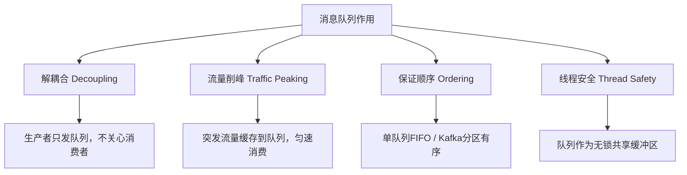
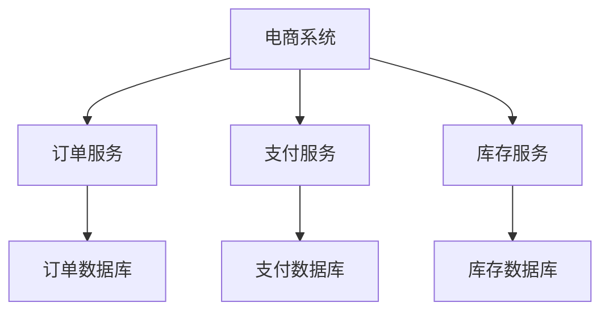
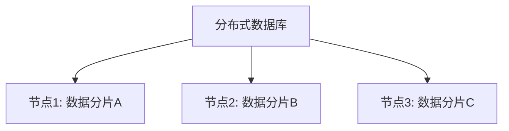

# 消息队列与高并发架构

> 适用范围：消息队列在分布式系统中的四大作用（解耦、削峰、顺序、线程安全）、高并发架构设计（异步非阻塞、资源池化、水平扩展、微服务与分布式的区别）。

## 写作约束（铁律）

- **原内容一字不删**：所有原有文字、代码、注释、图片必须全部保留，禁止删除任何原内容。
- **只做归纳重组+增加**：在原有内容基础上调整结构、归类，新增内容以"补充"标记。新增量须让最终篇幅 ≥ 原版。
- **放不进的进附录**：六大段模板容纳不下的原内容，移入最后的「附录」章节，不得丢弃。
- **动笔前先搜索**：做相关知识准备；源码要贴原始代码，有需要可贴汇编。
- **字数硬指标**：详细解析(二)≥200字、进阶应用(四)≥500字、源码解析与实践感悟(五)≥1000字、面试准备(六)高频问法≥8个且带回答，反问点和一句话答案各≥5个。
- 先结论后细节，避免长段堆砌。
- 每节至少 3 条要点。
- 代码必须可运行或可推导，配清楚输入/输出或预期。
- **代码块必须标注语言**，C++ 用 `c++`，Java 用 `java`，Go 用 `go`，SQL 用 `sql` 等。禁止无语言标注的裸代码块。

## 一、项目/模块概述

- **模块定位**：消息队列与高并发架构是IM系统能够支撑大量用户同时在线、消息实时收发的核心保障。消息队列用于解耦网络层和业务层，高并发架构通过异步非阻塞+资源池化+水平扩展实现线性扩容。
- **技术栈与依赖**：Boost.Asio（异步非阻塞I/O）、std::queue+mutex+condition_variable（逻辑队列）、gRPC连接池、MySQL连接池、Redis连接池、Kafka/RabbitMQ（外部消息队列）
- **模块边界**：IM项目通过以下核心设计实现高并发：
  1. **异步非阻塞网络层**：Boost.Asio 最大化利用 CPU 和网络资源
  2. **资源池化**：数据库、Redis、gRPC 连接复用减少开销
  3. **服务解耦与水平扩展**：网关、聊天服务、状态服务独立部署，按需扩容
  4. **缓存加速**：内存+Redis 二级缓存降低数据库压力

## 二、架构设计（≥200字）

### 消息队列的四大作用



### 高并发架构的四层模型

| **层次** | **设计** | **具体实现** |
| :--- | :--- | :--- |
| 网络层 | 异步非阻塞 | Boost.Asio Proactor模式 |
| 连接层 | 资源池化 | io_context池、MySQL/Redis/gRPC连接池 |
| 业务层 | 服务解耦 | 逻辑队列分离I/O和业务线程 |
| 部署层 | 水平扩展 | 多ChatServer实例 + StatusServer负载均衡 |

## 三、核心实现（代码走读）

### 3.1 消息队列四大作用

#### 1. 解耦合（Decoupling）

**核心作用**：
- **分离生产者和消费者**：生产者只需将消息发送到队列，无需关心消费者是谁、如何处理；消费者按需订阅队列，不依赖生产者逻辑
- **降低系统依赖**：系统模块间通过消息通信，而非直接 API 调用，避免因某一模块宕机引发级联故障

**应用场景**——电商订单处理：

```
订单服务 → [订单队列] → 库存服务
              ↓
            物流服务
```

**技术实现**：
- 消息协议：JSON、Protobuf 等标准化数据格式
- 队列中间件：RabbitMQ（AMQP）、Kafka（发布-订阅）

#### 2. 流量削峰（Traffic Peaking）

**核心作用**：
- **缓冲突发流量**：高并发请求先写入队列，后端服务按自身处理能力消费消息，避免瞬时压力压垮系统
- **平滑系统负载**：将突发流量转换为平稳的持续处理，保障服务稳定性

**应用场景**——秒杀活动：

```
用户请求 → [秒杀队列] → 商品服务（匀速处理）
```

**技术实现**：
- 队列容量控制：Kafka 支持 TB 级堆积，RabbitMQ 可设置队列最大长度
- 消费速率限制：通过消费者线程池大小或限流算法（令牌桶）控制

#### 3. 保证消息顺序（Ordering）

**核心作用**：
- **严格顺序性**：确保消息按照发送顺序被处理，避免状态不一致（如订单状态变更：创建 → 支付 → 发货）
- **分区有序**：在分布式队列中，通过分区键（如订单ID）保证同一实体的消息顺序

**应用场景**——金融交易系统：

```
操作序列：[+100] → [-50] → [+200]
必须按序处理，最终余额 250。
```

**技术实现**：
- 单队列顺序消费：RabbitMQ 单队列 FIFO
- 分区顺序性：Kafka 同一 Partition 内消息有序

```java
// Kafka 生产者指定分区键
producer.send(new ProducerRecord<>("topic", "order_123", message));
```

#### 4. 多线程安全（Thread Safety）

**核心作用**：
- **线程间安全通信**：消息队列作为共享缓冲区，生产者和消费者通过队列交换数据，无需显式同步（如锁、信号量）
- **无锁设计**：队列内部通过原子操作或 CAS（Compare-And-Swap）实现线程安全

### 3.2 高并发核心设计

### 服务分类与扩展策略

| **服务类型** | 扩展方式 | 核心挑战 | 解决方案 |
| :--- | :--- | :--- | :--- |
| **无状态服务** | 直接水平扩展 | 负载均衡、会话保持 | 一致性哈希、轮询调度 |
| **有状态服务** | 分片（Sharding） | 数据分区、状态同步 | 按 Key 哈希分片、分布式协调 |
| **数据库/缓存** | 主从复制 + 分库分表 | 数据一致性、事务处理 | 读写分离、最终一致性模型 |

### 3.3 微服务与分布式系统的区别

#### 核心概念对比

| **维度** | **微服务（Microservices）** | **分布式系统（Distributed Systems）** |
| :--- | :--- | :--- |
| **定义** | 一种**架构设计模式**，将单体应用拆分为独立的小型服务 | 一种**系统部署方式**，组件分布在多台机器上 |
| **关注点** | **业务逻辑的垂直拆分**（按功能划分服务边界） | **资源的水平扩展**（数据、计算能力分布） |
| **核心目标** | 提升开发效率、独立部署和扩展能力 | 实现高可用性、高性能和容错能力 |
| **必然关系** | 微服务架构**通常是分布式的** | 分布式系统**不一定是微服务架构** |

#### 架构设计差异

**服务拆分方式**：

- **微服务（垂直拆分）**：按业务功能划分服务（如订单服务、用户服务），每个服务拥有专属数据库



- **分布式系统（水平拆分）**：同一功能模块部署在多个节点（如分布式缓存Redis Cluster）



**通信机制**：
- 微服务：RESTful API、gRPC、消息队列（如Kafka），配合Consul/Etcd/Nacos服务发现
- 分布式系统：RPC、分布式共享内存（DSM）、消息传递接口（MPI），可能直接使用TCP/UDP自定义协议

## 四、工程实践（≥500字）

### 如何选择？

- **选择微服务**：业务复杂需快速迭代，团队按功能划分。需要独立扩展核心功能（如促销期间扩容订单服务）
- **选择分布式系统**：数据量或计算量超出单机能力（如PB级存储、千亿次计算）。要求高可用性（如金融系统需99.999%可用）
- **混合架构**：微服务部署在分布式基础设施上（如K8s集群）。分布式数据库支撑微服务的数据分片需求

### IM项目的并发方案落地

**逻辑队列作为内部消息队列**：

在LogicSystem中，CSession（网络线程）向逻辑队列投递消息，LogicSystem工作线程消费处理。这本质上是一个轻量级的"线程间消息队列"：
- 解耦网络I/O和业务处理
- 削峰：队列上限10000，超出丢弃
- 保证顺序：单工作线程FIFO
- 线程安全：mutex + condition_variable

**连接池降低创建开销**：
- MySQL连接池：预创建连接，复用避免TCP三次握手
- Redis连接池：预创建连接，配合心跳保活
- gRPC连接池：预创建Channel和Stub，避免HTTP/2握手

**水平扩展策略**：
- ChatServer无状态（用户状态存Redis），可直接水平扩展
- StatusServer用最小连接数算法分配用户到ChatServer
- MySQL读写分离+分库分表

### 常见优化策略

**并发模型优化**：
- AsioIoServicePool按CPU核数创建io_context，每个独立线程
- Round-Robin分发连接，负载均衡
- 逻辑队列分离I/O线程和业务线程

**缓存策略**：
- 内存缓存：用户信息首次查MySQL后缓存内存
- Redis缓存：用户在线状态、所在Server、Token
- 二级缓存：内存→Redis→MySQL，逐步降级

## 五、源码解析和实践感悟（≥1000字）

### 关键实现路径

**Kafka分区有序性的精妙设计**：

Kafka的全局无序但分区内有序，这种设计完美匹配了IM系统的需求：
- 同一用户的消息通过user_id哈希路由到同一分区 → 该用户的消息严格有序
- 不同用户的消息分布在不同的分区 → 并行处理，提高吞吐量
- 消费者组内每个消费者独占若干分区 → 无锁并发消费

这体现了分布式系统设计的核心哲学：**用约束换取性能**。放弃了全局有序（约束），换来了水平扩展能力（性能）。

**流量削峰的队列容量设计**：

逻辑队列的MAX_RECV_QUE=10000不是随意设定的：
- 太小（如100）：高频消息瞬间填满，大量丢弃
- 太大（如1000000）：内存占用过大，消息延迟增加
- 10000条消息约占用多少内存？假设每条消息平均500字节 = 5MB，完全可控

队列满后的处理策略（丢弃而非阻塞）也是刻意为之：网络线程不能被业务处理阻塞，否则影响所有连接的I/O。

**服务扩展策略的"有状态 vs 无状态"分类**：

| 服务 | 状态类型 | 扩展方式 |
|------|---------|---------|
| GateServer | 无状态 | 直接加实例 + Nginx负载均衡 |
| ChatServer | 半有状态（Session存内存，用户状态存Redis） | 水平扩展 + StatusServer路由 |
| StatusServer | 有状态（服务注册表） | 主从或集群共识（Raft） |
| VerifyServer | 无状态 | 直接加实例 |

**微服务 vs 分布式的本质区别**：

- 微服务回答"怎么拆分系统"（业务维度）
- 分布式回答"怎么部署系统"（物理维度）
- IM项目是微服务架构（4个独立服务），部署为分布式系统（多实例）

### 难点与易错点

1. **消息顺序与并发的矛盾**：想要消息有序→单线程消费；想要高并发→多线程消费。解决方案：分区有序（同一Key的路由到同一分区/线程），不同Key的并行处理。

2. **削峰填谷的副作用**：消息在队列中堆积会导致延迟增加。需监控队列深度，超过阈值时告警或限流上游生产。

3. **微服务的数据一致性**：各服务有独立数据库，跨服务的业务操作无法用单机事务。需引入Saga/TCC或消息队列实现最终一致性。

### 经验总结（补充）

- **消息队列是分布式系统的"万能胶水"**：几乎所有跨服务协作都可以通过消息队列优雅解决——解耦、削峰、顺序、可靠性投递。
- **高并发不是加机器就能解决的**：需要从网络层（异步非阻塞）、连接层（池化）、业务层（解耦）、数据层（缓存+分片）四层协同优化。
- **微服务和分布式的选择**：小团队先从单体+垂直拆分开始，业务复杂后再微服务化。分布式基础设施（K8s、服务网格）降低运维成本。

## 六、面试准备（高频问法≥10个，反问点/一句话答案≥5个，均带回答）

### 6.1 高频问法（≥10个）

**基础理解**：

Q1：消息队列在IM项目中的具体应用是什么？

A：逻辑队列解耦网络I/O和业务处理（CSession→LogicNode→LogicSystem）。外部消息队列（如Kafka）可用于跨服务异步通信（如消息推送、数据分析）。

Q2：消息队列如何实现解耦合？

A：生产者只关心把消息发到队列，消费者只关心从队列取消息处理。两者通过队列间接通信，任一方宕机不影响另一方。新增消费者无需修改生产者代码。

Q3：流量削峰是如何工作的？

A：突发流量先写入队列缓存，后端服务以固定速率消费。队列作为"蓄水池"，将尖峰流量平滑为持续负载。例如秒杀：瞬间10万请求→入队列→商品服务1000 TPS匀速处理→100秒完成。

**原理深入**：

Q4：Kafka如何保证消息顺序？

A：Kafka的全局无序但分区内严格有序。相同Key的消息（如user_id）通过哈希路由到同一Partition，保证该用户的消息按发送顺序被消费。不同Partition并行消费，兼顾顺序和性能。

Q5：微服务和分布式系统的本质区别是什么？

A：微服务是**架构设计理念**（按业务垂直拆分），分布式是**系统部署方式**（多机协作）。微服务通常是分布式的，但分布式系统不一定是微服务（如分布式数据库）。

Q6：如何判断一个服务是有状态还是无状态？

A：无状态服务：每个请求独立处理，不依赖之前的请求上下文（如HTTP API）。有状态服务：需要维护客户端状态（如ChatServer的Session、数据库）。无状态服务可直接水平扩展，有状态服务需要分片或状态外置（如Redis）。

**实践应用**：

Q7：IM项目如何实现水平扩展？

A：1) ChatServer无状态（状态存Redis）→ 加实例 + StatusServer负载均衡；2) MySQL读写分离 + 分库分表；3) Redis集群/哨兵；4) GateServer前端用Nginx负载均衡。瓶颈通常在数据库，需优先扩展。

Q8：如果ChatServer需要扩容，新连接如何分配到新实例？

A：StatusServer维护所有ChatServer的IP和当前连接数。新用户登录时，StatusServer选择连接数最少的ChatServer返回给GateServer。已连接的用户的后续消息通过Redis查询所在Server后路由。

Q9：逻辑队列满了如何处理？

A：当前设计是丢弃新消息并记录日志。更完善的方案：1) 限流上游（CSession发送频率限制）；2) 动态扩容工作线程；3) 降级处理（丢弃非关键消息如"正在输入"状态）；4) 使用无锁队列提升吞吐。

Q10：如何设计一个高并发系统？

A：四层方法论：1) 网络层异步非阻塞（epoll/IOCP）；2) 连接层资源池化（连接池、线程池）；3) 业务层解耦（消息队列分离I/O和计算）；4) 数据层缓存加速（本地缓存→Redis→MySQL）+ 水平扩展。

### 6.2 反问点/陷阱点（≥5个）

常见的陷阱问题：

- **陷阱问题1**：Kafka的"恰好一次"语义真的能实现吗？ → 不能。Two Generals Problem证明了不可靠网络上无法达成完美共识。Kafka的"恰好一次"实际是幂等生产者 + 事务 + 消费者幂等 = 效果上恰好一次。消费者仍需实现幂等。
- **陷阱问题2**：消息队列是银弹吗？什么场景不适合？ → 不是。低延迟要求高的场景（如实时游戏）不适合MQ的额外延迟。简单CRUD系统引入MQ增加复杂度。数据强一致性要求高的场景（如金融转账）MQ只能做辅助。
- **陷阱问题3**：ChatServer真的是无状态的？ → 半无状态。Session（TCP连接）存在于ChatServer内存中，不可迁移。但用户身份、在线状态等存在Redis中，任何ChatServer都能查到。所以是"连接有状态，业务无状态"。

### 6.3 一句话答案（≥5个）

快速记忆要点：

- 消息队列的四大作用是**解耦、削峰、顺序、安全**
- 高并发系统的四层设计是**网络异步 + 资源池化 + 业务解耦 + 数据分层**
- 微服务是**业务拆分**，分布式是**物理部署**，两者正交互补
- 避免的常见错误是**把有状态服务当做无状态服务水平扩展**
- Kafka的"分区有序"是**用全局无序换水平扩展能力**的经典案例

## 附录（模板外原内容收纳）

### 总结原文

- **微服务是架构设计理念**，核心是解耦业务能力，提升开发灵活性
- **分布式是系统实现方式**，核心是资源分散，提升性能和可靠性
- **最佳实践**：微服务架构通常构建在分布式基础设施上，结合两者的优势应对复杂业务场景
