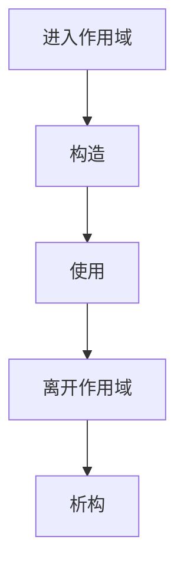

# 生命周期

> 适用范围：单一主题（一个概念/机制/模块），保持可复用、可检索。

## 写作约束（铁律）

- **原内容一字不删**：所有原有文字、代码、注释、图片必须全部保留，禁止删除任何原内容。
- **只做归纳重组+增加**：在原有内容基础上调整结构、归类，新增内容以"补充"标记。新增量须让最终篇幅 ≥ 原版。
- **放不进的进附录**：六大段模板容纳不下的原内容，移入最后的「附录」章节，不得丢弃。
- **动笔前先搜索**：做相关知识准备；源码要贴原始代码，有需要可贴汇编。
- **字数硬指标**：详细解析(二)≥200字、进阶应用(四)≥500字、源码解析与实践感悟(五)≥1000字、面试准备(六)高频问法≥8个且带回答，反问点和一句话答案各≥5个。
- 先结论后细节，避免长段堆砌。
- 每节至少 3 条要点。
- 代码必须可运行或可推导，配清楚输入/输出或预期。
- **代码块必须标注语言**：所有代码块必须根据实际语言标注，C++ 代码用 `c++`（不可用 `cpp` 或 `c`），Python 用 `python`，汇编用 `asm`/`x86asm`，shell 用 `bash` 等。禁止无语言标注的裸代码块。
- 图示统一放在 `资源/图片/`，文内使用相对路径引用。
- 有流程的用流程图或其他类型的图。

## 一、核心概念

- 定义：生命周期描述对象从构造到析构的时间区间，受存储期与作用域控制。
- 关键词：自动/动态/静态存储期、RAII、临时对象、NRVO。
- 适用场景/边界：所有对象都受生命周期约束；**补充**：跨函数/跨线程持有指针需明确生命周期边界。

## 二、详细解析（≥200字）

- **原理拆解（三层递进）**：
  - 第一层：基本工作原理（配流程图/序列图展示核心流程）
  - 第二层：关键步骤详解（每步展开子步骤）
  - 第三层：底层机制（编译器实现、运行时行为、内存布局影响）
- 关键数据结构/接口：
- 关键公式/复杂度：

**补充**：生命周期由“存储期 + 构造/析构规则”共同决定。自动存储期对象在进入作用域时构造，离开作用域时析构；动态存储期对象由 `new` 构造、`delete` 析构；静态存储期对象在程序启动或首次访问时构造，程序结束时析构。临时对象通常在完整表达式结束后析构，但被 `const` 引用绑定可延长其生命周期。编译器在生成代码时会插入构造/析构调用，并通过异常表保证在栈展开过程中正确析构已构造对象。这也是 RAII 的核心：对象生命周期与资源生命周期绑定。



## 三、动手实践（代码案例）

```c++
#include <iostream>

struct X {
    X() { std::cout << "ctor\n"; }
    ~X() { std::cout << "dtor\n"; }
};

int main() {
    std::cout << "enter\n";
    X x;
    std::cout << "leave\n";
    return 0;
}
```

- 预期输出：enter → ctor → leave → dtor。
- **补充**：把 `X x;` 改为 `auto p = new X; delete p;` 可观察动态存储期。
- **补充**：在 `return X{};` 中观察 NRVO 行为。

## 四、进阶应用（≥500字）

- 与其他主题的关联：
- 工程中的真实用法（大型项目案例、实际使用模式）：
- 常见优化策略：
  - 算法层面：选择更优算法
  - 数据结构：使用缓存友好结构
  - 内存访问：优化数据局部性
  - 并发处理：利用并行计算
  - 具体技巧：预计算与缓存、批处理减少开销、SIMD、避免虚函数调用等

**补充**：生命周期与资源管理是工程实践的核心。自动存储期对象天然遵循 RAII，适合管理文件、锁、数据库连接等资源。动态存储期对象则要求显式释放，若用裸指针极易泄漏或悬垂；现代 C++ 强烈推荐使用 `std::unique_ptr`、`std::shared_ptr` 管理动态对象。静态存储期对象要注意初始化/销毁顺序问题（静态初始化顺序问题），因此跨翻译单元的全局对象应尽量避免互相依赖，或用函数内静态对象延迟初始化。

**补充**：生命周期与异常安全紧密相关。若构造函数抛异常，已构造的成员会析构，未构造的成员不会触及，这要求成员按照“可安全析构”设计。析构函数必须 `noexcept`，否则栈展开期间二次异常会导致 `std::terminate`。移动语义对生命周期也有影响：移动后的对象必须保持“可析构”状态（valid-but-unspecified），这意味着类设计必须允许“空对象”存在。

**补充**：在性能优化中，理解 NRVO 和临时对象生命周期至关重要。返回值优化能够消除拷贝/移动，但前提是返回值为具名局部对象，且编译器可优化。避免在 `return` 处显式 `std::move`，否则可能阻止 NRVO。在容器操作中，注意临时对象的延迟析构与生命周期延长规则，避免对临时对象绑定非 const 引用导致悬垂。

## 五、源码解析和实践感悟（≥1000字）

- 关键实现路径（贴源码、必要时贴汇编）：
- 难点与易错点（陷阱案例 + 深度剖析）：
- 经验总结（补充）：

**补充**：生命周期的底层实现由编译器插入构造/析构调用完成。对自动对象，编译器在进入作用域时生成构造调用，在离开作用域的所有路径上生成析构调用（包括异常路径）。这通常通过“清理表”实现，确保异常抛出时也能正确析构。对动态对象，`new` 会先分配内存，再调用构造函数；`delete` 则先调用析构函数，再释放内存。理解这一点有助于解释为什么 `delete` 需要与 `new` 匹配：只有匹配的 `delete` 才能调用正确的析构函数与释放策略。

**补充**：静态存储期对象的生命周期最容易出错。跨翻译单元的全局对象初始化顺序是不确定的，可能导致“在构造中访问尚未初始化的对象”。解决方案是使用“函数内静态对象”（Meyers Singleton）延迟初始化，或在一个翻译单元中集中管理初始化顺序。析构顺序同样不确定，尤其在程序退出时，静态对象之间的依赖可能导致访问已析构对象。工程实践中应减少跨单元静态依赖，或显式控制生命周期。

**补充**：临时对象生命周期规则常被忽略。临时对象默认在完整表达式结束后销毁，但被 `const T&` 绑定可延长到引用离开作用域。右值引用也可延长生命周期，但语义上仍需谨慎，因为移动后的对象状态未指定。最常见的 bug 是“返回局部对象引用”，其生命周期已结束而引用继续存在，导致悬垂引用。另一类常见 bug 是“保存 `string_view` 指向临时字符串”，这在生命周期结束后立即悬垂。

**补充**：placement new 与手动析构是高级场景的生命周期管理方式。placement new 仅在指定内存位置构造对象，不分配内存，因此必须显式调用析构函数释放资源。它常用于对象池、内存池与自定义容器。错误使用 placement new 会导致对象多次析构或资源泄漏。实践中应明确“构造/析构计数”并用 RAII 封装 placement new 的生命周期，避免手动调用错误。

**补充**：移动语义对生命周期的影响体现在“资源所有权转移”。移动构造后源对象仍需可析构，但其内部资源可能被清空。这要求类在移动后仍处于“可用但不确定”的状态。工程经验是：移动后对象应能安全赋值或销毁，但不应假设其值。对容器而言，移动能显著降低拷贝成本，但也要求移动构造 `noexcept`，否则容器在扩容时会退化为拷贝。

**补充**：生命周期与并发关联在于“跨线程访问”。如果一个对象被多个线程共享，必须确保它在所有线程结束访问前依然存活。这通常通过共享所有权（`shared_ptr`）或显式的生命周期管理（线程 join）实现。对观察者指针或引用应避免跨线程传递，除非明确由更高层保证生命周期。在实际工程中，绝大多数悬垂问题都来自“错误的跨线程访问”。

**补充**：最后的实践感悟是：生命周期管理不是“语法知识”，而是系统可靠性的核心。一个小小的悬垂引用可能导致难以复现的崩溃；一个析构顺序错误可能导致程序退出时的诡异 bug。解决之道是：1) 尽量使用 RAII 与智能指针；2) 避免跨单元静态对象依赖；3) 对临时对象与 `string_view` 等非拥有引用建立明确的使用规范；4) 在调试环境中开启 ASan/UBSan 检测生命周期错误。

## 六、面试准备（高频问法≥10个，反问点/一句话答案≥5个，均带回答）

### 6.1 高频问法（≥10个）

Q1：对象生命周期包含哪些阶段？

A：分配存储 → 构造 → 使用 → 析构 → 释放存储。

Q2：RAII 如何绑定资源生命周期？

A：构造获取资源，析构释放资源。

Q3：临时对象生命周期默认多长？

A：完整表达式结束后销毁。

Q4：`const` 引用为何能延长临时对象生命周期？

A：语言规则允许延长到引用离开作用域。

Q5：移动后的对象还能用吗？

A：可析构、可赋值，但值未指定。

Q6：静态对象的初始化顺序问题如何解决？

A：使用函数内静态或集中管理初始化顺序。

Q7：placement new 为什么需要显式析构？

A：只构造不分配，编译器不会自动析构。

Q8：NRVO 的前提是什么？

A：返回具名局部对象，类型完全匹配。

Q9：生命周期与并发如何关联？

A：对象必须在所有线程访问结束后才析构。

Q10：析构函数为什么 `noexcept`？

A：栈展开期间抛异常会终止程序。

### 6.2 反问点/陷阱点（≥5个）

- 反问：团队是否禁止返回局部对象引用？
- 反问：是否有统一的所有权/生命周期规范？
- 反问：是否在 CI 中启用 ASan/UBSan？
- 陷阱：`string_view` 绑定临时字符串导致悬垂。
- 陷阱：全局对象析构顺序不确定导致退出崩溃。

### 6.3 一句话答案（≥5个）

- 生命周期决定对象何时可用与何时销毁。
- RAII 让资源释放自动化。
- 临时对象默认在表达式结束后销毁。
- NRVO 是返回值优化的核心。
- 不管理生命周期就会产生悬垂与泄漏。

## 附录（模板外原内容收纳）

> 以下为原笔记中不直接适配六大段结构、但仍有价值的内容，原样保留于此。

# 生命周期

## C++ 对象生命周期

C++ 中一个类可以具有构造函数和析构函数。

* 构造函数固定为 `类名(构造函数参数列表)`。
* 析构函数固定为 `~类名()`。
* 构造函数和析构函数都没有返回值类型。
* 析构函数不得拥有任何参数，但构造函数可以有。

```
struct Class {
    Class() {
        puts("构造函数");
    }

    ~Class() {
        puts("析构函数");
    }
};
```

```
int main() {
    puts("进入 main");
    Class c;
    puts("离开 main");
}
```

运行结果：

```
进入 main
构造函数
离开 main
析构函数
```

这是 C++ 中最基本的现象。每当一个对象被创建时，会调用构造函数，每当一个对象离开定义了他的函数体时，会调用析构函数。

函数体指的是从 `{` 到 `}` 之间的代码块。

其中构造函数中通常负责创建资源，析构函数中通常销毁资源。对于智能指针和 vector 而言，这个资源就是内存。

为什么要及时销毁不用的资源？只分配不释放，一个程序占用的内存和其他各种资源就会越来越多，这种程序如果长期运行，会吃光整个系统的所有资源然后被 Linux 内核视为危险进程而杀死。除非你的程序只会运行一会会，如果是长期运行的程序，例如服务器，必须严格管理所有自己曾经分配过的内存，不用时就立即释放，不要占着茅坑不拉史。

`}` 被誉为**最伟大的运算符**，就是因为他可以触发析构函数，帮你自动释放掉资源，你就不用自己费心手动释放内存，和其他各种资源了。

## 三大存储周期

在进一步深入之前，我们必须明确以下术语：自动存储周期、动态存储周期、静态存储周期。

变量定义在不同的位置，其生命周期（构造函数和析构函数调用的时机）会有所不同。

比如一个变量定义在函数体内、类体内、通过 new 创建，之类的。

1. 自动存储周期，这种变量直接定义在**函数体**内。俗称“栈上”或“局部变量”

```
void func() {
    Class a;  // a 是自动存储周期
}
```

* 构造时机：当变量定义时被调用。
* 析构时机：当变量所在的 `{}` 代码块执行到 `}` 处时调用。

1. 动态存储周期，这种变量通过 new 来创建。俗称“堆上”或“堆对象”

```
void func() {
    Class *p = new Class;  // *p 是动态存储周期
    delete p;              // 释放动态分配的内存
}
```

* 构造时机：当变量通过 new 创建时被调用。
* 析构时机：当 delete 被调用时被调用。

特别注意，`p` 依然是“栈上变量”，`p` 指向的 `*p` 才是“堆上变量”！

用律师语再说一遍：`p` 是自动存储周期，`p` 指向的 `*p` 才是动态存储周期！（白律师最满意的一集）

指针本身，和指针指向的对象，是两个东西，不要混淆。

`p` 本身会随着 func 的 `}` 而析构，但是 `*p` 的类型是 `Class *`，是一个 C 语言原始指针，原始指针属于 C 语言原始类型，没有析构函数。也就是说，抵达 `}` 时，`p` 名义上会析构，但是他没有析构函数，并不会产生任何作用。这一切和 `p` 指向的对象 `*p` 没有任何关系，你需要手动 delete 才会调用到 `*p` 的析构函数，并释放分配的内存。

* new 分为两部分：内存分配 + **对象构造**
* delete 分为两部分：**对象析构** + 内存释放

智能指针的优势在于，智能指针是个 C++ 类，具有定制的析构函数。当 `}` 抵达，**智能指针本身**由于自动存储周期的规则析构时，其会 `delete p`，利用动态存储周期的规则，触发**智能指针指向对象**的析构函数，也就是从而调用 `*p` 的析构函数。

1. 静态存储周期，这种变量又要具体分三种情况，俗称“全局变量”或“静态变量”

(1) 定义在**名字空间**内，不论是不是 static 或 inline（在名字空间中，static 和 inline 影响的只是“符号可见性”，而不是存储周期）

```
namespace hello {
Class s;         // s 是静态存储周期
static Class s;  // s 是静态存储周期
inline Class s;  // s 是静态存储周期
}
```

* 构造时机：当程序启动时调用（main 函数之前）；对 DLL 来说则是 DLL 首次加载时调用。
* 析构时机：当程序退出时调用（main 函数之后）。

(2) 注意，**全局名字空间**是一个特殊的**名字空间**，外面没有包裹任何 `namespace` 时就属于这种情况，俗称“全局变量”。所以下面这种也属于“在 (全局) 名字空间内”：

```
Class s;         // s 是静态存储周期
static Class s;  // s 是静态存储周期
inline Class s;  // s 是静态存储周期
```

(3) 定义在类内的静态成员变量，也就是通过 static 修饰过的成员变量（在类内，static 就影响存储周期了，inline 继续只影响“符号可见性”）

```
struct Other {
    static Class s;
};
Class Other::s;             // s 是静态存储周期

struct Other {
    inline static Class s;  // s 是静态存储周期
};

struct Other {
    Class a;                // a 不是静态存储周期，而是跟随其所属的 Other 结构体的存储周期
};
```

1. 定义在类内的成员变量（没有 static 的），跟随所属类的存储周期

```
struct Other {
    Class a;  // a 跟随 Other 结构体的存储周期
};

Other o;      // o.a 是静态存储周期

int main() {
    Other o;  // o.a  是自动存储周期
    Other *p; // p->a 是动态存储周期
}
```

* 构造时机：当 Other 结构体构造时调用。
* 析构时机：当 Other 结构体析构时调用。

## 总结

* 自动存储周期 - 函数的局部变量，自动析构
* 动态存储周期 - 通过 new 创建的，delete 时析构
* 静态存储周期 - 全局变量，程序结束时析构

## 五、源码解析和实践感悟

### 1. 对象生命周期的编译器管理

```
// 构造: 分配内存 → 调用构造函数 → 对象可用
// 析构: 调用析构函数 → 释放内存 → 对象不可用
// 编译器严格按 RAII 管理生命周期:

void f() {
    string s("hello");  // 1. 构造
    // ...
}  // 2. 离开作用域，自动调用 ~string()，栈内存自动回收

// 临时对象的生命周期延长:
const string& ref = string("temp");  // 临时对象存活到 ref 离开作用域
```

### 2. 生命周期与移动语义

```
// 移动后源对象仍有效（valid-but-unspecified），析构仍会执行
vector<int> a = {1,2,3};
vector<int> b = std::move(a);  // a 资源的生命周期转移给 b
// a 仍可析构，但 size() 未指定

// NRVO: 返回局部对象时编译器直接在调用方构造
vector<int> make() { vector<int> v; return v; }
// 编译器优化为: 在调用者栈帧上构造 v，完全避免拷贝/移动
```

### 实践经验
1. **临时对象用 const 引用捕获可延长生命周期**：非 const 引用不能绑定临时对象
2. **析构函数不应抛异常**：栈展开期间抛异常直接 terminate
3. **placement new 的对象需显式析构**：编译器不会为 placement new 自动调用析构
4. **union 的非平凡成员需手动构造/析构**：编译器不会自动管理
5. **NRVO 比 std::move 更优**：return 处不要加 move

## 六、面试准备

### Q&A（10题）

**Q1: 对象的生命周期包含哪些阶段？**
A: 分配存储 → 构造（开始生命）→ 使用 → 析构（结束生命）→ 释放存储

**Q2: RAII 如何绑定资源生命周期到对象生命周期？**
A: 构造函数获取资源，析构函数释放资源——对象生命周期的自动保证

**Q3: 临时对象的生命周期有多长？**
A: 完整表达式结束后销毁，除非被 const 引用绑定（延长到引用离开作用域）

**Q4: 移动后的对象还能用吗？**
A: 处于 valid-but-unspecified 状态，必须可析构，可赋新值

**Q5: 构造函数中抛异常对象会析构吗？**
A: 已构造的成员和基类会自动析构，对象自身的析构不会调用

**Q6: placement new 创建的对象如何销毁？**
A: 必须显式调用析构函数：`ptr->~T()`，编译器不会自动调用

**Q7: NRVO 在什么条件下生效？**
A: 返回类型与局部变量类型完全一致（非引用），且返回变量名（非表达式）

**Q8: std::optional 如何管理生命周期？**
A: 内部用 aligned_storage + placement new 延迟构造，reset 时显式析构

**Q9: union 的活跃成员切换规则？**
A: C++ 中只有平凡类型的 union 成员可安全切换；非平凡类型需 placement new + 显式析构

**Q10: 静态局部变量的生命周期？**
A: 首次执行到声明处初始化，程序结束时析构

### 陷阱与反问（5个）
1. **陷阱**：返回局部变量的非 const 引用→悬垂引用
2. **反问**：为什么不用 GC 管理生命周期？→ RAII 是确定性的，GC 不确定析构时机
3. **陷阱**：析构函数中调用虚函数→调用的是当前类的版本
4. **反问**：C++ 为什么没有 finally？→ RAII 替代了 finally
5. **陷阱**：全局对象之间的析构顺序不确定

### 一句话答案（8个）
1. **RAII**：资源获取即初始化，析构保证释放
2. **作用域结束**：栈对象自动析构
3. **临时对象**：表达式结束后销毁
4. **const 引用**：可延长临时对象生命周期
5. **NRVO**：返回值优化，零拷贝
6. **placement new**：需手动析构
7. **移动后状态**：valid-but-unspecified
8. **静态变量**：首次访问初始化，程序结束析构
