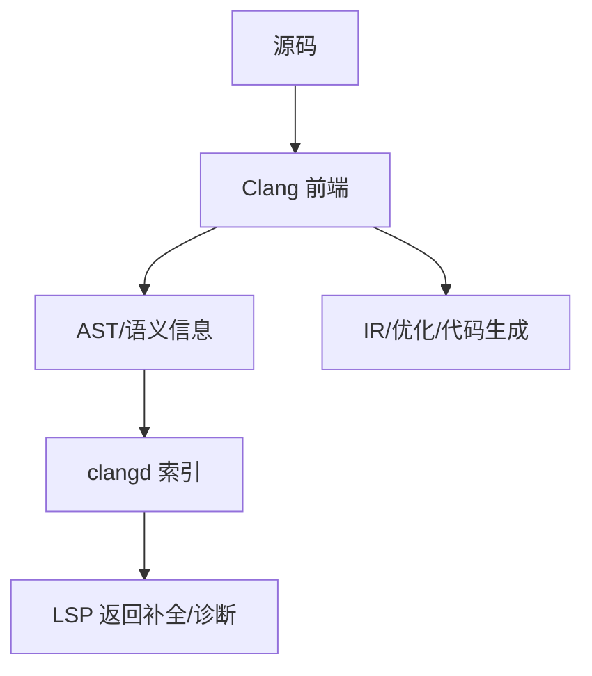

# 编译器以及Clangd

> 适用范围：单一主题（一个概念/机制/模块），保持可复用、可检索。

## 写作约束（铁律）

- **原内容一字不删**：所有原有文字、代码、注释、图片必须全部保留，禁止删除任何原内容。
- **只做归纳重组+增加**：在原有内容基础上调整结构、归类，新增内容以"补充"标记。新增量须让最终篇幅 ≥ 原版。
- **放不进的进附录**：六大段模板容纳不下的原内容，移入最后的「附录」章节，不得丢弃。
- **动笔前先搜索**：做相关知识准备；源码要贴原始代码，有需要可贴汇编。
- **字数硬指标**：详细解析(二)≥200字、进阶应用(四)≥500字、源码解析与实践感悟(五)≥1000字、面试准备(六)高频问法≥8个且带回答，反问点和一句话答案各≥5个。
- 先结论后细节，避免长段堆砌。
- 每节至少 3 条要点。
- 代码必须可运行或可推导，配清楚输入/输出或预期。
- **代码块必须标注语言**：所有代码块必须根据实际语言标注，C++ 代码用 `c++`（不可用 `cpp` 或 `c`），Python 用 `python`，汇编用 `asm`/`x86asm`，shell 用 `bash` 等。禁止无语言标注的裸代码块。
- 图示统一放在 `资源/图片/`，文内使用相对路径引用。
- 有流程的用流程图或其他类型的图。

## 一、核心概念

- 定义：编译器负责把 C++ 源码转为目标代码并进行优化；clangd 是基于 Clang 的语言服务器，提供补全、诊断、跳转等语义能力。
- 关键词：编译前端、语义分析、AST、IR、优化、LSP、`compile_commands.json`。
- 适用场景/边界：编译器用于构建与性能优化；clangd 用于开发期语义支持。**补充**：clangd 的语义准确性依赖编译数据库与系统头文件路径，缺失时只能退化为语法级提示。

## 二、详细解析（≥200字）

- **原理拆解（三层递进）**：
  - 第一层：基本工作原理（配流程图/序列图展示核心流程）
  - 第二层：关键步骤详解（每步展开子步骤）
  - 第三层：底层机制（编译器实现、运行时行为、内存布局影响）
- 关键数据结构/接口：
- 关键公式/复杂度：

**补充**：编译器的工作链路分为前端、中端、后端。前端完成词法/语法/语义分析并构建 AST；中端基于 IR 进行优化（如常量折叠、内联、死代码消除、SSA 变换）；后端负责指令选择、寄存器分配、指令调度并输出目标代码。clangd 复用 Clang 前端能力，通过 LSP 与编辑器通信，依赖 `compile_commands.json` 获取编译选项，从而准确解析宏、头文件与模板实例化。若编译数据库不完整，clangd 会出现类型推断失准、跳转失败或诊断误报。



## 三、动手实践（代码案例）

```bash
# 生成编译数据库（CMake）
cmake -S . -B build -DCMAKE_EXPORT_COMPILE_COMMANDS=ON
# 将 compile_commands.json 放到工程根目录
cp build/compile_commands.json .
```

```bash
# clangd 读取编译数据库后，编辑器中应能准确跳转与诊断
# VS Code 示例：安装 clangd 插件并关闭默认 C/C++ intellisense
```

- 预期：clangd 能正确识别头文件路径、宏定义与编译标准。
- **补充**：如果工程中存在多个目标，可使用 `-DCMAKE_EXPORT_COMPILE_COMMANDS=ON` 并在根目录创建软链接或复制。
- **补充**：大型工程可使用 `clangd --background-index` 构建索引以提升跳转速度。

## 四、进阶应用（≥500字）

- 与其他主题的关联：
- 工程中的真实用法（大型项目案例、实际使用模式）：
- 常见优化策略：
  - 算法层面：选择更优算法
  - 数据结构：使用缓存友好结构
  - 内存访问：优化数据局部性
  - 并发处理：利用并行计算
  - 具体技巧：预计算与缓存、批处理减少开销、SIMD、避免虚函数调用等

**补充**：在大型 C++ 项目里，编译器与 clangd 的协作直接决定“可维护性 + 编译效率”。一方面，编译器的优化级别与诊断配置（如 `-Wall -Wextra -Werror`）影响代码质量；另一方面，clangd 的准确性决定日常编辑体验。实践中，建议将编译配置统一收敛到 CMake 或 Bazel 中，再由编译数据库向 clangd 提供真实选项，避免“编译能过但 clangd 误报”的分裂状态。

**补充**：针对多平台项目，推荐在编译数据库中包含每个平台的编译参数，并使用 clangd 的 `--query-driver` 指向具体编译器（如 `clang++`、`g++` 或交叉编译器）。当宏定义与平台头文件切换时，clangd 才能正确解析条件编译分支。若项目依赖生成头文件（如 protobuf、shader 头），应保证生成步骤在 clangd 索引前完成，或者在 `.clangd` 中追加 `-I` 路径指向生成目录。

**补充**：从性能角度看，编译器优化与 clangd 索引都有资源成本。编译器侧可通过分层编译、预编译头（PCH）与 unity build 降低编译时间；clangd 侧则可通过限制索引范围、排除第三方巨型目录、设置 `CompileFlags` 减少解析负担。对于“编译时间过长”的工程，除了优化算法与源码结构，还应针对模板膨胀、头文件污染与过度 inline 做专项治理，这些问题同时也是 clangd 卡顿的主要原因。

**补充**：实战中常见问题包括：1) clangd 与实际编译器不一致导致的诊断偏差；2) `compile_commands.json` 路径不一致导致的头文件解析失败；3) 缺失 `-std=` 导致语法不匹配；4) 交叉编译时使用 host 头文件造成类型冲突。解决策略是：统一编译参数来源、固定编译器路径、检查编译数据库是否最新，并在项目中维护一个可版本化的 `.clangd` 配置文件。

## 五、源码解析和实践感悟（≥1000字）

- 关键实现路径（贴源码、必要时贴汇编）：
- 难点与易错点（陷阱案例 + 深度剖析）：
- 经验总结（补充）：

**补充**：理解编译器与 clangd 的内部流程可以从 Clang 的架构入手。Clang 前端在解析源代码时，会为每个语法单元构建 AST 节点，并为每个节点附加语义信息（类型、作用域、模板实例化上下文）。clangd 则复用这套 AST 与语义信息，建立索引（Symbol Index），使“跳转定义、查找引用、重构”成为可行操作。这意味着 clangd 的能力本质上取决于 Clang 前端能否“像真实编译一样”解析你的代码，因此 compile database 的准确性是第一前提。

**补充**：在实践中，clangd 常见的“误报”其实是编译选项不一致的结果。例如缺少 `-D` 宏时，条件编译会走到错误分支，导致类型不匹配；缺少 `-I` 头文件路径时，clangd 会使用 fallback 头文件或直接报错；缺少 `-std=c++20` 时，语言特性（如 `concepts`、`consteval`）会被当作语法错误。解决这类问题的根本方法不是“关闭诊断”，而是让 clangd 读取同一套编译数据库。

**补充**：另一个经常被忽视的点是“编译器驱动路径”。clangd 默认会调用系统 clang 来解析头文件，但项目真实使用的可能是 GCC 或交叉编译器，这会造成标准库头文件与 ABI 细节不匹配。clangd 的 `--query-driver` 可以显式指定允许的编译器路径，使其读取对应的系统 include 与 libstdc++/libc++ 头文件。对于 Windows/MSVC 项目，必须确保 clangd 能读取 MSVC 的 include 路径，或者使用 clang-cl 模式，否则语义解析会大量失败。

**补充**：在源码层面，Clang 的前端会将语义分析结果输出为 `ASTContext`，并在模板实例化时记录 `InstantiationContext`。当 clangd 提供“重命名”或“查找引用”功能时，会遍历 `ASTContext` 与索引数据库，依据符号位置与 USR（Unified Symbol Resolution）来定位目标。这也解释了为什么在宏展开或生成代码中，clangd 有时找不到准确位置：因为宏扩展后的实体在源文件中没有稳定的 token 位置。

**补充**：调试 clangd 的一线方法是“最小化可复现工程”。通过精简工程和 `compile_commands.json`，检查诊断是否一致；其次使用 clangd 的日志输出（`--log=verbose`）查看编译参数与解析路径；再次核对 `.clangd` 配置是否覆盖了编译数据库选项。实践经验表明，90% 的问题都与“路径与参数不一致”有关，只有少数是真正的 clangd bug。

**补充**：在构建系统层面，推荐使用 CMake 或 Bazel 等能够导出完整编译数据库的系统。对于自定义构建脚本，应考虑引入 `bear` 或 `intercept-build` 捕获编译命令生成 `compile_commands.json`。如果项目启用 PCH，clangd 可能需要额外配置才能识别。此时可以通过 `CompileFlags` 中加入 `-include-pch` 或为 clangd 生成单独的 PCH 供索引使用。

**补充**：实践感悟主要有三条：第一，编译器与 clangd 不是独立的两条链路，而是一条“构建与开发体验”共同体；第二，工程规模越大，编译数据库越需要严谨维护，否则每一次“头文件路径变化”都会导致全量索引失效；第三，团队级别应当有统一的 clangd 配置策略，把 LSP、编译器、构建系统合一管理，这比个人局部修补更有效。

## 六、面试准备（高频问法≥10个，反问点/一句话答案≥5个，均带回答）

### 6.1 高频问法（≥10个）

Q1：clangd 的核心作用是什么？

A：基于 Clang 语义分析提供补全、跳转、重构与诊断。

Q2：为什么 clangd 需要 `compile_commands.json`？

A：它需要完整的编译参数来正确解析宏、头文件与语言标准。

Q3：clangd 与编译器诊断不一致的根因是什么？

A：通常是编译参数或编译器驱动不一致导致的语义分歧。

Q4：如何让 clangd 支持交叉编译项目？

A：通过 `--query-driver` 指定交叉编译器路径，并确保编译数据库包含正确参数。

Q5：Clang 前端的核心产物是什么？

A：AST 与语义信息，这是后续优化与 LSP 语义能力的基础。

Q6：clangd 索引慢的常见原因？

A：工程规模大、编译数据库过于庞杂、头文件污染与模板膨胀。

Q7：`-std` 选项对 clangd 有何影响？

A：决定语法解析与标准库 API 可见性，缺失会导致误报。

Q8：为什么宏展开会影响跳转结果？

A：宏扩展后的实体没有稳定位置，USRs 与源位置可能映射不精确。

Q9：编译器前端和后端的差异是什么？

A：前端负责语义与 AST，后端负责目标代码生成与优化。

Q10：如何排查 clangd 解析不到头文件的问题？

A：检查编译数据库路径、`-I` 选项、`--query-driver` 与系统头文件位置。

Q11：为什么建议关闭默认 IntelliSense？

A：避免两套语义系统冲突，降低误报与资源占用。

Q12：CMake 项目中 clangd 失效的最常见原因？

A：未生成或未更新 `compile_commands.json`。

### 6.2 反问点/陷阱点（≥5个）

- 反问：团队是否统一维护 clangd 配置与编译数据库？
- 反问：在多平台项目中，如何保证 clangd 与 CI 编译环境一致？
- 反问：是否引入 clang-tidy 或 clang-format 与 clangd 联动？
- 陷阱：只改 `.clangd` 而不更新编译数据库，导致根因未解决。
- 陷阱：使用错误的编译器驱动导致 STL 头文件解析崩溃。

### 6.3 一句话答案（≥5个）

- clangd 的准确性取决于编译数据库与编译器路径。
- 编译器前端产出 AST，clangd 复用它做语义服务。
- 诊断不一致多是参数不一致而非 clangd 本身错误。
- 大型项目必须把 clangd 配置纳入工程规范。
- 编译期配置正确，开发体验才稳定。

## 附录（模板外原内容收纳）

> 以下为原笔记中不直接适配六大段结构、但仍有价值的内容，原样保留于此。

# 编译器以及Clangd

<https://zhuanlan.zhihu.com/p/566506467>

[程序员必备 VS Code 插件大全！-腾讯云开发者社区-腾讯云](https://cloud.tencent.com/developer/article/2432310)
