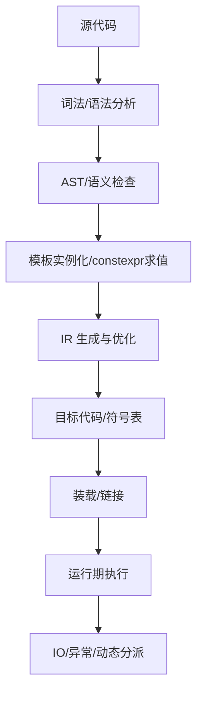

# 编译期和运行期

> 适用范围：单一主题（一个概念/机制/模块），保持可复用、可检索。

## 写作约束（铁律）

- **原内容一字不删**：所有原有文字、代码、注释、图片必须全部保留，禁止删除任何原内容。
- **只做归纳重组+增加**：在原有内容基础上调整结构、归类，新增内容以"补充"标记。新增量须让最终篇幅 ≥ 原版。
- **放不进的进附录**：六大段模板容纳不下的原内容，移入最后的「附录」章节，不得丢弃。
- **动笔前先搜索**：做相关知识准备；源码要贴原始代码，有需要可贴汇编。
- **字数硬指标**：详细解析(二)≥200字、进阶应用(四)≥500字、源码解析与实践感悟(五)≥1000字、面试准备(六)高频问法≥8个且带回答，反问点和一句话答案各≥5个。
- 先结论后细节，避免长段堆砌。
- 每节至少 3 条要点。
- 代码必须可运行或可推导，配清楚输入/输出或预期。
- **代码块必须标注语言**：所有代码块必须根据实际语言标注，C++ 代码用 `c++`（不可用 `cpp` 或 `c`），Python 用 `python`，汇编用 `asm`/`x86asm`，shell 用 `bash` 等。禁止无语言标注的裸代码块。
- 图示统一放在 `资源/图片/`，文内使用相对路径引用。
- 有流程的用流程图或其他类型的图。

## 一、核心概念

- 定义：编译期负责把源代码转为可执行产物并进行静态分析；运行期负责进程执行、内存与资源管理、动态分派等。**补充**：编译期的核心产物是机器码与元数据（调试信息、符号表、模板实例化产物），运行期的核心产物是行为与状态（栈/堆/寄存器、对象生命周期、IO 交互）。
- 关键词：`constexpr`、模板实例化、`static_assert`、内联、虚表、RTTI、异常、动态链接。**补充**：LTO、ODR、ABI、JIT、AOT、常量折叠、死代码消除。
- 适用场景/边界：适合编译期处理的包括常量计算、类型约束、代码生成；适合运行期处理的包括用户输入、动态数据、系统资源。**补充**：边界常见于配置驱动与插件系统，配置可编译期固化时性能更优，若需热更新则必须运行期决策。

## 二、详细解析（≥200字）

- **原理拆解（三层递进）**：
  - 第一层：基本工作原理（配流程图/序列图展示核心流程）
  - 第二层：关键步骤详解（每步展开子步骤）
  - 第三层：底层机制（编译器实现、运行时行为、内存布局影响）
- 关键数据结构/接口：
- 关键公式/复杂度：

**补充**：编译期与运行期的分工可以理解为“确定性 vs 不确定性”的分界。编译期通过语法分析、语义分析、模板实例化、常量折叠与优化管线，把“可确定”的东西尽可能固定下来，以减少运行期的负担；运行期则面对外部输入、系统环境、IO、并发调度等不确定因素，必须保留动态决策能力。编译期的关键步骤包括词法/语法分析、AST 构建、类型推导与约束、模板展开、IR 生成、优化与代码生成；运行期的关键步骤包括装载、初始化、执行、异常展开、资源回收。底层机制上，编译期会生成符号表、调试信息、重定位表；运行期则依赖 ABI 与调用约定，完成函数调用栈管理、动态分派（vtable）、RTTI 与异常处理机制（栈展开表）。复杂度上，编译期的模板实例化可能引入指数级的编译时间成本，而运行期的动态分派引入的是常数级间接调用开销。



## 三、动手实践（代码案例）

```c++
#include <array>
#include <iostream>

constexpr int fib(int n) {
    return (n <= 1) ? n : fib(n - 1) + fib(n - 2);
}

constexpr std::array<int, 6> make_table() {
    return {fib(0), fib(1), fib(2), fib(3), fib(4), fib(5)};
}

int main() {
    constexpr auto table = make_table();
    int runtime = fib(6); // 运行期计算
    std::cout << table[5] << " " << runtime << "\n";
    return 0;
}
```

- 输入/输出预期：输出 `5 8`，其中 `table` 在编译期完成求值。
- 关键观察：编译器可将 `table` 固化为只读数据段，而 `runtime` 仍在运行期递归求值。
- **补充**：可在 godbolt 上观察 `table` 直接以常量数据形式落入 `.rodata`。

## 四、进阶应用（≥500字）

- 与其他主题的关联：
- 工程中的真实用法（大型项目案例、实际使用模式）：
- 常见优化策略：
  - 算法层面：选择更优算法
  - 数据结构：使用缓存友好结构
  - 内存访问：优化数据局部性
  - 并发处理：利用并行计算
  - 具体技巧：预计算与缓存、批处理减少开销、SIMD、避免虚函数调用等

**补充**：在工程实践中，编译期与运行期的协作常用于“性能与灵活性”的权衡。编译期方面，`constexpr` 与模板可生成查表、位运算掩码、协议字段解析器，从而把复杂的逻辑搬到编译器求值器中，运行期仅做 O(1) 访问；运行期方面，插件系统、脚本系统或配置系统仍需动态加载与决策。例如在图形引擎中，渲染管线的固定部分（顶点格式、常量寄存器布局、材质关键字组合）可以在编译期生成多套 variant；而在运行期基于资源热更新与设备能力选择合适的 variant。再如在高性能网络库中，解析器可以在编译期生成状态机（减少分支预测失败），但 IO 读写与拥塞控制仍需运行期处理。

**补充**：编译期优化策略包括：1) 通过 `static_assert` 或 Concepts 在编译期提前报错，减少运行期分支；2) 采用 `if constexpr` 让模板分支在编译期剔除不可达代码；3) 用 `std::array` 与 `constexpr` 生成查找表，避免运行期计算；4) 使用 `extern template` 或显式实例化，减少重复模板实例化带来的编译成本。运行期优化策略包括：1) 减少虚函数调用次数，将热点路径用静态多态或函数对象替代；2) 对 IO 进行批处理，降低系统调用频率；3) 对内存访问进行分块与对齐，提升缓存命中率；4) 合理使用线程池/异步模型减少上下文切换。二者组合时要注意：过度的编译期计算会显著增加编译时间与二进制体积，而过度的运行期抽象则会带来可预测性下降与性能不稳定。

**补充**：在大型项目中常见的做法是“编译期生成、运行期选择”。例如对多种 CPU 指令集（SSE/AVX/NEON）分别在编译期生成不同实现，通过运行期检测 CPU 特性选择最优路径；对协议版本的解析器，编译期生成多个版本的解析函数，运行期根据版本号调度；对 GUI 主题/样式，编译期生成静态资源表，运行期仅切换索引。这样能将复杂度分摊到编译期，提高运行期稳定性。

## 五、源码解析和实践感悟（≥1000字）

- 关键实现路径（贴源码、必要时贴汇编）：
- 难点与易错点（陷阱案例 + 深度剖析）：
- 经验总结（补充）：

**补充**：从源码与编译器实现角度看，编译期与运行期的边界并非“黑白分明”，而是由编译器的能力与语言规则共同决定。以 `constexpr` 为例，编译器内部会构建一个“常量求值器”，在 IR 生成前对 AST 进行解释执行，若所有输入在编译期可求值，则结果被替换为常量；若输入包含运行期变量，则 `constexpr` 函数退化为普通函数调用。此过程本质上是一种“解释执行”，它依赖于编译器对表达式求值的安全限制（例如递归深度限制、禁止访问未初始化的对象、禁止执行不可在编译期完成的 IO）。实践中，`constexpr` 的限制常导致“看似可行，实则不可”的代码失败，因此需要在设计 API 时明确可编译期求值的边界。

**补充**：模板实例化是编译期最典型的“代码生成”机制。编译器在看到模板的使用点时，会根据模板参数进行语义替换与实例化，这会生成具体的函数或类代码。在大型项目里，模板可能导致指数级实例化与编译时内存膨胀。为了控制这一问题，常见的手段包括：1) 在头文件中声明模板，在 cpp 中进行显式实例化；2) 使用 `extern template` 抑制重复实例化；3) 限制模板层级，避免过深的递归模板；4) 避免在热路径中滥用复杂的模板元编程。编译器在实例化时会生成大量符号，最终影响链接时间与二进制体积，这也是编译期成本的重要来源。

**补充**：运行期的动态多态（虚表机制）则是典型的“延迟绑定”。编译器在编译期为每个多态类生成 vtable，并在对象构造时写入 vptr。运行期调用虚函数时，通过 vptr 间接跳转。这个间接跳转会破坏分支预测，且难以被内联优化，因此在高频调用路径中性能开销明显。实践经验是：热点路径倾向于使用静态多态（CRTP）或策略类，冷路径才使用虚函数，从而平衡扩展性与性能。

**补充**：异常处理是运行期机制中的“隐藏成本”。编译器会生成异常处理表（例如 DWARF 的 LSDA），在抛出异常时进行栈展开与对象析构。即使不抛异常，编译器也会插入必要的清理路径。对于性能敏感的代码，往往采用错误码或 `std::expected` 替代异常，从而减少运行期开销。这里的关键点是：异常机制在运行期引入了控制流复杂度，影响指令缓存与分支预测，必须结合具体场景评估。

**补充**：链接与装载是编译期与运行期交接的关键。编译期生成的符号表、重定位信息在运行期被动态链接器使用，完成地址修正与符号绑定。静态链接将更多工作放到编译期/链接期，运行期更快但产物更大；动态链接则将部分工作推迟到运行期，换取更小的可执行体与共享库复用。对于大型系统，常通过 LTO 或 ThinLTO 在链接期做跨模块优化，将“编译期优化”延伸到链接期，从而减少运行期的函数调用与间接跳转。

**补充**：可维护性上，编译期代码的复杂度往往更高（模板元编程、SFINAE、Concepts 约束），对团队心智负担大，因此需要“可读性优先”的规范。例如：优先使用 `constexpr` 函数而非模板递归，优先用 Concepts 替代复杂的 `enable_if`，使用 `static_assert` 输出清晰的错误信息。运行期代码则更偏“可调试性”，需要配合日志、断言与性能指标采集。二者的最大差异在于调试方式：编译期错误依赖编译器诊断与静态分析，运行期错误依赖调试器、日志与监控。

**补充**：汇编层面的差异可以通过 godbolt 或 objdump 观察。编译期常量会直接生成 `mov` 指令写入立即数；运行期计算则表现为实际的指令序列。比如 `constexpr int x = fib(10);` 会被折叠为常量 `55`，而 `int y = fib(n);` 则需要递归调用或循环实现。通过对比反汇编，可以直观理解编译期优化带来的指令数量减少与分支消除。这种“可视化优化”是理解编译期/运行期差异的最有效方式之一。

**补充**：综合实践中最常见的难点是“界限模糊”。例如：`constexpr` 函数在运行期也可调用，这使得同一套代码既有编译期路径，也有运行期路径。开发者必须同时关注两种路径的正确性与性能，避免在 `constexpr` 中引入不可编译期执行的操作（如动态分配、IO）。另外，`if constexpr` 的分支消除需要编译期可判定的条件，否则会退化为普通 `if`，导致性能或错误预期不一致。这类细节通常要通过单元测试与编译器报错信息来反复校验。

**补充**：实践经验总结为三条：第一，能编译期解决的问题要有成本评估，若编译时间和二进制体积可控，则优先编译期；第二，运行期动态性是系统弹性的重要来源，不能为了“理论性能”而过度模板化；第三，始终用测量驱动决策，借助编译器诊断、构建时间统计、性能剖析工具，持续调整编译期与运行期的边界。

## 六、面试准备（高频问法≥10个，反问点/一句话答案≥5个，均带回答）

### 6.1 高频问法（≥10个）

基础理解：

Q1：请解释编译期和运行期的基本概念和工作原理？

A：编译期负责语义分析、模板实例化与代码生成，运行期负责装载、执行与动态资源管理；编译期输出的是可执行产物与元数据，运行期输出的是程序行为与状态。

Q2：编译期与运行期的主要区别是什么？

A：编译期处理可确定的逻辑并进行静态优化，运行期处理不确定输入与动态行为；编译期错误会阻止生成产物，运行期错误需要异常或错误码处理。

Q3：在什么情况下应该使用 `constexpr` 或模板元编程？

A：当输入在编译期可确定且可接受编译时间成本时使用，典型场景是查表、编译期校验与类型生成。

Q4：模板实例化在什么时机发生？

A：隐式实例化发生在首次使用时，显式实例化发生在显式声明处，二者都会生成具体代码并进入符号表。

Q5：`if constexpr` 与普通 `if` 的差异是什么？

A：`if constexpr` 在编译期决定分支并移除不可达代码，普通 `if` 两个分支都编译，只在运行期选择。

Q6：运行期的虚表机制如何工作？

A：对象构造时写入 vptr，运行期通过 vptr 查找 vtable 并进行间接调用，从而实现动态分派。

Q7：异常机制为什么会带来运行期开销？

A：异常需要栈展开与析构调用，编译器还要生成异常表，导致控制流复杂化与指令缓存压力。

Q8：编译期优化会影响编译时间吗？

A：会，模板实例化与 `constexpr` 递归都可能显著增加编译时间与内存占用。

Q9：动态链接与静态链接对运行期有何影响？

A：动态链接推迟符号绑定到运行期，减少可执行体积但增加装载成本；静态链接则相反。

Q10：运行期能否“像编译期一样”做类型检查？

A：只能有限做到，依赖 RTTI 的 `typeid` 与 `dynamic_cast`，精度与性能都不如编译期检查。

Q11：`consteval` 和 `constexpr` 的差异？

A：`consteval` 必须编译期求值，运行期调用会报错；`constexpr` 允许运行期调用。

Q12：哪些数据永远无法在编译期获得？

A：用户输入、文件内容、网络数据、环境变量、系统时间、随机数等。

### 6.2 反问点/陷阱点（≥5个）

- 反问：贵团队如何权衡编译期优化与编译时间增长？是否有 LTO/ThinLTO 的实践准则？
- 反问：在性能敏感模块里，虚函数是否会被替换为静态多态？有哪些迁移经验？
- 反问：当 `constexpr` 限制阻碍实现时，你们通常如何降级处理？
- 陷阱：认为“constexpr 一定更快”——忽略编译期成本与二进制体积膨胀。
- 陷阱：把运行期类型检查当作编译期类型安全的替代方案。

### 6.3 一句话答案（≥5个）

- 编译期的核心是“提前确定”，运行期的核心是“动态应对”。
- `constexpr` 是编译期求值的钥匙，但不是性能银弹。
- 运行期多态带来灵活性，也带来间接调用成本。
- 能编译期完成的就别拖到运行期，但要评估编译成本。
- 调试编译期问题靠诊断与静态分析，运行期问题靠调试器与日志。

## 附录（模板外原内容收纳）

> 以下为原笔记中不直接适配六大段结构、但仍有价值的内容，原样保留于此。

# 编译期和运行期

在 C++ 中，**编译期（Compile Time）** 和 **运行期（Runtime）** 分别负责不同的任务，理解其分工对优化代码性能和设计高效程序至关重要。以下是两者的核心能力对比及典型应用场景：

---

### **一、编译期（Compile Time）**

#### **核心能力**：

1. **类型检查与模板实例化**

+ 确保类型安全，生成模板的具体代码。
+ 示例：

```c++
template <typename T>
T add(T a, T b) { return a + b; }
auto sum = add(3, 5);  // 编译时实例化为 add<int>
```

2. **常量表达式求值（**`constexpr`**/**`consteval`**）**

+ 计算可在编译期确定的常量值。
+ 示例：

```c++
constexpr int factorial(int n) {
    return (n <= 1) ? 1 : n * factorial(n - 1);
}
int result = factorial(5);  // 编译时计算 120
```

3. **代码生成与优化**

+ 内联函数、循环展开、死代码消除。
+ 示例：

```c++
inline int square(int x) { return x * x; }  // 可能内联展开
```

4. **静态断言（**`static_assert`**）**

+ 编译时检查条件，确保类型或常量符合预期。
+ 示例：

```c++
static_assert(sizeof(int) == 4, "int must be 4 bytes");
```

5. **元编程（Template Metaprogramming）**

+ 生成类型或计算数值。
+ 示例（计算斐波那契数列）：

```c++
template <int N>
struct Fib {
    static constexpr int value = Fib<N-1>::value + Fib<N-2>::value;
};
template <>
struct Fib<0> { static constexpr int value = 0; };
template <>
struct Fib<1> { static constexpr int value = 1; };
int fib5 = Fib<5>::value;  // 5
```

---

### **二、运行期（Runtime）**

#### **核心能力**：

1. **动态内存管理**

+ 分配/释放堆内存（`new`/`delete`，`malloc`/`free`）。
+ 示例：

```c++
int* arr = new int[100];
delete[] arr;
```

2. **虚函数与动态多态**

+ 通过虚表（vtable）实现运行时方法绑定。
+ 示例:

```c++
class Animal { virtual void speak() = 0; };
class Dog : public Animal { void speak() override { ... } };
Animal* pet = new Dog();
pet->speak();  // 运行时绑定到 Dog::speak
```

3. **用户输入与外部交互**

+ 处理文件、网络、键盘输入等不可预测的操作。
+ 示例：

```c++
std::string input;
std::cin >> input;  // 运行时获取输入
```

4. **异常处理**

+ 捕获和处理程序运行时的错误。
+ 示例：

```c++
try {
    throw std::runtime_error("Error!");
} catch (const std::exception& e) {
    std::cerr << e.what();
}
```

5. **动态类型信息（RTTI）**

+ 使用 `typeid` 或 `dynamic_cast` 检查类型。
+ 示例：

```c++
if (auto* dog = dynamic_cast<Dog*>(pet)) {
    dog->bark();
}
```

---

### **三、编译期 vs 运行期的典型场景对比**

|  |  |  |
| --- | --- | --- |
| **场景** | **编译期** | **运行期** |
| **计算斐波那契数列** | `constexpr` 函数或模板元编程 | 递归或迭代的动态计算 |
| **类型检查** | 模板参数约束、`static_assert` | `dynamic_cast` 检查类型 |
| **内存分配** | 静态数组（栈内存） | `new`/`malloc` 动态分配堆内存 |
| **函数调用** | 内联函数、模板实例化 | 虚函数调用、函数指针 |
| **错误处理** | 编译错误（语法/类型不匹配） | 异常、错误码、断言 |

---

### **四、协作与最佳实践**

#### **1. 编译期优化运行期性能**

* 使用 `constexpr` 和模板提前计算常量。
* 示例：编译时生成查找表，减少运行时计算。

```c++
constexpr std::array<int, 256> generate_table() { /* ... */ }
```

#### **2. 运行期处理动态逻辑**

* 处理用户输入、文件读取等不可预知的行为。
* 示例：动态加载插件（DLL/SO）。

```c++
void* lib = dlopen("plugin.so", RTLD_LAZY);
auto func = (void(*)())dlsym(lib, "run");
func();  // 运行插件逻辑
```

#### **3. 结合两者提升灵活性**

* 使用模板生成通用代码，同时保留运行时的动态行为。
* 示例：策略模式（编译时选择策略，运行时调用）。

```c++
template <typename Strategy>
class Processor {
    Strategy strategy;
public:
    void run() { strategy.execute(); }  // 策略逻辑在编译时确定
};
```

---

### **五、总结**

* **编译期**：处理类型安全、代码生成、常量计算，目标是生成高效且无错误的代码。
* **运行期**：处理动态数据、用户交互、资源管理，确保程序灵活应对运行时环境。
* 协作原则：

+ 尽量将能提前的计算移至编译期（如 `constexpr`、模板元编程）。
+ 运行时处理必须动态的操作（如 IO、多态）。
+ 避免在运行时重复编译期可完成的工作（如预先计算的查找表）。


## 五、源码解析和实践感悟

### 1. constexpr 函数的编译期执行机制

```c++
// constexpr 函数：编译期和运行期两用
constexpr int fib(int n) {
    return (n <= 1) ? n : fib(n - 1) + fib(n - 2);
}

constexpr int x = fib(10);  // ★ 编译期计算：常量折叠为 55
int y = fib(10);            // ★ 运行期调用：仍然是递归，但可能被优化

// 汇编验证（-O2）：
// constexpr int x = fib(10); → mov DWORD PTR [x], 55  （直接存储结果）
// 用 godbolt.org 查看，编译器的 constexpr 求值器本质上是个内置解释器
```

### 2. 模板元编程 vs constexpr

```c++
// C++11 方式：模板递归（每个实例化产生一份类型）
template<int N> struct Fib {
    static constexpr int value = Fib<N-1>::value + Fib<N-2>::value;
};
template<> struct Fib<0> { static constexpr int value = 0; };
template<> struct Fib<1> { static constexpr int value = 1; };

// C++14 方式：constexpr 函数（更直观，编译更快）
constexpr int fib(int n) { return n <= 1 ? n : fib(n-1) + fib(n-2); }

// constexpr 优势：写法像普通函数，但运行时也可调用，编译器有深度限制（约512层）
// 模板优势：类型层面的运算（如 integer_sequence），constexpr 无法替代
```

### 3. if constexpr 的编译期分支消除

```c++
template<typename T>
auto process(T&& val) {
    if constexpr (std::is_integral_v<T>) {
        return val * 2;          // T 不是整数 → 这行不实例化
    } else if constexpr (std::is_floating_point_v<T>) {
        return val * 2.0;        // T 不是浮点 → 这行不实例化
    } else {
        return val;              // 其他类型 → 走这里
    }
}
// process("hello") — 前两个分支的 val*2 不会实例化，string 无 operator* 也不报错
```

### 实践经验

1. **能编译期算的就别留到运行期**：`constexpr`、模板、`static_assert` 是零运行时开销的工具
2. **constexpr 不是万能**：有递归深度限制（~512），复杂算法避免完全编译期
3. **if constexpr vs 标签派发**：函数体内分支用 if constexpr，多个重载版本用标签派发（true_type/false_type）
4. **编译时间代价**：过度模板实例化拉长编译时间，用 `extern template` 抑制显式实例化
5. **consteval (C++20)**：比 constexpr 更严格——必须在编译期执行，不能运行期调用
6. **运行时信息无法编译期使用**：`argc`、用户输入、文件内容、时间戳都是运行期才有的

## 六、面试准备

### Q&A（10题）

**Q1: 编译期能做什么，运行期不能？**
A: 类型检查、`static_assert`、模板实例化、`constexpr` 常量求值、死代码消除、内联展开

**Q2: constexpr 和 const 的区别？**
A: const 表示运行期不可修改；constexpr 表示编译期可求值。constexpr 隐含 const，const 不隐含 constexpr

**Q3: if constexpr 和普通 if 的区别？**
A: if constexpr 在编译期评估条件，false 分支完全不实例化；普通 if 两个分支都编译，仅运行时不执行

**Q4: 模板元编程 vs constexpr，各自适用场景？**
A: 模板用于类型运算/生成（`integer_sequence`、`tuple`）；constexpr 用于值运算（计算、查表）

**Q5: consteval 和 constexpr 的区别？**
A: consteval (C++20) 必须编译期执行，运行期调用报错；constexpr 可编译期也可运行期

**Q6: static_assert 什么时机检查？**
A: 编译期断言，条件为 false 时编译失败。不产生任何运行时代码

**Q7: 虚函数为什么不能是 constexpr？**
A: 虚函数依赖运行时的 vtable 派发，constexpr 要求编译期就能确定调用目标

**Q8: 什么数据编译期无法获得？**
A: 用户输入、文件内容、网络数据、系统时间、argc/argv、环境变量、随机数

**Q9: 模板实例化什么时候发生？**
A: 隐式实例化——首次使用时；显式实例化——`template class Foo<int>` 声明处

**Q10: 编译期计算会增加编译时间吗？**
A: 会。大量 `constexpr` 递归、深度模板实例化会显著增加编译时间和内存占用

### 陷阱与反问（5个）

1. **陷阱**：用 `decltype(auto)` 替代 `auto` 期待编译期推导 — `decltype(auto)` 保留引用，可能意外延长临时对象生命周期
2. **反问**：全部写成 constexpr 好吗？→ 不是，有些逻辑必须运行时（IO/随机），且过度 constexpr 拖慢编译
3. **陷阱**：模板错误信息长达数百行 — 因为实例化链完整展开，用 `static_assert` 提前截断
4. **反问**：运行期能否判断类型？→ 可以但有限，`typeid` + `dynamic_cast`，但信息不如编译期精确
5. **陷阱**：`constexpr` 函数中包含 `throw` — C++14 允许但编译期走 throw 分支视为不满足 constexpr

### 一句话答案（5个）

1. **编译期核心**：类型检查、constexpr、模板、static_assert
2. **运行期核心**：动态内存、虚函数、IO、异常
3. **constexpr vs const**：constexpr 编译期可求值，const 运行期不可改
4. **if constexpr**：编译期分支，false 分支不实例化
5. **原则**：能编译期完成的不留给运行期
