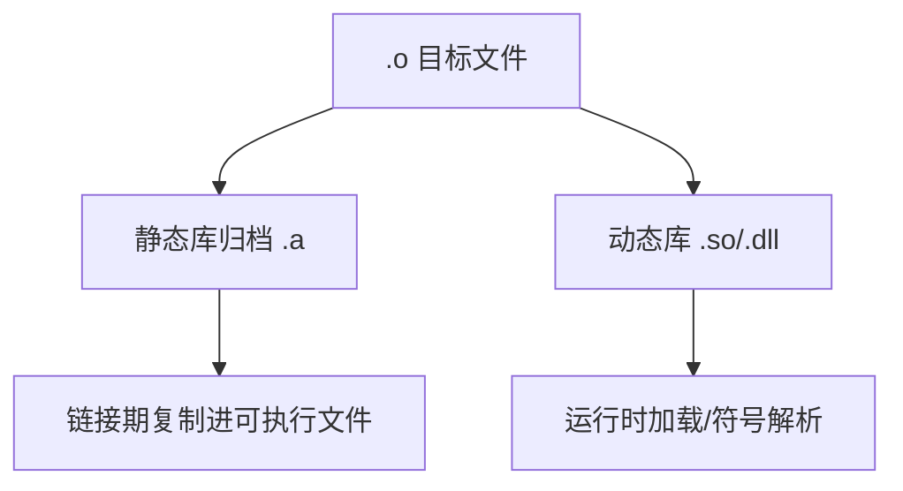

# 静态库和动态库

> 适用范围：单一主题（一个概念/机制/模块），保持可复用、可检索。

## 写作约束（铁律）

- **原内容一字不删**：所有原有文字、代码、注释、图片必须全部保留，禁止删除任何原内容。
- **只做归纳重组+增加**：在原有内容基础上调整结构、归类，新增内容以"补充"标记。新增量须让最终篇幅 ≥ 原版。
- **放不进的进附录**：六大段模板容纳不下的原内容，移入最后的「附录」章节，不得丢弃。
- **动笔前先搜索**：做相关知识准备；源码要贴原始代码，有需要可贴汇编。
- **字数硬指标**：详细解析(二)≥200字、进阶应用(四)≥500字、源码解析与实践感悟(五)≥1000字、面试准备(六)高频问法≥8个且带回答，反问点和一句话答案各≥5个。
- 先结论后细节，避免长段堆砌。
- 每节至少 3 条要点。
- 代码必须可运行或可推导，配清楚输入/输出或预期。
- **代码块必须标注语言**：所有代码块必须根据实际语言标注，C++ 代码用 `c++`（不可用 `cpp` 或 `c`），Python 用 `python`，汇编用 `asm`/`x86asm`，shell 用 `bash` 等。禁止无语言标注的裸代码块。
- 图示统一放在 `资源/图片/`，文内使用相对路径引用。
- 有流程的用流程图或其他类型的图。

## 一、核心概念

- 定义：静态库是目标文件归档，链接时拷贝进可执行文件；动态库运行时加载并共享代码段。
- 关键词：`.a/.lib`、`.so/.dll`、符号表、PLT/GOT、`-fPIC`、RPATH。
- 适用场景/边界：静态库适合独立分发与稳定依赖；动态库适合共享与频繁更新。**补充**：动态库更依赖 ABI 兼容策略。

## 二、详细解析（≥200字）

- **原理拆解（三层递进）**：
  - 第一层：基本工作原理（配流程图/序列图展示核心流程）
  - 第二层：关键步骤详解（每步展开子步骤）
  - 第三层：底层机制（编译器实现、运行时行为、内存布局影响）
- 关键数据结构/接口：
- 关键公式/复杂度：

**补充**：静态库是“.o 的集合”，链接器在链接期解析未定义符号并把所需目标文件复制进可执行文件，因此运行时不再依赖外部库；动态库则在运行期加载，由动态加载器进行重定位与符号绑定。静态库的链接结果更可预测，但会导致可执行体积增大，且每次更新库都需要重新链接。动态库共享代码段节省内存，但带来版本管理与部署路径的问题。底层机制上，动态库使用 GOT/PLT 实现延迟绑定，静态库则直接进行符号解析与地址固化。



## 三、动手实践（代码案例）

```bash
# 生成静态库
g++ -c mycode.cpp
ar rcs libmycode.a mycode.o
# 链接静态库
g++ myprogram.cpp -L. -lmycode -o myprogram
```

```bash
# 生成动态库
g++ -shared -fPIC -o libmycode.so mycode.cpp
# 链接动态库
g++ myprogram.cpp -L. -lmycode -o myprogram
```

- 预期：静态链接产物可独立运行；动态链接产物需运行期路径配置。
- **补充**：Linux 下使用 `LD_LIBRARY_PATH` 或 rpath 解决库路径。
- **补充**：Windows 下使用 `PATH` 或放在可执行文件同目录。

## 四、进阶应用（≥500字）

- 与其他主题的关联：
- 工程中的真实用法（大型项目案例、实际使用模式）：
- 常见优化策略：
  - 算法层面：选择更优算法
  - 数据结构：使用缓存友好结构
  - 内存访问：优化数据局部性
  - 并发处理：利用并行计算
  - 具体技巧：预计算与缓存、批处理减少开销、SIMD、避免虚函数调用等

**补充**：工程实践中选择静态库还是动态库，通常基于部署策略与更新频率。对 CLI 工具或嵌入式程序，静态库能减少运行时依赖；对桌面应用或服务端平台，动态库能降低内存占用并支持热更新。一个常见策略是“核心稳定模块动态化、插件模块动态化、性能关键路径静态化”，以此平衡维护与性能。对于跨平台项目，动态库的 ABI 稳定性比静态库更重要，因为升级库文件会影响所有依赖该库的应用。

**补充**：动态库与多线程的结合需要确保线程安全。多线程程序同时访问动态库时，库内部必须具备线程安全能力；若库本身非线程安全，需要在上层加锁或做实例隔离。静态库则在每个可执行文件中拥有独立副本，对线程安全要求仍在，但不会引入“共享库被多程序复用”的额外风险。

**补充**：静态库的“链接顺序”是最常见的工程陷阱。GNU ld 单遍扫描导致依赖库必须放在被依赖库之后，这在多库项目中非常容易出错。解决方式包括：调整链接顺序、拆分库、或使用 `--start-group`。但后者会显著增加链接时间，因此更推荐优化库依赖结构。动态库在链接顺序上相对宽松，但会在运行期出现“符号找不到”或“版本不兼容”的问题。

## 五、源码解析和实践感悟（≥1000字）

- 关键实现路径（贴源码、必要时贴汇编）：
- 难点与易错点（陷阱案例 + 深度剖析）：
- 经验总结（补充）：

**补充**：静态库的链接机制基于“按需提取”。链接器在扫描静态库时只提取被引用的目标文件，这意味着静态库内部若有多个对象文件，未被引用的不会进入最终二进制。这在性能上有利，但也可能导致“静态构造未执行”或“模板实例未被拉入”的困惑。实践中要确保符号引用明确，必要时用 `--whole-archive` 强制拉入库对象，但这会增加体积。

**补充**：动态库加载过程涉及 mmap 映射、重定位、符号解析、执行初始化函数。PLT/GOT 的延迟绑定机制使得第一次调用成本高于后续调用，因此在性能关键系统中需要关注“首帧卡顿”问题。实践上可通过预热（启动时主动调用关键 API）来 amortize 延迟绑定成本。对于安全敏感场景，可启用 `-Wl,-z,relro -Wl,-z,now` 以减少可被重写的 GOT 区域，提升安全性但增加启动开销。

**补充**：ABI 兼容性是动态库的最大风险来源。任何函数签名变化、类布局变化、虚函数表变化都会破坏 ABI。为了保持兼容性，通常通过“PImpl 模式”隐藏实现细节，或将跨模块 API 固定为 C ABI。静态库在 ABI 方面风险较小，因为每次链接都会重新编译，调用方与库版本一致，但缺点是无法热更新。

**补充**：Windows 与 Linux 的差异主要体现在符号导出机制与加载路径管理。Windows 必须显式导出符号（`__declspec(dllexport)`），并通过导入库 `.lib` 提供链接信息；Linux 默认导出全部符号，但更推荐显式控制可见性。Windows 的 DLL 搜索路径复杂且容易冲突，实践中应将 DLL 与 EXE 放在同目录，并避免依赖全局 PATH。

**补充**：动态库升级的“版本策略”必须明确。Linux 使用 SONAME 进行版本管理，通常主版本号变表示 ABI 不兼容；Windows 则更多依赖文件名与版本资源。实践中建议统一版本策略、遵循语义化版本，并在 CI 中使用 ABI 检查工具（如 abi-compliance-checker）验证兼容性。

**补充**：实践感悟总结为三点：第一，静态库更适合“可控环境 + 独立部署”，动态库更适合“共享 + 频繁更新”；第二，动态库的风险主要是 ABI 与路径管理，必须通过规范与自动化工具控制；第三，静态库虽然简单，但对体积与更新成本的影响不可忽视。正确的选择应基于部署模型而非个人偏好。

## 六、面试准备（高频问法≥10个，反问点/一句话答案≥5个，均带回答）

### 6.1 高频问法（≥10个）

Q1：静态库与动态库的本质差异？

A：静态库在链接期复制到可执行文件；动态库在运行期加载共享。

Q2：为什么动态库需要 `-fPIC`？

A：保证代码位置无关，可加载到任意地址。

Q3：PLT/GOT 有什么作用？

A：实现延迟绑定与符号解析。

Q4：静态库链接顺序为何重要？

A：链接器单遍扫描，未解析符号只能在后续库中找到。

Q5：动态库升级的风险是什么？

A：ABI 不兼容导致运行时崩溃或符号解析失败。

Q6：如何让动态库可被程序找到？

A：配置 `LD_LIBRARY_PATH`/RPATH 或 Windows PATH。

Q7：静态链接与动态链接的体积差异？

A：静态链接体积更大，动态链接共享代码段。

Q8：如何控制导出符号？

A：Linux 用 `-fvisibility=hidden`，Windows 用导出宏。

Q9：为何动态库更新需要重启进程？

A：进程已加载的库映射不会自动替换。

Q10：静态库也能被动态库链接吗？

A：可以，动态库可静态链接部分依赖。

### 6.2 反问点/陷阱点（≥5个）

- 反问：团队的 ABI 兼容策略与版本发布规则？
- 反问：是否对导出符号做最小化控制？
- 反问：是否对 DLL/SO 搜索路径做统一治理？
- 陷阱：忽略链接顺序导致 undefined reference。
- 陷阱：在动态库中暴露 STL 类型导致 ABI 不稳定。

### 6.3 一句话答案（≥5个）

- 静态库是链接期拷贝，动态库是运行期加载。
- `-fPIC` 是动态库的基本要求。
- PLT/GOT 解决延迟绑定。
- ABI 兼容是动态库更新的前提。
- 链接顺序错误是静态库常见坑。

## 附录（模板外原内容收纳）

> 以下为原笔记中不直接适配六大段结构、但仍有价值的内容，原样保留于此。

# 静态库和动态库

[VS2022 C++动态库制作和使用指南-腾讯云开发者社区-腾讯云](https://cloud.tencent.com/developer/article/2532337)

在C++中，库是一组预编译的代码，这些代码可以被多个程序共享。库可以是静态的（Static Libraries）或动态的（Dynamic Libraries）。这两种类型的库在许多编程语言中都存在，包括C++，C，Java，Python等。不过，这里我们主要讨论的是C和C++中的静态库和动态库。

### 静态库

静态库是一种库文件，它在编译时被包含在程序中。当你编译一个使用静态库的程序时，编译器会将库中你程序所需的所有函数和数据复制到最终的可执行文件中。这意味着，一旦程序被编译，它就包含了所有它需要的库代码，不再需要任何外部的库文件。

在C++中，静态库通常有`.lib`或`.a`的文件扩展名（在Windows和Unix/Linux系统上）。

#### 创建静态库

在C++中，创建静态库通常涉及以下步骤：

1. 编写你的代码（函数和类）。
2. 将你的代码编译为目标文件（`.o`或`.obj`文件）。
3. 使用`ar`工具（在Unix/Linux系统上）或`lib`工具（在Windows系统上）将目标文件打包为静态库。

例如，你可以使用以下命令创建一个静态库：

**代码语言：**bash

**AI代码解释**

```bash
g++ -c mycode.cpp
ar rcs libmycode.a mycode.o
```

#### 使用静态库

在C++中，使用静态库通常涉及以下步骤：

1. 在你的代码中包含库的头文件。
2. 在编译你的代码时，链接静态库。

例如，你可以使用以下命令编译和链接一个使用静态库的程序：

**代码语言：**bash

**AI代码解释**

```bash
g++ myprogram.cpp -L. -lmycode -o myprogram
```

在这个命令中，`-L.`指定了库的路径，`-lmycode`指定了库的名字（不包括`lib`前缀和文件扩展名），`-o myprogram`指定了输出的程序名。

### 动态库

动态库是在程序运行时，而不是在编译时，被加载到程序中的库。当你运行一个使用动态库的程序时，操作系统会查找需要的库，并将其加载到内存中，供程序使用。

在C++中，动态库通常有`.dll`（在Windows系统上）或`.so`（在Unix/Linux系统上）的文件扩展名。

#### 创建动态库

在C++中，创建动态库通常涉及以下步骤：

1. 编写你的代码（函数和类）。
2. 将你的代码编译为共享目标文件（`.so`或`.dll`文件）。

例如，你可以使用以下命令创建一个动态库：

**代码语言：**bash

**AI代码解释**

```bash
g++ -shared -o libmycode.so mycode.cpp
```

#### 使用动态库

在C++中，使用动态库通常涉及以下步骤：

1. 在你的代码中包含库的头文件。
2. 在编译你的代码时，链接动态库。

例如，你可以使用以下命令编译和链接一个使用动态库的程序：

**代码语言：**bash

**AI代码解释**

```bash
g++ myprogram.cpp -L. -lmycode -o myprogram
```

在这个命令中，`-L.`指定了库的路径，`-lmycode`指定了库的名字（不包括`lib`前缀和文件扩展名），`-o myprogram`指定了输出的程序名。

在运行程序时，你需要确保动态库在程序可以找到的路径中。你可以通过设置`LD_LIBRARY_PATH`环境变量（在Unix/Linux系统上）或`PATH`环境变量（在Windows系统上）来指定库的路径。

例如，你可以使用以下命令设置库的路径并运行程序：

**代码语言：**bash

**AI代码解释**

```bash
export LD_LIBRARY_PATH=.:$LD_LIBRARY_PATH
./myprogram
```

### 静态库和动态库的选择

静态库在某种程度上可以被视为是“空间换时间”的策略。因为静态库在编译时被整个复制并链接到目标程序中，这意味着生成的可执行文件会更大，但在运行时，由于所有的代码都已经在程序中，所以运行速度可能会更快。

选择使用静态库还是动态库，主要取决于以下几个因素：

1. **分发**：如果你想要分发一个不依赖于用户系统上特定版本库的程序，静态库可能是一个更好的选择。因为静态库会被链接到程序中，所以用户不需要在他们的系统上安装任何额外的库。
2. **更新**：如果你的库经常更新，或者你希望用户能够利用库的新版本，那么动态库可能是一个更好的选择。因为动态库在运行时被加载，所以只需要替换库文件，就可以使程序使用新版本的库，而无需重新编译程序。
3. **资源**：如果你关心程序的大小或内存占用，那么动态库可能是一个更好的选择。因为动态库可以被多个程序共享，所以它们可以节省磁盘空间和内存。

### 示例

假设你正在开发一个数学库，这个库提供了一些基本的数学函数，如加法、减法、乘法和除法。你希望这个库能够被其他程序员在他们的程序中使用。

#### 静态库

如果你选择创建一个静态库，那么当其他程序员在他们的程序中使用你的库时，他们需要在编译他们的程序时链接你的库。这意味着你的库的所有代码都会被复制到他们的程序中。

这对于那些希望他们的程序可以在没有你的库的系统上运行的程序员来说是有利的。然而，如果你更新了你的库，那么他们需要重新编译他们的程序，以便使用新版本的库。

#### 动态库

如果你选择创建一个动态库，那么当其他程序员在他们的程序中使用你的库时，他们只需要在运行他们的程序时加载你的库。这意味着你的库的代码不会被复制到他们的程序中，而是在运行时被加载。

这对于那些关心他们的程序大小的程序员来说是有利的。此外，如果你更新了你的库，他们只需要替换库文件，就可以使他们的程序使用新版本的库，而无需重新编译他们的程序。

### 使用静态库时需要注意的事项：

1. **库的版本**：由于静态库在编译时被链接到程序中，所以如果库的版本更新了，你需要重新编译你的程序以使用新版本的库。因此，你需要密切关注你使用的库的版本，并在新版本发布时更新你的程序。
2. **程序的大小**：由于静态库的所有代码都会被复制到你的程序中，所以使用静态库会增加你的程序的大小。如果你关心你的程序的大小，你可能需要考虑使用动态库。
3. **许可证**：一些库的许可证可能要求你在使用静态库时，需要将你的程序以相同的许可证发布。你需要确保你了解并遵守你使用的库的许可证。

### 使用动态库时需要注意的事项：

1. **库的位置**：动态库在运行时被加载，所以你需要确保库在你的程序可以找到的路径中。你可以通过设置环境变量（如`LD_LIBRARY_PATH`或`PATH`）来指定库的路径。
2. **库的版本**：由于动态库在运行时被加载，所以如果库的版本不兼容，你的程序可能会出现问题。你需要确保你的程序使用的库的版本与运行时加载的库的版本兼容。
3. **多线程**：如果你的程序是多线程的，并且你的程序的不同线程需要访问同一个动态库，你需要确保这个库是线程安全的。
4. **许可证**：一些库的许可证可能要求你在使用动态库时，需要将你的程序以相同的许可证发布。你需要确保你了解并遵守你使用的库的许可证。

## 五、源码解析和实践感悟

### 1. 静态库的链接机制

```c++
// 静态库(.a/.lib)是 .o 文件的归档包
// 链接时: 链接器只提取被引用的 .o，复制到可执行文件
// g++ main.cpp -L. -lmylib  → 静态链接 libmylib.a
// 最终二进制包含所有被使用符号的副本

// ELF 中静态库被引用符号进入 .text/.data 段
// 未引用的符号被丢弃（Garbage Collection）
```

### 2. 动态库的加载过程

```c++
// 动态库(.so/.dll)在运行时加载
// Linux: ld.so 通过 LD_LIBRARY_PATH + /etc/ld.so.conf 查找
// 加载流程:
// 1. mmap 将 .so 映射到进程地址空间
// 2. 解析 .dynamic 段，重定位 GOT/PLT
// 3. 执行 .init 段初始化代码
// 4. 符号绑定：默认 Lazy Binding（PLT 延迟解析）
```

### 3. PLT/GOT 延迟绑定

```c++
// 首次调用动态库函数时:
// call func@PLT → PLT 代码 → 跳转到 _dl_runtime_resolve → 解析符号
// 解析后 GOT 条目被更新为实际函数地址
// 后续调用直接通过 GOT 跳转（无额外开销）

// 设置 LD_BIND_NOW=1 可在启动时解析所有符号
```

### 实践经验

1. **静态链接增大二进制**：每个静态链接的程序包含独立副本，但无运行时依赖
2. **动态库符号可见性**：`-fvisibility=hidden` + `__attribute__((visibility("default")))` 控制导出符号
3. **ABI 兼容性**：动态库更新时必须保持 ABI 兼容（函数签名、类布局不变）
4. **静态库初始化顺序**：`--start-group` 解决静态库循环依赖
5. **rpath**：`-Wl,-rpath,'$ORIGIN/../lib'` 让程序在相对路径查找动态库

## 六、面试准备

### Q&A（10题）

**Q1: 静态库和动态库的本质区别？**
A: 静态库编译时复制到可执行文件；动态库运行时加载，多个进程共享同一份物理内存

**Q2: 动态库如何实现代码共享？**
A: 操作系统将 .so 的只读段（.text）映射到各进程的虚拟地址空间，物理内存只有一份

**Q3: 什么是 GOT 和 PLT？**
A: GOT（全局偏移表）存函数最终地址，PLT（过程链接表）是桩代码实现延迟绑定

**Q4: 动态库的符号是如何解析的？**
A: 通过 PLT 桩调用 _dl_runtime_resolve，首次调用时查找符号表并更新 GOT

**Q5: 什么是 soname？**
A: 动态库的逻辑名称（如 libfoo.so.1），用于版本管理，实际文件通过符号链接指向

**Q6: 静态链接的顺序依赖问题？**
A: Unix 链接器从左到右处理，被依赖的库放后面。--start-group 解决循环依赖

**Q7: -fPIC 是什么？**
A: 位置无关代码——通过 GOT 访问全局变量，使 .so 可加载到任意地址

**Q8: LD_PRELOAD 有什么用？**
A: 在动态库加载时注入自定义库，可拦截标准库函数（如 malloc）

**Q9: 动态库的版本兼容性规则？**
A: 主版本号变→ABI 不兼容；次版本号变→新增符号（向后兼容）；补丁版本变→实现修改

**Q10: 如何使用 dlopen/dlsym 动态加载？**
A: `void* handle = dlopen("lib.so", RTLD_LAZY); auto fn = (FnType)dlsym(handle, "symbol");`

### 陷阱与反问（5个）

1. **陷阱**：静态链接中库顺序错误→ undefined reference
2. **反问**：全静态链接好还是全动态好？→ 静态：部署简单无依赖；动态：内存节省、可热更新
3. **陷阱**：动态库更新后不重启不会生效→已映射的旧版本继续使用
4. **反问**：为什么 Windows 用 .dll + .lib 而 Linux 用 .so？→ 设计理念不同，Windows 需导入库声明导出符号
5. **陷阱**：动态加载的库中全局对象的析构时机在 dlclose

### 一句话答案（8个）

1. **静态库**：.a/.lib，编译时代码复制
2. **动态库**：.so/.dll，运行时加载共享
3. **-fPIC**：生成位置无关代码，动态库必需
4. **PLT/GOT**：延迟绑定机制，首次调用解析
5. **soname**：逻辑库名，版本管理
6. **rpath**：硬编码运行时库搜索路径
7. **LD_LIBRARY_PATH**：运行时动态库搜索路径
8. **dlopen**：显式运行时加载动态库
